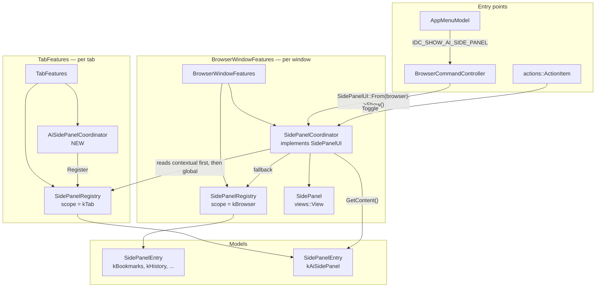
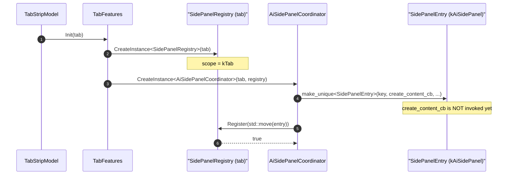
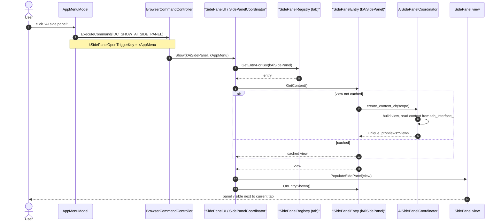
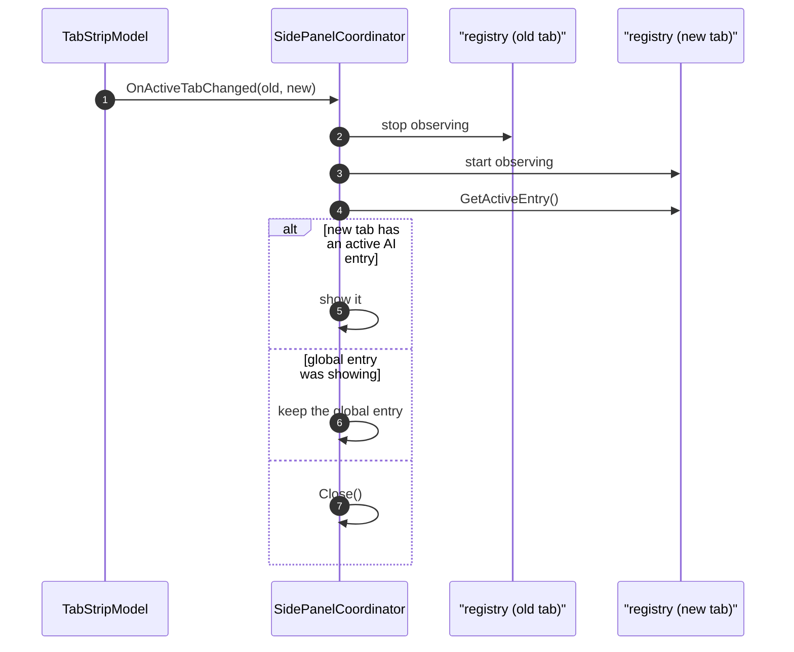
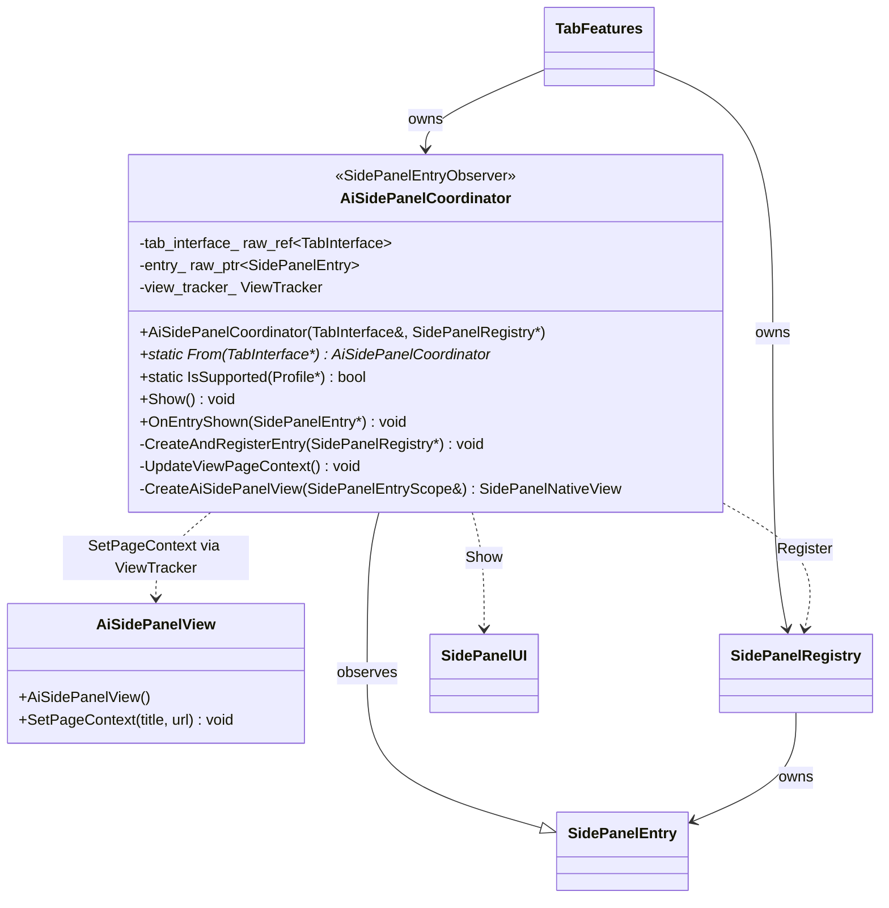
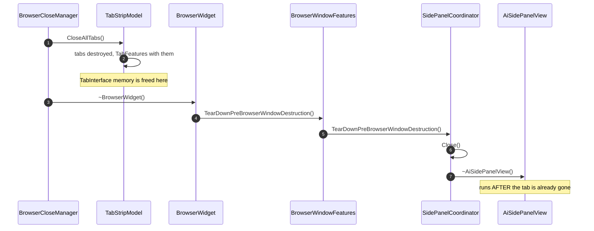
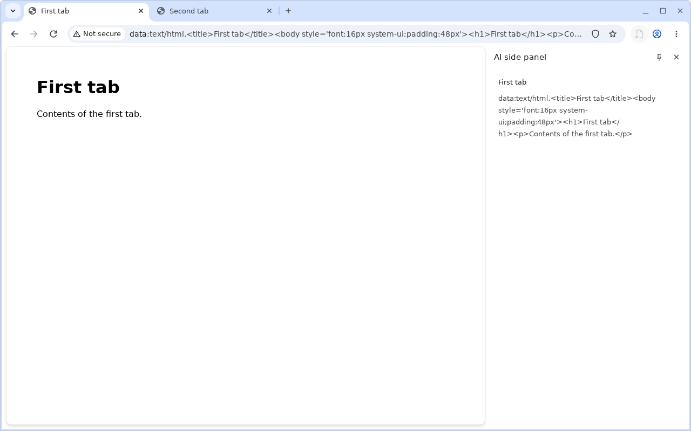
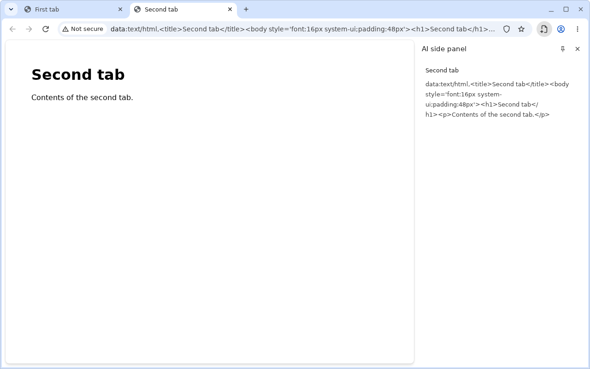

# AI Side Panel — Design Document

Status: **Draft / in implementation**
Branch: `ai-side-panel-desktop`
Author: Oleg Beletski
Last updated: 2026-09-11

---

## 1. Purpose

Add a new side panel, **"AI side panel"**, that opens next to the *current tab*
and is launched from an entry in the Chrome app menu (⋮).

This document has three parts:

1. An inventory of the side panels that exist in Chromium today (§2).
2. A description of every participant in the side panel system and the creation
   flow that binds them together (§3, §4).
3. The design and implementation plan for the AI side panel itself (§5–§8).

---

## 2. Inventory of existing side panels

Every side panel is identified by a `SidePanelEntryId`, declared in the
`SIDE_PANEL_ENTRY_IDS` X-macro at
`chrome/browser/ui/side_panel/side_panel_entry_id.h:19`.

The single most important axis is **scope** — which registry the entry is
registered into:

| Scope | Registry owner | Lifetime | Visible in |
|---|---|---|---|
| `kBrowser` (global) | `BrowserWindowFeatures` | Browser window | Every tab of the window |
| `kTab` (contextual) | `TabFeatures` | One tab | Only that tab; follows tab switches |

### 2.1 Browser-scoped ("global") entries

| Entry id | Coordinator | Content | Entry point |
|---|---|---|---|
| `kReadingList` | `views/side_panel/reading_list/reading_list_side_panel_coordinator.cc` | WebUI | Toolbar / `IDC_READING_LIST_MENU_SHOW_UI` |
| `kBookmarks` | `views/side_panel/bookmarks/bookmarks_side_panel_coordinator.cc` | WebUI | App menu / `IDC_SHOW_BOOKMARK_SIDE_PANEL` |
| `kHistory` | `views/side_panel/history/history_side_panel_coordinator.cc` | WebUI | `IDC_SHOW_HISTORY_SIDE_PANEL` |
| `kHistoryClusters` | `views/side_panel/history_clusters/history_clusters_side_panel_coordinator.cc` | WebUI | App menu / `IDC_SHOW_HISTORY_CLUSTERS_SIDE_PANEL` |
| `kComments` | `views/side_panel/comments/comments_side_panel_coordinator.cc` | WebUI | `IDC_SHOW_COMMENTS_SIDE_PANEL` |
| `kTabsFromOtherDevices` | `views/side_panel/tabs_from_other_devices/tabs_from_other_devices_side_panel_coordinator.cc` | WebUI | Recent Tabs submenu |
| `kContextualTasks` | `contextual_tasks/contextual_tasks_panel_host_desktop.cc` | WebUI | Toolbar button |

### 2.2 Tab-scoped ("contextual") entries

| Entry id | Coordinator | Content | Registered from |
|---|---|---|---|
| `kAboutThisSite` | `views/page_info/about_this_site_side_panel_coordinator.cc` | WebUI | Page info bubble, on demand |
| `kMerchantTrust` | `views/page_info/merchant_trust_side_panel_coordinator.cc` | WebUI | Page info, on demand |
| `kCustomizeChrome` | `customize_chrome/side_panel_controller_base.cc` | WebUI | `TabFeatures` |
| `kShoppingInsights` | `commerce/commerce_ui_tab_helper.cc` | WebUI | `TabFeatures` (`tab_features.cc:361`) |
| `kReadAnything` | `read_anything/read_anything_side_panel_controller.cc` | Views | `TabFeatures` (`tab_features.cc:524`) |
| `kLensOverlayResults` | `lens/lens_overlay_side_panel_coordinator.cc` | WebUI | On Lens overlay invocation |
| `kGlic` | `glic/widget/glic_side_panel_coordinator_impl.cc` | WebUI | `TabFeatures` (`tab_features.cc:424`) |
| `kGeic` | `geic/geic_side_panel_coordinator.cc` | Views + `WebView` | `TabFeatures` (`tab_features.cc:430`) |
| `kExtension` | `extensions/extension_side_panel_coordinator.cc` | WebUI | `chrome.sidePanel` extension API |

### 2.3 Reference example chosen for this feature

**`chrome/browser/geic/geic_side_panel_coordinator.cc`** — ~85 lines, the
smallest complete tab-scoped coordinator in the tree. The AI side panel follows
its shape.

---

## 3. Participants

| Participant | Header | Responsibility |
|---|---|---|
| **`SidePanelEntryId`** | `side_panel/side_panel_entry_id.h` | Enum of every panel. Declared in the `SIDE_PANEL_ENTRY_IDS` X-macro, which simultaneously generates the enum, the histogram name, and the `SidePanelEntryId → ActionId` mapping. A `LINT.IfChange` ties it to `histograms.xml`. |
| **`SidePanelEntryKey`** | `side_panel/side_panel_entry_key.h` | `SidePanelEntryId` + optional `ExtensionId`. The registry is keyed by this, so every extension gets a distinct key under one `kExtension` id. |
| **`SidePanelEntry`** | `side_panel/side_panel_entry.h` | The *model* of one panel. Owns a `CreateContentCallback` invoked **lazily** on first show, plus optional callbacks for "Open in new tab", the more-info menu, and default width. Caches its view between shows. |
| **`SidePanelRegistry`** | `side_panel/side_panel_registry.h` | Owns a set of `SidePanelEntry`s for one context. Two instances exist per tab-in-window: the window's global registry and the active tab's contextual registry. Also implements `SidePanelEntryScope`. |
| **`SidePanelEntryScope`** | `side_panel/side_panel_entry_scope.h` | Handed to the content factory. Exposes `GetBrowserWindowInterface()` always, and `GetTabInterface()` only for tab-scoped entries (CHECK-enforced). This is how panel content reaches its tab. |
| **`SidePanelUI`** | `side_panel/side_panel_ui.h` | The public, platform-agnostic API: `Show()`, `Close()`, `Toggle()`, `IsSidePanelShowing()`. Obtained via `SidePanelUI::From(browser)`. **This is the only surface feature code should call.** |
| **`SidePanelCoordinator`** | `views/side_panel/side_panel_coordinator.h` | The Views implementation of `SidePanelUI`. Merges the global and contextual registries into one panel, resolving ties **contextual-first**. Handles active-tab changes, view caching, and animation. |
| **`SidePanel`** | `views/side_panel/side_panel.h` | The actual `views::View` container — the visible chrome next to the tab contents. |
| **`SidePanelWebUIViewT<T>`** | `views/side_panel/side_panel_web_ui_view.h` | Template adapter that hosts a WebUI controller inside the panel. Used by most existing panels. |
| **`actions::ActionItem`** | `ui/actions/actions.h` | Toolbar/pinning model. Built by `SidePanelAction()` in `browser_actions.cc:305`, whose invoke callback comes from `CreateToggleSidePanelActionCallback()`. |
| **`BrowserCommandController`** | `ui/browser_command_controller.h` | Maps `IDC_*` command ids to behaviour, and enables/disables them. |
| **`AppMenuModel`** | `ui/toolbar/app_menu_model.h` | Builds the ⋮ menu, attaches icons/strings, and stamps `kSidePanelOpenTriggerKey` onto the invocation context for metrics. |
| **`TabFeatures`** | `ui/tabs/tab_features.h` | Owns per-tab objects, including the tab's `SidePanelRegistry` (`tab_features.cc:218`) and every tab-scoped coordinator. **This is where the AI side panel coordinator is instantiated.** |
| **`BrowserWindowFeatures`** | `ui/browser_window/internal/browser_window_features.cc` | Owns per-window objects: the global registry (`:324`) and the `SidePanelCoordinator` (`:891`). |

---

## 4. Creation flow

### 4.1 Component overview



### 4.2 Registration — happens once per tab, at tab creation



The content callback is deliberately not run here — building the panel's view
for every tab at tab-creation time would be unacceptable. It is invoked on
first show and the resulting view is then cached on the entry.

### 4.3 Show — user picks the menu item



### 4.4 Tab switch



This is precisely what "next to the current tab" buys: the AI panel's state is
per-tab, and switching tabs swaps it out automatically. No work is required in
the coordinator to get this behaviour.

---

## 5. AI Side Panel — design

### 5.1 Requirements

| # | Requirement |
|---|---|
| R1 | An app-menu item "AI side panel" opens the panel for the active tab. |
| R2 | The panel is **tab-scoped**: each tab has its own instance and state. |
| R3 | Switching tabs swaps the panel content; switching back restores it. |
| R4 | The feature is behind a disabled-by-default `base::Feature`. |
| R5 | The menu item is hidden entirely when the flag is off. *(Implemented; not covered by a test — see §9.)* |
| R6 | The panel can read the active tab's URL and title. |

### 5.2 Decisions

| Decision | Choice | Rationale |
|---|---|---|
| Scope | **Tab-scoped** | R2/R3. Registered from `TabFeatures`, same as Geic/Glic. |
| Content | **Views-native in phase 1** | A WebUI panel needs a `.mojom`, a TS/HTML bundle, a `WebUIConfig`, and `BUILD.gn` resource targets. Phase 1 proves the plumbing without that surface area. Phase 2 swaps the factory body for `SidePanelWebUIViewT<AiSidePanelUI>` — nothing else changes. |
| Entry point | App menu, under **More tools** | R1. The item is added in `ToolsMenuModel::Build()`, next to Reading mode — the closest analogue. To promote it to the top level of the ⋮ menu instead, move the `AddItemWithStringIdAndVectorIcon()` call to `AppMenuModel::Build()`; nothing else changes. |
| Show vs Toggle | `Show()` from the menu | Matches every other app-menu side panel item. The `ActionItem` path keeps `Toggle()` for a future toolbar button. |
| Gating | `features::kAiSidePanel`, default off | R4/R5. |

### 5.3 Class design



`AiSidePanelCoordinator` is an *unowned user data* on the `TabInterface`, the
pattern all new tab-scoped coordinators use — retrieve it anywhere with
`AiSidePanelCoordinator::From(tab)`.

### 5.4 Lifetime — and the teardown-order trap

The panel view outlives the tab. During browser teardown the order is:



So **the content view must not hold a pointer or reference to its tab.** A
`raw_ref<tabs::TabInterface>` member on the view compiles, works at runtime, and
then trips Chromium's dangling-pointer detector at shutdown:

```
[DanglingPtr] First, the memory was freed at:
    TabStripModel::SendDetachWebContentsNotifications()
[DanglingPtr] Later, the dangling raw_ptr was released at:
    AiSidePanelView::~AiSidePanelView()
```

The fix, and the rule for any Views-native side panel content: the **coordinator**
owns the tab reference and *pushes* context into the view
(`AiSidePanelView::SetPageContext()`), reached through a `views::ViewTracker`
that nulls itself out safely. The view holds no cross-object pointer at all.
Note that this hazard does not arise for WebUI panels, which reach their tab
through `SidePanelEntryScope` at construction only.

### 5.5 Ownership within the tab

The coordinator is constructed and destroyed with `TabFeatures`, i.e. with the
tab. The registry it registers into is owned by the same `TabFeatures` and is
declared *before* the coordinator (`tab_features.h:424` vs `:560`), so it is
destroyed *after* it. Two consequences:

- The raw `this` captured in the content callback via `base::Unretained` is
  safe: the entry cannot outlive the registry, which cannot outlive
  `TabFeatures`, which owns the coordinator.
- The reverse is also true, and is why `~AiSidePanelCoordinator()` must call
  `entry_->RemoveObserver(this)`. The entry is still alive at that point. Note
  the entry's list is declared `check_empty=false`
  (`side_panel_entry.h:191-196`), so *destroying* it with a stale observer does
  not `CHECK`; the crash would come later, when the list notifies a destroyed
  `CheckedObserver`. The requirement to deregister is unchanged.

---

## 6. As built

The feature is implemented and landed on branch `ai-side-panel-desktop`.
This section describes what exists, not what was planned.

### 6.1 Screenshots

`chrome --enable-features=AiSidePanel`, two tabs open, panel opened from
**⋮ → More tools → AI side panel** on each.

**Tab 1 active — the panel shows tab 1's context:**



**Tab 2 active — same window, same panel slot, tab 2's context:**



This pair is the visual proof of R2 and R3. The window, the panel position
(`894,86 378x710`) and the panel width are identical across both images — only
the active tab and the panel's contents change. Each tab owns a separate
`SidePanelEntry` in its own registry, with a separate cached content view; the
`SidePanelCoordinator` swaps them on activation without either tab's panel
knowing about the other.

Note the panel frame supplies the title ("AI side panel"), the pin button and
the close button. `AiSidePanelView` therefore renders **only** the two context
lines — an earlier version drew its own heading and the title appeared twice.

#### Regenerating

```sh
testing/xvfb.py out/Desktop/browser_tests \
    --gtest_filter=AiSidePanelScreenshotBrowserTest.MANUAL_Screenshots \
    --run-manual --single-process-tests
```

`AiSidePanelScreenshotBrowserTest` exists solely to add
`--enable-pixel-output-in-tests`. Without it browser tests run with a no-op
compositor: `ui::GrabWindowSnapshot()` returns a blank image, and painting the
Views tree directly with `views::test::PaintViewToBitmap()` produces a window
with no web contents and no omnibox, because both own their compositor layers
and an ancestor `View::Paint()` never reaches them. With the switch, the
snapshot is the real composited output.

### 6.2 Files added

| File | Lines | Purpose |
|---|---|---|
| `chrome/browser/ui/views/side_panel/ai/ai_side_panel_coordinator.h` | 76 | Tab-scoped coordinator interface |
| `chrome/browser/ui/views/side_panel/ai/ai_side_panel_coordinator.cc` | 107 | Registration, show, context push |
| `chrome/browser/ui/views/side_panel/ai/ai_side_panel_view.h` | 46 | Panel content view interface |
| `chrome/browser/ui/views/side_panel/ai/ai_side_panel_view.cc` | 61 | Labels + layout |
| `chrome/browser/ui/views/side_panel/ai/ai_side_panel_coordinator_browsertest.cc` | 200 | 5 tests + screenshot generator |
| `docs-ob/ai_side_panel_design.md` | — | This document |
| `docs-ob/images/ai_side_panel_tab1.png` | — | Generated screenshot, tab 1 active |
| `docs-ob/images/ai_side_panel_tab2.png` | — | Generated screenshot, tab 2 active |

### 6.3 Files modified

| # | File | Change |
|---|---|---|
| 1 | `chrome/browser/ui/ui_features.h` | Declare `features::kAiSidePanel` |
| 2 | `chrome/browser/ui/ui_features.cc` | Define it, `FEATURE_DISABLED_BY_DEFAULT` |
| 3 | `chrome/app/chrome_command_ids.h` | `IDC_SHOW_AI_SIDE_PANEL 40306` |
| 4 | `chrome/browser/ui/actions/chrome_action_id.h` | `kActionSidePanelShowAiSidePanel` in `SIDE_PANEL_ACTION_IDS` |
| 5 | `chrome/browser/ui/side_panel/side_panel_entry_id.h` | `kAiSidePanel` in `SIDE_PANEL_ENTRY_IDS` |
| 6 | `tools/metrics/histograms/metadata/browser/histograms.xml` | `AiSidePanel` variant — required by the `LINT.IfChange` on the macro |
| 7 | `chrome/app/generated_resources.grd` | `IDS_SHOW_AI_SIDE_PANEL` = "AI side panel" |
| 8 | `chrome/browser/ui/views/side_panel/BUILD.gn` | New sources + `//components/tabs:public` dep |
| 9 | `chrome/browser/ui/tabs/public/tab_features.h` | Forward decl + `ai_side_panel_coordinator_` member |
| 10 | `chrome/browser/ui/tabs/tab_features.cc` | Construct the coordinator per tab |
| 11 | `chrome/browser/ui/browser_command_controller.cc` | Command dispatch + `UpdateCommandEnabled()` |
| 12 | `chrome/browser/ui/toolbar/app_menu_model.cc` | Menu item + open-trigger property |
| 13 | `chrome/browser/ui/browser_actions.cc` | Register the `ActionItem` — see §6.6 |
| 14 | `chrome/test/BUILD.gn` | Browser test source |

Net: **59 insertions, 1 deletion** across the 14 modified files.

### 6.4 `AiSidePanelCoordinator` — methods

Owned by `TabFeatures`, one per tab. Inherits `SidePanelEntryObserver`.

| Method | Visibility | Description |
|---|---|---|
| `AiSidePanelCoordinator(tabs::TabInterface&, SidePanelRegistry*)` | public | Stores the tab, installs itself as unowned user data on the tab, and calls `CreateAndRegisterEntry()` when the registry is non-null. |
| `~AiSidePanelCoordinator()` | public | Removes itself from `entry_`'s observer list. Required: the registry — and therefore the entry — outlives the coordinator, so a `CheckedObserver` left registered would `CHECK` later. |
| `static From(tabs::TabInterface*)` | public | Retrieves the coordinator for a tab from its `UnownedUserDataHost`. Returns null for a null tab, or when the feature is off and none was created. |
| `static IsSupported(Profile*)` | public | Single gate for the whole feature: `base::FeatureList::IsEnabled(features::kAiSidePanel)`. Consulted by `TabFeatures`, `AppMenuModel`, `BrowserActions`, and `BrowserCommandController` so all four stay consistent. |
| `Show()` | public | Opens the panel for this tab via `SidePanelUI::From(...)->Show(kAiSidePanel)`. No-op if the window has no `SidePanelUI`. Not used by the menu path, which goes through the command id; provided for programmatic callers. |
| `OnEntryShown(SidePanelEntry*)` | public, override | `SidePanelEntryObserver`. Calls `UpdateViewPageContext()` — the view is cached between shows, so the tab may have navigated since it was built. |
| `CreateAndRegisterEntry(SidePanelRegistry*)` | private | Builds the `SidePanelEntry` with `CreateAiSidePanelView` as its lazy content callback, subscribes as an observer, caches the raw pointer in `entry_`, and registers it. |
| `UpdateViewPageContext()` | private | Reads the tab's `WebContents` title and last committed URL and pushes them into the view via `SetPageContext()`. Returns early if the `ViewTracker` is empty; clears both fields when there is no `WebContents`. |
| `CreateAiSidePanelView(SidePanelEntryScope&)` | private | The content factory. Invoked lazily by `SidePanelEntry` on first show, never at registration. Constructs the view, records it in `view_tracker_`, seeds the context, and returns ownership. |

Members: `tab_interface_` (`raw_ref`, valid for the coordinator's whole life
since `TabFeatures` dies with the tab), `entry_` (`raw_ptr`, owned by the
registry), `view_tracker_` (`views::ViewTracker`, nulls itself when the view is
destroyed), `scoped_unowned_user_data_`.

### 6.5 `AiSidePanelView` — methods

A plain `views::View` with a vertical `BoxLayout`, 16 DIP padding, 8 DIP spacing. Holds no cross-object pointers by design.

| Method | Visibility | Description |
|---|---|---|
| `AiSidePanelView()` | public | Builds the layout and two labels: a `STYLE_PRIMARY` title label and a `STYLE_SECONDARY` URL label, both empty at first and multi-line. Deliberately draws no heading — the side panel frame already renders the entry title. Takes **no** constructor arguments — see §5.4. |
| `~AiSidePanelView()` | public | Defaulted. Holds no cross-object pointers, so there is nothing to unwind. |
| `SetPageContext(const std::u16string& title, const std::u16string& url)` | public | Sets the text of the two context labels. The only way data enters the view. |

Members: `title_label_`, `url_label_` — both `raw_ptr<views::Label>` owned by the
view hierarchy.

### 6.6 The ActionItem is mandatory, not a nice-to-have

It is tempting to skip the toolbar `ActionItem` for a menu-only feature. It
cannot be skipped. Once a `SidePanelEntryId` is mapped to an `actions::ActionId`
in `chrome_action_id.h`, the side panel machinery assumes a matching
`ActionItem` exists:

- `SidePanelHelper::GetActionItem()`
  (`views/side_panel/side_panel_helper.cc:72`, `CHECK` at `:89`) `CHECK`s that the id maps, then
  returns `ActionManager::FindAction(...)`, which is **null** when no item was
  built.
- `SidePanelToolbarPinningController::UpdatePinState()`
  (`side_panel_toolbar_pinning_controller.cc:~115`) immediately dereferences
  that result: `GetActionItem(...)->GetActionId()`.

So a panel that is registered and shown, but has no `ActionItem`, crashes on
show. `SidePanelAction()` in `browser_actions.cc:305` builds one in six lines;
`is_pinnable=true` also gets the pin affordance.

## 7. Phases

- **Phase 1 — done.** Flag, ids, strings, tab-scoped coordinator, placeholder
  Views content showing the tab's title/URL, app-menu item, command dispatch,
  pinnable `ActionItem`, 5 browser tests. Satisfies R1–R6, with R5 verified by inspection rather than by test.
- **Phase 2** — replace the content factory with
  `SidePanelWebUIViewT<AiSidePanelUI>`; add `ai_side_panel.mojom`, the WebUI
  controller, and the TS bundle under `chrome/browser/resources/side_panel/ai/`.
  Only `CreateAiSidePanelView()` changes; registration, menu, and command
  plumbing are untouched. Note the §5.4 hazard disappears with WebUI content.
- **Phase 3** — dedicated icon, ephemeral toolbar presence, IPH.
- **Phase 4** — model plumbing behind the mojom interface.

## 8. Tests

`chrome/browser/ui/views/side_panel/ai/ai_side_panel_coordinator_browsertest.cc`

| Test | Asserts |
|---|---|
| `EntryIsRegisteredOnEveryTab` | Each tab gets its own entry and its own coordinator instance |
| `ShowSidePanel` | `Show()` makes the panel visible and current |
| `ShowFromAppMenu` | `IDC_SHOW_AI_SIDE_PANEL` with the app-menu trigger opens it |
| `PanelIsScopedToItsTab` | Opening on tab 0, switching to tab 1, and back: the panel follows the tab |
| `NothingIsRegistered` (flag off) | No coordinator, no registry entry |
| `MANUAL_Screenshots` | Not a correctness test; regenerates the two images in §6.1. Lives on `AiSidePanelScreenshotBrowserTest`, which enables pixel output. Skipped without `--run-manual` |

```sh
tools/autotest.py --quiet --run-all -C out/Desktop \
    chrome/browser/ui/views/side_panel/ai/ai_side_panel_coordinator_browsertest.cc
```

All 5 correctness tests pass, with Chromium's dangling-pointer detector clean.

## 9. Known gaps

| Gap | Detail |
|---|---|
| Translation screenshot | `chrome/app/generated_resources_grd/IDS_SHOW_AI_SIDE_PANEL.png.sha1` does not exist. `git cl presubmit` will fail until a real screenshot is uploaded via `tools/translation/upload_screenshots.py`. |
| Content is a placeholder | Phase 2 replaces it. No model is wired up. |
| Menu placement | Under **More tools**, not top level. See §5.2. |
| No context refresh mid-show | Context updates on show, not on navigation while the panel is already open. A `WebContentsObserver` would close this; deliberately deferred to phase 2, where the WebUI owns its own updates. |
| R5 untested | `NothingIsRegistered` asserts no coordinator and no registry entry when the flag is off, but not that the command is disabled, the `ActionItem` absent, or the menu item missing. `ShowFromAppMenu` dispatches the command directly, so `ToolsMenuModel::Build()` and the trigger-stamping switch are never exercised. Same shape as the `tabs_from_other_devices` test, but the name overclaims. |
| URL is shown raw | `UpdateViewPageContext()` uses `GURL::possibly_invalid_spec()`, which renders embedded credentials verbatim and is not how Chrome displays URLs to users. Phase 2 should use `url_formatter::FormatUrlForSecurityDisplay()`. Placeholder-only concern. |
| Screenshot test ships in `browser_tests` | `MANUAL_Screenshots` writes PNGs into the source tree under `docs-ob/`. Fine locally; would not survive upstream review and should move out of `browser_tests` before upload. |
| Not in Customize Chrome toolbar | The pinnable action is absent from `customize_toolbar_handler.cc`, so it never appears on that settings page. `OnActionPinnedChanged()` tolerates the unknown id, so this is cosmetic. |
| Layout constants are hardcoded | `AiSidePanelView` uses literal 16/8 DIP rather than `ChromeLayoutProvider`. |
