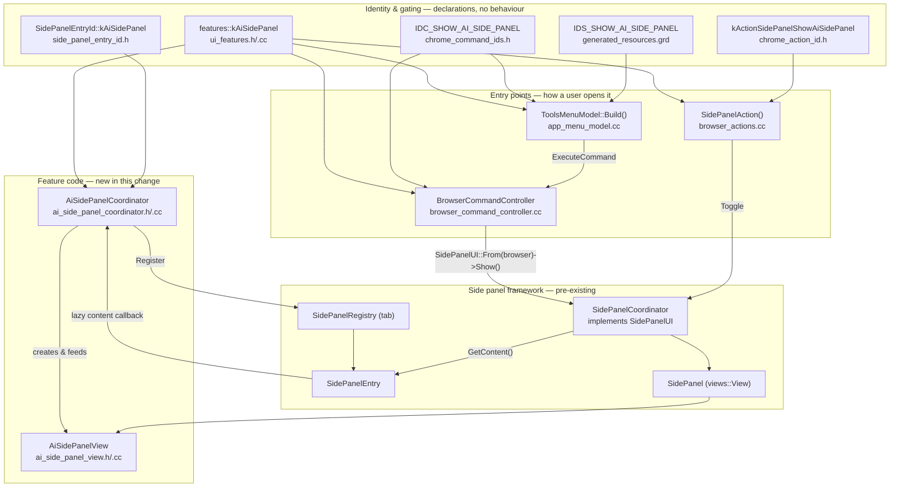
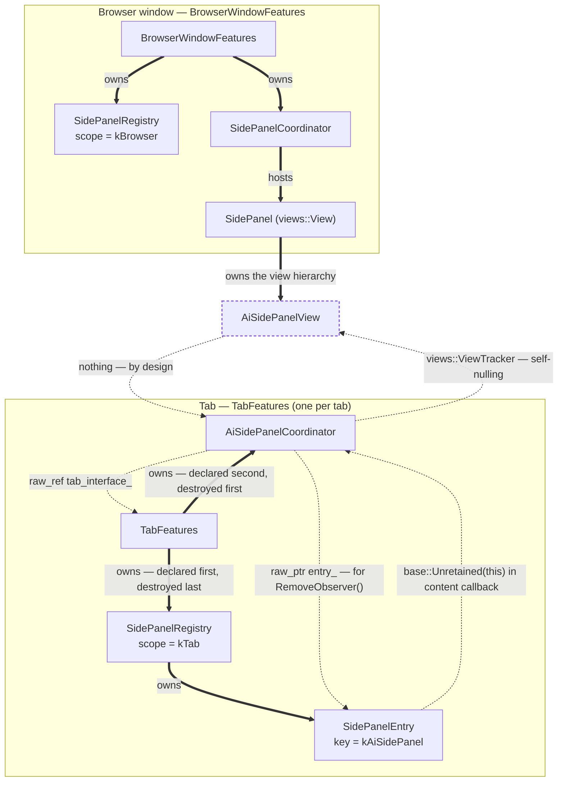
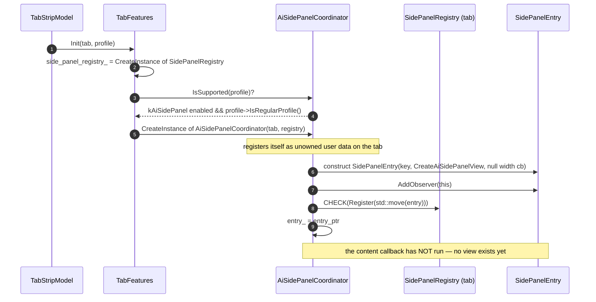
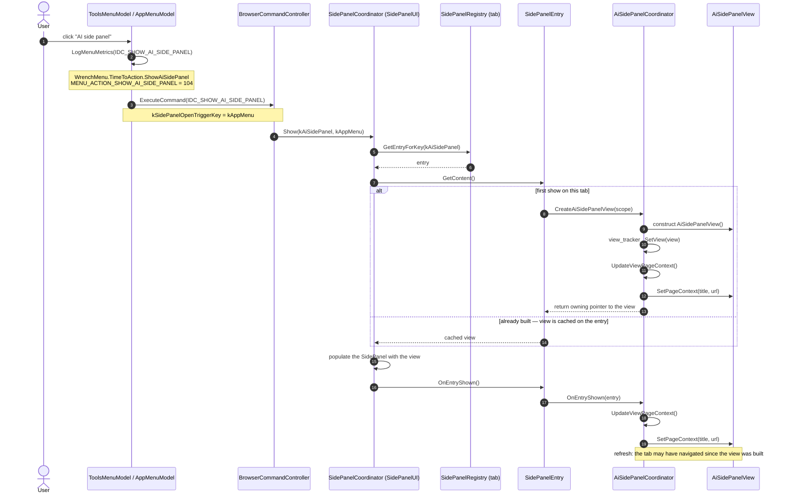
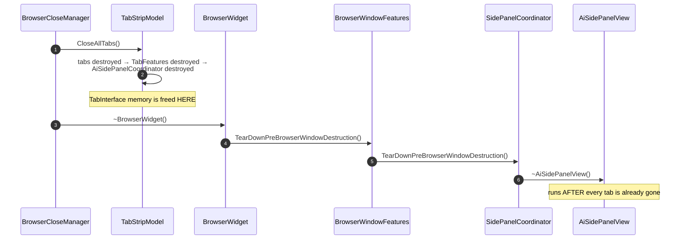
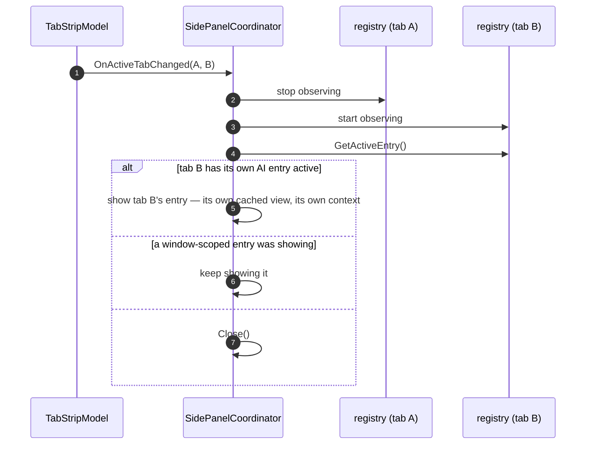
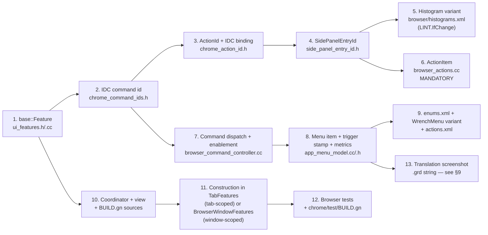

# AI Side Panel — Architecture & Implementation

Status: **Phase 1 landed**
Branch: `ai-side-panel-desktop`
Commit: the branch's single commit — *[side panel] Add a tab-scoped AI side panel behind a flag*
Author: Oleg Beletski
Last updated: 2026-09-15

Companion document: [`ai_side_panel_design.md`](ai_side_panel_design.md) — the
design rationale, the inventory of existing side panels, and the screenshots.
**This** document is the implementation reference: what the change is, which
files it touches, what each file contains, what changed in it, and how the
pieces call and own each other.

---

## Table of contents

1. [Summary](#1-summary)
2. [Platform support](#2-platform-support)
3. [Architecture](#3-architecture)
4. [File manifest](#4-file-manifest)
5. [New files in detail](#5-new-files-in-detail)
6. [Modified files in detail](#6-modified-files-in-detail)
7. [Wiring checklist](#7-wiring-checklist--what-a-new-side-panel-costs)
8. [Build and test](#8-build-and-test)
9. [Known gaps and next phases](#9-known-gaps-and-next-phases)
10. [Glossary](#10-glossary)

---

## 1. Summary

The change adds an **AI side panel**: a panel that opens to the right of the web
contents, is **scoped to a single tab**, and is launched from
**⋮ → More tools → AI side panel**.

| Property | Value |
|---|---|
| Feature flag | `features::kAiSidePanel`, `FEATURE_DISABLED_BY_DEFAULT` |
| Run with | `chrome --enable-features=AiSidePanel` |
| Scope | Tab-scoped (contextual) — one entry per tab, in the tab's own registry |
| Profile gate | Regular profiles only — not Incognito, not Guest |
| Entry point | App-menu item; a pinnable toolbar action also exists |
| Content (phase 1) | Views-native placeholder showing the tab's title and URL |
| Content (phase 2) | WebUI (web-technology user interface) host, same plumbing |
| Size | 26 files, 1136 insertions, 1 deletion — of which ~1000 lines are new code, tests and documentation |

Nothing in this change talks to a model yet. Phase 1 exists to prove the
**plumbing**: registration per tab, lazy content creation, tab-switch
behaviour, teardown safety, metrics and the flag gate.

---

## 2. Platform support

**Desktop only — Linux, macOS, Windows, ChromeOS. Not Android, not iOS.**

The side panel is a desktop Views concept; Android Chrome has neither the
`SidePanel` container nor the app menu model this change hooks into, and the
build files enforce that. Below: every touched file, what it holds, and where
it is compiled. "Desktop" means Linux, macOS, Windows and ChromeOS, and the GN
condition that excludes Android is named for each file.

| File | What it contains | Built for |
|---|---|---|
| [`chrome/browser/ui/views/side_panel/ai/ai_side_panel_coordinator.{h,cc}`](../chrome/browser/ui/views/side_panel/ai/ai_side_panel_coordinator.h) | The feature's controller: one per tab, creates and registers the panel's `SidePanelEntry`, gates the feature, builds the content lazily, pushes page context into the view | **Desktop.** `//chrome/browser/ui/views` is not in the Android build at all |
| [`chrome/browser/ui/views/side_panel/ai/ai_side_panel_view.{h,cc}`](../chrome/browser/ui/views/side_panel/ai/ai_side_panel_view.h) | The panel's content: a `views::View` with a vertical box layout and two labels (page title, page URL) plus the `SetPageContext()` setter | **Desktop.** Same target; `views::View` has no Android counterpart |
| [`chrome/browser/ui/views/side_panel/ai/ai_side_panel_coordinator_browsertest.cc`](../chrome/browser/ui/views/side_panel/ai/ai_side_panel_coordinator_browsertest.cc) | Three browser-test fixtures (flag on, flag on with pixel output, flag off) and six tests covering registration, show, tab scoping and the screenshot generator | **Desktop.** Added inside `if (!is_android)` at [`chrome/test/BUILD.gn:1625`](../chrome/test/BUILD.gn#L1625) |
| [`chrome/browser/ui/tabs/tab_features.{h,cc}`](../chrome/browser/ui/tabs/tab_features.cc) | The desktop per-tab object graph: declares and constructs everything a tab owns — its `SidePanelRegistry`, the Glic/Geic/Customize-Chrome coordinators, page-action controllers, and now the AI coordinator | **Desktop.** The whole target sits inside `if (!is_android)` at [`chrome/browser/ui/tabs/BUILD.gn:88`](../chrome/browser/ui/tabs/BUILD.gn#L88). Android has its own unrelated `chrome/browser/android/tab_features.cc` |
| [`chrome/browser/ui/browser_command_controller.cc`](../chrome/browser/ui/browser_command_controller.cc) | The dispatcher for every `IDC_*` browser command: a giant `switch` mapping command id to behaviour, plus `InitCommandState()`, which declares which commands are enabled for the current profile and window type | **Desktop.** In the `} else { # !is_android` branch at [`chrome/browser/ui/BUILD.gn:1318`](../chrome/browser/ui/BUILD.gn#L1318) — it belongs to `Browser`, a desktop-only class |
| [`chrome/browser/ui/browser_actions.cc`](../chrome/browser/ui/browser_actions.cc) | Builds the window's `actions::ActionItem` tree — the model behind toolbar buttons, pinning and Customize Chrome. One `ActionItem` per user-invocable action, with its string, icon, enabled state and invoke callback | **Desktop.** Inside `if (!is_android)` at [`chrome/browser/ui/BUILD.gn:103`](../chrome/browser/ui/BUILD.gn#L103) |
| [`chrome/browser/ui/toolbar/app_menu_model.{h,cc}`](../chrome/browser/ui/toolbar/app_menu_model.cc) | The ⋮ app menu: `AppMenuModel` and its submodels (`ToolsMenuModel`, bookmarks, history…) build the item list, route `ExecuteCommand()` to the command controller, and record the menu's UMA metrics. The header also holds the `AppMenuAction` histogram enum | **Desktop.** Inside `if (!is_android)` at [`chrome/browser/ui/toolbar/BUILD.gn:107`](../chrome/browser/ui/toolbar/BUILD.gn#L107); Android's menu is Java |
| [`chrome/browser/ui/views/side_panel/BUILD.gn`](../chrome/browser/ui/views/side_panel/BUILD.gn) | GN target definition for every desktop side panel implementation — the source list this change extends | **Desktop.** Only desktop targets depend on `//chrome/browser/ui/views/side_panel` |
| [`chrome/test/BUILD.gn`](../chrome/test/BUILD.gn) | GN definitions of the test binaries (`browser_tests`, `interactive_ui_tests`, `unit_tests`) and their source lists | Build configuration; the edited source list is the `!is_android` one |
| [`chrome/browser/ui/ui_features.{h,cc}`](../chrome/browser/ui/ui_features.h) | One flat `features::` namespace declaring and defining every desktop-UI `base::Feature` flag, each with its default state | **All platforms.** The target at [`chrome/browser/ui/BUILD.gn:3744`](../chrome/browser/ui/BUILD.gn#L3744) is unconditional, so `kAiSidePanel` exists on Android — with nothing reading it |
| [`chrome/app/chrome_command_ids.h`](../chrome/app/chrome_command_ids.h) | The complete numeric map of browser commands (`IDC_NEW_TAB`, `IDC_PRINT`, …) grouped by area, each a `#define` in a reserved range. The vocabulary shared by menus, accelerators, automation and the command controller | **All platforms.** A plain header; Android includes it for the commands it implements, and simply never sends `IDC_SHOW_AI_SIDE_PANEL` |
| [`chrome/browser/ui/actions/chrome_action_id.h`](../chrome/browser/ui/actions/chrome_action_id.h) | X-macro lists (`SIDE_PANEL_ACTION_IDS`, and siblings) that expand into the `actions::ActionId` enum and, where a second argument is given, bind each action to the `IDC_*` command it executes | **All platforms.** The target is unconditional, but the actions framework it feeds is desktop-only |
| [`chrome/browser/ui/side_panel/side_panel_entry_id.h`](../chrome/browser/ui/side_panel/side_panel_entry_id.h) | The `SIDE_PANEL_ENTRY_IDS` X-macro — the single source of truth for panel identity. One expansion produces the `SidePanelEntryId` enum, the histogram suffix string for each panel, and the entry→`ActionId` mapping, under a `LINT.IfChange` guard | **All platforms.** Unconditional target; only desktop code instantiates panels from it |
| [`chrome/app/generated_resources.grd`](../chrome/app/generated_resources.grd) | The GRD (GRIT resource description) file holding every translatable browser string as an `IDS_*` message with a translator description; compiled into the per-locale `.pak` resource bundles | **All platforms.** The string ships in the Android bundle too, unreferenced |
| [`tools/metrics/histograms/metadata/browser/histograms.xml`](../tools/metrics/histograms/metadata/browser/histograms.xml) | Histogram definitions for browser-level metrics, including the `SidePanelEntry` variant list that expands each side-panel histogram into one per panel | Metadata only — no code, no platform |
| [`tools/metrics/histograms/metadata/ui/enums.xml`](../tools/metrics/histograms/metadata/ui/enums.xml) | Enum label tables for UI histograms — the human-readable name of every numeric bucket, including `WrenchMenuAction` | Metadata only |
| [`tools/metrics/histograms/metadata/ui/histograms.xml`](../tools/metrics/histograms/metadata/ui/histograms.xml) | UI histogram definitions, including `WrenchMenu.TimeToAction` and the suffix list naming every app-menu action it is split by | Metadata only |
| [`tools/metrics/actions/actions.xml`](../tools/metrics/actions/actions.xml) | User-action metadata: the name and description of every `base::RecordAction()` event, including the per-`ActionId` variant list | Metadata only |
| [`docs-ob/ai_side_panel_design.md`](ai_side_panel_design.md), [`docs-ob/images/*.png`](images/) | The design document and its two screenshots | Documentation |

Two consequences worth stating explicitly, because they are the questions a
reviewer asks first:

- **Enabling `AiSidePanel` on Android does nothing.** No coordinator is
  constructed, no entry is registered, no menu item appears. There is no code
  path to reach.
- **No Java or JNI (Java Native Interface) surface is involved.** The
  `SIDE_PANEL_ENTRY_IDS` macro generates the C++ enum, the histogram suffix and
  the `SidePanelEntryId` → `ActionId` mapping only. (The participant table in
  the design document says it also generates a Java enum; it does not — the
  macro's only consumers are
  [`side_panel_entry_id.cc`](../chrome/browser/ui/side_panel/side_panel_entry_id.cc)
  and
  [`webui_browser_ui.cc`](../chrome/browser/ui/webui_browser/webui_browser_ui.cc).)

Porting to Android is not a matter of flipping a flag: it would need an
Android-side surface (a bottom sheet or a hub pane), its own Java UI and a
different entry point. Nothing in this change blocks that, and nothing in this
change advances it.

---

## 3. Architecture

### 3.1 The layers this change plugs into



### 3.2 Ownership

Solid arrows are **owning** (`std::unique_ptr` or view hierarchy); dashed
arrows are **non-owning** references that must therefore be proved safe.



Why each dashed edge is safe:

| Edge | Argument |
|---|---|
| `AiSidePanelCoordinator` → `SidePanelEntry` | The registry is declared **before** the coordinator in `TabFeatures` ([`tab_features.h:424`](../chrome/browser/ui/tabs/public/tab_features.h#L424) vs [`:560`](../chrome/browser/ui/tabs/public/tab_features.h#L560)), so it is destroyed **after** it. The entry is alive when `~AiSidePanelCoordinator()` calls `RemoveObserver()` |
| `SidePanelEntry` → `AiSidePanelCoordinator` (`base::Unretained`) | Same ordering, read the other way: the entry cannot outlive the registry, which cannot outlive `TabFeatures`, which owns the coordinator |
| `AiSidePanelCoordinator` → `TabInterface` (`raw_ref`) | `TabFeatures` dies with the tab, so the coordinator never outlives its tab |
| `AiSidePanelCoordinator` → `AiSidePanelView` (`ViewTracker`) | A `views::ViewTracker` observes the view and nulls itself when the view is destroyed; every use re-checks it |
| `AiSidePanelView` → anything | There is no edge. This is the whole point — see §3.5 |

### 3.3 Interaction — registration (once per tab, at tab creation)



The content callback is deliberately not invoked here: building a view for
every tab at tab-creation time would cost memory and time for a panel most
tabs never open.

### 3.4 Interaction — show



### 3.5 Interaction — teardown, and the trap it encodes



The panel's content view **outlives the tab**. A `raw_ref<tabs::TabInterface>`
on `AiSidePanelView` compiles, runs, and then trips Chromium's
dangling-pointer detector at shutdown:

```
[DanglingPtr] First, the memory was freed at:
    TabStripModel::SendDetachWebContentsNotifications()
[DanglingPtr] Later, the dangling raw_ptr was released at:
    AiSidePanelView::~AiSidePanelView()
```

Hence the rule this implementation encodes, and the reason
`AiSidePanelView`'s constructor takes no arguments: **Views-native side panel
content holds no pointer to its tab.** The coordinator owns the tab reference
and pushes data in. WebUI-hosted panels sidestep this because they touch
`SidePanelEntryScope` only during construction.

### 3.6 Interaction — tab switch

Tab-scoping is not implemented by this change; it is *inherited* by
registering into the tab's registry rather than the window's.



---

## 4. File manifest

26 files: **8 added**, **18 modified**. Every path below links to the file in
this repository.

### 4.1 Added — feature code

| File | Lines | Contains |
|---|---|---|
| [`chrome/browser/ui/views/side_panel/ai/ai_side_panel_coordinator.h`](../chrome/browser/ui/views/side_panel/ai/ai_side_panel_coordinator.h) | 74 | Declaration of `AiSidePanelCoordinator`: the tab-scoped owner of the panel's registry entry, its static `From()`/`IsSupported()` helpers, and its four members |
| [`chrome/browser/ui/views/side_panel/ai/ai_side_panel_coordinator.cc`](../chrome/browser/ui/views/side_panel/ai/ai_side_panel_coordinator.cc) | 116 | Entry construction and registration, the flag/profile gate, the lazy content factory, and the context push into the view |
| [`chrome/browser/ui/views/side_panel/ai/ai_side_panel_view.h`](../chrome/browser/ui/views/side_panel/ai/ai_side_panel_view.h) | 46 | Declaration of `AiSidePanelView`, a `views::View` with two labels and a single `SetPageContext()` entry point. Documents why it holds no tab pointer |
| [`chrome/browser/ui/views/side_panel/ai/ai_side_panel_view.cc`](../chrome/browser/ui/views/side_panel/ai/ai_side_panel_view.cc) | 56 | Layout (vertical box, 16 DIP padding, 8 DIP spacing), the two labels, `SetPageContext()`, view metadata |

### 4.2 Added — tests

| File | Lines | Contains |
|---|---|---|
| [`chrome/browser/ui/views/side_panel/ai/ai_side_panel_coordinator_browsertest.cc`](../chrome/browser/ui/views/side_panel/ai/ai_side_panel_coordinator_browsertest.cc) | 243 | Three fixtures and six tests: flag-on behaviour, flag-off behaviour, and the manual screenshot generator |

### 4.3 Added — documentation

| File | Contains |
|---|---|
| [`docs-ob/ai_side_panel_design.md`](ai_side_panel_design.md) | Design document: inventory of every existing side panel, participant reference, creation-flow diagrams, decisions, as-built notes, known gaps |
| [`docs-ob/images/ai_side_panel_tab1.png`](images/ai_side_panel_tab1.png) | Screenshot: two tabs, tab 1 active, panel showing tab 1's context |
| [`docs-ob/images/ai_side_panel_tab2.png`](images/ai_side_panel_tab2.png) | Same window, tab 2 active, panel showing tab 2's context — the visual proof of tab scoping |
| `docs-ob/ai_side_panel_implementation.md` | This document |

### 4.4 Modified — identity and gating

The five declarations that give the feature an identity, in the order a caller
meets them:

```cpp
// chrome/browser/ui/ui_features.h / .cc
BASE_DECLARE_FEATURE(kAiSidePanel);
BASE_FEATURE(kAiSidePanel, base::FEATURE_DISABLED_BY_DEFAULT);

// chrome/app/chrome_command_ids.h
#define IDC_SHOW_AI_SIDE_PANEL          40306

// chrome/browser/ui/actions/chrome_action_id.h - binds action to command
  E(kActionSidePanelShowAiSidePanel, IDC_SHOW_AI_SIDE_PANEL) \

// chrome/browser/ui/side_panel/side_panel_entry_id.h - binds entry to action
  V(kAiSidePanel, kActionSidePanelShowAiSidePanel, "AiSidePanel")             \
```

```xml
<!-- chrome/app/generated_resources.grd -->
<message name="IDS_SHOW_AI_SIDE_PANEL"
         desc="App menu entry point to open the AI side panel next to the
               current tab.">
  AI side panel
</message>
```

| File | Δ | What the file is | What changed |
|---|---|---|---|
| [`chrome/browser/ui/ui_features.h`](../chrome/browser/ui/ui_features.h#L405) | +4 | Declarations of every desktop-UI `base::Feature` | Declares `kAiSidePanel` with a comment pointing at the design document |
| [`chrome/browser/ui/ui_features.cc`](../chrome/browser/ui/ui_features.cc#L579) | +2 | Definitions of those features | `BASE_FEATURE(kAiSidePanel, base::FEATURE_DISABLED_BY_DEFAULT)` |
| [`chrome/app/chrome_command_ids.h`](../chrome/app/chrome_command_ids.h#L295) | +1 | The numeric `IDC_*` (command identifier) space for every browser command | `#define IDC_SHOW_AI_SIDE_PANEL 40306`, next to the other side panel commands |
| [`chrome/browser/ui/actions/chrome_action_id.h`](../chrome/browser/ui/actions/chrome_action_id.h#L488) | +1 | X-macro lists that generate the `actions::ActionId` enum | Adds `E(kActionSidePanelShowAiSidePanel, IDC_SHOW_AI_SIDE_PANEL)` to `SIDE_PANEL_ACTION_IDS`, binding the action to the command |
| [`chrome/browser/ui/side_panel/side_panel_entry_id.h`](../chrome/browser/ui/side_panel/side_panel_entry_id.h#L46) | +1 | The `SIDE_PANEL_ENTRY_IDS` X-macro — the single source of truth for panel identity | Adds `V(kAiSidePanel, kActionSidePanelShowAiSidePanel, "AiSidePanel")`, which simultaneously creates the enum value, the histogram suffix and the entry→action mapping. Guarded by `LINT.IfChange`, so the histogram variant in §4.7 is mandatory |
| [`chrome/app/generated_resources.grd`](../chrome/app/generated_resources.grd#L9738) | +5 | GRD (GRIT resource description) file holding every translatable browser string | Adds `IDS_SHOW_AI_SIDE_PANEL` = "AI side panel", with a translator description |

### 4.5 Modified — construction and entry points

| File | Δ | What the file is | What changed |
|---|---|---|---|
| [`chrome/browser/ui/tabs/public/tab_features.h`](../chrome/browser/ui/tabs/public/tab_features.h#L560) | +2 | Declares `TabFeatures`, the owner of every per-tab object | Forward-declares `AiSidePanelCoordinator` and adds the `ai_side_panel_coordinator_` member — placed after `side_panel_registry_` so it is destroyed before it |
| [`chrome/browser/ui/tabs/tab_features.cc`](../chrome/browser/ui/tabs/tab_features.cc#L436) | +7 | Constructs those objects in `TabFeatures::Init()` | Constructs one coordinator per tab, gated on `AiSidePanelCoordinator::IsSupported()`, passing the tab's registry — the line that makes the panel tab-scoped |
| [`chrome/browser/ui/browser_command_controller.cc`](../chrome/browser/ui/browser_command_controller.cc#L1279) | +7 | Maps `IDC_*` commands to behaviour and tracks which are enabled | Adds the `IDC_SHOW_AI_SIDE_PANEL` dispatch case calling `SidePanelUI::From(browser_)->Show(kAiSidePanel, kAppMenu)`, and enables the command in `InitCommandState()` only when supported |
| [`chrome/browser/ui/toolbar/app_menu_model.cc`](../chrome/browser/ui/toolbar/app_menu_model.cc#L1107) | +17 −1 | Builds the ⋮ app menu and records its metrics | Three edits: (1) the menu item in `ToolsMenuModel::Build()`, after Reading mode; (2) `IDC_SHOW_AI_SIDE_PANEL` joined to the `ExecuteCommand()` case list that stamps `kSidePanelOpenTriggerKey = kAppMenu`; (3) a `LogMenuMetrics()` case recording `WrenchMenu.TimeToAction.ShowAiSidePanel` and `MENU_ACTION_SHOW_AI_SIDE_PANEL` |
| [`chrome/browser/ui/toolbar/app_menu_model.h`](../chrome/browser/ui/toolbar/app_menu_model.h#L126) | +1 | Declares `AppMenuModel` and the `AppMenuAction` histogram enum | Adds `MENU_ACTION_SHOW_AI_SIDE_PANEL = 104`. `LINT.ThenChange` ties it to `enums.xml` |
| [`chrome/browser/ui/browser_actions.cc`](../chrome/browser/ui/browser_actions.cc#L667) | +12 | Builds the window's `actions::ActionItem` tree (toolbar, pinning, Customize Chrome) | Registers the side panel action via `SidePanelAction(...)` with `is_pinnable=true`. **Not optional** — see §7 |

### 4.6 Modified — build

| File | Δ | What the file is | What changed |
|---|---|---|---|
| [`chrome/browser/ui/views/side_panel/BUILD.gn`](../chrome/browser/ui/views/side_panel/BUILD.gn#L12) | +4 | GN (generate-ninja) build rules for the desktop side panel sources | Adds the four new coordinator/view sources to the `side_panel` source set |
| [`chrome/test/BUILD.gn`](../chrome/test/BUILD.gn#L2779) | +1 | Build rules for the test binaries | Adds the browser test to `browser_tests`, inside the `if (!is_android)` block |

### 4.7 Modified — metrics metadata

None of these change behaviour; each satisfies a presubmit or `LINT.IfChange`
constraint triggered by the code above. UMA is Chromium's User Metrics
Analysis pipeline.

| File | Δ | What the file is | What changed |
|---|---|---|---|
| [`tools/metrics/histograms/metadata/browser/histograms.xml`](../tools/metrics/histograms/metadata/browser/histograms.xml) | +1 | Histogram definitions for browser-level metrics | Adds the `AiSidePanel` variant to the `SidePanelEntry` variant list — required by the `LINT.IfChange` on `SIDE_PANEL_ENTRY_IDS` |
| [`tools/metrics/histograms/metadata/ui/enums.xml`](../tools/metrics/histograms/metadata/ui/enums.xml) | +1 | Enum label tables for UI histograms | Adds label `104 = "Show AI side panel"` to `WrenchMenuAction`, paired with `app_menu_model.h` |
| [`tools/metrics/histograms/metadata/ui/histograms.xml`](../tools/metrics/histograms/metadata/ui/histograms.xml) | +1 | UI histogram definitions | Adds the `.ShowAiSidePanel` suffix to the `WrenchMenu.TimeToAction` variant list |
| [`tools/metrics/actions/actions.xml`](../tools/metrics/actions/actions.xml) | +2 | User-action metadata | Adds the `.kActionSidePanelShowAiSidePanel` variant, so invoking the action records a named user action |

---

## 5. New files in detail

### 5.1 `ai_side_panel_coordinator.h` / `.cc`

One instance per tab, owned by `TabFeatures`, and installed as *unowned user
data* on the `TabInterface` so any code can reach it with
`AiSidePanelCoordinator::From(tab)`. It inherits `SidePanelEntryObserver`.

```cpp
// chrome/browser/ui/views/side_panel/ai/ai_side_panel_coordinator.h
class AiSidePanelCoordinator : public SidePanelEntryObserver {
 public:
  AiSidePanelCoordinator(tabs::TabInterface& tab_interface,
                         SidePanelRegistry* registry);
  ~AiSidePanelCoordinator() override;

  DECLARE_USER_DATA(AiSidePanelCoordinator);
  static AiSidePanelCoordinator* From(tabs::TabInterface* tab);
  static bool IsSupported(Profile* profile);

  void Show();

  // SidePanelEntryObserver:
  void OnEntryShown(SidePanelEntry* entry) override;

 private:
  void CreateAndRegisterEntry(SidePanelRegistry* registry);
  void UpdateViewPageContext();
  SidePanelNativeView CreateAiSidePanelView(SidePanelEntryScope& scope);

  const raw_ref<tabs::TabInterface> tab_interface_;
  raw_ptr<SidePanelEntry> entry_ = nullptr;   // Owned by the tab's registry.
  views::ViewTracker view_tracker_;           // Self-nulling.
  ui::ScopedUnownedUserData<AiSidePanelCoordinator> scoped_unowned_user_data_;
};
```

| Member | Visibility | What it does |
|---|---|---|
| `AiSidePanelCoordinator(TabInterface&, SidePanelRegistry*)` | public | Stores the tab reference, installs itself as unowned user data, and registers the entry when the registry is non-null ([`.cc:44`](../chrome/browser/ui/views/side_panel/ai/ai_side_panel_coordinator.cc#L44)) |
| `~AiSidePanelCoordinator()` | public | `entry_->RemoveObserver(this)`. Mandatory: the registry — and so the entry — outlives the coordinator, and a `CheckedObserver` left registered crashes when the list later notifies a destroyed object |
| `static From(TabInterface*)` | public | Looks the coordinator up in the tab's `UnownedUserDataHost`. Null-safe, and null when the feature is off |
| `static IsSupported(Profile*)` | public | The single gate for the whole feature: `profile->IsRegularProfile() && base::FeatureList::IsEnabled(features::kAiSidePanel)`. Four call sites — `TabFeatures`, `AppMenuModel`, `BrowserActions`, `BrowserCommandController` — consult it, which is what keeps them consistent |
| `Show()` | public | Opens the panel for this tab through `SidePanelUI::From(...)->Show(kAiSidePanel)`. No-op when the window exposes no `SidePanelUI`. Used by tests and programmatic callers; the menu path goes through the command id instead |
| `OnEntryShown(SidePanelEntry*)` | public, override | Refreshes the context. Needed because `SidePanelEntry` caches the view between shows, so the tab may have navigated since it was built |
| `CreateAndRegisterEntry(SidePanelRegistry*)` | private | Builds the `SidePanelEntry` with `CreateAiSidePanelView` bound as its lazy content callback, subscribes, `CHECK`s the registration, then caches the raw pointer — in that order, so `entry_` is only set once the registry owns the entry |
| `UpdateViewPageContext()` | private | Reads the tab's `WebContents` title and last committed URL and pushes both into the view. Returns early when the `ViewTracker` is empty; clears both fields when there is no `WebContents` |
| `CreateAiSidePanelView(SidePanelEntryScope&)` | private | The content factory. Constructs the view, records it in `view_tracker_`, seeds the context, returns ownership |

**The gate** ([`.cc:37`](../chrome/browser/ui/views/side_panel/ai/ai_side_panel_coordinator.cc#L37)).
One function, four callers — `TabFeatures`, `AppMenuModel`, `BrowserActions`
and `BrowserCommandController` — which is what keeps them from drifting apart:

```cpp
// static
bool AiSidePanelCoordinator::IsSupported(Profile* profile) {
  // The panel sends page context to a model, so it is not offered in
  // incognito, guest or other non-regular profiles.
  return profile->IsRegularProfile() &&
         base::FeatureList::IsEnabled(features::kAiSidePanel);
}
```

**Registration** ([`.cc:61`](../chrome/browser/ui/views/side_panel/ai/ai_side_panel_coordinator.cc#L61)).
Note the ordering: `entry_` is assigned only after `Register()` has taken
ownership, because a failed registration destroys the entry:

```cpp
void AiSidePanelCoordinator::CreateAndRegisterEntry(
    SidePanelRegistry* registry) {
  auto entry = std::make_unique<SidePanelEntry>(
      SidePanelEntryKey(SidePanelEntryId::kAiSidePanel),
      base::BindRepeating(&AiSidePanelCoordinator::CreateAiSidePanelView,
                          base::Unretained(this)),
      /*default_content_width_callback=*/base::NullCallback());
  entry->AddObserver(this);
  SidePanelEntry* const entry_ptr = entry.get();
  // Register() destroys `entry` and returns false if the key is already taken.
  // Only retain the pointer once it is known to be owned by the registry.
  CHECK(registry->Register(std::move(entry)));
  entry_ = entry_ptr;
}
```

`base::Unretained(this)` is safe here for the ownership reason argued in §3.2:
the entry cannot outlive the registry, which cannot outlive `TabFeatures`,
which owns the coordinator. The mirror-image obligation is the destructor:

```cpp
AiSidePanelCoordinator::~AiSidePanelCoordinator() {
  // The registry, and therefore the entry, outlives this object.
  if (entry_) {
    entry_->RemoveObserver(this);
  }
}
```

**The lazy content factory and the context push**
([`.cc:110`](../chrome/browser/ui/views/side_panel/ai/ai_side_panel_coordinator.cc#L110)).
`CreateAiSidePanelView()` runs on first show, never at registration;
`UpdateViewPageContext()` runs again on every subsequent show because the view
is cached:

```cpp
SidePanelNativeView AiSidePanelCoordinator::CreateAiSidePanelView(
    SidePanelEntryScope& scope) {
  auto view = std::make_unique<AiSidePanelView>();
  view_tracker_.SetView(view.get());
  UpdateViewPageContext();
  return view;
}

void AiSidePanelCoordinator::UpdateViewPageContext() {
  auto* view = views::AsViewClass<AiSidePanelView>(view_tracker_.view());
  if (!view) {
    return;
  }

  content::WebContents* const contents = tab_interface_->GetContents();
  if (!contents) {
    view->SetPageContext(std::u16string(), std::u16string());
    return;
  }

  // TODO: Use url_formatter::FormatUrlForSecurityDisplay() when this stub is
  // replaced. possibly_invalid_spec() renders embedded credentials verbatim
  // and is not how Chrome displays URLs to users.
  view->SetPageContext(
      contents->GetTitle(),
      base::UTF8ToUTF16(
          contents->GetLastCommittedURL().possibly_invalid_spec()));
}
```

Note that the `SidePanelEntryScope&` parameter is accepted and ignored. Most
panels use it to reach their tab; this coordinator already holds the tab, and
the scope is what a WebUI host will consume in phase 2.

Members: `tab_interface_` (`raw_ref`), `entry_` (`raw_ptr`, owned by the
registry), `view_tracker_` (`views::ViewTracker`, self-nulling),
`scoped_unowned_user_data_`.

### 5.2 `ai_side_panel_view.h` / `.cc`

A plain `views::View`: a vertical `BoxLayout` with 16 DIP (device-independent
pixel) padding and 8 DIP spacing, holding two multi-line labels — a
`STYLE_PRIMARY` title and a `STYLE_SECONDARY` URL.

| Member | What it does |
|---|---|
| `AiSidePanelView()` | Builds the layout and the two labels, both initially empty. Takes **no arguments** — deliberately, see §3.5. Draws no heading: the side panel frame already renders the entry title, and an earlier version showed it twice |
| `~AiSidePanelView()` | Defaulted. There is nothing to unwind because the view holds no cross-object pointer |
| `SetPageContext(title, url)` | Sets the two labels. The only channel through which data enters the view |

The constructor takes no arguments and the class has no pointer members other
than the two labels it owns through the view hierarchy — that is the §3.5 rule
expressed in code
([`ai_side_panel_view.cc:26`](../chrome/browser/ui/views/side_panel/ai/ai_side_panel_view.cc#L26)):

```cpp
AiSidePanelView::AiSidePanelView() {
  SetLayoutManager(std::make_unique<views::BoxLayout>(
      views::BoxLayout::Orientation::kVertical, gfx::Insets(kPanelPadding),
      kLabelSpacing));

  // No heading here: the side panel frame already renders the entry title.
  auto title_label = std::make_unique<views::Label>(
      std::u16string(), views::style::CONTEXT_LABEL,
      views::style::STYLE_PRIMARY);
  title_label->SetHorizontalAlignment(gfx::ALIGN_LEFT);
  title_label->SetMultiLine(true);
  title_label_ = AddChildView(std::move(title_label));
  // ... the URL label is built the same way with STYLE_SECONDARY.
}

void AiSidePanelView::SetPageContext(const std::u16string& title,
                                     const std::u16string& url) {
  title_label_->SetText(title);
  url_label_->SetText(url);
}
```

### 5.3 `ai_side_panel_coordinator_browsertest.cc`

| Fixture | Test | Line | Asserts |
|---|---|---|---|
| `AiSidePanelCoordinatorBrowserTest` (flag on) | `EntryIsRegisteredOnEveryTab` | [72](../chrome/browser/ui/views/side_panel/ai/ai_side_panel_coordinator_browsertest.cc#L72) | Every tab has its own entry and its own coordinator |
| | `ShowSidePanel` | [82](../chrome/browser/ui/views/side_panel/ai/ai_side_panel_coordinator_browsertest.cc#L82) | `Show()` makes the panel visible and current |
| | `ShowFromAppMenu` | [91](../chrome/browser/ui/views/side_panel/ai/ai_side_panel_coordinator_browsertest.cc#L91) | Executing `IDC_SHOW_AI_SIDE_PANEL` with the app-menu trigger opens it |
| | `PanelIsScopedToItsTab` | [105](../chrome/browser/ui/views/side_panel/ai/ai_side_panel_coordinator_browsertest.cc#L105) | Open on tab 0, switch to tab 1 and back — the panel follows the tab and does not leak across |
| `AiSidePanelScreenshotBrowserTest` | `MANUAL_Screenshots` | [148](../chrome/browser/ui/views/side_panel/ai/ai_side_panel_coordinator_browsertest.cc#L148) | Not a correctness test: regenerates the two images in §4.3. Adds `--enable-pixel-output-in-tests`, without which browser tests composite to a no-op and snapshots come back blank |
| `AiSidePanelCoordinatorDisabledBrowserTest` (flag off) | `NothingIsRegistered` | [232](../chrome/browser/ui/views/side_panel/ai/ai_side_panel_coordinator_browsertest.cc#L232) | No coordinator on the tab, no entry in the registry |

The load-bearing test is `PanelIsScopedToItsTab` — it is what proves the
behaviour §3.6 describes, and it would fail if the entry had been registered
into the window's registry instead of the tab's:

```cpp
IN_PROC_BROWSER_TEST_F(AiSidePanelCoordinatorBrowserTest,
                       PanelIsScopedToItsTab) {
  coordinator()->SetNoDelaysForTesting(true);
  ASSERT_TRUE(AddTabAtIndex(1, GURL("about:blank"), ui::PAGE_TRANSITION_TYPED));

  browser()->tab_strip_model()->ActivateTabAt(0);
  coordinator()->Show(SidePanelEntryId::kAiSidePanel);
  ASSERT_TRUE(
      base::test::RunUntil([&]() { return GetSidePanel()->GetVisible(); }));

  browser()->tab_strip_model()->ActivateTabAt(1);
  EXPECT_TRUE(base::test::RunUntil([&]() {
    return coordinator()->GetCurrentEntryId() != SidePanelEntryId::kAiSidePanel;
  }));

  browser()->tab_strip_model()->ActivateTabAt(0);
  EXPECT_TRUE(base::test::RunUntil([&]() {
    return coordinator()->GetCurrentEntryId() == SidePanelEntryId::kAiSidePanel;
  }));
}
```

The flag-off fixture is the same shape with
`features_.InitAndDisableFeature(features::kAiSidePanel)`, asserting that
`AiSidePanelCoordinator::From(tab)` is null and the registry has no entry for
the key.

---

## 6. Modified files in detail

The five edits worth reading in full, because each encodes a constraint of the
framework rather than a choice of this feature.

**`tab_features.cc` — the line that defines the scope.** Registering into
`side_panel_registry_.get()` (the *tab's* registry, owned by `TabFeatures`)
rather than the window's registry is the entire tab-scoping implementation.
Everything in §3.6 follows from it and required no code here.

```cpp
// chrome/browser/ui/tabs/tab_features.cc, in TabFeatures::Init()
if (AiSidePanelCoordinator::IsSupported(profile)) {
  ai_side_panel_coordinator_ =
      GetUserDataFactory().CreateInstance<AiSidePanelCoordinator>(
          tab, tab, side_panel_registry_.get());
}
```

The member is declared *after* `side_panel_registry_` in `tab_features.h`, so
it is destroyed *before* it — the ordering the destructor in §5.1 depends on:

```cpp
// chrome/browser/ui/tabs/public/tab_features.h
std::unique_ptr<SidePanelRegistry> side_panel_registry_;   // line 424
// ...
std::unique_ptr<AiSidePanelCoordinator> ai_side_panel_coordinator_;  // line 560
```

**`side_panel_entry_id.h` — one line, four consequences.** The `V(...)` entry
generates the enum value, the histogram suffix string, and the
`SidePanelEntryId` → `actions::ActionId` mapping, and the `LINT.IfChange`
annotation makes the `histograms.xml` variant a build-time requirement rather
than a convention.

```cpp
// chrome/browser/ui/side_panel/side_panel_entry_id.h
// LINT.IfChange(SIDE_PANEL_ENTRY_IDS)
#define SIDE_PANEL_ENTRY_IDS(V)                                               \
  /* ... */                                                                   \
  V(kAiSidePanel, kActionSidePanelShowAiSidePanel, "AiSidePanel")             \
  /* ... */
// LINT.ThenChange(//tools/metrics/histograms/metadata/browser/histograms.xml:SidePanelEntry)
```

```xml
<!-- tools/metrics/histograms/metadata/browser/histograms.xml -->
<variants name="SidePanelEntry">
  <variant name="AboutThisSite" summary="about this site"/>
  <variant name="AiSidePanel" summary="AI side panel"/>
  <!-- ... one variant per SidePanelEntryId ... -->
</variants>
```

**`browser_actions.cc` — mandatory, not decorative.** Once an entry id maps to
an `ActionId`, the framework assumes a matching `actions::ActionItem` exists:
`SidePanelHelper::GetActionItem()` returns `ActionManager::FindAction(...)`,
which is **null** when no item was built, and
`SidePanelToolbarPinningController::UpdatePinState()` dereferences that result
immediately. A panel registered without an `ActionItem` crashes when shown —
even if its only entry point is a menu item.

```cpp
// chrome/browser/ui/browser_actions.cc, in InitializeSidePanelActions()
if (AiSidePanelCoordinator::IsSupported(profile)) {
  root_action_item_->AddChild(
      SidePanelAction(SidePanelEntryId::kAiSidePanel, IDS_SHOW_AI_SIDE_PANEL,
                      IDS_SHOW_AI_SIDE_PANEL,
                      features::IsRoundedIconsEnabled() ? kDraftSparkIcon
                                                        : kDraftSparkOldIcon,
                      kActionSidePanelShowAiSidePanel, bwi,
                      /*is_pinnable=*/true)
          .Build());
}
```

**`app_menu_model.cc` — three separate edits, all required.** The item itself;
membership in the `ExecuteCommand()` case list that stamps
`kSidePanelOpenTriggerKey` (without it, the metric attributes the open to no
trigger); and the `LogMenuMetrics()` case. Missing the third silently drops the
menu-action metric.

```cpp
// (1) chrome/browser/ui/toolbar/app_menu_model.cc, ToolsMenuModel::Build()
if (AiSidePanelCoordinator::IsSupported(browser->GetProfile())) {
  AddItemWithStringIdAndVectorIcon(
      this, IDC_SHOW_AI_SIDE_PANEL, IDS_SHOW_AI_SIDE_PANEL,
      features::IsRoundedIconsEnabled() ? kDraftSparkIcon
                                        : kDraftSparkOldIcon);
}

// (2) AppMenuModel::ExecuteCommand() - joins the case list that stamps the
// open trigger onto the action invocation context.
    case IDC_SHOW_CUSTOMIZE_CHROME_SIDE_PANEL:
    case IDC_SHOW_AI_SIDE_PANEL: {
      actions::ActionInvocationContext context =
          actions::ActionInvocationContext::Builder()
              .SetProperty(
                  kSidePanelOpenTriggerKey,
                  static_cast<std::underlying_type_t<SidePanelOpenTrigger>>(
                      SidePanelOpenTrigger::kAppMenu))
              .Build();

// (3) AppMenuModel::LogMenuMetrics()
    case IDC_SHOW_AI_SIDE_PANEL:
      if (!uma_action_recorded_) {
        base::UmaHistogramMediumTimes("WrenchMenu.TimeToAction.ShowAiSidePanel",
                                      delta);
      }
      LogMenuAction(MENU_ACTION_SHOW_AI_SIDE_PANEL);
      break;
```

`MENU_ACTION_SHOW_AI_SIDE_PANEL = 104` is added to the `AppMenuAction` enum in
`app_menu_model.h`, whose `LINT.ThenChange` requires the matching label in
`tools/metrics/histograms/metadata/ui/enums.xml`:

```xml
<int value="104" label="Show AI side panel"/>
```

**`browser_command_controller.cc` — dispatch and enablement are separate.**
Adding the `case` makes the command work; `UpdateCommandEnabled()` in
`InitCommandState()` is what makes it *disabled* when the flag is off, so a
stray accelerator or automation cannot reach a feature that was never built.

```cpp
// chrome/browser/ui/browser_command_controller.cc
// HandleCommandWithDisposition() - what the command does:
    case IDC_SHOW_AI_SIDE_PANEL:
      SidePanelUI::From(browser_)->Show(SidePanelEntryId::kAiSidePanel,
                                        SidePanelOpenTrigger::kAppMenu);
      break;

// InitCommandState() - whether the command exists at all:
  command_updater_->UpdateCommandEnabled(
      IDC_SHOW_AI_SIDE_PANEL, AiSidePanelCoordinator::IsSupported(profile()));
```

---

## 7. Wiring checklist — what a new side panel costs

Distilled from this change; useful for the next panel, and for reviewing this
one.



The three that are easy to miss and fail loudly or silently:

- **6** — omitting the `ActionItem` crashes on show, not at registration.
- **5, 9** — omitting the metrics metadata fails presubmit, or silently drops
  the metric.
- **The trigger stamp in 8** — invisible until someone reads the histogram.

---

## 8. Build and test

```sh
# Build (Linux host, no remote execution on this machine)
autoninja --quiet -C out/Desktop chrome

# Run the feature
out/Desktop/chrome --enable-features=AiSidePanel

# Tests — autotest.py builds what it needs; pass filenames, not GN labels
tools/autotest.py --quiet --run-all -C out/Desktop \
    chrome/browser/ui/views/side_panel/ai/ai_side_panel_coordinator_browsertest.cc

# Regenerate the screenshots in the design document
testing/xvfb.py out/Desktop/browser_tests \
    --gtest_filter=AiSidePanelScreenshotBrowserTest.MANUAL_Screenshots \
    --run-manual --single-process-tests
```

All five correctness tests pass, with Chromium's dangling-pointer detector
clean. There is no Android target to build for this change (§2).

---

## 9. Known gaps and next phases

| Gap | Detail |
|---|---|
| Translation screenshot missing | `chrome/app/generated_resources_grd/IDS_SHOW_AI_SIDE_PANEL.png.sha1` does not exist, so `git cl presubmit` fails until one is uploaded with `tools/translation/upload_screenshots.py`. It cannot be generated locally |
| Content is a placeholder | No model is wired up; the panel renders the tab's title and URL |
| Context does not refresh mid-show | It updates on show, not on navigation while the panel is already open. A `WebContentsObserver` would close this; deferred to phase 2, where the WebUI owns its own updates |
| URL rendered raw | `possibly_invalid_spec()` shows embedded credentials verbatim. Phase 2 should use `url_formatter::FormatUrlForSecurityDisplay()` |
| Flag-off coverage is partial | `NothingIsRegistered` checks the coordinator and the registry, but not that the command is disabled, the `ActionItem` absent or the menu item missing |
| Screenshot test writes into the source tree | Fine locally; would not survive upstream review inside `browser_tests` |
| Absent from Customize Chrome | The pinnable action is not listed in `customize_toolbar_handler.cc`, so it never appears on that settings page. Cosmetic — the unknown id is tolerated |
| Hardcoded layout constants | `AiSidePanelView` uses literal 16/8 DIP instead of `ChromeLayoutProvider` |

**Phase 2** replaces the body of `CreateAiSidePanelView()` with
`SidePanelWebUIViewT<AiSidePanelUI>` and adds `ai_side_panel.mojom`, a WebUI
controller and a TypeScript bundle under
`chrome/browser/resources/side_panel/ai/`. Registration, menu and command
plumbing are untouched, and the §3.5 hazard disappears with WebUI content.
**Phase 3** adds a dedicated icon, ephemeral toolbar presence and IPH
(in-product help). **Phase 4** plumbs a model behind the Mojo interface.

---

## 10. Glossary

Abbreviations used above and throughout the Chromium side panel code.

| Term | Expansion / meaning |
|---|---|
| **IDC** | "ID for command" — the numeric identifier of a browser command, defined in `chrome_command_ids.h` and dispatched by `BrowserCommandController` |
| **IDS** | "ID for string" — the identifier of a translatable string defined in a `.grd` file |
| **GRD / GRIT** | Graphical Resource Description file, processed by GRIT (Google Resource and Internationalization Tool) into compiled resources |
| **X-macro** | A C preprocessor list (`SIDE_PANEL_ENTRY_IDS(V)`) expanded several times with different `V` definitions, so one list generates an enum, a string table and a mapping |
| **DIP** | Device-independent pixel — the display-scale-independent unit Views lays out in |
| **UMA** | User Metrics Analysis — Chromium's histogram and user-action telemetry pipeline |
| **UKM** | URL-Keyed Metrics — per-URL telemetry; not used by this change |
| **WebUI** | A browser user interface implemented with web technologies (HTML/CSS/TypeScript) rendered in a privileged `WebContents`, as opposed to a native Views surface |
| **Mojo / `.mojom`** | Chromium's inter-process communication system and its interface definition language |
| **Views** | Chromium's native desktop UI toolkit (`ui/views`); `views::View` is its widget base class |
| **GN** | "Generate Ninja" — Chromium's build-configuration language; `BUILD.gn` files declare targets |
| **IPH** | In-product help — the promo bubbles that introduce a feature |
| **JNI** | Java Native Interface — the Java↔C++ bridge used on Android; not involved here |
| **`raw_ptr` / `raw_ref`** | Chromium's checked pointer and reference wrappers, which detect dangling use (MiraclePtr) |
| **`LINT.IfChange` / `LINT.ThenChange`** | Presubmit annotations pairing two regions that must be edited together — used here between the entry-id macro and `histograms.xml`, and between `AppMenuAction` and `enums.xml` |
| **Glic / Geic** | Two existing tab-scoped AI side panels in the tree; `Geic`'s coordinator was the structural model for this one |
| **Wrench menu** | The historical name for the ⋮ app menu, still used in its metric names (`WrenchMenu.TimeToAction.*`) |
| **`TabInterface`** | The public, embedder-facing handle to a tab (`components/tabs/public/tab_interface.h`) |
| **`TabFeatures` / `BrowserWindowFeatures`** | The owners of per-tab and per-window objects respectively; where feature code is constructed |
| **`UnownedUserData`** | A keyed lookup table attached to a host object (here the tab), letting code find an object it does not own |
| **RBE** | Remote build execution — not available on this machine, hence local-only builds |
