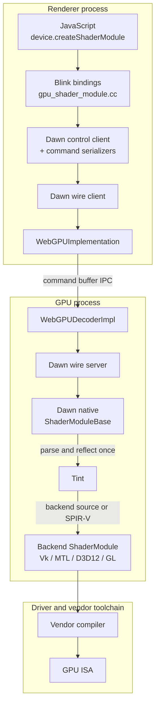
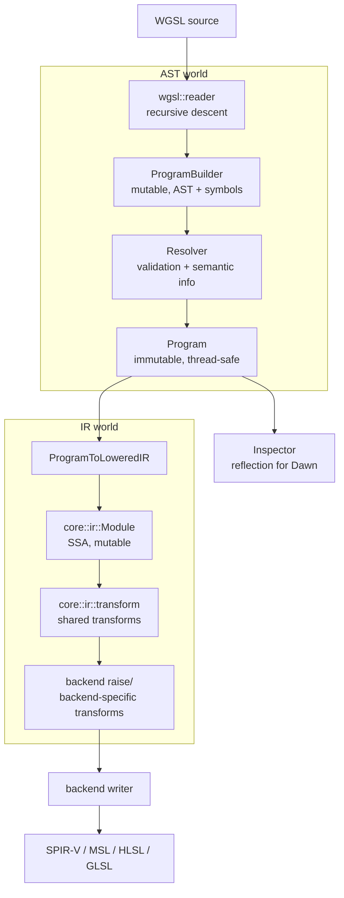
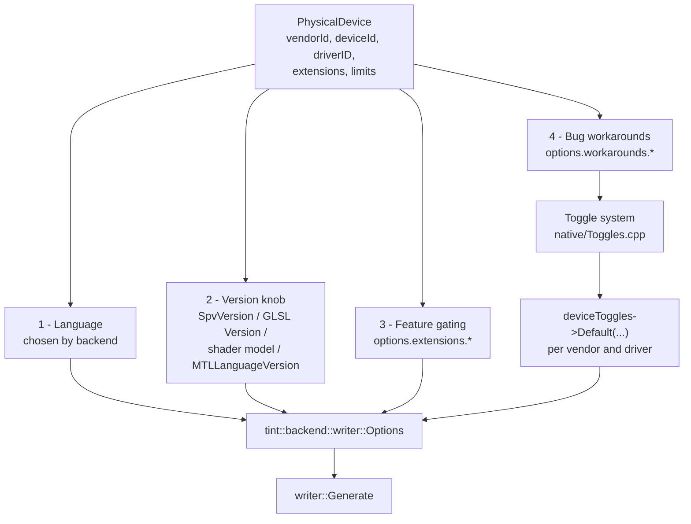
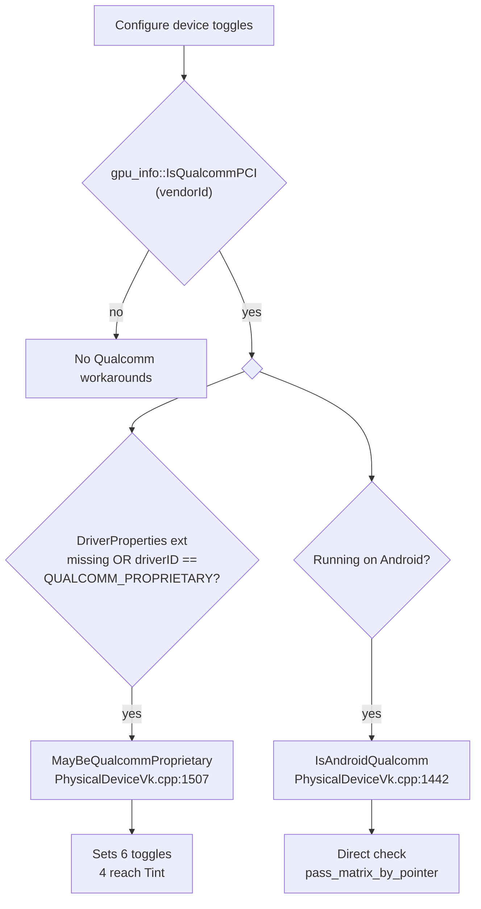
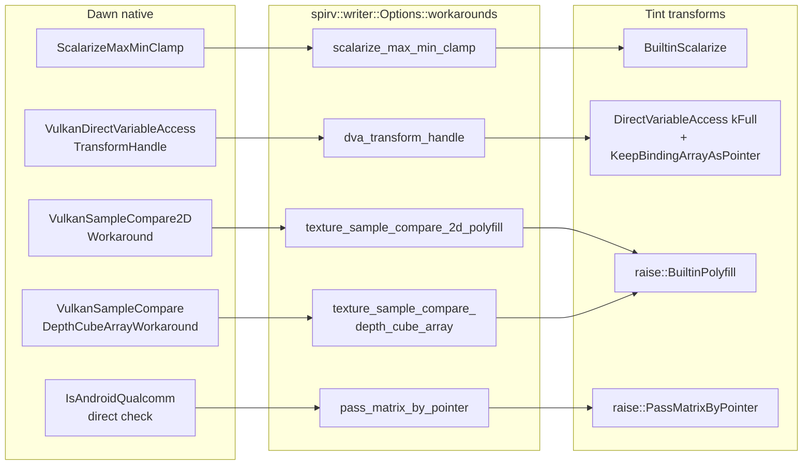

# WGSL Compilation Path

How a WebGPU shader travels from a JavaScript string to GPU instructions in Chromium, and where "which GPU am I on?" actually changes the generated code.

> **Source links.** Paths below link into
> [github.com/obeletski/chromium](https://github.com/obeletski/chromium) on the
> `digitclassifier` branch. Files under `third_party/dawn/` are deliberately not
> linked: dawn is a git submodule, so its contents are not in this repository.

> **The one-line answer:** Chromium never compiles WGSL to GPU machine code. It translates WGSL into whatever *source-level* shading language the platform driver accepts — SPIR-V, MSL, HLSL, or GLSL ES — and hands that to the vendor compiler. Everything people call "targeting a specific GPU" is a set of options threaded into that translation.

---

## Contents

- [Scope](#scope)
- [Participating subprojects](#participating-subprojects)
- [End-to-end pipeline](#end-to-end-pipeline)
- [Inside Tint](#inside-tint)
- [The four axes of GPU targeting](#the-four-axes-of-gpu-targeting)
- [Per-backend version targeting](#per-backend-version-targeting)
- [Case study: Qualcomm workarounds](#case-study-qualcomm-workarounds)
- [Why the cache key matters](#why-the-cache-key-matters)
- [Files worth reading](#files-worth-reading)
- [Existing documentation](#existing-documentation)
- [Caveats and gotchas](#caveats-and-gotchas)

---

## Scope

This covers the **shader compilation** path only: `GPUDevice.createShaderModule()` through to a driver-consumable shader binary or source string. It deliberately does not cover pipeline creation, resource binding, or command submission, except where those leak into shader codegen (binding remapping and immediate/push-constant layout genuinely do).

Everything below was read out of the tree at `f6fd8f0cdc96a`. Paths are relative to `//` (the Chromium `src/` root).

---

## Participating subprojects

Seven distinct codebases participate, spanning two processes and two repositories.

| # | Subproject | Path | Role in this scenario |
|---|---|---|---|
| 1 | **Blink WebGPU bindings** | `//third_party/blink/renderer/modules/webgpu/` | IDL surface. Converts a JS `GPUShaderModuleDescriptor` into a Dawn C++ call. |
| 2 | **Blink GPU platform** | `//third_party/blink/renderer/platform/graphics/gpu/` | Holds the Dawn control client and command serializers that carry the call out of the renderer. |
| 3 | **Command buffer client** | `//gpu/command_buffer/client/` | `WebGPUImplementation` — renderer-side transport. |
| 4 | **Command buffer service** | `//gpu/command_buffer/service/` | `WebGPUDecoderImpl` — GPU-process-side decode; owns the Dawn wire server. |
| 5 | **Dawn wire** | `//third_party/dawn/src/dawn/wire/` | Serializes the WebGPU object model across the process boundary (`client/`, `server/`). |
| 6 | **Dawn native** | `//third_party/dawn/src/dawn/native/` | The WebGPU implementation. Validates, reflects, decides *all* device-specific options, invokes Tint, then calls the driver. |
| 7 | **Tint** | `//third_party/dawn/src/tint/` | The WGSL compiler proper. Reader → IR → transforms → backend writer. |

Plus three external toolchains that finish the job, none of which Chromium controls:

| Toolchain | Consumed by | Notes |
|---|---|---|
| **SPIRV-Tools** | `native/SpirvValidation.cpp` | Validation only, not codegen. Runs against `SPV_ENV_VULKAN_1_1` or `..._SPIRV_1_4`. |
| **DXC / FXC** | `native/d3d/ShaderUtils.cpp` | HLSL → DXIL/DXBC. Shader model passed as a profile string. |
| **Vendor driver compilers** | Vulkan / Metal / GL | The only component that emits actual GPU ISA. |

There is also a small **code generation** subproject worth knowing about: `//third_party/dawn/generator/dawn_gpu_info_generator.py` turns `//third_party/dawn/src/dawn/gpu_info.json` into `GPUInfo_autogen.h`, which is where predicates like `gpu_info::IsQualcommPCI()` and `gpu_info::IsMaliG68()` come from. Adding a new GPU family to a workaround means editing that JSON, not a header.

---

## End-to-end pipeline



Two things are easy to miss in this diagram:

1. **WGSL is parsed once, generated many times.** `native/ShaderModule.cpp` parses and reflects the WGSL into an immutable `tint::Program` at `createShaderModule` time. Backend code generation happens *later*, at pipeline creation, because it needs the pipeline layout to resolve binding points. That is why `ShaderModuleVk.cpp` receives an already-parsed `Program` rather than source.
2. **The renderer never sees the GPU.** All device-specific decisions happen in the GPU process, where `PhysicalDevice` has queried the real driver.

---

## Inside Tint



The `Program` is immutable and carries full semantic information, which is what makes it safe to share across threads and cache. The IR is the opposite: mutable, SSA-form, and deliberately reduced — `for`/`while`/`loop` all collapse to a single `loop` construct, complex expressions are broken into single operations, and short-circuit `&&`/`||` become real control flow.

That reduction is the whole point. Per `docs/tint/ir.md`, transforms used to run on the immutable AST, which meant every transform cloned the AST *and* forced the resolver to rerun to regenerate semantic info. The IR replaced that.

**Transforms are configured, not registered.** There is no transform manager. `raise.cc` is a straight-line function that calls each transform in a fixed order, with `if` guards on the options. Ordering is load-bearing and the comments say so explicitly — `PreservePadding` must precede `DirectVariableAccess`, which must precede `PassMatrixByPointer`.

---

## The four axes of GPU targeting

Everything device-specific converges on one struct per backend: `tint::<backend>::writer::Options`. Dawn builds it fresh per shader stage, per pipeline.



**Axis 1 — Language.** Fixed by backend. Vulkan → SPIR-V, Metal → MSL, D3D11/12 → HLSL, OpenGL/ES → GLSL.

**Axis 2 — Version.** A per-writer knob; see the table below.

**Axis 3 — Feature gating.** `options.extensions.*` mirrors what the driver actually advertises, so Tint emits the efficient instruction when available and a polyfill otherwise. In `ShaderModuleVk.cpp:300-330`: `use_vulkan_memory_model`, `use_demote_to_helper_invocation`, `dot_4x8_packed`, `use_storage_input_output_16`, `use_maximal_reconvergence`, `use_subgroup_uniform_control_flow`, `use_zero_initialize_workgroup_memory`.

**Axis 4 — Bug workarounds.** `options.workarounds.*`, driven by Dawn's **toggle** system. Toggles are declared centrally in `native/Toggles.cpp` (each with a description and a crbug link) and defaulted per-device in the backend's `PhysicalDevice*.cpp`. This is the axis that is literally about *specific GPUs*.

The distinction between axes 3 and 4 is worth internalizing: **axis 3 asks "can this driver do X?", axis 4 asks "does this driver do X *wrong*?"**

---

## Per-backend version targeting

| Backend | Mechanism | Values | Set at |
|---|---|---|---|
| **Vulkan** | `Options::spirv_version` | `kSpv13`, `kSpv14`, `kSpv15` (testing only) | `vulkan/ShaderModuleVk.cpp:294` |
| **OpenGL / ES** | `Options::version` — `{Standard, major, minor}` | `kES` or `kDesktop`, e.g. ES 3.1 | `opengl/ShaderModuleGL.cpp:438` |
| **D3D12** | DXC profile string — Tint emits version-agnostic HLSL | `vs_6_2`, `ps_6_2`, `cs_6_2`, … | `d3d12/DeviceD3D12.cpp:206-209` |
| **Metal** | `MTLCompileOptions.languageVersion` | e.g. `MTLLanguageVersion3_2` | `metal/ShaderModuleMTL.mm:539` |

A few details that surprised me:

**SPIR-V version is a Chromium feature flag, not a capability query.** `ShaderModuleVk.cpp:294` reads `Toggle::UseSpirv14`, which `PhysicalDeviceVk.cpp:1314` gates on `platform::Features::kWebGPUUseSpirv14` *and* `!IsAndroidARM()`. The enum's own comment lists the checklist for adding a version:

```
/// Supported SPIR-V binary versions.
/// If a new version is added here, also add it to:
/// * Writer::CanGenerate
/// * Printer::Code
/// Fully usable version will also need additions to:
/// * --spir-version on the command line
/// * Dawn in the Vulkan backend
```

**D3D shader model is discovered by descending probe.** `d3d12/D3D12Info.cpp:216-247` walks a list of `D3D12_FEATURE_DATA_SHADER_MODEL` values calling `CheckFeatureSupport` until one succeeds, then packs it as `10 * major + minor` (so SM 6.2 → `62`). `DeviceD3D12.cpp:206` formats it into a profile suffix:

```cpp
std::wstring profileSuffix = std::format(L"s_{}_{}", shaderModelMajor, shaderModelMinor);
mDxcShaderProfiles[SingleShaderStage::Vertex]   = L"v" + profileSuffix;
mDxcShaderProfiles[SingleShaderStage::Fragment] = L"p" + profileSuffix;
mDxcShaderProfiles[SingleShaderStage::Compute]  = L"c" + profileSuffix;
```

The discovered model can then be *clamped down* by a toggle — `PhysicalDeviceD3D12.cpp:79` caps it at 65 when `D3D12DontUseShaderModel66OrHigher` is set. So the applied model is a policy decision, not purely a hardware fact.

**GLSL version is copied verbatim off the live context.** `opengl/ShaderModuleGL.cpp:438` reads `gl.GetVersion()` and passes major/minor straight through. No probing, no clamping.

---

## Case study: Qualcomm workarounds

The most instructive example, and directly relevant to any Android checkout, since Adreno covers most target hardware.

### Two different predicates



The two are **not** interchangeable:

- `MayBeQualcommProprietary()` is deliberately conservative — it returns true when `DriverProperties` is *unavailable*, not only when the proprietary driver is confirmed. Fail-safe rather than fail-fast.
- `IsAndroidQualcomm()` ignores driver ID entirely, so it also covers Mesa/Turnip on Android, but excludes Qualcomm on Windows.

### What actually reaches the shader compiler

The `MayBeQualcommProprietary()` block at `PhysicalDeviceVk.cpp:1033` sets six toggles. **Only four are shader compilation.** The other three are command-buffer or render-pass level and never touch Tint:

| Toggle | Reaches Tint? | Layer |
|---|---|---|
| `VulkanSplitCommandBufferOnComputePassAfterRenderPass` | No | Command buffer |
| `AlwaysResolveIntoZeroLevelAndLayer` | No | Render pass |
| `VulkanAddWorkToEmptyResolvePass` | No | Render pass |
| `ScalarizeMaxMinClamp` | **Yes** | Shader |
| `VulkanDirectVariableAccessTransformHandle` | **Yes** | Shader |
| `VulkanSampleCompareDepthCubeArrayWorkaround` | **Yes** (32-bit only) | Shader |
| `VulkanSampleCompare2DWorkaround` | **Yes** | Shader |

### The five shader workarounds



Mapping happens in one contiguous block at `vulkan/ShaderModuleVk.cpp:337-366`.

#### 1. `scalarize_max_min_clamp` — [crbug 407109052](https://crbug.com/407109052)

> Qualcomm devices have a bug where the spirv extended op NClamp modifies other components of a vector when one of the components is nan.

`core/ir/transform/builtin_scalarize.cc:74` matches vector `min`/`max`/`clamp`, and `ScalarizeBuiltin()` splits them into per-component scalar calls. One `OpExtInst NClamp %v4float` becomes four scalar `NClamp`s plus a vector construct.

#### 2. `dva_transform_handle`

> Qualcomm's shader compiler returns an internal error when `binding_array<texture*>` is passed by argument to functions.

This one *escalates* an existing transform rather than adding one (`raise.cc:159`):

```cpp
dva_options.transform_handle = options.workarounds.dva_transform_handle
                                   ? core::ir::transform::HandleTransformLevel::kFull
                                   : core::ir::transform::HandleTransformLevel::kExternal;
```

It then pulls in a paired second transform (`raise.cc:171`), because the first one creates a new problem:

> Fixup loads of binding_arrays of handles that may have been introduced by DirectVariableAccess (DVA). Vulkan drivers that need DVA of handle expect binding_arrays to stay as pointer and many mishandle by-value binding_arrays.

#### 3 & 4. Depth-compare sampling polyfills

Both land in `raise/builtin_polyfill.cc:774-783` and both work by **substituting a different SPIR-V opcode** — `OpImageDrefGather` instead of `OpImageSampleDref{Implicit,Explicit}Lod` (`:812-825`).

`texture_sample_compare_2d_polyfill` ([crbug 469328925](https://crbug.com/469328925)) goes further and hand-rolls the bilinear PCF filtering the driver gets wrong (`:844`): query dimensions with `OpImageQuerySizeLod`, compute `coords * dim - 0.5`, bake any offset into the coordinates, gather four depth comparisons, interpolate manually. The result type changes too — `vec4f` instead of `f32` at `:898`, since a gather returns four texels.

`texture_sample_compare_depth_cube_array` is narrower and is the only one here that is architecture-conditional:

```cpp
// Qualcomm has compiler error only in 32 bit. Modern devices (64 bit, adreno 8xx) do not
// exhibit this compiler error.
#if DAWN_PLATFORM_IS(32_BIT)
    deviceToggles->Default(Toggle::VulkanSampleCompareDepthCubeArrayWorkaround, true);
#endif
```

#### 5. `pass_matrix_by_pointer` — [crbug tint/2045](https://crbug.com/tint/2045)

The odd one out: no toggle at all, checked directly against the physical device at `ShaderModuleVk.cpp:363`. Rewrites calls that pass matrix-containing values so they pass pointers instead. Ordering matters (`raise.cc:175`): *"PassMatrixByPointer must come after PreservePadding+DirectVariableAccess."*

### Not Qualcomm

For contrast, since it is easy to lump these together: `polyfill_case_switch` / `VulkanPolyfillSwitchWithIf` is **Imagination**, set by `MayBeImaginationProprietary()` at `PhysicalDeviceVk.cpp:1077` for [crbug 443906252](https://crbug.com/443906252) (large switch ranges). Other vendor-gated shader toggles in the same file include `CollapseSubgroupMinMax` (Windows AMD), `PolyfillPackUnpack4x8Norm` (ARM), and `EnableSubgroupsIntelGen9`.

---

## Why the cache key matters

Because output is device-specific along all four axes, a compiled blob can never be shared across devices. `native/Device.cpp:386-392`:

```cpp
CacheKey cacheKey;
StreamIn(&cacheKey, adapterInfo, mEnabledFeatures.featuresBitSet, mToggles, cacheDesc);

// Hash the key to make it smaller.
Sha3_224::Output hash = Sha3_224::Hash(cacheKey.data(), cacheKey.size());
// Dawn Version needs to be in plain because it's used for ValidateCacheKey()
StreamIn(&mDeviceCacheKey, kDawnVersion, hash);
```

Note that **`mToggles` is part of the key**. Flipping any workaround toggle — including via a command-line override — correctly invalidates cached shaders. `kDawnVersion` is stored unhashed so it can be validated before trusting the rest.

---

## Files worth reading

Ordered roughly by how much understanding each one buys.

### Start here

| File | Why |
|---|---|
| `dawn/src/dawn/native/vulkan/ShaderModuleVk.cpp` | The single best file in this whole path. Lines 259-380 are one continuous, readable list of every device-specific decision. Read this before any doc. |
| `dawn/src/tint/lang/spirv/writer/raise/raise.cc` | The entire SPIR-V transform pipeline as straight-line code. Shows ordering constraints and which options gate which transform. |
| `dawn/src/dawn/native/vulkan/PhysicalDeviceVk.cpp` | Lines ~1000-1250. Every vendor and driver quirk in the Vulkan backend, each with a crbug link. Reads like a field guide to mobile GPU bugs. |
| `dawn/src/tint/lang/spirv/writer/common/options.h` | The full contract between Dawn and Tint. `Workarounds` and `Extensions` structs are the interesting part. |

### Next

| File | Why |
|---|---|
| `dawn/src/dawn/native/ShaderModule.cpp` | WGSL parse, validation, and Tint-based reflection. ~1500 lines; `ReflectShaderUsingTint` around :1314. |
| `dawn/src/dawn/native/Toggles.cpp` | Central registry of every toggle with description and bug link. Grep here first when you see an unfamiliar toggle name. |
| `dawn/src/tint/lang/spirv/writer/raise/builtin_polyfill.cc` | Representative of how a polyfill is actually written against the IR builder. |
| `dawn/src/tint/lang/core/ir/transform/builtin_scalarize.cc` | The smallest complete transform worth reading end-to-end. |
| `dawn/src/dawn/native/Device.cpp` | Cache key construction at :386. |

### Backend comparison

Read these three side by side to see how the same problem is solved four ways:

| File | Version mechanism |
|---|---|
| `dawn/src/dawn/native/opengl/ShaderModuleGL.cpp` | GLSL `{Standard, major, minor}` from live context (:438) |
| `dawn/src/dawn/native/metal/ShaderModuleMTL.mm` | `MTLCompileOptions` (:529-560) |
| `dawn/src/dawn/native/d3d12/DeviceD3D12.cpp` | DXC profile strings (:206) |
| `dawn/src/dawn/native/d3d12/D3D12Info.cpp` | Shader model probing (:216) |

### Chromium-side plumbing

| File | Why |
|---|---|
| [`blink/renderer/modules/webgpu/gpu_shader_module.cc`](https://github.com/obeletski/chromium/blob/digitclassifier/third_party/blink/renderer/modules/webgpu/gpu_shader_module.cc) | Where the JS call becomes a Dawn call (:56). Thin. |
| [`gpu/command_buffer/service/webgpu_decoder_impl.cc`](https://github.com/obeletski/chromium/blob/digitclassifier/gpu/command_buffer/service/webgpu_decoder_impl.cc) | GPU-process entry; owns the wire server (:440, :1180). |
| `dawn/src/dawn/gpu_info.json` | Add a GPU family here, not in a header — it generates `GPUInfo_autogen.h`. |

---

## Existing documentation

### Tint

| Doc | Covers |
|---|---|
| [`dawn/docs/tint/arch.md`](https://dawn.googlesource.com/dawn/+/refs/heads/main/docs/tint/arch.md) | Reader → ProgramBuilder → Resolver → Program → Transform → Writer, with an ASCII pipeline diagram. **Partly stale** — see caveats. |
| [`dawn/docs/tint/ir.md`](https://dawn.googlesource.com/dawn/+/refs/heads/main/docs/tint/ir.md) | The IR that actually does the work: design, control flow, values, and a candid "Alternatives Considered" section on why not LLVM IR or NIR. |
| [`dawn/docs/tint/layering.md`](https://dawn.googlesource.com/dawn/+/refs/heads/main/docs/tint/layering.md) | Dependency layering of Tint's build units. |
| `dawn/docs/tint/spirv-input-output-variables.md` | SPIR-V I/O variable handling. |
| `dawn/docs/tint/spirv-ptr-ref.md` | SPIR-V pointer/reference semantics. |
| `dawn/docs/tint/spirv-reader-overview.md` | The SPIR-V *input* path (less relevant to WebGPU, used for testing). |
| `dawn/docs/tint/uniformity_analysis.md` | Uniformity analysis, with worked examples in `uniformity_examples/`. |
| `dawn/docs/tint/translations.md` | WGSL → backend language mappings. |

### Dawn

| Doc | Covers |
|---|---|
| [`dawn/docs/dawn/overview.md`](https://dawn.googlesource.com/dawn/+/refs/heads/main/docs/dawn/overview.md) | Dawn's overall structure. |
| `dawn/docs/dawn/codegen.md` | The generator infrastructure. |
| `dawn/docs/dawn/device_facilities.md` | Toggles, caching, and other device-level machinery. |
| `dawn/src/dawn/updating_gpu_info.md` | How to add a GPU vendor or family to `gpu_info.json`. |
| `dawn/docs/dawn/debugging.md`, `debug_markers.md` | Debugging, including shader dumping. |

### Chromium

There is **no** WebGPU shader-compilation architecture doc under `//docs/gpu/` — that directory holds GPU debugging, testing, and triage material only. The design documentation lives entirely in the Dawn repo. The closest Chromium-side items are [`//docs/gpu/debugging_gpu_related_code.md`](https://github.com/obeletski/chromium/blob/digitclassifier/docs/gpu/debugging_gpu_related_code.md) and [`//docs/gpu/webgpu_cts_harness_message_protocol.md`](https://github.com/obeletski/chromium/blob/digitclassifier/docs/gpu/webgpu_cts_harness_message_protocol.md).

---

## Caveats and gotchas

**`arch.md` describes a pipeline that no longer runs.** Its diagram shows transforms cloning the immutable `Program` into a fresh `ProgramBuilder` and rebuilding. That is not the live backend path. Today it is `Program → ProgramToLoweredIR → core::ir::Module → raise transforms → writer` (`ShaderModuleVk.cpp:414`, `:425`). Read `ir.md` alongside `arch.md`, and treat the latter's Reader/Program/Writer halves as accurate while ignoring its transform story.

**"Version" means four different things.** A SPIR-V binary version, a GLSL language version, a D3D shader model, and a Metal language version are not analogous knobs. Only GLSL is copied straight from the driver. SPIR-V is a Chromium feature flag. D3D is probed and then possibly clamped by policy. Metal is conditional on an unrelated feature (shader print logging).

**Not every toggle in a vendor block is a shader toggle.** Three of the six in the Qualcomm block are command-buffer or render-pass level. Check whether a toggle is actually read in `ShaderModule*.cpp` before assuming it affects codegen.

**Two Qualcomm predicates with different semantics.** `MayBeQualcommProprietary()` and `IsAndroidQualcomm()` cover overlapping but distinct device sets. Using the wrong one silently under- or over-applies a workaround.

**Transform ordering is a correctness constraint, not a style choice.** `raise.cc` carries explicit comments about it. A transform inserted in the wrong place can produce IR that later transforms ICE on, since each transform declares the IR `Capabilities` it supports.

**Workaround toggles are in the cache key.** Convenient — you cannot poison a shader cache by flipping a toggle. But it also means toggle churn invalidates caches broadly.
