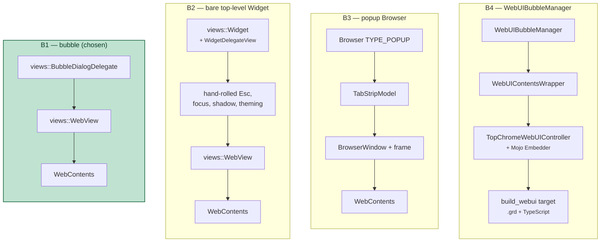
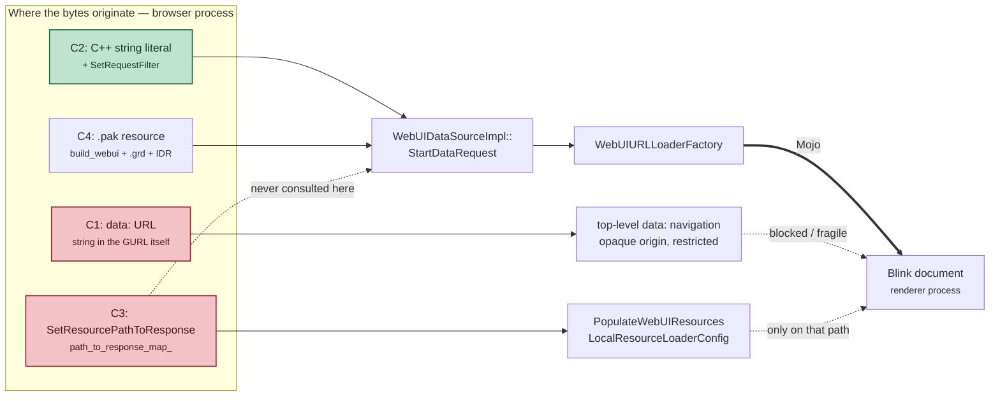
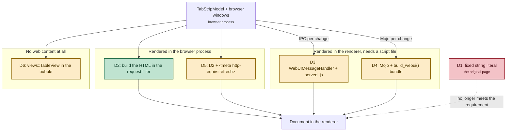
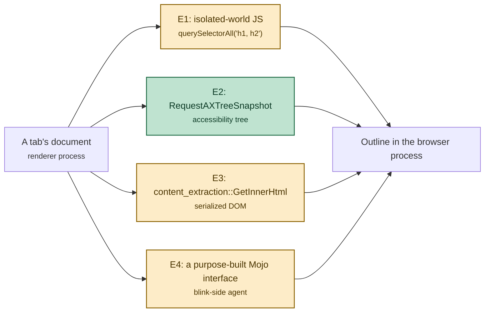

# A toolbar button that opens a floating HTML window

Design alternatives and the chosen implementation, written against this
checkout (`~/chromium-desk/src`) at `f6fd8f0cdc96a`, branch `floating-window`.

> **Source links.** Every path below links into
> [github.com/obeletski/chromium](https://github.com/obeletski/chromium) on the
> `floating-window` branch. Line anchors were checked against the tree these docs
> were written from; they will drift if the branch is rebased onto newer upstream.

## The requirement

1. An icon in the desktop (Linux) Chromium toolbar, sitting next to the profile
   / Incognito indicator and the extensions puzzle icon.
2. Clicking it opens a **floating, non-modal** window.
3. The window renders **HTML** — originally the text *"I am the floating
   window"*; since extended to a **table of every open tab in the profile**,
   grouped by browser window, each tab followed by that page's **outline: its
   level 1 and level 2 headings**.
4. Clicking the icon again, or pressing **Esc**, closes it.

Five decisions fall out of that, and they are independent: **where the button
comes from**, **what kind of widget the window is**, **how the HTML gets to the
renderer**, — once the content stopped being fixed text — **where the content
itself comes from**, and — once that content included data the browser process
does not have — **how it is fetched across the process boundary**. Each is
treated separately below.

> Parts A–C were settled by the original static-page version and are unchanged.
> Part D was added when the page had to start showing real data. Part E was
> added when it had to show data that lives in *other processes*, which is the
> point the design stopped being synchronous.


---

## Part A — where the button comes from

### A1. A `ToolbarButton` added directly in `ToolbarView::Init()`

`ToolbarView` builds its children in a fixed order in
`chrome/browser/ui/views/toolbar/toolbar_view.cc:308`. Roughly:

```
back → forward → reload → home → split-tabs → location bar →
extensions container → toolbar divider → pinned actions → chrome labs →
battery saver → performance intervention → media → glic → avatar →
overflow → app menu
```

Adding a `raw_ptr<...> foo_` member and one `AddChildView()` call at the right
index puts the icon exactly where you want it, permanently.

* **For:** ~15 lines in `ToolbarView`. Placement is deterministic and is
  precisely "between extensions and the profile icon". No prefs, no action
  framework, no model. This is what `BatterySaverButton` and
  `PerformanceInterventionButton` do today.
* **Against:** the button is not user-pinnable or re-orderable, does not appear
  in the "Customize toolbar" surface, and does not participate in
  `ToolbarController` overflow. Adding an always-visible child also perturbs
  tests that assert on toolbar child counts or layout.

### A2. An `actions::ActionItem` hosted by `PinnedToolbarActionsContainer`

The modern route. You declare an `ActionId` (`chrome/browser/ui/actions/`),
register an `ActionItem` with an icon, text and an invoke callback, and pin it
by default through `PinnedToolbarActionsModel`. `PinnedToolbarActionsContainer`
([`toolbar_view.cc:500`](https://github.com/obeletski/chromium/blob/floating-window/chrome/browser/ui/views/toolbar/toolbar_view.cc#L500)) then materialises a `PinnedActionToolbarButton` for it.
This is how the side panel entries and `kActionShowAiOverlayDialog` work.

* **For:** the idiomatic 2025/2026 pattern. Free context menu, pinning,
  overflow, `ActionItem`-driven enabled/visible state, and it lands in the
  container that already sits next to extensions and the avatar.
* **Against:** substantially more machinery — a new `ActionId` enum entry, an
  `ActionItem` registration in `BrowserActions`, a pinned-by-default migration,
  and a `PinnedToolbarActionsModel` pref. And the *position* becomes the user's,
  not ours: it lands wherever the pinned container puts it, which is adjacent to
  but not exactly "next to the profile icon".

### A3. An extension with a browser action

Zero Chromium changes; a `chrome.action` + `chrome.windows.create` extension
gets an icon in the puzzle-menu area.

* **For:** no build at all.
* **Against:** it is not *in* the browser. It is behind the puzzle icon unless
  pinned, the window is a real browser popup with a frame and an omnibox chip,
  and none of it is C++. Rejected — it does not answer the request.

### A4. `WebUIToolbarWebView`

This checkout is mid-migration to a WebUI toolbar
(`features::IsWebUIToolbarFullyEnabled()`, `webui_toolbar_web_view.h`). A button
could be added on that side in TypeScript instead.

* **For:** where the toolbar is heading.
* **Against:** the WebUI toolbar is behind flags that are off here, so the
  button would be invisible in a default build. It also duplicates work: the
  Views path still has to exist. Rejected for now.

---

## Part B — what kind of widget the window is

The four serious candidates differ in how much of the stack they drag in. Each
column is one option; the boxes are what you end up owning.



B1 wins not because it is the most capable but because a bubble **already is**
an independent top-level widget with a shadow and a themed frame. B2 reaches the
same place by re-implementing what B1 inherits; B3 and B4 add whole subsystems.


### B1. `views::BubbleDialogDelegateView` anchored to the button

A bubble is already a separate, non-modal, top-level `views::Widget` with a
shadow and a rounded frame — "floating" in every sense that matters — that
happens to position itself relative to an anchor view.

* **For:** Esc-to-close comes for free (`DialogClientView` registers the
  `VKEY_ESCAPE` accelerator at [`ui/views/window/dialog_client_view.cc:114`](https://github.com/obeletski/chromium/blob/floating-window/ui/views/window/dialog_client_view.cc#L114)).
  `set_close_on_deactivate(false)` makes it persist while you use the browser,
  which is what "floating window" implies. `autosize` sizes it to its contents.
  It follows the browser window when that moves.
* **Against:** the user cannot drag it away from the anchor, and it has no
  title bar. It is a bubble that behaves like a window rather than a window.

### B2. A standalone top-level `views::Widget`

`views::Widget::InitParams(TYPE_WINDOW)` with a `WidgetDelegateView`, parented
to the browser's native view but with its own frame.

* **For:** a real, draggable, independently positioned window with a title bar.
  Closest to a literal reading of "floating window".
* **Against:** you hand-roll everything a bubble gives you — Esc handling,
  focus, shadow, theming, close-on-parent-destroyed, and correct behaviour when
  the browser window is minimised or moved between displays. Noticeably more
  code for a demo surface, and easy to get subtly wrong on Wayland/X11.

### B3. A `Browser` popup window (`Browser::TYPE_POPUP`)

`Browser::Create()` with a popup type and a tab navigated to the page.

* **For:** trivially "a window"; gets the full browser stack.
* **Against:** enormously heavier than needed — a whole `Browser`, tab strip
  model, session entry and window controller for one line of text. It also
  shows browser chrome, and Esc does nothing useful in it.

### B4. `WebUIBubbleManager` + `TopChromeWebUIController`

The Tab Search / Read Later machinery
(`chrome/browser/ui/views/bubble/webui_bubble_manager.h`).

* **For:** contents pre-warming, caching across shows, and the standard
  reopen-suppression helper.
* **Against:** it requires a `MojoBubbleWebUIController` with a Mojo
  `Embedder` interface, a `WebUIContentsWrapper`, and a real WebUI bundle with
  a TypeScript build target and a `.grd`. That is a lot of infrastructure whose
  entire benefit is latency on a page that says one sentence.

### B5. A `SidePanel` entry

Rejected outright: docked, not floating.

---

## Part C — how the HTML reaches the renderer

All four options end with bytes arriving in the renderer over the same Mojo
`URLLoader`. They differ in where those bytes come *from*, and how much build
machinery stands between the source text and the response.



The dashed edges are the trap: `StartDataRequest()` — the function that actually
answers a `chrome://` request — checks the request filter first and the resource
ID second, and **never reads** the map that `SetResourcePathToResponse()` fills.


### C1. A `data:` URL in a bare `views::WebView`

`web_view->LoadInitialURL(GURL("data:text/html,..."))`.

* **For:** no WebUI registration whatsoever.
* **Against:** top-level `data:` navigations are restricted, the resulting
  document is an opaque origin, and it is exactly the pattern the navigation
  code has been narrowing for years (`navigation_request.cc` special-cases
  `url::kDataScheme` in eight places). Fragile foundation.

### C2. A `chrome://` WebUI whose response comes from an inline string

Register a `content::DefaultWebUIConfig<T>` + `content::WebUIController`; in the
controller call `content::WebUIDataSource::CreateAndAdd()` and
`SetRequestFilter()`, returning the HTML from a `base::RefCountedString`.

* **For:** a real, correctly-originated WebUI page with a proper CSP, and
  **no `.grd` entry, no resource ID, no TypeScript target, no Mojo**. The whole
  page is one C++ string literal. [`chrome/browser/ui/webui/internals/internals_ui.cc:58`](https://github.com/obeletski/chromium/blob/floating-window/chrome/browser/ui/webui/internals/internals_ui.cc#L58)
  does exactly this.
* **Against:** still needs a host constant and one line in
  [`chrome_web_ui_configs.cc`](https://github.com/obeletski/chromium/blob/floating-window/chrome/browser/ui/webui/chrome_web_ui_configs.cc).

### C3. `SetResourcePathToResponse()`

Looks like a shorter C2 — and it is used that way in content browsertests
([`content/browser/webui/initial_webui_browsertest.cc:144`](https://github.com/obeletski/chromium/blob/floating-window/content/browser/webui/initial_webui_browsertest.cc#L144)). But it only
populates `path_to_response_map_`, which is consumed by
`PopulateWebUIResources()` for the `LocalResourceLoaderConfig` path;
`WebUIDataSourceImpl::StartDataRequest()` never consults it. Correctness would
depend on which loading path is active. Rejected as too subtle.

### C4. A conventional WebUI bundle (`.grd` + `.ts` + `build_webui()`)

The full production shape.

* **For:** what a real feature would do.
* **Against:** a `BUILD.gn` `build_webui()` target, a grd, a resources map and a
  TS file for one `<p>`. Disproportionate.

---

## Part D — where the page content comes from

Parts A–C answer *how bytes get to the renderer*. They are indifferent to what
those bytes say. Once the page had to list open tabs, a fourth question opened:
the tab strips live in the browser process, the document lives in a renderer,
and something has to carry one to the other.

The constraint that shapes every option below is the default WebUI Content
Security Policy. `URLDataSource::GetContentSecurityPolicy()`
([`content/public/browser/url_data_source.cc:78`](https://github.com/obeletski/chromium/blob/floating-window/content/public/browser/url_data_source.cc#L78)) resolves `script-src` to
`chrome://resources 'self'` for a trusted `chrome://` source. Read it carefully,
because it splits the option space in half:

* **inline `<script>` is blocked** — and blocked silently, with no error that
  surfaces anywhere a casual run would notice;
* **a same-origin `.js` file is allowed**, because of the `'self'`;
* `require-trusted-types-for 'script'` is on, so any script that did run could
  not use `innerHTML` and would have to build DOM nodes.

So "just add a script tag" is not on the table, but "serve a script file" very
much is.



### D1. A fixed string literal

What the page was: one `constexpr char[]`, identical bytes on every request.

* **For:** nothing simpler exists.
* **Against:** cannot express data. Listed only because it is the baseline the
  others are measured against, and because it is worth noticing how little of
  it had to be thrown away — `SetRequestFilter()` was always a *computed*
  response, so D2 reuses the same delivery mechanism unchanged.

### D2. Build the HTML in the request filter — **chosen**

`HandleRequest()` walks `ProfileBrowserCollection` → `TabStripModel` and emits
the `<table>` as text, spliced between two static literals. No script, no
handler, no `.mojom`, no new files.

* **For:** the data and the code that formats it are already in the same
  process and on the same thread, so there is no IPC to design, no interface to
  version, and no serialisation. Profile scoping is free — the data source is
  registered per `BrowserContext`, so an Incognito window cannot list
  regular-profile tabs even by mistake. It survives the CSP untouched, since
  the page still contains no script at all. The whole change is one `.cc`, three
  GN deps, and a wider bubble.
* **Against:** the table is a **snapshot**, read once while the response is
  composed. It does not follow tab changes while the window stays open. What
  makes that acceptable rather than broken is the surface's own lifecycle: the
  toolbar button builds a fresh `views::WebView` — hence a fresh `WebContents`
  and a fresh navigation — on every press, so reopening *is* the refresh
  gesture. If the window were long-lived or pinned, this would be the wrong
  choice.
* **Against, secondary:** HTML assembled by string concatenation puts the
  burden of escaping on the author. Here that is two `Escaped()` overloads
  wrapping `base::EscapeForHTML()` applied at every interpolation point, but it
  is a discipline a template engine or a DOM API would enforce instead.

### D3. A served `.js` file plus a `WebUIMessageHandler`

Serve `/main.js` from the same request filter that already serves the HTML —
`'self'` permits it — and add a `content::WebUIMessageHandler` via
`web_ui()->AddMessageHandler()`. The page calls `sendWithPromise()` to fetch the
tab list and `addWebUiListener()` to subscribe to pushes; the handler observes
tab changes and calls `FireWebUIListener()`.

* **For:** a genuinely live table. This is the smallest option that updates
  while the window is open, and it needs no `.mojom` and no `build_webui()` —
  the script can be another string literal beside the HTML. The JS helpers ship
  at `chrome://resources/js/cr.js`, which the CSP also allows; they are ES
  modules (`import {addWebUiListener} from 'chrome://resources/js/cr.js'`, as in
  [`chrome/browser/resources/accessibility/accessibility.ts:8`](https://github.com/obeletski/chromium/blob/floating-window/chrome/browser/resources/accessibility/accessibility.ts#L8)),
  so the served script has to be a `<script type="module">`.
* **Against:** `chrome.send()` is the legacy WebUI IPC. It is untyped — messages
  are `base::Value` lists matched by string name — and new Chromium WebUI is
  expected to use Mojo instead. It also drags in the whole observation problem
  below, which is the real cost, not the transport.
* **Against:** `require-trusted-types-for 'script'` means the renderer side
  cannot take the easy route of assigning `innerHTML`; every row has to be built
  with `document.createElement`.

### D4. Mojo plus a `build_webui()` bundle

The production shape. A `.mojom` defining a `PageHandler`/`Page` pair, a
TypeScript frontend compiled by `build_webui()`, and a handler observing the tab
strip. This is exactly what **Tab Search** is
([`chrome/browser/ui/webui/tab_search/tab_search.mojom`](https://github.com/obeletski/chromium/blob/floating-window/chrome/browser/ui/webui/tab_search/tab_search.mojom),
[`tab_search_page_handler.h`](https://github.com/obeletski/chromium/blob/floating-window/chrome/browser/ui/webui/tab_search/tab_search_page_handler.h),
[`chrome/browser/resources/tab_search/BUILD.gn`](https://github.com/obeletski/chromium/blob/floating-window/chrome/browser/resources/tab_search/BUILD.gn)).

* **For:** typed, versioned, testable, and the only option a reviewer would
  accept for a feature that was actually shipping. Gets sorting, filtering and
  virtual scrolling for free from a real frontend framework.
* **Against:** wildly disproportionate here. A `.mojom`, a TS target, a
  generated resources map, a `.grd` entry and a handler — to render a table
  this checkout renders in about eighty lines of C++.
* **Worth knowing regardless:** the modern way to observe the tab strip is not
  `TabStripModelObserver`. Tab Search now takes
  `tabs_api::observation::TabStripApiBatchedObserver`
  ([`components/browser_apis/tab_strip/observation/tab_strip_api_batched_observer.h`](https://github.com/obeletski/chromium/blob/floating-window/components/browser_apis/tab_strip/observation/tab_strip_api_batched_observer.h)),
  a Mojo `TabStripService` that batches events into one `OnTabEvents()` call.
  Two traps live there. It is reached through
  `BrowserWindowFeatures::tab_strip_service_feature()`, so it is scoped to **one
  browser window** — a cross-window listing like this one needs a service per
  window plus `BrowserCollectionObserver`
  ([`browser_collection_observer.h`](https://github.com/obeletski/chromium/blob/floating-window/chrome/browser/ui/browser_window/public/browser_collection_observer.h))
  to notice windows opening and closing. And the in-tree guide
  `chrome/browser/ui/tabs/tab_strip_api/tab_strip_api.md` still points at
  `//chrome/browser/ui/tabs/tab_strip_api/*.mojom`, which no longer exists;
  the mojom files moved to `//components/browser_apis/tab_strip/`.

### D5. D2 plus `<meta http-equiv="refresh">`

Keep the browser-side rendering and let the page re-navigate itself every few
seconds. No CSP directive blocks a meta refresh, so this buys periodic updates
without a single line of script.

* **For:** the cheapest possible answer to D2's one real weakness, and it stays
  inside the "no script" property that makes D2 easy to reason about.
* **Against:** each refresh is a full navigation. It resets scroll position,
  discards any text selection, re-runs the auto-resize handshake (so the window
  can visibly twitch), and burns a renderer commit on a fixed interval whether
  or not anything changed. Polling to observe state that the browser process
  can already observe directly is the wrong instinct — D3 is not much more work
  and is correct.
* **Not built.** Reasoned about, not measured; unlike D2 and the C-series traps,
  nothing here was verified on hardware.

### D6. Skip HTML: a `views::TableView` in the bubble

Drop the `views::WebView` and put a `views::TableView`
([`ui/views/controls/table/table_view.h`](https://github.com/obeletski/chromium/blob/floating-window/ui/views/controls/table/table_view.h))
backed by a `ui::TableModel` into the bubble instead.

* **For:** no renderer, no process hop, no CSP, no escaping, no snapshot
  problem — a `TableModel` notifies its observers and the table repaints. This
  is what a real desktop feature would most likely do, and it would be *less*
  code than D2.
* **Against:** it fails requirement 3. The entire point of the exercise is a
  floating window that renders **HTML**; removing the web content removes the
  thing being learned. Recorded here because it is the option a reviewer would
  raise first, and the answer is "the requirement, not the engineering".

### D7. Do not build it — use `chrome://tab-search`

Tab Search already exists, already lists every tab across every window with
search and recently-closed sections, and already opens from the toolbar
(`kChromeUITabSearchHost`, `chrome/common/webui_url_constants.h:422`).

* **For:** shipping features should not be reimplemented.
* **Against:** this checkout exists to learn how Chromium works, not to ship
  (see the repo `CLAUDE.md`). Tab Search is the honest answer to "how do I show
  the user their tabs" and the useless answer to "how does a WebUI page get
  dynamic content into it". Listed so the omission is deliberate rather than
  ignorant.

---

## Part E — how the page outlines are obtained

Part D settled that the browser process composes the document. That was easy
while everything shown was browser-process state. Page outlines are not: `h1`
and `h2` elements are DOM, one renderer process per tab, and the browser holds
no copy. Something must ask across the process boundary.

Note this is a genuinely different question from Part D. D asked *who renders
the HTML*; E asks *how the data gets to whoever renders it*. E2 below keeps the
D2 answer intact — the browser still composes inert HTML — and only changes
where one of its inputs comes from.



Whichever is chosen, one consequence is unavoidable and is the real cost of the
feature: **the answer arrives later**, so the WebUI response becomes
asynchronous. That is a property of the process boundary, not of the mechanism.

### E1. Run JavaScript in an isolated world

`RenderFrameHost::ExecuteJavaScriptInIsolatedWorld()` with something like
`[...document.querySelectorAll('h1, h2')].map(h => ...)`, returning a
`base::Value` list.

* **For:** by far the most obvious and the easiest to read. The selector says
  exactly what the feature says.
* **Against:** it executes script in every open tab to render a browser UI
  surface. An isolated world keeps it out of reach of page script, but the code
  still runs on the page's main thread, in the page's process, at a moment the
  user did not ask for — and it is dropped entirely on pages where script is
  disallowed.
* **Against:** `querySelectorAll('h1, h2')` is *not* the document outline. It
  misses `<div role="heading" aria-level="2">` and wrongly includes an
  `<h1 aria-level="4">`. Reimplementing the level rules in the injected script
  means duplicating logic Blink already has.
* **Trap worth recording:** the neighbouring `ExecuteJavaScript()` looks like
  the simpler call and is not available — it is restricted to `chrome://` and
  `devtools://` URLs
  ([`render_frame_host.h`](https://github.com/obeletski/chromium/blob/floating-window/content/public/browser/render_frame_host.h)), so it cannot touch a web page at all.

### E2. Snapshot the accessibility tree — **chosen**

`WebContents::RequestAXTreeSnapshot()`, a one-shot capture that does not
permanently change the accessibility mode, filtered to nodes where
`ui::IsHeading(role)` and `kHierarchicalLevel` is 1 or 2.

* **For:** no script runs in the page. The browser asks the renderer for data it
  can already produce, which is a narrower ask than "evaluate this program".
* **For:** the heading levels are Blink's own, so `aria-level`, `role="heading"`
  and the tag rules all come out right without reimplementing them. An outline
  is a semantic question and this is the API that answers semantic questions.
* **For:** the shape of the call already anticipates this being expensive
  against untrusted content — it takes a `max_nodes` cap, a renderer-side
  `timeout`, and an `AXTreeSnapshotPolicy` that prunes cross-origin subtrees.
  Doing E1 responsibly would mean building all three by hand.
* **For:** established precedent. Compose, Read Anything, Mahi and
  `ai_data_keyed_service` all take page context this way.
* **Against:** it is an oblique route to a simple question, and it drags in the
  accessibility model — `AXTreeUpdate`, `AXMode` flags, `AXNodeData` attributes
  — to find some headings. Two of its traps (level only serialized under
  `kExtendedProperties`; accessible name ≠ `textContent`) cost real debugging;
  both are documented in the implementation walkthrough, §7.
* **Against:** it does more work than asked. Even at the narrowest useful mode
  the renderer builds a tree of the whole document to hand back a dozen nodes.

### E3. `content_extraction::GetInnerHtml()`

`chrome/browser/content_extraction/inner_html.h` already exists and returns a
frame's serialized DOM to the browser.

* **For:** in-tree, purpose-built for "give the browser this page's content",
  and used by other features.
* **Against:** it hands back an HTML *string*, so extracting headings would mean
  parsing HTML in the browser process — either with a real parser (heavy, and
  the browser process is the wrong place for it) or with regular expressions,
  which is the wrong answer to the question. It also transfers the entire
  document to select a few dozen bytes from it.

### E4. A purpose-built Mojo interface into Blink

Define an interface implemented on the renderer side that walks the document and
returns just the outline.

* **For:** the least data crossing the boundary, and exactly the right shape.
  This is what a feature would build if outlines mattered enough.
* **Against:** a `.mojom`, a renderer-side implementation inside
  `third_party/blink/renderer/`, and the layering care that comes with it — to
  duplicate what the accessibility tree already computes and already exposes.
  Reaching for a new IPC surface before checking whether an existing one answers
  the question is the mistake this option exists to name.

### What none of them avoid

The window can no longer be composed the instant the button is pressed. Every
option costs at least one IPC round trip per tab, so the implementation needs a
deadline, a per-tab timeout, and a way to render tabs that never answered — and
note that the "renderer alive but never replies" case is *not* covered by
`mojo::WrapCallbackWithDefaultInvokeIfNotRun`, which is the idiom you would
reach for first.

All of that is worked through, with diagrams, in
[`floating-window-page-outlines.md`](floating-window-page-outlines.md).

---

## Chosen implementation: A1 + B1 + C2 + D2 + E2

**A1** because the request was specific about *where* the icon goes, and A1 is
the only option that puts it there deterministically. **B1** because a bubble
with `close_on_deactivate(false)` already is a floating non-modal widget, and it
gives Esc-to-close for free — the alternative is re-implementing widget
plumbing to end up in the same place. **C2** because it is the only HTML path
that is both architecturally honest and small enough to be proportionate.
**D2** because C2 had already made the response a computed one, so rendering the
table in the browser process cost no new mechanism at all — and the one property
it gives up, liveness, is the property this surface needs least, since the
window is rebuilt from scratch on every press.

**E2** because the outline is a semantic question about a document, and the
accessibility tree is the API that already answers semantic questions about
documents — reading Blink's own heading levels rather than reimplementing them,
and without running script in every open tab to draw browser UI.

The pairing is the interesting part. C2 was chosen to *avoid* build machinery
for a page too trivial to deserve it; that same choice is what later made a
dynamic page reachable without adding any. A `build_webui()` bundle (C4) would
have forced D3 or D4, because a `.pak` resource cannot vary per request.

E2 then leaned on a property of D2 nobody had needed yet. `GotDataCallback` was
always allowed to be answered late; the static page and the tab table just
happened to answer inline. Fetching outlines from N renderers made the response
genuinely asynchronous, and the delivery mechanism absorbed that without a line
of change — no placeholder document, no second navigation, and still no script
in the page.

### Files

| File | Role |
|---|---|
| [`chrome/common/webui_url_constants.h`](https://github.com/obeletski/chromium/blob/floating-window/chrome/common/webui_url_constants.h) | `kChromeUIFloatingWindowHost` / `…URL` |
| `chrome/browser/ui/webui/floating_window/`<br/>[`floating_window_ui.h`](https://github.com/obeletski/chromium/blob/floating-window/chrome/browser/ui/webui/floating_window/floating_window_ui.h) · [`.cc`](https://github.com/obeletski/chromium/blob/floating-window/chrome/browser/ui/webui/floating_window/floating_window_ui.cc) | `FloatingWindowUIConfig`, `FloatingWindowUI`; renders the tab table into the response (D2) |
| `chrome/browser/ui/webui/floating_window/BUILD.gn` | its `source_set` |
| [`chrome/browser/ui/webui/chrome_web_ui_configs.cc`](https://github.com/obeletski/chromium/blob/floating-window/chrome/browser/ui/webui/chrome_web_ui_configs.cc) | registers the config |
| `chrome/browser/ui/views/floating_window/`<br/>[`floating_window_bubble.h`](https://github.com/obeletski/chromium/blob/floating-window/chrome/browser/ui/views/floating_window/floating_window_bubble.h) · [`.cc`](https://github.com/obeletski/chromium/blob/floating-window/chrome/browser/ui/views/floating_window/floating_window_bubble.cc) | `floating_window::CreateAndShow()`; the bubble hosting a `views::WebView` |
| `chrome/browser/ui/views/floating_window/BUILD.gn` | its `source_set` |
| `chrome/browser/ui/views/toolbar/`<br/>[`floating_window_toolbar_button.h`](https://github.com/obeletski/chromium/blob/floating-window/chrome/browser/ui/views/toolbar/floating_window_toolbar_button.h) · [`.cc`](https://github.com/obeletski/chromium/blob/floating-window/chrome/browser/ui/views/toolbar/floating_window_toolbar_button.cc) | the `ToolbarButton`, owns the bubble widget, toggles it |
| `chrome/browser/ui/views/toolbar/`<br/>[`toolbar_view.h`](https://github.com/obeletski/chromium/blob/floating-window/chrome/browser/ui/views/toolbar/toolbar_view.h) · [`.cc`](https://github.com/obeletski/chromium/blob/floating-window/chrome/browser/ui/views/toolbar/toolbar_view.cc) | creates the button before `avatar_` |
| `chrome/browser/ui/`<br/>[`ui_features.h`](https://github.com/obeletski/chromium/blob/floating-window/chrome/browser/ui/ui_features.h) · [`.cc`](https://github.com/obeletski/chromium/blob/floating-window/chrome/browser/ui/ui_features.cc) | `kFloatingWindowToolbarButton` kill switch |

### The two mechanisms worth calling out

**Esc.** `views::WebView` swallows accelerators by default so that pages can use
Esc; a UI-hosting WebView must opt out with `set_allow_accelerators(true)`
([`ui/views/controls/webview/webview.h:209`](https://github.com/obeletski/chromium/blob/floating-window/ui/views/controls/webview/webview.h#L209)). With that set, Esc reaches the
bubble's `FocusManager`, hits the `DialogClientView` accelerator, and closes the
widget.

**Subclassing.** `views::BubbleDialogDelegateView` cannot be subclassed by new
code: its constructors are private behind a `friend` allowlist
([`bubble_dialog_delegate_view.h:890`](https://github.com/obeletski/chromium/blob/floating-window/ui/views/bubble/bubble_dialog_delegate_view.h#L890)). New bubbles instead construct a
`views::BubbleDialogDelegate` and hand it a contents view via
`SetContentsView()`, which is what [`ai_overlay_toolbar_button.cc`](https://github.com/obeletski/chromium/blob/floating-window/chrome/browser/ui/views/toolbar/ai_overlay_toolbar_button.cc) does. Here the
contents view is the `views::WebView` itself.

**Toggle-on-second-click.** Bubbles normally close on deactivation, which fires
*before* the button's click handler — so a naive toggle closes and immediately
reopens. Setting `close_on_deactivate(false)` removes the race entirely: the
widget is still open when the handler runs, so the handler simply closes it.
This is also what makes the surface behave like a window rather than a menu.

### What was deliberately left out

* No localized strings. The tooltip and accessible name are hardcoded
  `u"..."` literals with a TODO, following the precedent in
  [`ai_overlay_toolbar_button.cc`](https://github.com/obeletski/chromium/blob/floating-window/chrome/browser/ui/views/toolbar/ai_overlay_toolbar_button.cc). Adding `IDS_` messages to
  `generated_resources.grd` requires translation screenshots that presubmit
  enforces, which is not proportionate to a demo surface.
* A purpose-built vector icon, `kFloatingWindowAiSumIcon` in
  `chrome/app/vector_icons/`. (An earlier revision of this document said the
  button reused `kNewWindowIcon`; that stopped being true when the icon landed.)
* Android is untouched: the whole `chrome/browser/ui/views/toolbar` target is
  `assert(is_win || is_mac || is_linux || is_chromeos)`.
