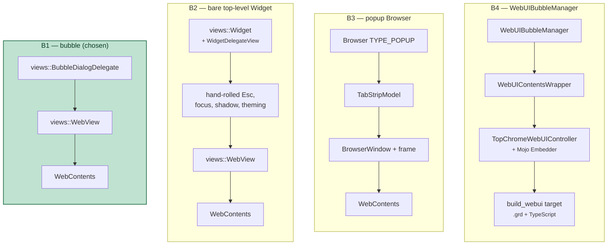
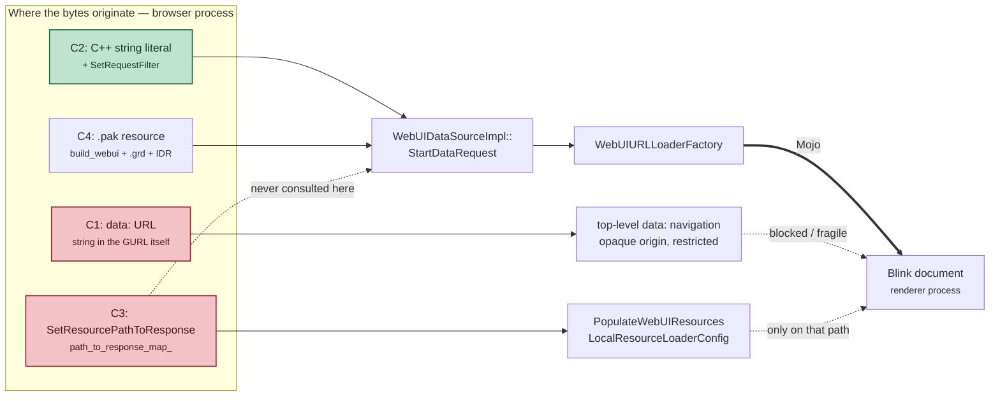

# A toolbar button that opens a floating HTML window

Design alternatives and the chosen implementation, written against this
checkout (`~/chromium-desk/src`) at `f6fd8f0cdc96a`, branch `floating-window`.

> **Source links.** Every path below links into
> [github.com/obeletski/chromium](https://github.com/obeletski/chromium) on the
> `floating-window` branch. Line anchors were checked against the tree these docs
> were written from; they will drift if the branch is rebased onto newer upstream.

## The requirement

1. An icon in the desktop (Linux) Chromium toolbar, sitting next to the profile
   / Incognito indicator and the extensions puzzle icon.
2. Clicking it opens a **floating, non-modal** window.
3. The window renders **HTML** — for now, the text *"I am the floating window"*.
4. Clicking the icon again, or pressing **Esc**, closes it.

Three decisions fall out of that, and they are independent: **where the button
comes from**, **what kind of widget the window is**, and **how the HTML gets to
the renderer**. Each is treated separately below.


---

## Part A — where the button comes from

### A1. A `ToolbarButton` added directly in `ToolbarView::Init()`

`ToolbarView` builds its children in a fixed order in
`chrome/browser/ui/views/toolbar/toolbar_view.cc:308`. Roughly:

```
back → forward → reload → home → split-tabs → location bar →
extensions container → toolbar divider → pinned actions → chrome labs →
battery saver → performance intervention → media → glic → avatar →
overflow → app menu
```

Adding a `raw_ptr<...> foo_` member and one `AddChildView()` call at the right
index puts the icon exactly where you want it, permanently.

* **For:** ~15 lines in `ToolbarView`. Placement is deterministic and is
  precisely "between extensions and the profile icon". No prefs, no action
  framework, no model. This is what `BatterySaverButton` and
  `PerformanceInterventionButton` do today.
* **Against:** the button is not user-pinnable or re-orderable, does not appear
  in the "Customize toolbar" surface, and does not participate in
  `ToolbarController` overflow. Adding an always-visible child also perturbs
  tests that assert on toolbar child counts or layout.

### A2. An `actions::ActionItem` hosted by `PinnedToolbarActionsContainer`

The modern route. You declare an `ActionId` (`chrome/browser/ui/actions/`),
register an `ActionItem` with an icon, text and an invoke callback, and pin it
by default through `PinnedToolbarActionsModel`. `PinnedToolbarActionsContainer`
([`toolbar_view.cc:500`](https://github.com/obeletski/chromium/blob/floating-window/chrome/browser/ui/views/toolbar/toolbar_view.cc#L500)) then materialises a `PinnedActionToolbarButton` for it.
This is how the side panel entries and `kActionShowAiOverlayDialog` work.

* **For:** the idiomatic 2025/2026 pattern. Free context menu, pinning,
  overflow, `ActionItem`-driven enabled/visible state, and it lands in the
  container that already sits next to extensions and the avatar.
* **Against:** substantially more machinery — a new `ActionId` enum entry, an
  `ActionItem` registration in `BrowserActions`, a pinned-by-default migration,
  and a `PinnedToolbarActionsModel` pref. And the *position* becomes the user's,
  not ours: it lands wherever the pinned container puts it, which is adjacent to
  but not exactly "next to the profile icon".

### A3. An extension with a browser action

Zero Chromium changes; a `chrome.action` + `chrome.windows.create` extension
gets an icon in the puzzle-menu area.

* **For:** no build at all.
* **Against:** it is not *in* the browser. It is behind the puzzle icon unless
  pinned, the window is a real browser popup with a frame and an omnibox chip,
  and none of it is C++. Rejected — it does not answer the request.

### A4. `WebUIToolbarWebView`

This checkout is mid-migration to a WebUI toolbar
(`features::IsWebUIToolbarFullyEnabled()`, `webui_toolbar_web_view.h`). A button
could be added on that side in TypeScript instead.

* **For:** where the toolbar is heading.
* **Against:** the WebUI toolbar is behind flags that are off here, so the
  button would be invisible in a default build. It also duplicates work: the
  Views path still has to exist. Rejected for now.

---

## Part B — what kind of widget the window is

The four serious candidates differ in how much of the stack they drag in. Each
column is one option; the boxes are what you end up owning.



B1 wins not because it is the most capable but because a bubble **already is**
an independent top-level widget with a shadow and a themed frame. B2 reaches the
same place by re-implementing what B1 inherits; B3 and B4 add whole subsystems.


### B1. `views::BubbleDialogDelegateView` anchored to the button

A bubble is already a separate, non-modal, top-level `views::Widget` with a
shadow and a rounded frame — "floating" in every sense that matters — that
happens to position itself relative to an anchor view.

* **For:** Esc-to-close comes for free (`DialogClientView` registers the
  `VKEY_ESCAPE` accelerator at [`ui/views/window/dialog_client_view.cc:114`](https://github.com/obeletski/chromium/blob/floating-window/ui/views/window/dialog_client_view.cc#L114)).
  `set_close_on_deactivate(false)` makes it persist while you use the browser,
  which is what "floating window" implies. `autosize` sizes it to its contents.
  It follows the browser window when that moves.
* **Against:** the user cannot drag it away from the anchor, and it has no
  title bar. It is a bubble that behaves like a window rather than a window.

### B2. A standalone top-level `views::Widget`

`views::Widget::InitParams(TYPE_WINDOW)` with a `WidgetDelegateView`, parented
to the browser's native view but with its own frame.

* **For:** a real, draggable, independently positioned window with a title bar.
  Closest to a literal reading of "floating window".
* **Against:** you hand-roll everything a bubble gives you — Esc handling,
  focus, shadow, theming, close-on-parent-destroyed, and correct behaviour when
  the browser window is minimised or moved between displays. Noticeably more
  code for a demo surface, and easy to get subtly wrong on Wayland/X11.

### B3. A `Browser` popup window (`Browser::TYPE_POPUP`)

`Browser::Create()` with a popup type and a tab navigated to the page.

* **For:** trivially "a window"; gets the full browser stack.
* **Against:** enormously heavier than needed — a whole `Browser`, tab strip
  model, session entry and window controller for one line of text. It also
  shows browser chrome, and Esc does nothing useful in it.

### B4. `WebUIBubbleManager` + `TopChromeWebUIController`

The Tab Search / Read Later machinery
(`chrome/browser/ui/views/bubble/webui_bubble_manager.h`).

* **For:** contents pre-warming, caching across shows, and the standard
  reopen-suppression helper.
* **Against:** it requires a `MojoBubbleWebUIController` with a Mojo
  `Embedder` interface, a `WebUIContentsWrapper`, and a real WebUI bundle with
  a TypeScript build target and a `.grd`. That is a lot of infrastructure whose
  entire benefit is latency on a page that says one sentence.

### B5. A `SidePanel` entry

Rejected outright: docked, not floating.

---

## Part C — how the HTML reaches the renderer

All four options end with bytes arriving in the renderer over the same Mojo
`URLLoader`. They differ in where those bytes come *from*, and how much build
machinery stands between the source text and the response.



The dashed edges are the trap: `StartDataRequest()` — the function that actually
answers a `chrome://` request — checks the request filter first and the resource
ID second, and **never reads** the map that `SetResourcePathToResponse()` fills.


### C1. A `data:` URL in a bare `views::WebView`

`web_view->LoadInitialURL(GURL("data:text/html,..."))`.

* **For:** no WebUI registration whatsoever.
* **Against:** top-level `data:` navigations are restricted, the resulting
  document is an opaque origin, and it is exactly the pattern the navigation
  code has been narrowing for years (`navigation_request.cc` special-cases
  `url::kDataScheme` in eight places). Fragile foundation.

### C2. A `chrome://` WebUI whose response comes from an inline string

Register a `content::DefaultWebUIConfig<T>` + `content::WebUIController`; in the
controller call `content::WebUIDataSource::CreateAndAdd()` and
`SetRequestFilter()`, returning the HTML from a `base::RefCountedString`.

* **For:** a real, correctly-originated WebUI page with a proper CSP, and
  **no `.grd` entry, no resource ID, no TypeScript target, no Mojo**. The whole
  page is one C++ string literal. [`chrome/browser/ui/webui/internals/internals_ui.cc:58`](https://github.com/obeletski/chromium/blob/floating-window/chrome/browser/ui/webui/internals/internals_ui.cc#L58)
  does exactly this.
* **Against:** still needs a host constant and one line in
  [`chrome_web_ui_configs.cc`](https://github.com/obeletski/chromium/blob/floating-window/chrome/browser/ui/webui/chrome_web_ui_configs.cc).

### C3. `SetResourcePathToResponse()`

Looks like a shorter C2 — and it is used that way in content browsertests
([`content/browser/webui/initial_webui_browsertest.cc:144`](https://github.com/obeletski/chromium/blob/floating-window/content/browser/webui/initial_webui_browsertest.cc#L144)). But it only
populates `path_to_response_map_`, which is consumed by
`PopulateWebUIResources()` for the `LocalResourceLoaderConfig` path;
`WebUIDataSourceImpl::StartDataRequest()` never consults it. Correctness would
depend on which loading path is active. Rejected as too subtle.

### C4. A conventional WebUI bundle (`.grd` + `.ts` + `build_webui()`)

The full production shape.

* **For:** what a real feature would do.
* **Against:** a `BUILD.gn` `build_webui()` target, a grd, a resources map and a
  TS file for one `<p>`. Disproportionate.

---

## Chosen implementation: A1 + B1 + C2

**A1** because the request was specific about *where* the icon goes, and A1 is
the only option that puts it there deterministically. **B1** because a bubble
with `close_on_deactivate(false)` already is a floating non-modal widget, and it
gives Esc-to-close for free — the alternative is re-implementing widget
plumbing to end up in the same place. **C2** because it is the only HTML path
that is both architecturally honest and small enough to be proportionate.

### Files

| File | Role |
|---|---|
| [`chrome/common/webui_url_constants.h`](https://github.com/obeletski/chromium/blob/floating-window/chrome/common/webui_url_constants.h) | `kChromeUIFloatingWindowHost` / `…URL` |
| `chrome/browser/ui/webui/floating_window/`<br/>[`floating_window_ui.h`](https://github.com/obeletski/chromium/blob/floating-window/chrome/browser/ui/webui/floating_window/floating_window_ui.h) · [`.cc`](https://github.com/obeletski/chromium/blob/floating-window/chrome/browser/ui/webui/floating_window/floating_window_ui.cc) | `FloatingWindowUIConfig`, `FloatingWindowUI`; serves the HTML from a string |
| `chrome/browser/ui/webui/floating_window/BUILD.gn` | its `source_set` |
| [`chrome/browser/ui/webui/chrome_web_ui_configs.cc`](https://github.com/obeletski/chromium/blob/floating-window/chrome/browser/ui/webui/chrome_web_ui_configs.cc) | registers the config |
| `chrome/browser/ui/views/floating_window/`<br/>[`floating_window_bubble.h`](https://github.com/obeletski/chromium/blob/floating-window/chrome/browser/ui/views/floating_window/floating_window_bubble.h) · [`.cc`](https://github.com/obeletski/chromium/blob/floating-window/chrome/browser/ui/views/floating_window/floating_window_bubble.cc) | `floating_window::CreateAndShow()`; the bubble hosting a `views::WebView` |
| `chrome/browser/ui/views/floating_window/BUILD.gn` | its `source_set` |
| `chrome/browser/ui/views/toolbar/`<br/>[`floating_window_toolbar_button.h`](https://github.com/obeletski/chromium/blob/floating-window/chrome/browser/ui/views/toolbar/floating_window_toolbar_button.h) · [`.cc`](https://github.com/obeletski/chromium/blob/floating-window/chrome/browser/ui/views/toolbar/floating_window_toolbar_button.cc) | the `ToolbarButton`, owns the bubble widget, toggles it |
| `chrome/browser/ui/views/toolbar/`<br/>[`toolbar_view.h`](https://github.com/obeletski/chromium/blob/floating-window/chrome/browser/ui/views/toolbar/toolbar_view.h) · [`.cc`](https://github.com/obeletski/chromium/blob/floating-window/chrome/browser/ui/views/toolbar/toolbar_view.cc) | creates the button before `avatar_` |
| `chrome/browser/ui/`<br/>[`ui_features.h`](https://github.com/obeletski/chromium/blob/floating-window/chrome/browser/ui/ui_features.h) · [`.cc`](https://github.com/obeletski/chromium/blob/floating-window/chrome/browser/ui/ui_features.cc) | `kFloatingWindowToolbarButton` kill switch |

### The two mechanisms worth calling out

**Esc.** `views::WebView` swallows accelerators by default so that pages can use
Esc; a UI-hosting WebView must opt out with `set_allow_accelerators(true)`
([`ui/views/controls/webview/webview.h:209`](https://github.com/obeletski/chromium/blob/floating-window/ui/views/controls/webview/webview.h#L209)). With that set, Esc reaches the
bubble's `FocusManager`, hits the `DialogClientView` accelerator, and closes the
widget.

**Subclassing.** `views::BubbleDialogDelegateView` cannot be subclassed by new
code: its constructors are private behind a `friend` allowlist
([`bubble_dialog_delegate_view.h:890`](https://github.com/obeletski/chromium/blob/floating-window/ui/views/bubble/bubble_dialog_delegate_view.h#L890)). New bubbles instead construct a
`views::BubbleDialogDelegate` and hand it a contents view via
`SetContentsView()`, which is what [`ai_overlay_toolbar_button.cc`](https://github.com/obeletski/chromium/blob/floating-window/chrome/browser/ui/views/toolbar/ai_overlay_toolbar_button.cc) does. Here the
contents view is the `views::WebView` itself.

**Toggle-on-second-click.** Bubbles normally close on deactivation, which fires
*before* the button's click handler — so a naive toggle closes and immediately
reopens. Setting `close_on_deactivate(false)` removes the race entirely: the
widget is still open when the handler runs, so the handler simply closes it.
This is also what makes the surface behave like a window rather than a menu.

### What was deliberately left out

* No localized strings. The tooltip and accessible name are hardcoded
  `u"..."` literals with a TODO, following the precedent in
  [`ai_overlay_toolbar_button.cc`](https://github.com/obeletski/chromium/blob/floating-window/chrome/browser/ui/views/toolbar/ai_overlay_toolbar_button.cc). Adding `IDS_` messages to
  `generated_resources.grd` requires translation screenshots that presubmit
  enforces, which is not proportionate to a demo surface.
* No new vector icon. It reuses `kNewWindowIcon` from
  `chrome/app/vector_icons/`.
* Android is untouched: the whole `chrome/browser/ui/views/toolbar` target is
  `assert(is_win || is_mac || is_linux || is_chromeos)`.
