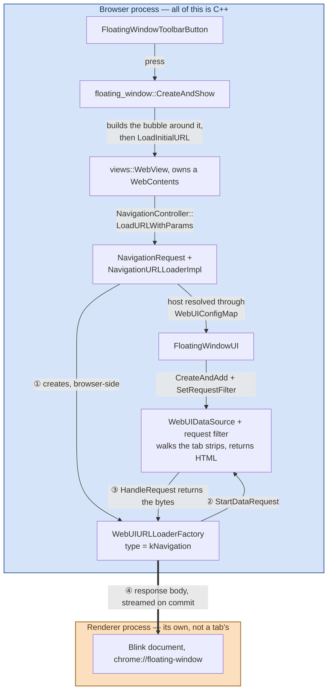
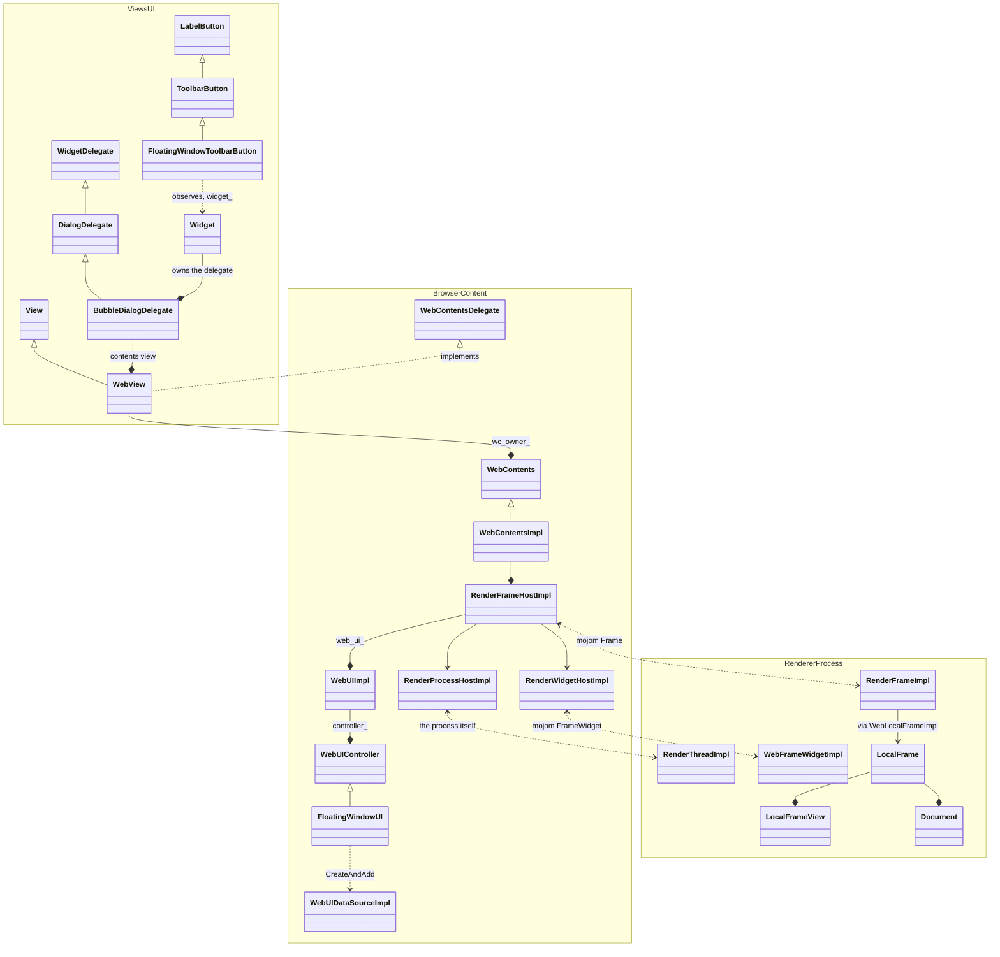
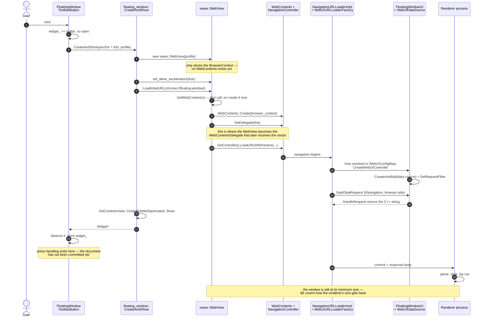
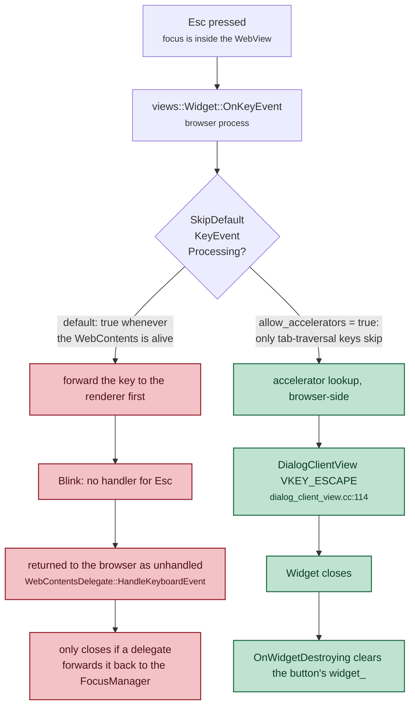
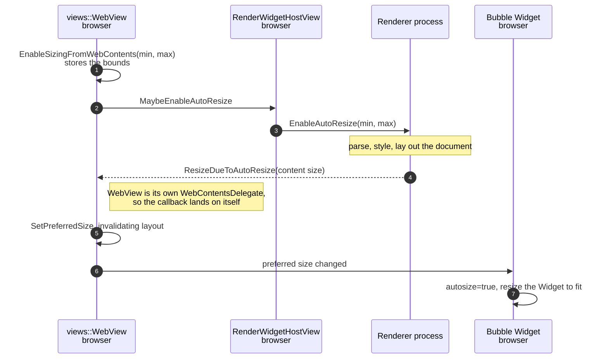
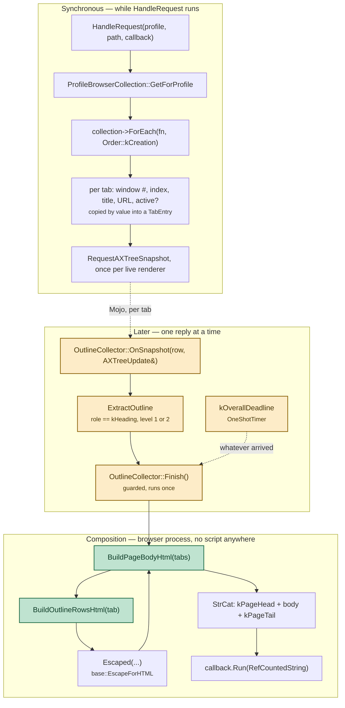
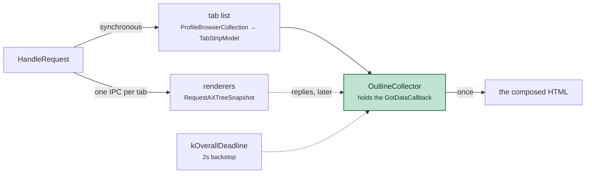

# `chrome://floating-window`: an end-to-end walkthrough

How the toolbar button and its floating window actually work, file by file.
Written against branch `floating-window` (based on `f6fd8f0cdc96a`) in
`~/chromium-desk/src`. The alternatives that were weighed and rejected are in
[`floating-window-alternatives.md`](floating-window-alternatives.md); this
document only covers what was built.

> **See also.** The page lists each tab's `h1`/`h2` outline, which is the one
> part of the feature that reaches into other processes and the reason the
> response is produced asynchronously. That mechanism has its own walkthrough,
> diagram-heavy, in
> [`floating-window-page-outlines.md`](floating-window-page-outlines.md).

> **Source links.** Every path below links into
> [github.com/obeletski/chromium](https://github.com/obeletski/chromium) on the
> `floating-window` branch. Line anchors were checked against the tree these docs
> were written from; they will drift if the branch is rebased onto newer upstream.


---

## 1. What it does

A button in the desktop toolbar, between the extensions area and the profile /
Incognito indicator. Pressing it opens a floating, non-modal surface listing
**every open tab in the current profile**, grouped by browser window, as a
table of index / title / URL — and under each tab, that page's **outline: its
level 1 and level 2 headings**, indented by level. Pressing the button again,
or pressing **Esc**, closes it. The surface stays up while you keep using the
browser.

The table is a *snapshot*, taken while the page is being served. It does not
follow tab changes while the window is open — but the bubble builds a fresh
`WebContents` on every press (§4), so closing and reopening always re-reads the
tab strips. §7 covers why it was built that way and what a live version would
cost.

The two halves of that table come from very different places, and this is the
single most important thing to hold on to. The **tab list** is browser-process
state, read synchronously in a few microseconds. The **outlines** are DOM
content, one renderer process per tab, fetched over IPC and arriving one reply
at a time. Adding the outlines is what turned this page from a synchronous
response into an asynchronous one (§7).

Behind a `base::Feature` kill switch, `features::kFloatingWindowToolbarButton`,
enabled by default.

---

## 2. The pieces

| File | Job |
|---|---|
| [`chrome/common/webui_url_constants.h`](https://github.com/obeletski/chromium/blob/floating-window/chrome/common/webui_url_constants.h) | `kChromeUIFloatingWindowHost` = `"floating-window"`, and the `chrome://floating-window/` URL |
| `chrome/browser/ui/webui/floating_window/`<br/>[`floating_window_ui.h`](https://github.com/obeletski/chromium/blob/floating-window/chrome/browser/ui/webui/floating_window/floating_window_ui.h) · [`.cc`](https://github.com/obeletski/chromium/blob/floating-window/chrome/browser/ui/webui/floating_window/floating_window_ui.cc) | `FloatingWindowUIConfig` (registry entry) and `FloatingWindowUI` (serves the HTML) |
| [`chrome/browser/ui/webui/chrome_web_ui_configs.cc`](https://github.com/obeletski/chromium/blob/floating-window/chrome/browser/ui/webui/chrome_web_ui_configs.cc) | registers the config at startup |
| `chrome/browser/ui/views/floating_window/`<br/>[`floating_window_bubble.h`](https://github.com/obeletski/chromium/blob/floating-window/chrome/browser/ui/views/floating_window/floating_window_bubble.h) · [`.cc`](https://github.com/obeletski/chromium/blob/floating-window/chrome/browser/ui/views/floating_window/floating_window_bubble.cc) | `floating_window::CreateAndShow()` — builds the bubble around a `views::WebView` |
| `chrome/browser/ui/views/toolbar/`<br/>[`floating_window_toolbar_button.h`](https://github.com/obeletski/chromium/blob/floating-window/chrome/browser/ui/views/toolbar/floating_window_toolbar_button.h) · [`.cc`](https://github.com/obeletski/chromium/blob/floating-window/chrome/browser/ui/views/toolbar/floating_window_toolbar_button.cc) | the `ToolbarButton`; owns the toggle state |
| `chrome/browser/ui/views/toolbar/`<br/>[`toolbar_view.h`](https://github.com/obeletski/chromium/blob/floating-window/chrome/browser/ui/views/toolbar/toolbar_view.h) · [`.cc`](https://github.com/obeletski/chromium/blob/floating-window/chrome/browser/ui/views/toolbar/toolbar_view.cc) | creates the button at the right position |
| `chrome/browser/ui/`<br/>[`ui_features.h`](https://github.com/obeletski/chromium/blob/floating-window/chrome/browser/ui/ui_features.h) · [`.cc`](https://github.com/obeletski/chromium/blob/floating-window/chrome/browser/ui/ui_features.cc) | the feature flag |
| [`ui/enums.xml`](https://github.com/obeletski/chromium/blob/floating-window/tools/metrics/histograms/metadata/ui/enums.xml) · [`page/histograms.xml`](https://github.com/obeletski/chromium/blob/floating-window/tools/metrics/histograms/metadata/page/histograms.xml) | required metrics registration for a new WebUI host (§7) |

Three layers, and the interesting thing is how little glue they need.

The single most useful thing to hold in your head: **everything here lives in
the browser process except the rendered document.** The HTML is assembled as a
`std::string` in the browser — the chrome around the table is a compiled-in
string literal, the rows are built by walking the profile's tab strips at the
moment of the request — and it only becomes a document after crossing into a
renderer as bytes over a Mojo `URLLoader`.

That is also why the tab data needs no IPC of its own. `TabStripModel` is
browser-process state, and so is the code that renders it; the process boundary
is crossed exactly once, by the finished HTML.



**The renderer never asks for anything.** Steps ① ② ③ all happen inside the
browser: a `chrome://` navigation is fetched by `NavigationURLLoaderImpl`, which
builds a `WebUIURLLoaderFactory` of type `kNavigation` and runs it with
`kBrowserProcessId` ([`navigation_url_loader_impl.cc:712`](https://github.com/obeletski/chromium/blob/floating-window/content/browser/loader/navigation_url_loader_impl.cc#L712)).
Only step ④ crosses the process boundary, and it goes browser → renderer: the
finished document is streamed in as the navigation's response body.

There is a second, renderer-driven path — `CreateWebUIURLLoaderFactory` is also
called from `RenderFrameHostImpl` with type `kDocumentSubResource` — but it is
for subresources a page asks for after it loads. This page has none: no script,
no external stylesheet, no images.

---

### The classes, and their renderer-side counterparts

The map above is the flow; this is the type structure behind it. Solid arrows
are ownership, hollow triangles inheritance, dotted lines the Mojo pairs that
straddle the process boundary.



Three things this makes visible that prose keeps burying.

**`views::WebView` wears two hats.** It is a `View` so it can sit in the bubble,
and it implements `content::WebContentsDelegate` so the `WebContents` it owns
can call back into it. That is the whole reason `ResizeDueToAutoResize` lands on
the WebView in §6 — the WebView made itself the delegate in `SetDelegate(this)`.

**The `WebUIController` hangs off the frame, not the tab.** `FloatingWindowUI`
is owned by `WebUIImpl`, which is owned by `RenderFrameHostImpl` — so it is
per-frame and per-navigation, not a long-lived per-profile object. A
cross-document navigation destroys and rebuilds it.

**Nothing in this feature has a renderer-side counterpart.** The dotted pairs
are all generic content/ plumbing that any page gets. The three classes written
for this feature — the button, the bubble helper, `FloatingWindowUI` — are
browser-only. On the other side of the boundary there is just a `Document` with
one `<p>` in it.

## 3. The button, and why it lands where it does

`ToolbarView::Init()` ([`toolbar_view.cc:309`](https://github.com/obeletski/chromium/blob/floating-window/chrome/browser/ui/views/toolbar/toolbar_view.cc#L309)) builds the toolbar's children in a
fixed sequence, and the layout manager lays them out **in child order**. So
position is decided by nothing more than where `AddChildView()` is called:

```
… extensions container → toolbar divider → pinned actions → chrome labs →
battery saver → performance intervention → media → glic →
  ★ FloatingWindowToolbarButton ★
→ avatar → overflow → app menu
```

Inserting immediately before `avatar_` is what puts the icon between the
extensions area and the profile chip.

`FloatingWindowToolbarButton` derives from `ToolbarButton` rather than
`views::Button`; that is what supplies the ink drop, hover highlight,
toolbar-sized icon and insets, and the standard focus ring.

The icon is `kNewWindowIcon`, a **vector** icon compiled from a `.icon` file
under `chrome/app/vector_icons/` into a generated header. Vector icons
re-rasterize at any scale factor and are recolored from the theme, which is why
`SetVectorIcon()` is preferred over setting an image directly — the button then
tracks theme and touch-mode changes on its own.

---

## 4. The toggle, and the race that shapes it

The press handler is three lines:

```cpp
void FloatingWindowToolbarButton::OnPressed() {
  if (widget_) {
    CloseWindow();
    return;
  }
  widget_ = floating_window::CreateAndShow(this, browser_->GetProfile());
  widget_observation_.Observe(widget_.get());
}
```

**It is only this simple because the bubble sets
`set_close_on_deactivate(false)`.** With the default setting, the sequence on a
second press is:

1. mouse press goes to the browser window;
2. the bubble widget **deactivates** and closes itself;
3. *then* the button's `OnPressed()` runs, sees `widget_ == nullptr`, and opens
   a new one.

The surface would appear never to close from its own button. Chromium has a
helper for exactly this — `WebUIBubbleReopenSuppressor` in
`chrome/browser/ui/views/bubble/` — which times the close and suppresses the
reopen. Turning deactivation-closing off removes the race at the source instead,
and independently gives the "floating window, not a menu" behaviour that was
asked for.

### What one press actually does

Two things are easy to get wrong here. **`LoadInitialURL` is called by
`CreateAndShow`, not by the WebView on itself** — the WebView is a passive host.
And **constructing `views::WebView(profile)` does not create a `WebContents`**;
it only records the `BrowserContext`. The `WebContents` is created lazily, on
the first `GetWebContents()` call, which `LoadInitialURL` triggers
([`webview.cc:106`](https://github.com/obeletski/chromium/blob/floating-window/ui/views/controls/webview/webview.cc#L106)).
That same call is where `SetDelegate(this)` runs, which is what later lets the
renderer's resize reach the WebView at all (§6).

Ordering matters too: the widget is shown *before* the document is committed.
The bubble appears at its minimum size and grows once the renderer reports back.
Nothing waits on the renderer.



### Why the button observes the widget

The bubble can also close *itself* (Esc). If `widget_` were only cleared by
`CloseWindow()`, the next press would call `Close()` on a destroyed `Widget`.
`views::WidgetObserver::OnWidgetDestroying()` clears the pointer for closes we
did not initiate. `base::ScopedObservation` handles the reverse hazard — the
button being destroyed while still observing.

### Why `CloseWindow()` clears before closing

```cpp
views::Widget* const widget = widget_;
widget_observation_.Reset();
widget_ = nullptr;
widget->Close();
```

`Widget::Close()` is **asynchronous** — it posts the destruction rather than
doing it inline, so `OnWidgetDestroying()` arrives later. Clearing first means
the button reports "not showing" immediately, so a press landing in that gap
opens a fresh window rather than being swallowed by a stale non-null pointer.
`Widget::CloseNow()` would close the gap by destroying synchronously, but it is
discouraged: it can tear the widget down underneath code still on the stack.

---

## 5. The bubble

`floating_window::CreateAndShow()` is a free function, not a class. Nothing
needs subclassing: `views::BubbleDialogDelegate` is configured entirely through
setters, and the contents arrive via `SetContentsView()`.

> A bubble already *is* an independent top-level `views::Widget` with a shadow
> and a themed frame. "Bubble" only adds that it positions itself relative to an
> anchor view and closes when the anchor goes away. That is why this is a bubble
> rather than a hand-built widget: the alternative is re-implementing Esc, focus,
> theming and teardown to arrive at the same place.

Note the *View* flavour, `views::BubbleDialogDelegateView`, cannot be subclassed
by new code — its constructors are private behind a `friend` allowlist
([`ui/views/bubble/bubble_dialog_delegate_view.h:968`](https://github.com/obeletski/chromium/blob/floating-window/ui/views/bubble/bubble_dialog_delegate_view.h#L968)). New bubbles use the
delegate + `SetContentsView()` shape, as [`ai_overlay_toolbar_button.cc`](https://github.com/obeletski/chromium/blob/floating-window/chrome/browser/ui/views/toolbar/ai_overlay_toolbar_button.cc) does.

Construction, in order:

```cpp
views::BubbleDialogDelegate(anchor_view,
                            views::BubbleBorder::TOP_RIGHT,   // hangs below, right-aligned
                            views::BubbleBorder::DIALOG_SHADOW,
                            /*autosize=*/true);               // see §6
```

`TOP_RIGHT` matters for a button near the right edge: a left-aligned bubble
would run off-screen.

Then three things are switched off, because a `BubbleDialogDelegate` is a
`DialogDelegate` and would otherwise grow dialog furniture: `SetButtons(kNone)`,
`SetShowCloseButton(false)`, `SetShowTitle(false)`. `SetAccessibleTitle()` is
still needed — without it the accessibility tree exposes an unnamed dialog.
`set_margins(gfx::Insets())` lets the WebView fill the bubble edge to edge,
since the page supplies its own padding.

### Esc is inherited, not implemented

There is no key handler anywhere in this feature. One line does it:

```cpp
web_view->set_allow_accelerators(true);
```

By default `WebView::SkipDefaultKeyEventProcessing()` returns true whenever the
`WebContents` is alive, which tells `FocusManager` **not** to treat key events as
accelerators — the page gets first refusal. That is right for real web content,
which may bind Esc itself.

For a WebView hosting browser UI it is backwards. `set_allow_accelerators(true)`
flips the check so only tab-traversal keys are skipped
([`ui/views/controls/webview/webview.cc:336`](https://github.com/obeletski/chromium/blob/floating-window/ui/views/controls/webview/webview.cc#L336)). Esc then reaches the
`FocusManager`, matches the `VKEY_ESCAPE` accelerator that `DialogClientView`
registers ([`ui/views/window/dialog_client_view.cc:114`](https://github.com/obeletski/chromium/blob/floating-window/ui/views/window/dialog_client_view.cc#L114)), and the widget closes —
which fires `OnWidgetDestroying()` on the button, clearing its pointer.

The flag decides *which process* handles the key. With it set, Esc never leaves
the browser:



The red path is not merely slower — nothing in this feature implements the
`HandleKeyboardEvent` hand-back, so on that path Esc would simply do nothing.

### Ownership

`CreateBubbleDeprecated(..., NATIVE_WIDGET_OWNS_WIDGET)` — the platform widget
owns the `views::Widget`, which owns the delegate, which owns the contents. The
caller holds a raw pointer purely as a "does it exist" flag.

The `Deprecated` suffix refers to the **ownership mode**, not the call. The
preferred `CreateBubble()` overload returns `std::unique_ptr<Widget>` under
`CLIENT_OWNS_WIDGET`, which would make the toolbar button responsible for the
widget's lifetime and for calling `MakeCloseSynchronous()`. Widget-owned is the
simpler contract for a surface that can close itself.

---

## 6. How the window gets its size

The bubble is created before the page has rendered, so its size cannot be known
up front. The chain that resolves it:



Two consequences worth knowing:

- **`autosize=true` on the delegate is load-bearing.** Without it the widget
  would never pick up the new preferred size.
- **Calling `EnableSizingFromWebContents()` before the renderer exists is fine.**
  `WebView` re-applies the stored bounds from `SetUpNewMainFrame()` whenever a
  new main frame appears ([`webview.cc:784`](https://github.com/obeletski/chromium/blob/floating-window/ui/views/controls/webview/webview.cc#L784)).

The widget is shown immediately, at its minimum size, and grows when the
renderer reports back.

> **A trap this feature actually hit.** Auto-resize can only report the size
> the *content* wants. The tab table is `width: 100%` with
> `table-layout: fixed`, which is happy at any width — it has no intrinsic
> width at all — so the renderer reported the auto-resize **minimum**, and the
> bubble opened as a narrow column with every title and URL ellipsized down to
> a few characters. Nothing was wrong with the widget code; there was simply no
> number for it to grow to. The fix is in the page, not in the view: the `body`
> rule carries a `min-width` (660px, chosen to sit under the width in
> `kMaxSize` so the bubble is never clamped horizontally). `kMinSize` stays as
> a backstop for a future page that forgets to.
>
> The height end works the other way and needs no help. Once content exceeds
> `kMaxSize`, auto-resize stops reporting growth, which leaves the renderer a
> viewport smaller than its document — so the page scrolls inside a fixed-size
> window instead of growing without bound. With 24 tabs open the window caps at
> 560px tall and grows a scrollbar.

---

## 7. The WebUI

### Registration

Three steps, and only the last one is per-feature:

1. `FloatingWindowUIConfig` derives from `content::DefaultWebUIConfig<T>` and
   names the (scheme, host) pair. `DefaultWebUIConfig` supplies
   `CreateWebUIController()` for the common case — it just does
   `std::make_unique<T>(web_ui)`. Deriving from bare `WebUIConfig` is only
   needed when construction wants more than the `WebUI*`, or when the page must
   be conditionally disabled (`IsWebUIEnabled()`).
2. `RegisterChromeWebUIConfigs()` adds one instance to the global
   `WebUIConfigMap` at startup. Ours goes in the `!BUILDFLAG(IS_ANDROID)` half,
   matching the desktop-only `assert()` in the target's `BUILD.gn`.
3. Navigating to `chrome://floating-window` looks the host up in that map and
   builds a `FloatingWindowUI`.

`WEB_UI_CONTROLLER_TYPE_DECL/IMPL` declare a per-class type tag — literally the
address of a static `int` — so a `WebUIController*` can be safely downcast back.

### What changed from the static page

The first version of this feature served one fixed document — a `<p>` reading
*"I am the floating window"* — from a single `constexpr char[]`. Every request
produced identical bytes, so the response could be, and was, a `std::string`
copy of that literal.

Listing tabs breaks exactly one property of that design: **the body is no longer
the same on every request.** Everything else survives intact, which is why the
diff is smaller than it sounds.

| | Static page | Tab listing | + page outlines |
|---|---|---|---|
| Response bytes | one `constexpr char[]` | `kPageHead` + generated table + `kPageTail` | unchanged |
| Varies per request | no | yes — by profile, and by whatever the tab strips hold at that instant | also by what each tab's DOM contains |
| Varies per *profile* | no | yes — the `Profile*` is bound into the request filter | unchanged |
| Delivery mechanism | `SetRequestFilter()` | unchanged | unchanged |
| Registration (config, host constant, metrics) | | unchanged | unchanged |
| Script in the page | none | still none | **still none** |
| Subresources | none | still none | still none |
| Data source | — | browser process only | browser process **+ one IPC per tab** |
| Response produced | synchronously | synchronously | **asynchronously** |
| New GN deps | — | `//chrome/browser/ui/browser_window`, `//chrome/browser/ui/tabs:tab_strip`, `//url` | `//ui/accessibility:ax_base`, `//mojo/public/cpp/bindings` |

The third column is the outline step. Note what it does *not* change: still no
script, still no subresources, still the same request filter. The one property
it does change is the last-but-one row, and that one matters — see
[Going asynchronous](#going-asynchronous).

The mechanism did not have to change because `SetRequestFilter()` was always a
*computed* response — the static version simply computed a constant. That is
the part worth internalising: the escape hatch chosen to avoid `build_webui()`
overhead for a trivial page turned out to be the same hatch that makes a
dynamic page possible without any renderer-side code at all.

What did have to change:

- `HandleRequest()` gained a bound `Profile*` first parameter, because the tab
  data is per-profile and the filter callback otherwise has no handle on one.
- The single literal split into `kPageHead` / `kPageTail` so the generated
  markup can be spliced between them.
- The `<style>` block grew from four rules to a table stylesheet, and the page
  acquired a `min-width` — which, unexpectedly, is what actually sizes the
  window (§6).
- The target gained three GN deps and the file six includes.

### Serving the HTML

The usual shape for a WebUI page is a `build_webui()` GN target: HTML/TS/CSS on
disk, packed into a `.pak`, reached by resource ID via `AddResourcePath()`. That
target serves *fixed* bytes, which is the wrong shape for a document whose body
differs on every request — see [Why the table is rendered in
C++](#why-the-table-is-rendered-in-c-and-not-by-script).

`SetRequestFilter()` is the escape hatch — it lets a source compute a response
in C++. It takes **two** callbacks, a predicate and a producer
([`web_ui_data_source.h`](https://github.com/obeletski/chromium/blob/floating-window/content/public/browser/web_ui_data_source.h#L141)):

```cpp
typedef base::RepeatingCallback<bool(const std::string&)> ShouldHandleRequestCallback;
using  HandleRequestCallback =
    base::RepeatingCallback<void(const std::string&, GotDataCallback)>;
```

The split matters because the predicate is consulted for **every** request to
the host, and answering `false` falls through to the ordinary resource-ID path.
`WebUIDataSourceImpl::StartDataRequest()`
([`.cc`](https://github.com/obeletski/chromium/blob/floating-window/content/browser/webui/web_ui_data_source_impl.cc#L508)) shows
that the filter is checked *ahead* of the `AddResourcePath()` lookup, and
short-circuits it entirely:

```cpp
if (!should_handle_request_callback_.is_null() &&
    should_handle_request_callback_.Run(path)) {
  filter_callback_.Run(path, std::move(callback));
  return;                        // the resource-ID lookup never happens
}
```

That is what makes the filter the only one of the two paths able to produce a
*different* document per request — the requirement here, since the page lists
live tab state.

- `ShouldHandleRequest(path)` — returns `true` unconditionally here, so any path
  under the host serves the same document and a stray trailing segment does not
  produce a blank window.
- `HandleRequest(profile, path, callback)` — hands back
  `base::RefCountedString`. The response goes through a *callback* rather than a
  return value because sources are allowed to answer asynchronously, and since
  the outlines were added this one genuinely does: the tab list is read inline,
  but the callback is moved into an `OutlineCollector` and run later. See
  [Going asynchronous](#going-asynchronous).

Both are registered in one statement, and its shape repays a look:

```cpp
source->SetRequestFilter(
    base::BindRepeating(&ShouldHandleRequest),
    base::BindRepeating(&HandleRequest, base::Unretained(profile)));
```

- **`RepeatingCallback`, not `Once`.** The data source outlives any single
  navigation and answers every request to the host — reloads, a second window,
  `/anything`. Note the contrast with the `GotDataCallback` *inside* the second
  signature, which is a `OnceCallback`: one response per request. Two different
  lifetimes declared in one line.
- **The first bind is degenerate.** `base::BindRepeating(&ShouldHandleRequest)`
  binds no arguments at all; it exists only because the parameter is a
  `RepeatingCallback` and a bare function pointer does not implicitly convert.
  Nothing is kept alive, so there is no lifetime question.
- **The second bind is partial application, and it is load-bearing.**
  `HandleRequest` takes *three* parameters while `HandleRequestCallback` is
  declared with *two*. Binding `profile` as the **leading** argument consumes the
  first parameter, leaving `(const std::string&, GotDataCallback)` — exactly the
  required signature. This is how a free function is given context without a
  class or a global, and it is where profile scoping comes from: the profile the
  data source was registered for is baked into the callback, which is why an
  Incognito floating window cannot list regular-profile tabs.
- **`base::Unretained(profile)` is a claim, not a cast.** `base::Bind*` refuses
  to bind a bare raw pointer, so the lifetime decision has to be named. The proof
  here is structural: the data source is owned by the `URLDataManager` keyed on
  that same `BrowserContext`, so the source — and therefore the callback —
  cannot outlive the profile. The alternatives do not fit. `Profile` is not
  ref-counted, so `RetainedRef` is out; a `WeakPtr` would need a factory on
  `Profile` and would silently do nothing once null, which for a data source
  means a navigation that hangs rather than a visible failure.

### How the HTML is generated

Three concatenated pieces, in one `base::StrCat()` at the end of
`HandleRequest()`:

```cpp
base::StrCat({kPageHead, BuildPageBodyHtml(tabs_), kPageTail})
```

`kPageHead` runs from `<!doctype html>` through the whole `<style>` block and
the opening `<body>`; `kPageTail` is `</body></html>`. Neither is templated or
substituted into — the generated markup is spliced *between* them, never *into*
them. There is no template engine anywhere in this, and no string-replacement
pass: nothing scans the literals looking for placeholders.



Each composition function returns a `std::string` that its caller appends;
nothing is written through an output parameter or a stream.

**`base::StrCat()` and `base::StrAppend()`, not `operator+` or `<<`.** Both take
a `span<const std::string_view>` and size the result once before copying, so an
eight-fragment row costs one allocation rather than seven temporaries. It also
keeps the row template readable as a single braced list, which matters when the
literal fragments are HTML with escaped quotes in them. The idiom is worth
recognising: `StrCat` builds a new string, `StrAppend` appends into an existing
one, and both live in `base/strings/strcat.h`.

**Numbers and plurals are inline ternaries.** `base::NumberToString()` for the
counts, and `count == 1 ? " tab" : " tabs"` for agreement. Real production code
would reach for `l10n_util::GetPluralStringFUTF16()` and an `IDS_` message,
because plural rules are not two-branch in most languages — this checkout
deliberately skips `IDS_` strings (see the repo `CLAUDE.md`), so the English
form is hardcoded with the same TODO the rest of the feature carries.

**Escaping happens at the leaves, once.** Two overloads of a local `Escaped()`
wrap `base::EscapeForHTML()` — one taking `std::u16string_view` (titles, via
`base::UTF16ToUTF8`) and one taking `std::string_view` (URL specs). The row
builder calls it on every interpolated value, including inside the `title=`
attribute. Nothing else in the file touches untrusted text, so there is no path
that skips it.

### Going asynchronous

The tab list is browser-process state. The outlines are not: `h1` and `h2`
elements live in each tab's DOM, in a different process, and the browser has no
copy. Something has to ask, and the answer arrives later.

`SetRequestFilter()` already permits that. Its response is handed back through a
`GotDataCallback` precisely because "a data source is allowed to answer
asynchronously (reading from disk, waiting on a service)" — the static page and
the tab table both simply ran it inline. Now it is moved into an
`OutlineCollector` and run once the replies settle. **No placeholder document,
no second navigation, and still no script in the page.**



Four things carry the design, and they are covered in depth — with the full
sequence diagram, the collector's state machine, the ownership graph and the
failure-mode table — in
[`floating-window-page-outlines.md`](floating-window-page-outlines.md):

- **a "still issuing" sentinel** on the pending count, so a snapshot that
  completes inline cannot publish a page built from half the tabs;
- **a deadline**, because `mojo::WrapCallbackWithDefaultInvokeIfNotRun` fires on
  callback *destruction* and so does not cover a renderer that is alive and
  simply never answers — the case that would otherwise leave the window blank
  forever;
- **`Finish()` guarded to run exactly once**, since it is reachable from both
  the last reply and the timer, and `GotDataCallback` is a `OnceCallback`;
- **ref-counting**, because the reply callbacks and the collector's own timer
  are independent owners; and `TabEntry` holding titles and URLs *by value*, so
  a tab closed mid-gather cannot dangle.

### Reading headings out of an accessibility tree

The outline comes from `WebContents::RequestAXTreeSnapshot()`, not from running
script in the page. An `AXTreeUpdate` is a **flat `std::vector<AXNodeData>`**,
serialized in document order, so reading it straight through yields headings in
the order they appear — no recursion needed.

Three traps, each of which costs a debugging cycle if you meet it the hard way,
and all three are worked through in the outlines document:

1. **Heading level is only serialized under `kExtendedProperties`.** Without
   that AX mode flag you still get heading nodes — they just all report level 0,
   so an h1/h2 filter silently drops every one.
2. **"Level 1 and 2" is not `querySelectorAll("h1, h2")`.** `aria-level` wins
   when present, so a `<div role="heading" aria-level="2">` counts and an
   `<h1 aria-level="4">` does not.
3. **An accessible name is not `textContent`.** It is computed, so it carries
   source-line whitespace and omits `<script>` content.

#### The markup it emits

Abridged from a real run — long `file://` URLs cut, `title=` attributes elided
where they repeat the cell text:

```html
<h1>Open tabs <span class="count">5 tabs in 2 windows</span></h1>
<table><thead><tr><th class="idx">#</th><th>Title</th><th>URL</th></tr></thead>
<tbody><tr><th scope="colgroup" colspan="3">Window 1 · 3 tabs</th></tr>
<tr class="tab" aria-current="true"><td class="idx">1</td><td>Quarterly report — draft</td><td class="url">file:///…/a.html</td></tr>
<tr class="hd lvl1"><td class="idx"></td><td colspan="2">Quarterly Report</td></tr>
<tr class="hd lvl2"><td class="idx"></td><td colspan="2">Revenue</td></tr>
<tr class="hd lvl2"><td class="idx"></td><td colspan="2">Costs &amp; risks</td></tr>
<tr class="hd lvl1"><td class="idx"></td><td colspan="2">Appendix</td></tr>
<tr class="tab"><td class="idx">2</td><td>Aria levels</td><td class="url">file:///…/c.html</td></tr>
<tr class="hd lvl1"><td class="idx"></td><td colspan="2">ARIA level 1</td></tr>
<tr class="hd lvl2"><td class="idx"></td><td colspan="2">ARIA level 2</td></tr>
</tbody>
<tbody><tr><th scope="colgroup" colspan="3">Window 2 · 1 tab</th></tr>
<tr class="tab" aria-current="true"><td class="idx">1</td><td>No headings here</td><td class="url">file:///…/d.html</td></tr>
<tr class="hd note"><td class="idx"></td><td colspan="2">no level 1 or 2 headings</td></tr>
</tbody>
</table>
```

(`title=` attributes carrying the untruncated text are elided above; every
title, URL and heading cell has one.)

Four structural choices are doing work there.

- **One `<tbody>` per browser window.** A `<tbody>` is the standard way to group
  rows in a table that has more than one logical section, and it lets the group
  header be a real `<th scope="colgroup">` rather than a styled `<td>`. Screen
  readers announce the grouping; the alternative (a separate `<table>` per
  window) would let the columns drift out of alignment between windows.
- **Outline entries are rows of the same table**, spanning the title and URL
  columns, rather than a nested `<ul>` inside the title cell. A nested list
  would have to opt out of the `nowrap` / ellipsis rules the cells rely on, and
  it would break the alignment of the index column. Indent comes from the
  `lvl1` / `lvl2` class, so the level is in the markup rather than baked into
  whitespace.
- **`aria-current="true"` marks the active tab**, and the CSS hangs *both* the
  bold weight and the `▸` marker off that same attribute selector
  (`tr[aria-current="true"]`). There is deliberately no parallel `class="active"`
  — one source of truth means the visual state and the accessible state cannot
  disagree.
- **Per-window indices restart at 1**, because they are tab-strip positions, not
  a global ordinal. The header row carries the window's own tab count so the
  numbering reads unambiguously.

The `note` rows distinguish two states that would otherwise look identical:
*"no level 1 or 2 headings"* means the snapshot came back and the page has
none; *"outline unavailable"* means it never came back — a discarded tab, a
dead renderer, or the deadline. Collapsing them into one message would hide
the difference between "this page has no structure" and "we could not read
it".

#### The stylesheet the markup relies on

The generated markup is deliberately plain — no inline `style=` attributes, no
wrapper `<div>`s. Everything visual is four rules in `kPageHead`, and three of
them are load-bearing rather than decorative:

| Rule | Why it exists |
|---|---|
| `body { min-width: 660px }` | the only thing giving auto-resize a width to grow to (§6) |
| `table { table-layout: fixed; width: 100% }` + `.url { width: 45% }` | with the default `auto` layout a cell sizes to its content, so `text-overflow` would never have an overflow to act on and one long URL would push the window to `kMaxSize` |
| `th, td { overflow: hidden; text-overflow: ellipsis; white-space: nowrap }` | the actual truncation; the full value stays reachable in the `title=` tooltip |
| `tr.tab td { border-top: … }` | the separator moved off `th, td` when outline rows arrived: a border on every row drew a line under each heading too, turning the outline into a grid. One line per tab, with its outline hanging below it |
| `tr.hd.lvl2 td:last-child { padding-left: 34px }` | the indent is on the *cell*, not the row, because the row also holds the empty index cell that keeps the numbering column aligned |
| `color-mix(in srgb, canvastext 55%, canvas)` | muted greys and border tones derived from the system colors, so they follow the light/dark theme instead of being hardcoded to one of them |

`content: "\25B8"` on `tr[aria-current="true"] .idx::after` supplies the active
marker. A background tint would have been the obvious choice and is the wrong
one here: any fixed tint fights the system `canvas` color in one of the two
themes, whereas a glyph inherits `currentColor`.

Two empty states short-circuit before any of this. `GetForProfile()` returning
null yields *"No browser windows for this profile."*; zero `TYPE_NORMAL` windows
yields *"No open tabs."* Both are a single `<p class="empty">` — no table
skeleton with nothing in it.

#### Where the rows come from

```
ProfileBrowserCollection::GetForProfile(profile)
  -> ForEach(fn, Order::kCreation)          // one call per browser window
       -> BrowserWindowInterface::GetTabStripModel()
            -> count(), GetWebContentsAt(i), active_index()
                 -> WebContents::GetTitle(), GetLastCommittedURL()
```

Four choices in that chain are worth pausing on.

- **`ProfileBrowserCollection`, not a global list.** `BrowserList` no longer
  exists in this tree; window enumeration now goes through
  [`chrome/browser/ui/browser_window/public/`](https://github.com/obeletski/chromium/blob/floating-window/chrome/browser/ui/browser_window/public/browser_window_interface_iterator.h).
  Taking the *per-profile* collection is what keeps an Incognito window's
  floating window from listing regular-profile tabs, and it falls straight out
  of the data source already being registered per `BrowserContext`.
  `GetForProfile()` is a `KeyedService` lookup and **can return null**, so it is
  null-checked.
- **`ForEach()`, not `GetAllBrowserWindowInterfaces()`.** The callback form
  exists specifically so a window destroyed mid-iteration cannot leave a
  dangling pointer behind (crbug.com/405910169). The header says so directly,
  and the mechanism is worth knowing because it is not obvious from the
  signature: `ForEach()` wraps the loop in a `BrowserCollectionEnumerator`
  ([`browser_collection.cc`](https://github.com/obeletski/chromium/blob/floating-window/chrome/browser/ui/browser_window/internal/browser_collection.cc#L18)),
  a temporary that observes the collection for the duration of the iteration via
  `base::ScopedObservation`, keeps its own snapshot, and **nullifies entries in
  that snapshot** from `OnBrowserClosed()` so the loop skips them. A
  `std::vector` handed back to the caller is a dead snapshot that nothing can
  correct. The lambda's `return true` means *keep iterating* — the header
  states it plainly, and it is the opposite of several other in-tree
  visitor APIs.
- **`Order::kCreation`, not `kActivation`.** Activation order is runtime state
  that changes whenever the user focuses a window, so an activation-ordered
  table would reshuffle itself between openings for no reason the user could
  see. The same header warns against activation order for anything but
  presentation.
- **`GetLastCommittedURL()`, not `GetVisibleURL()`.** The visible URL is what
  the omnibox shows, which during a pending navigation is a destination the tab
  has not reached. A listing of current state wants what the tab is actually
  displaying.

Only `TYPE_NORMAL` windows are listed. Popups, PWA windows, DevTools windows and
picture-in-picture windows each technically own a one-entry tab strip, and
including them would list "tabs" that no user thinks of as tabs.
`IsDeleteScheduled()` drops windows mid-teardown — the same pair of filters
`ProfileBrowserCollection::FindTabbedBrowser()` applies internally.

> **Escaping is not optional here.** A page title is attacker-controlled — a
> site picks its own `<title>` — and this response is served on a `chrome://`
> origin. Titles and URLs go through `base::EscapeForHTML()`
> ([`base/strings/escape.h:69`](https://github.com/obeletski/chromium/blob/floating-window/base/strings/escape.h#L69)), which covers `&`, `<`, `>`, `"` and `'`,
> in both the cell text and the `title=` tooltip attribute.

> **A trap.** `SetResourcePathToResponse()` looks like a shorter way to do this
> and is used exactly that way in content's own browsertests
> ([`content/browser/webui/initial_webui_browsertest.cc:144`](https://github.com/obeletski/chromium/blob/floating-window/content/browser/webui/initial_webui_browsertest.cc#L144)). But it only fills
> `path_to_response_map_`, which is consumed by `PopulateWebUIResources()` for
> the `LocalResourceLoaderConfig` path — `StartDataRequest()` never reads it.
> Whether it worked would depend on which loading path was active. The request
> filter is honoured unconditionally.

### Why the table is rendered in C++, and not by script

Data sources get a default CSP from `URLDataSource::GetContentSecurityPolicy()`
([`content/public/browser/url_data_source.cc:64`](https://github.com/obeletski/chromium/blob/floating-window/content/public/browser/url_data_source.cc#L64)). For a trusted `chrome://`
source:

| Directive | Default | Effect here |
|---|---|---|
| `style-src` | unset | inline `<style>` is **allowed** |
| `script-src` | `chrome://resources 'self'` | inline script is **blocked** |
| `require-trusted-types-for` | `'script'` | ditto |
| `object-src`, `child-src`, `frame-ancestors` | `'none'` | irrelevant here |

So the styling is inline and there is deliberately no script. Note the shape of
the `script-src` value, because it decides the whole design of this page:

- **Inline `<script>` is blocked.** Not reported anywhere convenient, either —
  it simply does not run. Any attempt to build the table client-side from an
  inline block would fail silently.
- **A same-origin `.js` file would be allowed**, because of the `'self'`. The
  request filter can serve one as easily as it serves the HTML.

So a live-updating table *is* reachable, and it is what real Chromium WebUI
does. It costs: a served `main.js`, a `WebUIMessageHandler` (or a Mojo
interface) on the C++ side, `TabStripModelObserver` +
`BrowserCollectionObserver` subscriptions to know when to push, and DOM built
with `createElement` rather than `innerHTML` because
`require-trusted-types-for 'script'` is on.

This page takes the cheaper route instead: it composes the whole document in
the browser process. For the tab list that is nearly free, since the browser
already holds it.

The outlines complicate the picture without changing the conclusion. Those
*aren't* browser-process state — they are DOM content in one renderer per tab —
so something has to cross the process boundary either way. The question is only
what crosses and in which direction. Script in this page would mean the page
asking the browser, the browser asking each renderer, and the answers coming
back through two hops and a message handler. An accessibility-tree snapshot
skips the middle: the browser asks each renderer directly, and this page is
still served as finished bytes with nothing to run. That is why the CSP never
becomes a problem — the document stays inert no matter how dynamic its content
gets.

The trade is honest and worth naming — the table is a snapshot, and it goes
stale if you leave the window open while tabs change. What makes that tolerable
is that the surface is rebuilt from scratch on every press (§4 —
`CreateAndShow()` constructs a new `views::WebView`, hence a new `WebContents`
and a new navigation), so reopening is the refresh gesture.

Colors are CSS system colors plus `color-scheme: light dark`, so the page
follows the OS/browser theme without the browser pushing any color values into
it. The muted greys are `color-mix(in srgb, canvastext 55%, canvas)` for the
same reason: derived from the system colors, so they track the theme instead of
being hardcoded to one of light or dark.

### The metrics registration a new WebUI host requires

`WebUIUrlHashesBrowserTest` ([`chrome/browser/ui/webui/webui_url_hashes_browsertest.cc`](https://github.com/obeletski/chromium/blob/floating-window/chrome/browser/ui/webui/webui_url_hashes_browsertest.cc))
walks every registered config and fails if either is missing:

- [`tools/metrics/histograms/metadata/ui/enums.xml`](https://github.com/obeletski/chromium/blob/floating-window/tools/metrics/histograms/metadata/ui/enums.xml), enum `WebUIUrlHashes`, keyed
  by `base::Hash("chrome://floating-window/")` as a signed 32-bit value —
  `-330093187`.
- [`tools/metrics/histograms/metadata/page/histograms.xml`](https://github.com/obeletski/chromium/blob/floating-window/tools/metrics/histograms/metadata/page/histograms.xml), variant `WebUIHost`,
  entry `.floating-window`. (Configs deriving from `InternalWebUIConfig` are
  exempt from this second one; ours is not.)

`base::Hash` is SuperFastHash
(`base/third_party/superfasthash/superfasthash.c`). The value above was computed
with a Python port, cross-checked against the existing `chrome://flags/`
(`1371905827`) and `chrome://version/` (`-756514973`) entries before being
trusted.

---

## 8. Build wiring

Two new `source_set`s, both asserting desktop:

- `//chrome/browser/ui/webui/floating_window` — pulled in by the `configs`
  target's `!is_android` `public_deps`.
- `//chrome/browser/ui/views/floating_window` — depended on by
  `//chrome/browser/ui/views/toolbar:impl`.

The button itself lives in the existing toolbar target: its header on
`:toolbar` (whose `public` list already carries [`toolbar_view.h`](https://github.com/obeletski/chromium/blob/floating-window/chrome/browser/ui/views/toolbar/toolbar_view.h)), its source on
`:impl`.

Note the dependency direction: **toolbar → floating_window**, never the reverse.
The bubble knows nothing about the toolbar; it takes a `views::View*` anchor and
a `Profile*`.

---

## 9. Verification performed

Built as `out/Linux/chrome` and driven under `Xvfb :99` with real X input
synthesised through `libXtst` via `ctypes`:

| Step | Result |
|---|---|
| launch | icon renders between the bookmark star and the profile chip |
| click the icon | window opens, rendering *"I am the floating window"* |
| press Esc | closes |
| click, click | opens, then closes |

The toggle screenshots are byte-identical (md5) to the first-open and
Esc-closed captures, so both paths reach exactly the same state. No
`FATAL`/`DCHECK`/CSP errors in the browser log.

### The tab table

Same harness. Two profiles' worth of state was set up by launching windows and
tabs directly, and the page was also driven standalone by navigating a tab to
`chrome://floating-window` over CDP `Page.navigate` (`/json/new` refuses
`chrome://` URLs, and `--headless` accepts only one target, so neither is a
route to it).

| Step | Result |
|---|---|
| 3 tabs in window 1, 1 tab in window 2, click the icon | *"4 tabs in 2 windows"*, two `<tbody>` groups, correct per-window indices |
| a title containing `&`, `"` and `<script>` | rendered as literal text; `&amp;`, `&quot;`, `&lt;script&gt;` in both the cell and the `title=` attribute |
| a page with no `<title>` | falls back to the filename, via `WebContents::GetTitle()` |
| the active tab of each window | bold, `aria-current="true"`, `▸` marker |
| 24 tabs in one window | window caps at 560px tall, page scrolls internally |
| press Esc | bubble region is byte-identical (md5) to the pre-open capture |

### Page outlines

Same harness, with pages written to pin down the heading-level rules rather
than just to have headings.

| Step | Result |
|---|---|
| `h1`, `h2`, `h3`, `h2`, `h1` in one page | the `h3` is excluded; the other four appear in document order at the right indents |
| `<h1>` nested one and two `<section>`s deep | all report level 1 — `GetComputedHeadingOffset()` is off by default, so tag number wins |
| `<div role="heading" aria-level="2">` | included as a level 2 |
| `<div role="heading" aria-level="4">` | excluded |
| `<h2>` split across three source lines | collapses to one line |
| heading containing `<script>alert(1)</script>` | script contributes no accessible text; the rest renders escaped |
| page with no headings | *"no level 1 or 2 headings"* |
| **a tab whose renderer busy-loops for 60s** | window still opens; that tab reads *"outline unavailable"*, every other tab renders its outline normally |

That last row is the one worth having run. It is the failure
`WrapCallbackWithDefaultInvokeIfNotRun` does *not* catch, and without
`kOverallDeadline` the floating window would have stayed blank indefinitely.

No CSP violations, `FATAL` or `DCHECK` output in the browser log across all
runs. `gn check` passes on `//chrome/browser/ui/webui/floating_window` with the
four new deps.

Also clean: `gn check` on both new targets, `git cl format`,
[`tools/metrics/histograms/validate_format.py`](https://github.com/obeletski/chromium/blob/floating-window/tools/metrics/histograms/validate_format.py), and `pretty_print.py --presubmit`
on both edited XML files.

---

## 10. Regenerating the PDFs

`floating-window-*.pdf` are renders of the Markdown next to them, diagrams
included. The Markdown is the source; never edit a PDF.

```sh
docs/floating_window/tools/render-pdf.sh          # defaults to out/Linux
```

The pipeline is `marked` for Markdown, `mermaid` for the diagrams, and **this
checkout's own `chrome`** in headless mode for `--print-to-pdf`, which avoids
needing puppeteer or a system browser. The one non-obvious flag is
`--virtual-time-budget=30000`: mermaid lays the diagrams out asynchronously
after load, and without it the PDF can be printed while they are still empty.

---

## 11. Known gaps

- **Strings are hardcoded** `u"..."` literals with TODOs, not `IDS_` messages.
  New `.grd` strings require translation screenshots that presubmit enforces,
  which is disproportionate for a demo surface. [`ai_overlay_toolbar_button.cc`](https://github.com/obeletski/chromium/blob/floating-window/chrome/browser/ui/views/toolbar/ai_overlay_toolbar_button.cc)
  sets the same precedent.
- **No tests.** A `FloatingWindowToolbarButton` browser test asserting
  open/toggle/Esc would be the natural next step; the interaction is exactly
  what `InteractiveBrowserTest` covers.
- **The table is a snapshot, not a live view.** It is read once while the
  response is composed, so it goes stale if tabs change while the window stays
  open; reopening is the refresh. §7 spells out what a live version would take.
  Nothing in the current shape blocks it — the request filter can serve a
  same-origin `.js`, which `script-src ... 'self'` already permits.
- **Opening the window now costs one IPC per tab.** The response is not
  composed until every tab has answered or `kOverallDeadline` (2s) expires, so
  with many tabs the bubble appears measurably later than it did when the page
  was pure browser-process state. Nothing here batches or caches those
  snapshots between openings.
- **Outlines are level 1 and 2 only, capped at 12 per tab**, with a `+ N more`
  row beyond that. Deeper levels are dropped rather than folded in.
- **Cross-origin iframes contribute nothing**, by choice of
  `kSameOriginDirectDescendants`. A page whose real content is in a same-site
  iframe will look emptier than it is.
- **Only `TYPE_NORMAL` windows appear.** Popups, PWA windows, DevTools and
  picture-in-picture windows own tab strips too and are deliberately skipped.
- **No histogram for usage.** The metrics files were touched only to satisfy the
  WebUI-host registration, not to record how often the button is pressed.
- **Not user-pinnable.** A deliberate consequence of choosing a hardcoded child
  over an `ActionItem`; see the alternatives doc, §A1 vs §A2.
