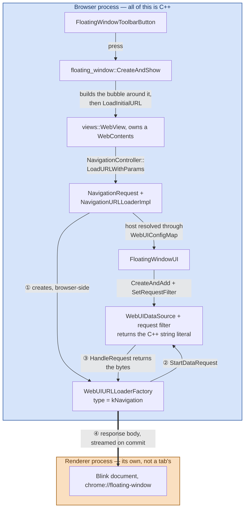
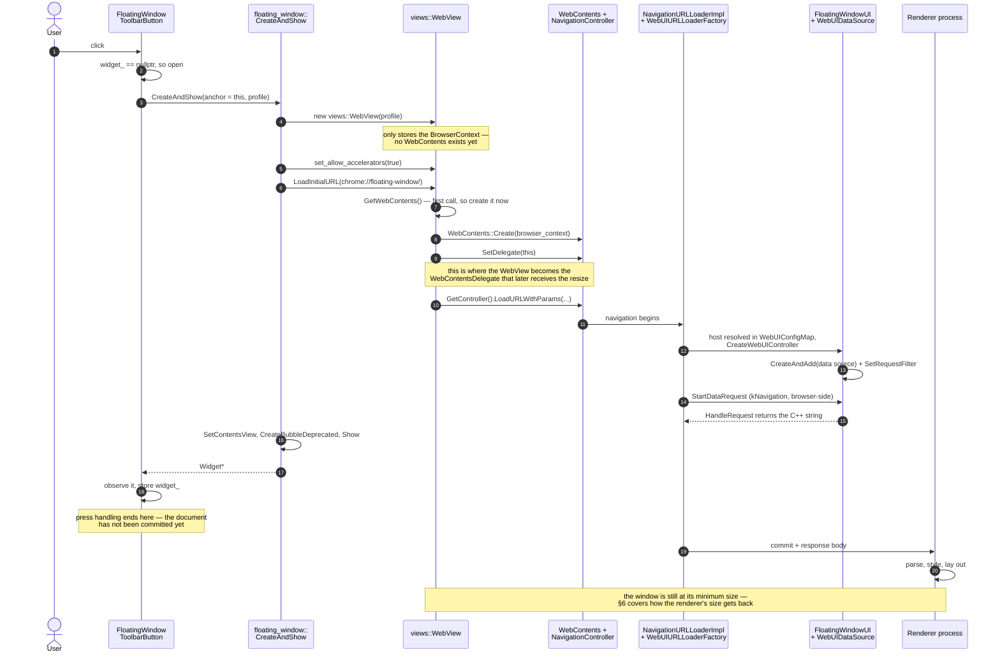
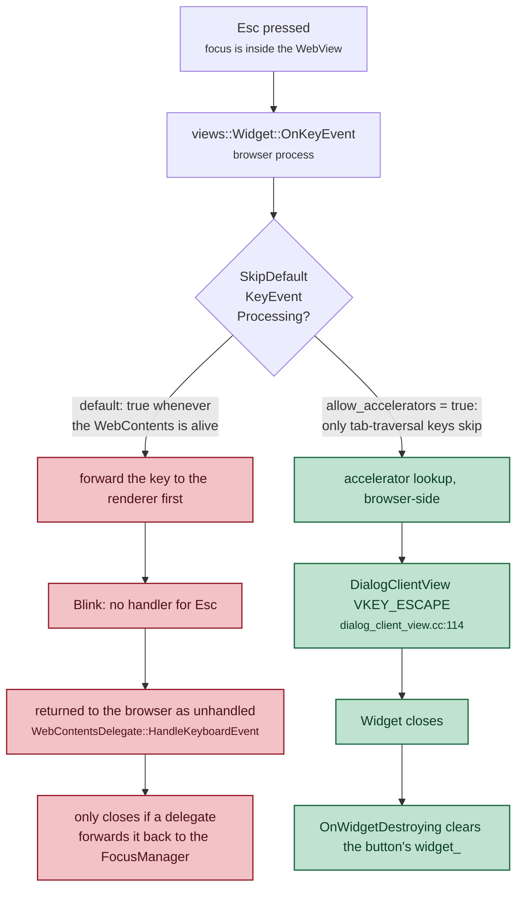
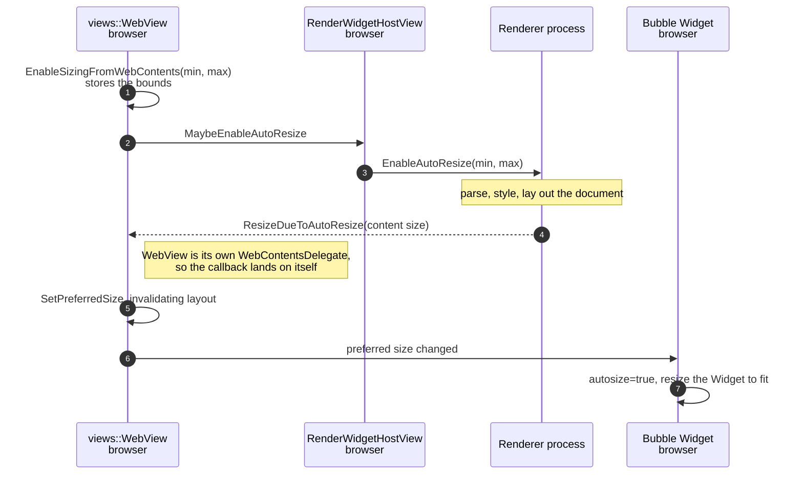

# `chrome://floating-window`: an end-to-end walkthrough

How the toolbar button and its floating window actually work, file by file.
Written against branch `floating-window` (based on `f6fd8f0cdc96a`) in
`~/chromium-desk/src`. The alternatives that were weighed and rejected are in
[`floating-window-alternatives.md`](floating-window-alternatives.md); this
document only covers what was built.

> **Source links.** Every path below links into
> [github.com/obeletski/chromium](https://github.com/obeletski/chromium) on the
> `floating-window` branch. Line anchors were checked against the tree these docs
> were written from; they will drift if the branch is rebased onto newer upstream.


---

## 1. What it does

A button in the desktop toolbar, between the extensions area and the profile /
Incognito indicator. Pressing it opens a floating, non-modal surface rendering
a real HTML document that says *"I am the floating window"*. Pressing the button
again, or pressing **Esc**, closes it. The surface stays up while you keep using
the browser.

Behind a `base::Feature` kill switch, `features::kFloatingWindowToolbarButton`,
enabled by default.

---

## 2. The pieces

| File | Job |
|---|---|
| [`chrome/common/webui_url_constants.h`](https://github.com/obeletski/chromium/blob/floating-window/chrome/common/webui_url_constants.h) | `kChromeUIFloatingWindowHost` = `"floating-window"`, and the `chrome://floating-window/` URL |
| `chrome/browser/ui/webui/floating_window/`<br/>[`floating_window_ui.h`](https://github.com/obeletski/chromium/blob/floating-window/chrome/browser/ui/webui/floating_window/floating_window_ui.h) · [`.cc`](https://github.com/obeletski/chromium/blob/floating-window/chrome/browser/ui/webui/floating_window/floating_window_ui.cc) | `FloatingWindowUIConfig` (registry entry) and `FloatingWindowUI` (serves the HTML) |
| [`chrome/browser/ui/webui/chrome_web_ui_configs.cc`](https://github.com/obeletski/chromium/blob/floating-window/chrome/browser/ui/webui/chrome_web_ui_configs.cc) | registers the config at startup |
| `chrome/browser/ui/views/floating_window/`<br/>[`floating_window_bubble.h`](https://github.com/obeletski/chromium/blob/floating-window/chrome/browser/ui/views/floating_window/floating_window_bubble.h) · [`.cc`](https://github.com/obeletski/chromium/blob/floating-window/chrome/browser/ui/views/floating_window/floating_window_bubble.cc) | `floating_window::CreateAndShow()` — builds the bubble around a `views::WebView` |
| `chrome/browser/ui/views/toolbar/`<br/>[`floating_window_toolbar_button.h`](https://github.com/obeletski/chromium/blob/floating-window/chrome/browser/ui/views/toolbar/floating_window_toolbar_button.h) · [`.cc`](https://github.com/obeletski/chromium/blob/floating-window/chrome/browser/ui/views/toolbar/floating_window_toolbar_button.cc) | the `ToolbarButton`; owns the toggle state |
| `chrome/browser/ui/views/toolbar/`<br/>[`toolbar_view.h`](https://github.com/obeletski/chromium/blob/floating-window/chrome/browser/ui/views/toolbar/toolbar_view.h) · [`.cc`](https://github.com/obeletski/chromium/blob/floating-window/chrome/browser/ui/views/toolbar/toolbar_view.cc) | creates the button at the right position |
| `chrome/browser/ui/`<br/>[`ui_features.h`](https://github.com/obeletski/chromium/blob/floating-window/chrome/browser/ui/ui_features.h) · [`.cc`](https://github.com/obeletski/chromium/blob/floating-window/chrome/browser/ui/ui_features.cc) | the feature flag |
| [`ui/enums.xml`](https://github.com/obeletski/chromium/blob/floating-window/tools/metrics/histograms/metadata/ui/enums.xml) · [`page/histograms.xml`](https://github.com/obeletski/chromium/blob/floating-window/tools/metrics/histograms/metadata/page/histograms.xml) | required metrics registration for a new WebUI host (§7) |

Three layers, and the interesting thing is how little glue they need.

The single most useful thing to hold in your head: **everything here lives in
the browser process except the rendered document.** The HTML is a C++ string
literal compiled into the browser binary; it only becomes a document after
crossing into a renderer as bytes over a Mojo `URLLoader`.



**The renderer never asks for anything.** Steps ① ② ③ all happen inside the
browser: a `chrome://` navigation is fetched by `NavigationURLLoaderImpl`, which
builds a `WebUIURLLoaderFactory` of type `kNavigation` and runs it with
`kBrowserProcessId` ([`navigation_url_loader_impl.cc:712`](https://github.com/obeletski/chromium/blob/floating-window/content/browser/loader/navigation_url_loader_impl.cc#L712)).
Only step ④ crosses the process boundary, and it goes browser → renderer: the
finished document is streamed in as the navigation's response body.

There is a second, renderer-driven path — `CreateWebUIURLLoaderFactory` is also
called from `RenderFrameHostImpl` with type `kDocumentSubResource` — but it is
for subresources a page asks for after it loads. This page has none: no script,
no external stylesheet, no images.

---

### The classes, and their renderer-side counterparts

The map above is the flow; this is the type structure behind it. Solid arrows
are ownership, hollow triangles inheritance, dotted lines the Mojo pairs that
straddle the process boundary.


Three things this makes visible that prose keeps burying.

**`views::WebView` wears two hats.** It is a `View` so it can sit in the bubble,
and it implements `content::WebContentsDelegate` so the `WebContents` it owns
can call back into it. That is the whole reason `ResizeDueToAutoResize` lands on
the WebView in §6 — the WebView made itself the delegate in `SetDelegate(this)`.

**The `WebUIController` hangs off the frame, not the tab.** `FloatingWindowUI`
is owned by `WebUIImpl`, which is owned by `RenderFrameHostImpl` — so it is
per-frame and per-navigation, not a long-lived per-profile object. A
cross-document navigation destroys and rebuilds it.

**Nothing in this feature has a renderer-side counterpart.** The dotted pairs
are all generic content/ plumbing that any page gets. The three classes written
for this feature — the button, the bubble helper, `FloatingWindowUI` — are
browser-only. On the other side of the boundary there is just a `Document` with
one `<p>` in it.

## 3. The button, and why it lands where it does

`ToolbarView::Init()` ([`toolbar_view.cc:309`](https://github.com/obeletski/chromium/blob/floating-window/chrome/browser/ui/views/toolbar/toolbar_view.cc#L309)) builds the toolbar's children in a
fixed sequence, and the layout manager lays them out **in child order**. So
position is decided by nothing more than where `AddChildView()` is called:

```
… extensions container → toolbar divider → pinned actions → chrome labs →
battery saver → performance intervention → media → glic →
  ★ FloatingWindowToolbarButton ★
→ avatar → overflow → app menu
```

Inserting immediately before `avatar_` is what puts the icon between the
extensions area and the profile chip.

`FloatingWindowToolbarButton` derives from `ToolbarButton` rather than
`views::Button`; that is what supplies the ink drop, hover highlight,
toolbar-sized icon and insets, and the standard focus ring.

The icon is `kNewWindowIcon`, a **vector** icon compiled from a `.icon` file
under `chrome/app/vector_icons/` into a generated header. Vector icons
re-rasterize at any scale factor and are recolored from the theme, which is why
`SetVectorIcon()` is preferred over setting an image directly — the button then
tracks theme and touch-mode changes on its own.

---

## 4. The toggle, and the race that shapes it

The press handler is three lines:

```cpp
void FloatingWindowToolbarButton::OnPressed() {
  if (widget_) {
    CloseWindow();
    return;
  }
  widget_ = floating_window::CreateAndShow(this, browser_->GetProfile());
  widget_observation_.Observe(widget_.get());
}
```

**It is only this simple because the bubble sets
`set_close_on_deactivate(false)`.** With the default setting, the sequence on a
second press is:

1. mouse press goes to the browser window;
2. the bubble widget **deactivates** and closes itself;
3. *then* the button's `OnPressed()` runs, sees `widget_ == nullptr`, and opens
   a new one.

The surface would appear never to close from its own button. Chromium has a
helper for exactly this — `WebUIBubbleReopenSuppressor` in
`chrome/browser/ui/views/bubble/` — which times the close and suppresses the
reopen. Turning deactivation-closing off removes the race at the source instead,
and independently gives the "floating window, not a menu" behaviour that was
asked for.

### What one press actually does

Two things are easy to get wrong here. **`LoadInitialURL` is called by
`CreateAndShow`, not by the WebView on itself** — the WebView is a passive host.
And **constructing `views::WebView(profile)` does not create a `WebContents`**;
it only records the `BrowserContext`. The `WebContents` is created lazily, on
the first `GetWebContents()` call, which `LoadInitialURL` triggers
([`webview.cc:106`](https://github.com/obeletski/chromium/blob/floating-window/ui/views/controls/webview/webview.cc#L106)).
That same call is where `SetDelegate(this)` runs, which is what later lets the
renderer's resize reach the WebView at all (§6).

Ordering matters too: the widget is shown *before* the document is committed.
The bubble appears at its minimum size and grows once the renderer reports back.
Nothing waits on the renderer.



### Why the button observes the widget

The bubble can also close *itself* (Esc). If `widget_` were only cleared by
`CloseWindow()`, the next press would call `Close()` on a destroyed `Widget`.
`views::WidgetObserver::OnWidgetDestroying()` clears the pointer for closes we
did not initiate. `base::ScopedObservation` handles the reverse hazard — the
button being destroyed while still observing.

### Why `CloseWindow()` clears before closing

```cpp
views::Widget* const widget = widget_;
widget_observation_.Reset();
widget_ = nullptr;
widget->Close();
```

`Widget::Close()` is **asynchronous** — it posts the destruction rather than
doing it inline, so `OnWidgetDestroying()` arrives later. Clearing first means
the button reports "not showing" immediately, so a press landing in that gap
opens a fresh window rather than being swallowed by a stale non-null pointer.
`Widget::CloseNow()` would close the gap by destroying synchronously, but it is
discouraged: it can tear the widget down underneath code still on the stack.

---

## 5. The bubble

`floating_window::CreateAndShow()` is a free function, not a class. Nothing
needs subclassing: `views::BubbleDialogDelegate` is configured entirely through
setters, and the contents arrive via `SetContentsView()`.

> A bubble already *is* an independent top-level `views::Widget` with a shadow
> and a themed frame. "Bubble" only adds that it positions itself relative to an
> anchor view and closes when the anchor goes away. That is why this is a bubble
> rather than a hand-built widget: the alternative is re-implementing Esc, focus,
> theming and teardown to arrive at the same place.

Note the *View* flavour, `views::BubbleDialogDelegateView`, cannot be subclassed
by new code — its constructors are private behind a `friend` allowlist
([`ui/views/bubble/bubble_dialog_delegate_view.h:968`](https://github.com/obeletski/chromium/blob/floating-window/ui/views/bubble/bubble_dialog_delegate_view.h#L968)). New bubbles use the
delegate + `SetContentsView()` shape, as [`ai_overlay_toolbar_button.cc`](https://github.com/obeletski/chromium/blob/floating-window/chrome/browser/ui/views/toolbar/ai_overlay_toolbar_button.cc) does.

Construction, in order:

```cpp
views::BubbleDialogDelegate(anchor_view,
                            views::BubbleBorder::TOP_RIGHT,   // hangs below, right-aligned
                            views::BubbleBorder::DIALOG_SHADOW,
                            /*autosize=*/true);               // see §6
```

`TOP_RIGHT` matters for a button near the right edge: a left-aligned bubble
would run off-screen.

Then three things are switched off, because a `BubbleDialogDelegate` is a
`DialogDelegate` and would otherwise grow dialog furniture: `SetButtons(kNone)`,
`SetShowCloseButton(false)`, `SetShowTitle(false)`. `SetAccessibleTitle()` is
still needed — without it the accessibility tree exposes an unnamed dialog.
`set_margins(gfx::Insets())` lets the WebView fill the bubble edge to edge,
since the page supplies its own padding.

### Esc is inherited, not implemented

There is no key handler anywhere in this feature. One line does it:

```cpp
web_view->set_allow_accelerators(true);
```

By default `WebView::SkipDefaultKeyEventProcessing()` returns true whenever the
`WebContents` is alive, which tells `FocusManager` **not** to treat key events as
accelerators — the page gets first refusal. That is right for real web content,
which may bind Esc itself.

For a WebView hosting browser UI it is backwards. `set_allow_accelerators(true)`
flips the check so only tab-traversal keys are skipped
([`ui/views/controls/webview/webview.cc:336`](https://github.com/obeletski/chromium/blob/floating-window/ui/views/controls/webview/webview.cc#L336)). Esc then reaches the
`FocusManager`, matches the `VKEY_ESCAPE` accelerator that `DialogClientView`
registers ([`ui/views/window/dialog_client_view.cc:114`](https://github.com/obeletski/chromium/blob/floating-window/ui/views/window/dialog_client_view.cc#L114)), and the widget closes —
which fires `OnWidgetDestroying()` on the button, clearing its pointer.

The flag decides *which process* handles the key. With it set, Esc never leaves
the browser:



The red path is not merely slower — nothing in this feature implements the
`HandleKeyboardEvent` hand-back, so on that path Esc would simply do nothing.

### Ownership

`CreateBubbleDeprecated(..., NATIVE_WIDGET_OWNS_WIDGET)` — the platform widget
owns the `views::Widget`, which owns the delegate, which owns the contents. The
caller holds a raw pointer purely as a "does it exist" flag.

The `Deprecated` suffix refers to the **ownership mode**, not the call. The
preferred `CreateBubble()` overload returns `std::unique_ptr<Widget>` under
`CLIENT_OWNS_WIDGET`, which would make the toolbar button responsible for the
widget's lifetime and for calling `MakeCloseSynchronous()`. Widget-owned is the
simpler contract for a surface that can close itself.

---

## 6. How the window gets its size

The bubble is created before the page has rendered, so its size cannot be known
up front. The chain that resolves it:



Two consequences worth knowing:

- **`autosize=true` on the delegate is load-bearing.** Without it the widget
  would never pick up the new preferred size.
- **Calling `EnableSizingFromWebContents()` before the renderer exists is fine.**
  `WebView` re-applies the stored bounds from `SetUpNewMainFrame()` whenever a
  new main frame appears ([`webview.cc:784`](https://github.com/obeletski/chromium/blob/floating-window/ui/views/controls/webview/webview.cc#L784)).

The widget is shown immediately, at its minimum size, and grows when the
renderer reports back.

---

## 7. The WebUI

### Registration

Three steps, and only the last one is per-feature:

1. `FloatingWindowUIConfig` derives from `content::DefaultWebUIConfig<T>` and
   names the (scheme, host) pair. `DefaultWebUIConfig` supplies
   `CreateWebUIController()` for the common case — it just does
   `std::make_unique<T>(web_ui)`. Deriving from bare `WebUIConfig` is only
   needed when construction wants more than the `WebUI*`, or when the page must
   be conditionally disabled (`IsWebUIEnabled()`).
2. `RegisterChromeWebUIConfigs()` adds one instance to the global
   `WebUIConfigMap` at startup. Ours goes in the `!BUILDFLAG(IS_ANDROID)` half,
   matching the desktop-only `assert()` in the target's `BUILD.gn`.
3. Navigating to `chrome://floating-window` looks the host up in that map and
   builds a `FloatingWindowUI`.

`WEB_UI_CONTROLLER_TYPE_DECL/IMPL` declare a per-class type tag — literally the
address of a static `int` — so a `WebUIController*` can be safely downcast back.

### Serving the HTML

The page is a C++ string literal. The usual shape for a WebUI page is a
`build_webui()` GN target: HTML/TS/CSS on disk, packed into a `.pak`, reached by
resource ID via `AddResourcePath()`. For a static one-line page that is a GN
target, a `.grd` entry, a generated resources map and a build step to produce a
single `<p>`.

`SetRequestFilter()` is the escape hatch — it lets a source compute a response
in C++, and it is checked **first** in `WebUIDataSourceImpl::StartDataRequest()`,
ahead of the resource-ID lookup. It takes two callbacks:

- `ShouldHandleRequest(path)` — returns `true` unconditionally here, so any path
  under the host serves the same document and a stray trailing segment does not
  produce a blank window.
- `HandleRequest(path, callback)` — hands back `base::RefCountedString`. The
  response goes through a *callback* rather than a return value because sources
  are allowed to answer asynchronously; this one runs it immediately.

> **A trap.** `SetResourcePathToResponse()` looks like a shorter way to do this
> and is used exactly that way in content's own browsertests
> ([`content/browser/webui/initial_webui_browsertest.cc:144`](https://github.com/obeletski/chromium/blob/floating-window/content/browser/webui/initial_webui_browsertest.cc#L144)). But it only fills
> `path_to_response_map_`, which is consumed by `PopulateWebUIResources()` for
> the `LocalResourceLoaderConfig` path — `StartDataRequest()` never reads it.
> Whether it worked would depend on which loading path was active. The request
> filter is honoured unconditionally.

### Why there is no script in the page

Data sources get a default CSP from `URLDataSource::GetContentSecurityPolicy()`
([`content/public/browser/url_data_source.cc:64`](https://github.com/obeletski/chromium/blob/floating-window/content/public/browser/url_data_source.cc#L64)). For a trusted `chrome://`
source:

| Directive | Default | Effect here |
|---|---|---|
| `style-src` | unset | inline `<style>` is **allowed** |
| `script-src` | `chrome://resources 'self'` | inline script is **blocked** |
| `require-trusted-types-for` | `'script'` | ditto |
| `object-src`, `child-src`, `frame-ancestors` | `'none'` | irrelevant here |

So the styling is inline and there is deliberately no script — one would be
silently blocked at runtime. Colors are CSS system colors plus
`color-scheme: light dark`, so the page follows the OS/browser theme without the
browser pushing any color values into it.

### The metrics registration a new WebUI host requires

`WebUIUrlHashesBrowserTest` ([`chrome/browser/ui/webui/webui_url_hashes_browsertest.cc`](https://github.com/obeletski/chromium/blob/floating-window/chrome/browser/ui/webui/webui_url_hashes_browsertest.cc))
walks every registered config and fails if either is missing:

- [`tools/metrics/histograms/metadata/ui/enums.xml`](https://github.com/obeletski/chromium/blob/floating-window/tools/metrics/histograms/metadata/ui/enums.xml), enum `WebUIUrlHashes`, keyed
  by `base::Hash("chrome://floating-window/")` as a signed 32-bit value —
  `-330093187`.
- [`tools/metrics/histograms/metadata/page/histograms.xml`](https://github.com/obeletski/chromium/blob/floating-window/tools/metrics/histograms/metadata/page/histograms.xml), variant `WebUIHost`,
  entry `.floating-window`. (Configs deriving from `InternalWebUIConfig` are
  exempt from this second one; ours is not.)

`base::Hash` is SuperFastHash
(`base/third_party/superfasthash/superfasthash.c`). The value above was computed
with a Python port, cross-checked against the existing `chrome://flags/`
(`1371905827`) and `chrome://version/` (`-756514973`) entries before being
trusted.

---

## 8. Build wiring

Two new `source_set`s, both asserting desktop:

- `//chrome/browser/ui/webui/floating_window` — pulled in by the `configs`
  target's `!is_android` `public_deps`.
- `//chrome/browser/ui/views/floating_window` — depended on by
  `//chrome/browser/ui/views/toolbar:impl`.

The button itself lives in the existing toolbar target: its header on
`:toolbar` (whose `public` list already carries [`toolbar_view.h`](https://github.com/obeletski/chromium/blob/floating-window/chrome/browser/ui/views/toolbar/toolbar_view.h)), its source on
`:impl`.

Note the dependency direction: **toolbar → floating_window**, never the reverse.
The bubble knows nothing about the toolbar; it takes a `views::View*` anchor and
a `Profile*`.

---

## 9. Verification performed

Built as `out/Linux/chrome` and driven under `Xvfb :99` with real X input
synthesised through `libXtst` via `ctypes`:

| Step | Result |
|---|---|
| launch | icon renders between the bookmark star and the profile chip |
| click the icon | window opens, rendering *"I am the floating window"* |
| press Esc | closes |
| click, click | opens, then closes |

The toggle screenshots are byte-identical (md5) to the first-open and
Esc-closed captures, so both paths reach exactly the same state. No
`FATAL`/`DCHECK`/CSP errors in the browser log.

Also clean: `gn check` on both new targets, `git cl format`,
[`tools/metrics/histograms/validate_format.py`](https://github.com/obeletski/chromium/blob/floating-window/tools/metrics/histograms/validate_format.py), and `pretty_print.py --presubmit`
on both edited XML files.

---

## 10. Regenerating the PDFs

`floating-window-*.pdf` are renders of the Markdown next to them, diagrams
included. The Markdown is the source; never edit a PDF.

```sh
docs/floating_window/tools/render-pdf.sh          # defaults to out/Linux
```

The pipeline is `marked` for Markdown, `mermaid` for the diagrams, and **this
checkout's own `chrome`** in headless mode for `--print-to-pdf`, which avoids
needing puppeteer or a system browser. The one non-obvious flag is
`--virtual-time-budget=30000`: mermaid lays the diagrams out asynchronously
after load, and without it the PDF can be printed while they are still empty.

---

## 11. Known gaps

- **Strings are hardcoded** `u"..."` literals with TODOs, not `IDS_` messages.
  New `.grd` strings require translation screenshots that presubmit enforces,
  which is disproportionate for a demo surface. [`ai_overlay_toolbar_button.cc`](https://github.com/obeletski/chromium/blob/floating-window/chrome/browser/ui/views/toolbar/ai_overlay_toolbar_button.cc)
  sets the same precedent.
- **No tests.** A `FloatingWindowToolbarButton` browser test asserting
  open/toggle/Esc would be the natural next step; the interaction is exactly
  what `InteractiveBrowserTest` covers.
- **No histogram for usage.** The metrics files were touched only to satisfy the
  WebUI-host registration, not to record how often the button is pressed.
- **Not user-pinnable.** A deliberate consequence of choosing a hardcoded child
  over an `ActionItem`; see the alternatives doc, §A1 vs §A2.
