# Page outlines: getting renderer data into a `chrome://` page

How `chrome://floating-window` shows the **level 1 and 2 headings** of every open
tab, and why that one addition turned a synchronous page into an asynchronous
one.

This is a companion to
[`floating-window-implementation.md`](floating-window-implementation.md), which
covers the toolbar button, the bubble, and how the page is served. Read that
first if you want the surrounding machinery; this document is only about the
outlines, and goes deeper on the parts that are genuinely tricky. The options
that were weighed and rejected are Part E of
[`floating-window-alternatives.md`](floating-window-alternatives.md).

> **Source links.** Every path below links into
> [github.com/obeletski/chromium](https://github.com/obeletski/chromium) on the
> `floating-window` branch. Line anchors were checked against the tree these
> docs were written from; they will drift if the branch is rebased.

---

## 1. The asymmetry that shapes everything

The page shows two kinds of thing, and they could hardly be less alike.

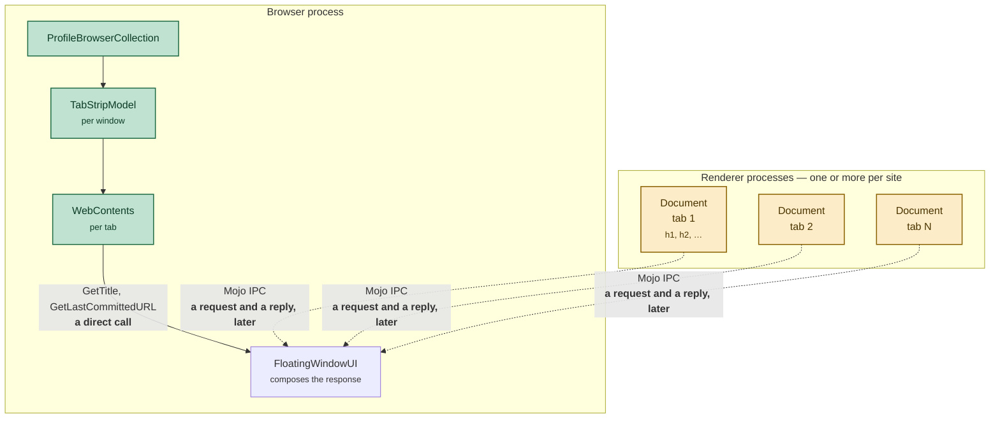

The **tab list** — which windows exist, which tabs they hold, each tab's title,
URL and index — is browser-process state. Reading it is a few pointer hops on
the UI thread, and it cannot fail.

The **outline** of each page is DOM. It lives in whichever renderer process is
hosting that tab, the browser holds no copy of it, and getting it means asking
another process and waiting. It can be slow, it can be truncated, and it can
never arrive at all.

Everything else in this document follows from that one difference.

---

## 2. Why the response became asynchronous

The page is served by a `WebUIDataSource` request filter, unchanged since the
feature rendered one line of static text. What changed is *when* the filter can
answer.

**The participants.** Everything below except the renderers runs in the
**browser process**, on the UI thread. Two of the four names are shorthand
rather than classes, which is worth knowing before reading arrows into them:

* **Navigation** — not a class. Shorthand for the URL-loading machinery that
  services a navigation to `chrome://floating-window`. Concretely it is
  [`WebUIURLLoaderFactory`](https://github.com/obeletski/chromium/blob/floating-window/content/browser/webui/web_ui_url_loader_factory.cc),
  whose `StartURLLoader()` builds the `GotDataCallback` and hands it to the data
  source. That callback is `DataAvailable` bound to a
  `mojo::PendingRemote<network::mojom::URLLoaderClient>` — so "running the
  callback" is literally what pushes the bytes down the URL load to the
  renderer. Nothing else in this document delivers the page.
* **`HandleRequest()`** — a **free function**, not a class or a method, declared
  in the anonymous namespace of
  [`floating_window_ui.cc`](https://github.com/obeletski/chromium/blob/floating-window/chrome/browser/ui/webui/floating_window/floating_window_ui.cc#L512). It reaches the data source as
  `base::BindRepeating(&HandleRequest, base::Unretained(profile))` passed to
  `WebUIDataSource::SetRequestFilter()`
  ([`.cc`](https://github.com/obeletski/chromium/blob/floating-window/chrome/browser/ui/webui/floating_window/floating_window_ui.cc#L668)), and
  [`WebUIDataSourceImpl::StartDataRequest()`](https://github.com/obeletski/chromium/blob/floating-window/content/browser/webui/web_ui_data_source_impl.cc#L508)
  runs it *instead of* the usual resource-ID lookup. Being a free function
  matters: it owns no state and cannot outlive the call, which is precisely why
  something else has to hold the callback.
* **Browser state** — also shorthand: the tab bookkeeping the browser already
  holds, walked synchronously as
  `ProfileBrowserCollection` → `BrowserWindowInterface` → `TabStripModel` →
  `WebContents`. §1 diagrams it. No IPC, no waiting, cannot fail.
* **Renderers** — one renderer process per tab (per site, strictly), each
  holding the DOM whose headings we want. The only participant outside the
  browser process.

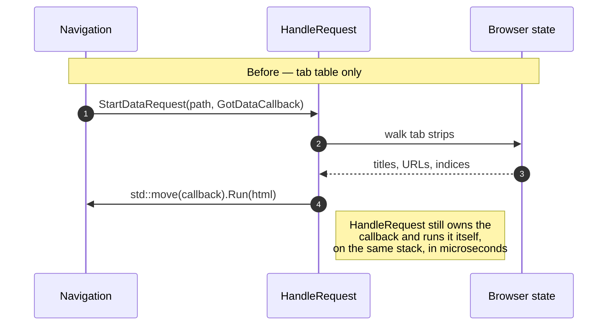

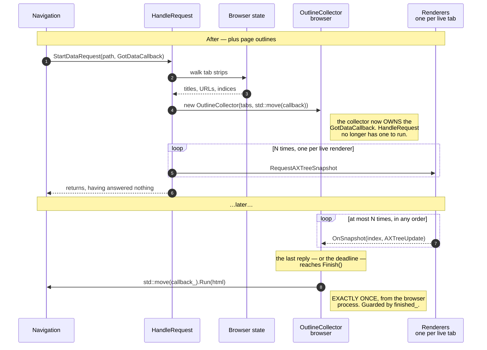

Three counts, since the diagram is easy to misread. Over one page load there
are **N** snapshot requests (one per tab with a live renderer), **at most N**
replies arriving one at a time in whatever order the renderers manage, and
**exactly one** `Run()`. The replies do not go to the navigation and they do not
each produce a response — each one only decrements a counter on the collector.

The object all three counts are about is `WebUIDataSource::GotDataCallback`.
It is the second half of the request filter's signature: `StartDataRequest()`
hands `HandleRequest()` a callback, and the response *is* running it. That is
the thing being moved in step 4 above. Before the outlines, `HandleRequest()`
held that callback for the few microseconds it took to build the string and ran
it before returning. Now it gives the callback away — `std::move()`d into the
`OutlineCollector`'s constructor — and returns having produced nothing. The
callback is now owned by an object that outlives the call, and running it is
what eventually publishes the page. Because it is a `OnceCallback`, running it
is also destructive, which is why "exactly once" is a correctness requirement
and not just an observation: see §3 on `finished_`.

The fifth participant, **`OutlineCollector`**, is the one this document keeps
coming back to, and §3 defines it properly. For now: a browser-process object
that outlives `HandleRequest()`, owns the callback, and knows how many replies
it is still waiting for. It exists because `HandleRequest()` cannot.

The crucial part is that this needed **no new mechanism**.
`WebUIDataSource::GotDataCallback` was always allowed to be answered later —
the API exists in callback form precisely because "a data source is allowed to
answer asynchronously (reading from disk, waiting on a service)". The static
page and the tab table simply happened to run it inline. Moving it into an
object that runs it later is using the interface as designed, not working
around it.

What this buys, and it is the whole reason the design holds together:

* no placeholder document and no second navigation — the renderer receives one
  complete page;
* no script in the served page, so the WebUI Content Security Policy never
  becomes a problem (see §7 of the implementation doc);
* no message handler and no `.mojom` of our own.

---

## 3. Assembling the page

This is the diagram to read if you read only one.

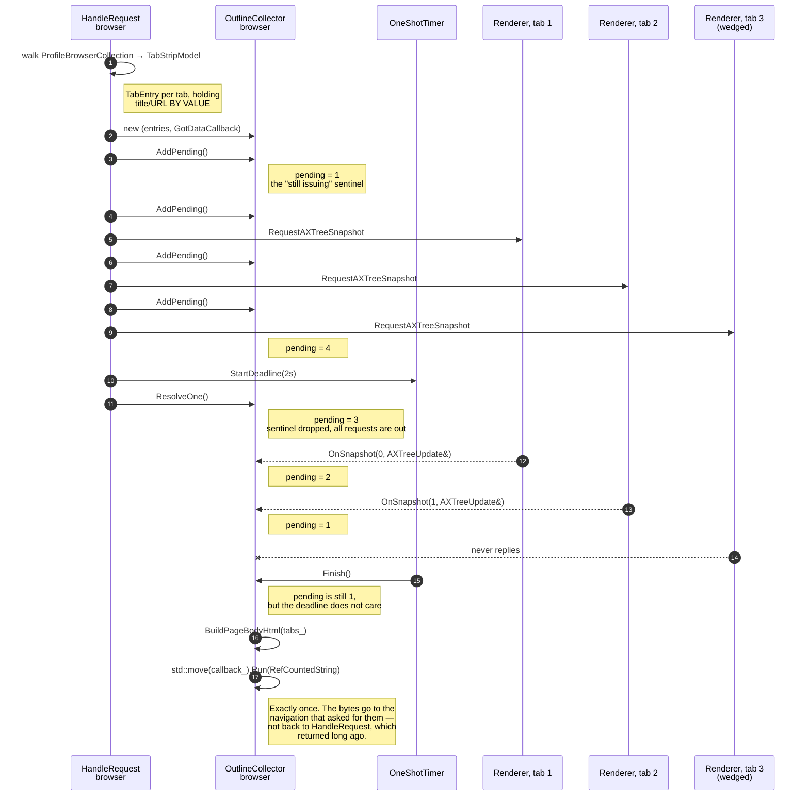

> **Mermaid aside, since this document is mostly diagrams.** A `;` inside
> sequence-diagram `Note` or message text silently ends the statement — mermaid
> treats it as a line separator — and the rest of the note runs into the
> following lines until the parse fails somewhere unrelated. Quoted flowchart
> labels are unaffected. Worth knowing before debugging a "Parse error on line
> N" that points at an innocent line.

### What the collector is

`OutlineCollector` is a **ref-counted, file-local class that owns one in-flight
gather and produces the response when it settles**. It is declared in the
anonymous namespace of
[`floating_window_ui.cc`](https://github.com/obeletski/chromium/blob/floating-window/chrome/browser/ui/webui/floating_window/floating_window_ui.cc#L430) — nothing outside that file has any
reason to name it, so it never reaches a header.

It exists because of a mismatch the rest of this document keeps circling: the
request arrives once, the answers arrive N times, and the response may only be
produced once. Something has to hold the callback across that gap and keep score.

Its entire interface is five methods:

```cpp
class OutlineCollector : public base::RefCounted<OutlineCollector> {
 public:
  OutlineCollector(std::vector<TabEntry> tabs,
                   content::WebUIDataSource::GotDataCallback callback);

  void AddPending();                                    // ++pending_
  void ResolveOne();                                    // --pending_, Finish() at zero
  void OnSnapshot(size_t index, ui::AXTreeUpdate&);     // store, then ResolveOne()
  void StartDeadline();                                 // arm the timer

 private:
  friend class base::RefCounted<OutlineCollector>;
  ~OutlineCollector() = default;
  void Finish();                                        // build the page, run the callback
```

and five members, each answering one question:

| Member | Question it answers |
|---|---|
| `tabs_` | what the page will say — every row, its outline filled in as replies land |
| `callback_` | how the page gets out — the `GotDataCallback`, moved in and owned |
| `pending_` | how many answers are still outstanding, **plus the sentinel** |
| `finished_` | has the callback already been run |
| `deadline_` | the `OneShotTimer` that gives up waiting |

Three invariants hold it together, and each is enforced rather than assumed:

* **`Finish()` runs at most once.** `finished_` guards it, because
  `GotDataCallback` is a `OnceCallback` and running it twice is a
  use-after-move. Two independent paths reach it — see *The collector's states*.
* **`pending_` never underflows.** `ResolveOne()` opens with
  `CHECK_GT(pending_, 0u)`, so a double-resolve crashes at the bug. Without it,
  `--pending_` would wrap a `size_t` to 2^64 and the reply path could never
  reach zero again — the page would then be published only when the deadline
  fired, two seconds late and missing outlines that had actually arrived. A
  `CHECK`, not a `DCHECK`, so that holds in release builds too.
* **The page is never published mid-issue.** That is the sentinel, next.

**Why a class, and not something smaller.** Each obvious alternative fails on a
specific point:

* *A lambda capturing the callback* — it would have to outlive
  `HandleRequest()`, and there is nothing for it to live in.
* *A `std::unique_ptr` owned by `HandleRequest()`* — destroyed when that
  function returns, which is before any reply arrives.
* *`base::BarrierCallback<T>`* — the in-tree fan-in helper, and the closest
  fit. It collects N results and fires once, which is most of this. But it can
  only be completed by its N calls arriving: there is no way to say "stop
  waiting now", and the deadline in §4 is the one mechanism the feature cannot
  do without. A second, smaller mismatch is that each reply has to be written to
  a *specific* row, and a barrier hands back an unordered vector.

The remaining three subsections cover its behaviour: why `pending_` starts at
one, the states it moves through, and what keeps it alive.

### Why the sentinel exists

`pending_` starts at one *before* any snapshot is requested, and that extra
count is dropped only after the request loop has finished.

Without it, consider a request that completes inline — a frame that is gone by
the time the call is made, so the reply callback is destroyed immediately and
the default fires synchronously. On the first tab of five, `pending_` would go
1 → 0, `Finish()` would run, and the page would be published built from one tab
while four requests were still being issued. The sentinel makes "still issuing"
an explicit state that has to be left deliberately.

It also handles the degenerate case for free: a profile where no tab has a live
renderer issues no requests at all, and the trailing `ResolveOne()` drives
`pending_` to zero right there — the page is served immediately instead of
waiting out a two-second deadline for replies that were never requested.

### The collector's states

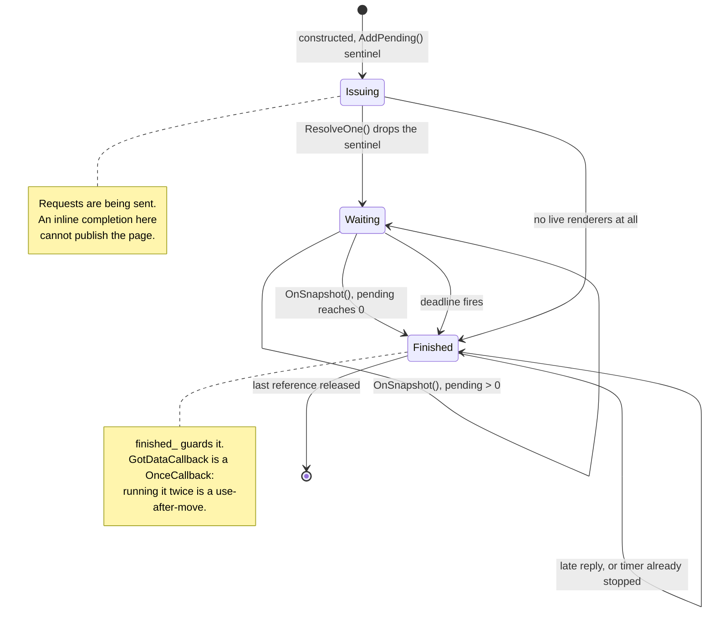

`Finish()` is reachable from two directions that know nothing about each other,
so it must be idempotent. A late reply arriving after the deadline still calls
`ResolveOne()`, still decrements, and may still reach `Finish()` — which returns
immediately.

### Who keeps the collector alive

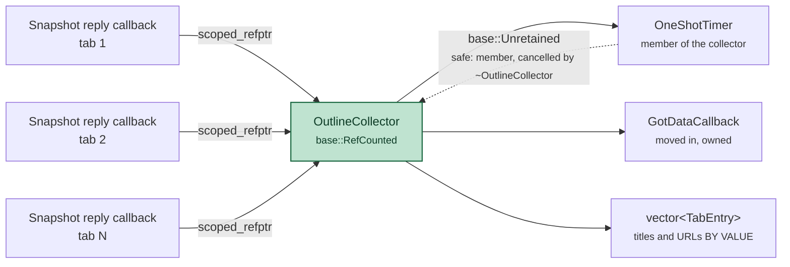

Two independent things keep the object alive and either may outlive the other,
which is exactly the case `base::RefCounted` is for: the outstanding reply
callbacks, and the collector's own deadline timer. A `unique_ptr` owned by
`HandleRequest()` would be destroyed when that function returns, which is
before any reply arrives.

The timer holds a `base::Unretained(this)` and that is safe *because* it is a
member: `OneShotTimer`'s destructor cancels it, so it cannot outlive the object
it points at.

> **`TabEntry` holds strings, not `WebContents*`.** A tab can be closed while
> its snapshot is in flight. A copied title and URL cannot dangle, so a tab that
> disappears mid-gather still renders as the row it was, rather than crashing or
> being silently dropped. This is a deliberate copy, not laziness.

---

## 4. Four failure modes, three mechanisms

This is where the design earns its keep, and where the obvious tool is not
enough.

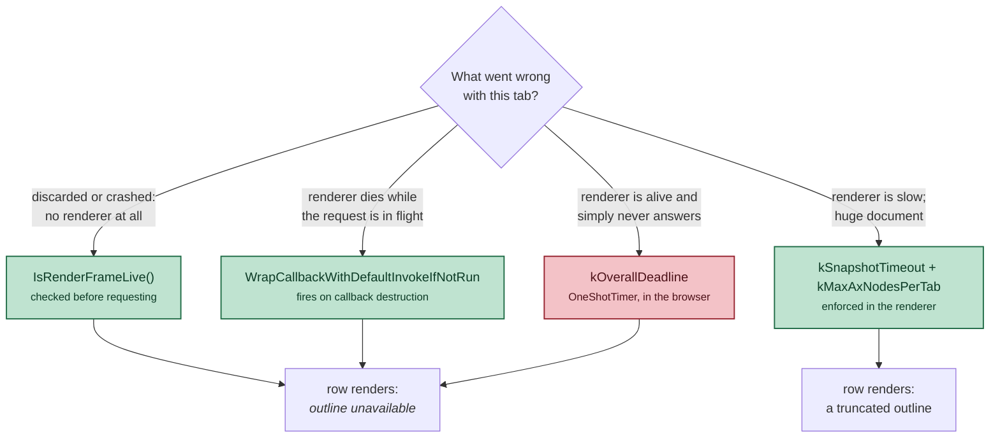

The red box is the point of this section.

`mojo::WrapCallbackWithDefaultInvokeIfNotRun`
([`callback_helpers.h`](https://github.com/obeletski/chromium/blob/floating-window/mojo/public/cpp/bindings/callback_helpers.h))
is the in-tree idiom for "this reply might not come", and it is what
[`ai_data_keyed_service.cc`](https://github.com/obeletski/chromium/blob/floating-window/chrome/browser/ai/ai_data_keyed_service.cc)
wraps around this very call. It is easy to reach for it and consider the problem
solved. But it fires when the callback is **destroyed** — a renderer that is
alive and spinning in a synchronous loop destroys nothing, holds the callback
indefinitely, and is completely invisible to it.

Because the response is not composed until *every* tab has reported, a single
wedged tab would leave the floating window blank for as long as it stayed
wedged. The `kOverallDeadline` timer is the only thing standing between the
feature and that outcome.

This was tested rather than argued: a page that busy-loops its main thread for
sixty seconds. The window still opens, that tab reads *outline unavailable*, and
every other tab renders its outline normally.

> **What the drop guard cannot express.** `WrapCallbackWithDefaultInvokeIfNotRun`
> resolves a dropped reply by invoking `OnSnapshot()` with a default-constructed
> `AXTreeUpdate` — and `OnSnapshot()` sets `snapshot_returned = true`
> unconditionally. So a renderer that **dies mid-flight** produces an empty
> outline that is indistinguishable from a page that genuinely has no `h1` or
> `h2`, and that row renders as *"no level 1 or 2 headings"* rather than
> *"outline unavailable"*. The distinction survives for the other two paths —
> a renderer that was already dead at request time never gets a row set, and a
> tab that misses `kOverallDeadline` never reports at all — so only the middle
> column of the diagram above is mislabelled. Fixing it would take a sentinel
> in the default value, or a separate handler bound to
> `WrapCallbackWithDropHandler` instead. Left as-is deliberately: the label is
> cosmetic and the alternative costs a branch on every reply.

> **A note on what the deadline does not do.** It does not cancel the
> outstanding request. The mojo callback stays alive until the renderer
> eventually replies or goes away; `Finish()` simply stops caring. The collector
> lives on until that last reference drops, and the late reply lands in a
> `Finished` state that ignores it.

---

## 5. Reading headings out of an accessibility tree

The outline is not obtained by running script in the page. It comes from
`WebContents::RequestAXTreeSnapshot()`
([`web_contents.h`](https://github.com/obeletski/chromium/blob/floating-window/content/public/browser/web_contents.h)),
a one-shot capture that does not permanently change the accessibility mode.

**`AX` is Chromium's abbreviation for *accessibility*** — it prefixes the whole
subsystem (`AXObject`, `AXNodeData`, `AXTree`, `AXMode`, `ax::mojom::Role`), and
`a11y`, seen in file and directory names, is the same word numeronym-style. The
two are used interchangeably in the tree. Nothing about this feature is *for*
assistive technology; the accessibility tree is simply the only structured,
already-serializable view of another process's DOM that the browser can ask for.

Four things take part, and only the last is ours. The **Document** is the live
DOM in the tab's renderer. The **Blink AX tree** is the parallel tree of
[`AXObject`](https://github.com/obeletski/chromium/blob/floating-window/third_party/blink/renderer/modules/accessibility/ax_object.h)s
that Blink maintains beside it for assistive technology — the thing that
actually knows what a "heading" is. **`ui::AXTreeUpdate`** is the serialized
form that crosses the process boundary. **`ExtractOutline()`**
([`floating_window_ui.cc`](https://github.com/obeletski/chromium/blob/floating-window/chrome/browser/ui/webui/floating_window/floating_window_ui.cc#L299))
is the browser-side function that turns that into rows.

> **Background reading, since this section only skims a large subsystem.** The
> tree documents its own accessibility architecture, and three documents cover
> the classes named here:
>
> * [`third_party/blink/renderer/modules/accessibility/readme.md`](https://github.com/obeletski/chromium/blob/floating-window/third_party/blink/renderer/modules/accessibility/readme.md)
>   — the renderer half: `AXObject`, `AXObjectCacheImpl` (which owns the tree and
>   defers updates until layout is clean), `WebAXObject`, and how the tree is
>   frozen and serialized. This is the document to read before touching anything
>   in Trap 1 or Trap 3 below.
> * [`docs/accessibility/browser/how_a11y_works.md`](https://github.com/obeletski/chromium/blob/floating-window/docs/accessibility/browser/how_a11y_works.md)
>   and its
>   [Part 2](https://github.com/obeletski/chromium/blob/floating-window/docs/accessibility/browser/how_a11y_works_2.md) /
>   [Part 3](https://github.com/obeletski/chromium/blob/floating-window/docs/accessibility/browser/how_a11y_works_3.md)
>   — builds the architecture up from a single-process browser to the
>   multi-process one, which is where `AXNodeData` and `AXTreeUpdate` earn their
>   shape. Part 2 is the relevant one for the serialization boundary this
>   section crosses.
> * [`docs/accessibility/overview.md`](https://github.com/obeletski/chromium/blob/floating-window/docs/accessibility/overview.md)
>   — what the subsystem is *for*, and the vocabulary. Start here if the terms
>   are unfamiliar.
>
> Reading those makes the traps below look less arbitrary: they are all
> consequences of the subsystem being built to drive platform accessibility
> APIs, not to answer one-off structural questions about a page.

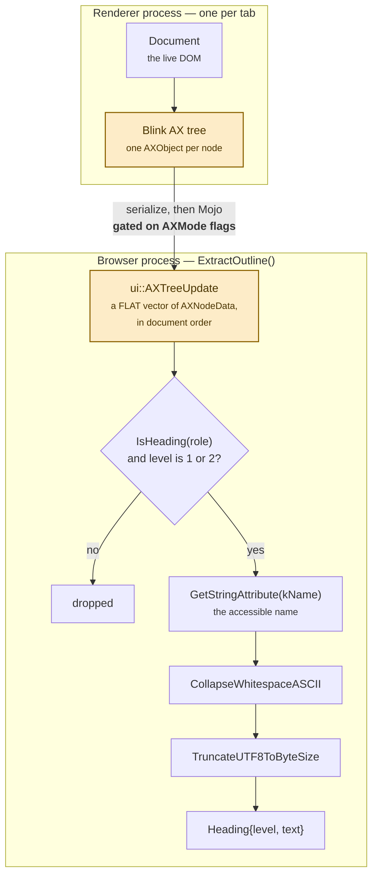

An `AXTreeUpdate`
([`ax_tree_update.h`](https://github.com/obeletski/chromium/blob/floating-window/ui/accessibility/ax_tree_update.h))
is a **flat `std::vector<AXNodeData>`**, not a tree — the structure lives in each
node's `child_ids`. That is convenient here rather than annoying: the
snapshotter serializes in document order, so reading `nodes` straight through
yields headings in the order they appear on the page, which is exactly what an
outline wants. No recursion, no tree reconstruction.

### Trap 1 — the level is only serialized under `kExtendedProperties`

Blink writes `kHierarchicalLevel` inside a branch guarded on that AX mode flag
([`ax_object.cc`](https://github.com/obeletski/chromium/blob/floating-window/third_party/blink/renderer/modules/accessibility/ax_object.cc),
the `IsHeading(role) && HeadingLevel()` case). Ask for plain `kWebContents` and
the snapshot still contains heading *nodes* — they simply all report level 0, so
an h1/h2 filter drops every one of them. Nothing logs, nothing fails; the
outline is just always empty.

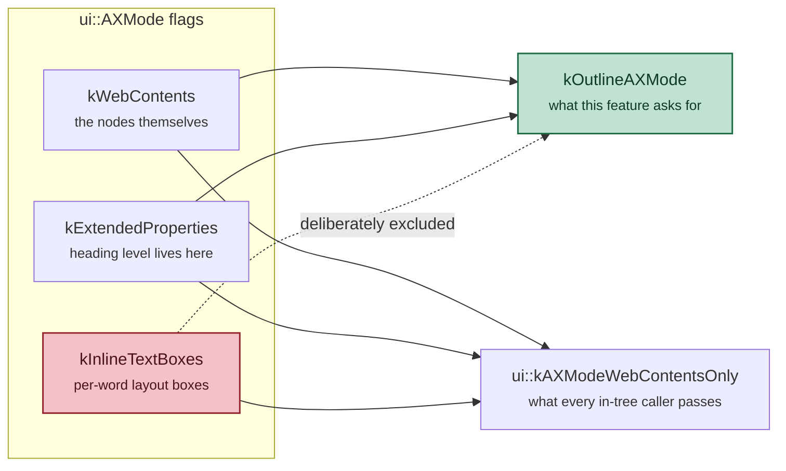

The mode is spelled out as `kWebContents | kExtendedProperties` rather than
reusing `ui::kAXModeWebContentsOnly`
([`ax_mode.h`](https://github.com/obeletski/chromium/blob/floating-window/ui/accessibility/ax_mode.h)),
which every in-tree snapshot caller passes — Compose, Read Anything, Mahi,
`ai_data_keyed_service` — and which is those two flags **plus
`kInlineTextBoxes`**. That third flag makes the renderer lay out and serialize
per-word text boxes for the entire document. Nothing here reads them, and the
cost would be paid once per open tab, every time the window is opened.

### Trap 2 — "level 1 and 2" is not `querySelectorAll("h1, h2")`

Blink's `HeadingLevel()`
([`ax_node_object.cc`](https://github.com/obeletski/chromium/blob/floating-window/third_party/blink/renderer/modules/accessibility/ax_node_object.cc))
resolves the level like this:

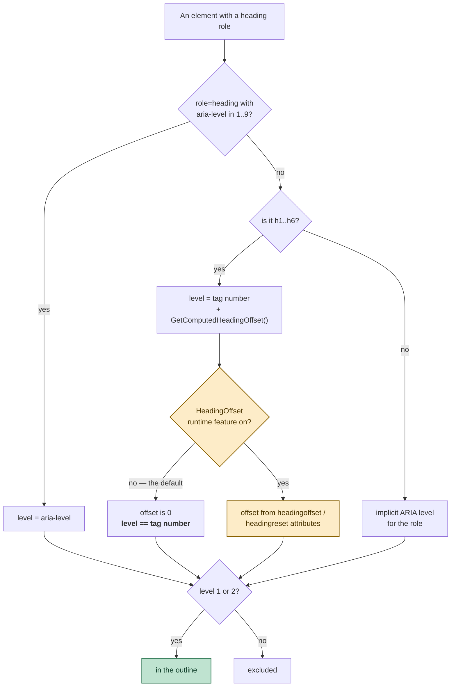

Two consequences, both verified against real pages:

* `<div role="heading" aria-level="2">` **is** an h2 for this purpose, and an
  `<h1 aria-level="4">` is excluded. A CSS selector would get both backwards.
  This is the right answer — an outline is a question about document semantics,
  not about tag names.
* `GetComputedHeadingOffset()` is easy to over-read. It does **not** come from
  nesting inside `<section>` or `<article>`; it comes from the `headingoffset`
  and `headingreset` content attributes
  ([`element.cc`](https://github.com/obeletski/chromium/blob/floating-window/third_party/blink/renderer/core/dom/element.cc)),
  and it is gated on the `HeadingOffset` runtime feature, which is
  `status: "experimental"` and therefore off in a default build. On any normal
  page today, level *is* the tag number: an `<h1>` nested two `<section>`s deep
  still reports 1.

### Trap 3 — an accessible name is not `textContent`

The name is *computed*, which cuts both ways:

* a heading whose markup wraps across several source lines carries those
  newlines and their indentation, so names go through
  `base::CollapseWhitespaceASCII()`
  ([`string_util.h`](https://github.com/obeletski/chromium/blob/floating-window/base/strings/string_util.h));
* a heading containing a `<script>` element contributes none of that element's
  text, which is a pleasant accident — `<h2>Costs &amp; <script>…</script>
  risks</h2>` comes out as `Costs & risks`.

Names are then capped with `base::TruncateUTF8ToByteSize()`, which cuts on a
character boundary where a naive `substr()` would split a multi-byte sequence
and emit invalid UTF-8.

Snapshots are requested with `kSameOriginDirectDescendants`: a cross-origin
iframe's headings are not part of this page's outline, and reaching into them
would widen what a `chrome://` page reads out of arbitrary sites for no benefit.

---

## 6. What ends up in the document

The outline rows are rows of the same table as the tabs, spanning the title and
URL columns.

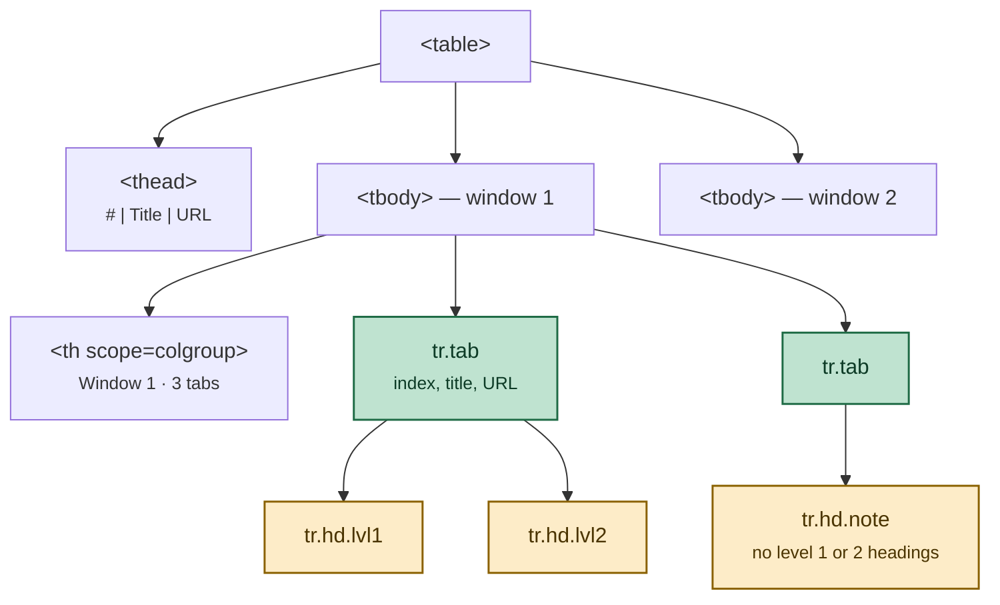

(The arrows from `tr.tab` are "followed by", not nesting — HTML tables have no
row nesting. The visual hierarchy is entirely the `lvl1` / `lvl2` indent.)

Abridged from a real run:

```html
<tr class="tab" aria-current="true"><td class="idx">1</td><td>Quarterly report — draft</td><td class="url">file:///…/a.html</td></tr>
<tr class="hd lvl1"><td class="idx"></td><td colspan="2">Quarterly Report</td></tr>
<tr class="hd lvl2"><td class="idx"></td><td colspan="2">Revenue</td></tr>
<tr class="hd lvl2"><td class="idx"></td><td colspan="2">Costs &amp; risks</td></tr>
<tr class="hd lvl1"><td class="idx"></td><td colspan="2">Appendix</td></tr>
```

Three decisions worth naming:

- **Rows, not a nested `<ul>` in the title cell.** A list would have to opt out
  of the `nowrap` / `text-overflow` rules the cells rely on, and it would break
  the alignment of the index column.
- **The indent is on the cell, not the row.** Each outline row still carries an
  empty `<td class="idx">` so the tab numbering column stays aligned; padding
  goes on `td:last-child`.
- **Two different empty states.** *"no level 1 or 2 headings"* means the
  snapshot came back and the page genuinely has none. *"outline unavailable"*
  means it never came back. Collapsing them into one message would hide the
  difference between "this page has no structure" and "we could not read it".

---

## 7. Costs, caps, and what is deliberately missing

| Knob | Value | Why |
|---|---|---|
| `kOverallDeadline` | 2 s | the browser-side backstop; the only cover for a live-but-silent renderer |
| `kSnapshotTimeout` | 1.2 s | passed to the renderer, which truncates the tree it serializes |
| `kMaxAxNodesPerTab` | 20 000 | a cap on a hostile or enormous document |
| `kMaxHeadingsPerTab` | 12 | beyond this the row reads `+ N more` |
| `kMaxHeadingBytes` | 300 | per heading, cut on a UTF-8 boundary |

Known limits, none of them accidental:

* **One IPC per tab, per opening.** Nothing is cached between openings and
  nothing is batched. With many tabs the window appears measurably later than
  it did when the page was pure browser-process state. This is the real price
  of the feature.
* **Levels 1 and 2 only.** Deeper headings are dropped rather than folded in.
* **Cross-origin iframes contribute nothing**, by choice of snapshot policy. A
  page whose real content sits in a cross-origin iframe will look emptier than
  it is.
* **Still a snapshot.** Like the tab list, the outlines are read once while the
  response is composed. The bubble builds a fresh `WebContents` on every press,
  so reopening is the refresh gesture.

---

## 8. Verification

Driven under `Xvfb`, with real X input synthesised through `libXtst` via
`ctypes` to click the toolbar button, plus CDP `Page.navigate` to load
`chrome://floating-window` into an ordinary tab for markup inspection.
(`/json/new` refuses `chrome://` URLs and `--headless` accepts only one target,
so neither is a route to the page.)

| Case | Expected | Result |
|---|---|---|
| `h1`, `h2`, `h3`, `h2`, `h1` | the `h3` excluded, four rows in document order | ✅ |
| `<h1>` nested one and two `<section>`s deep | all level 1 | ✅ |
| `<div role="heading" aria-level="2">` | included as level 2 | ✅ |
| `<div role="heading" aria-level="4">` | excluded | ✅ |
| `<h2>` split across three source lines | collapsed to one line | ✅ |
| heading containing `<script>alert(1)</script>` | script text absent, rest escaped | ✅ |
| page with no headings | *no level 1 or 2 headings* | ✅ |
| **renderer busy-looping for 60 s** | window still opens; that tab *outline unavailable*; others normal | ✅ |

No CSP violations, `FATAL` or `DCHECK` output in the browser log across any run.
`gn check` passes on `//chrome/browser/ui/webui/floating_window`.

The last row is the one worth having actually run: it is the failure that the
first-choice idiom does not cover, and without the deadline the window would
have stayed blank indefinitely.
