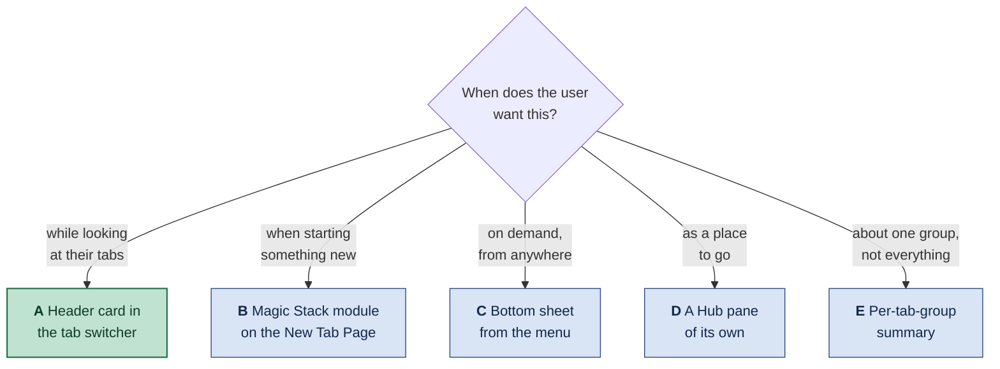
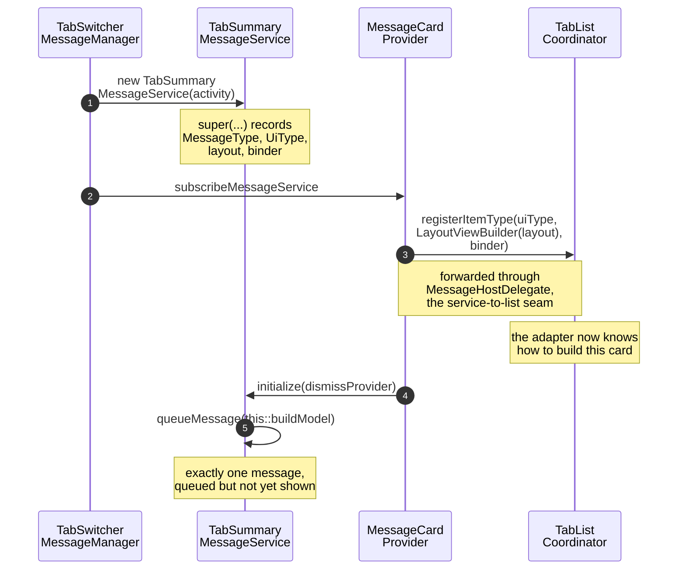
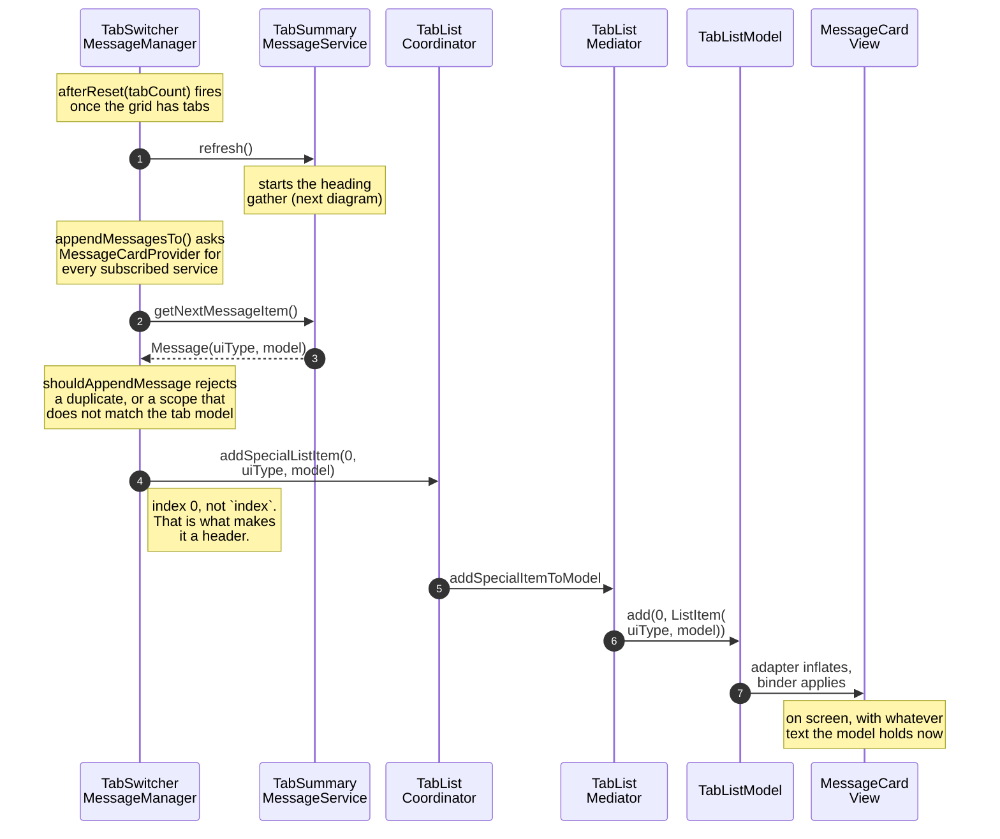
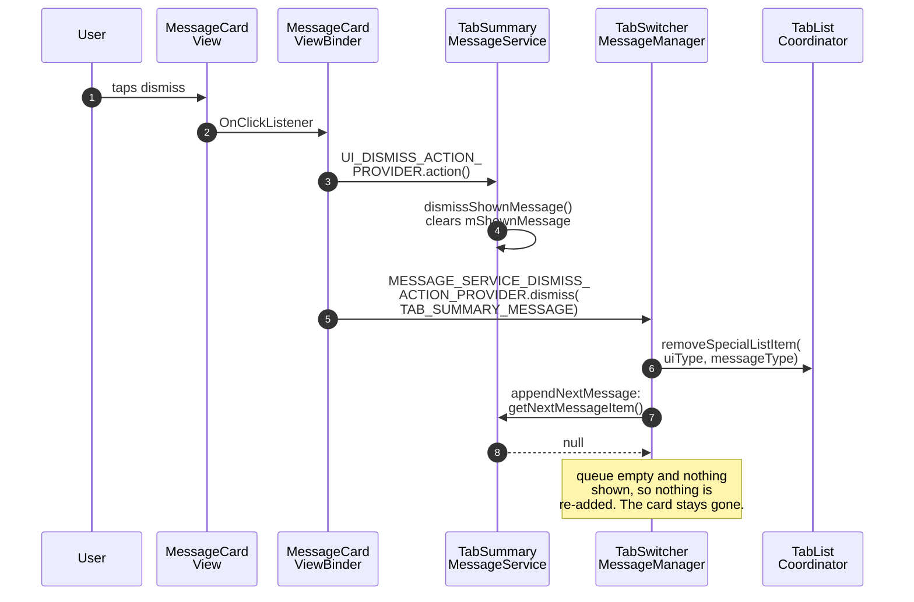
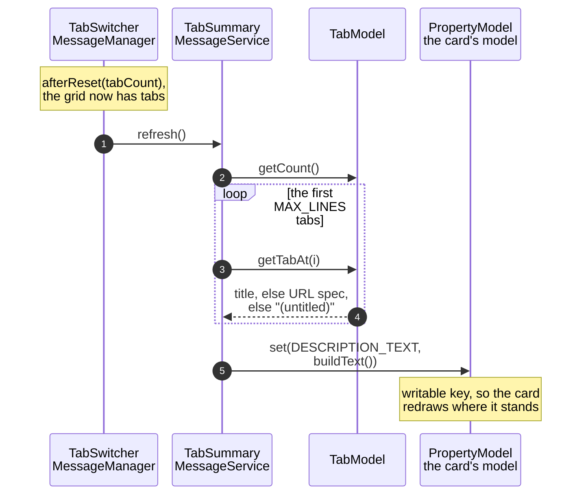
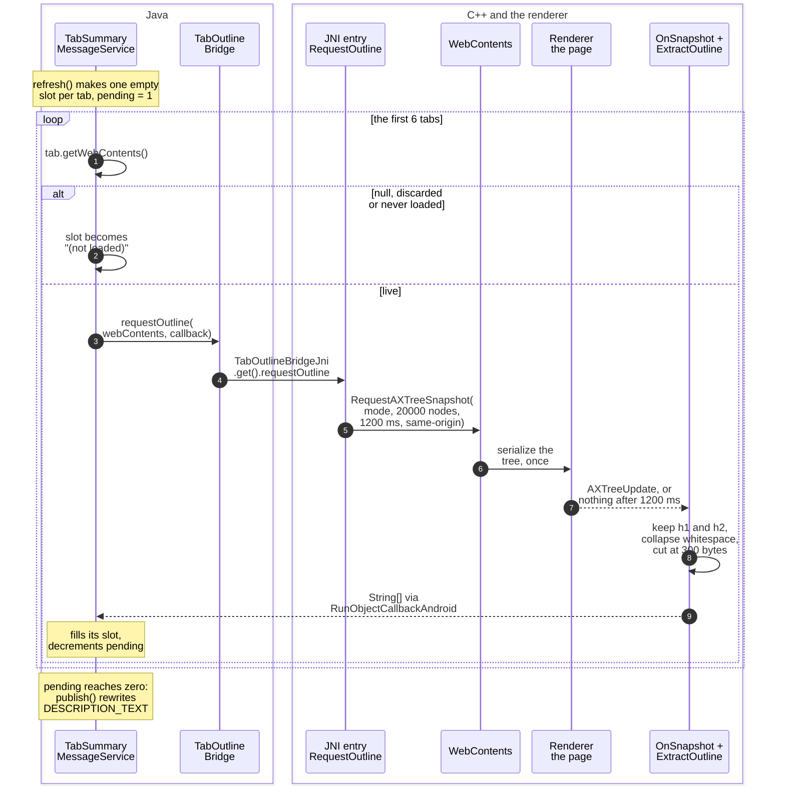
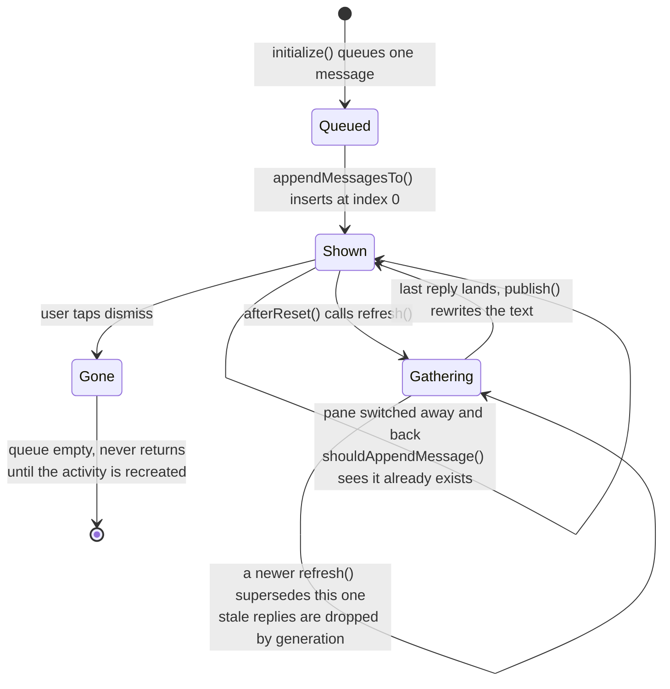
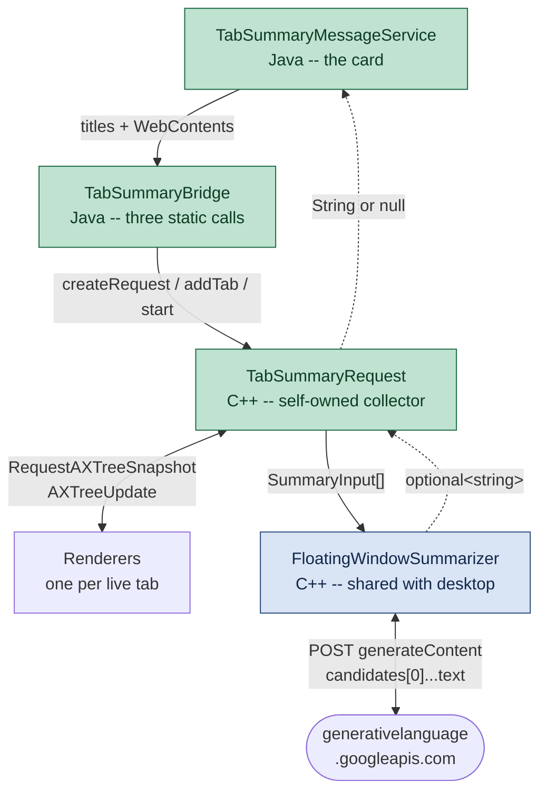
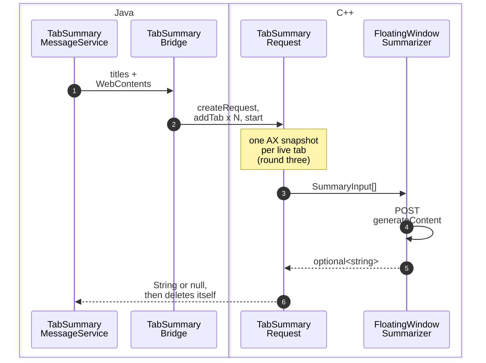
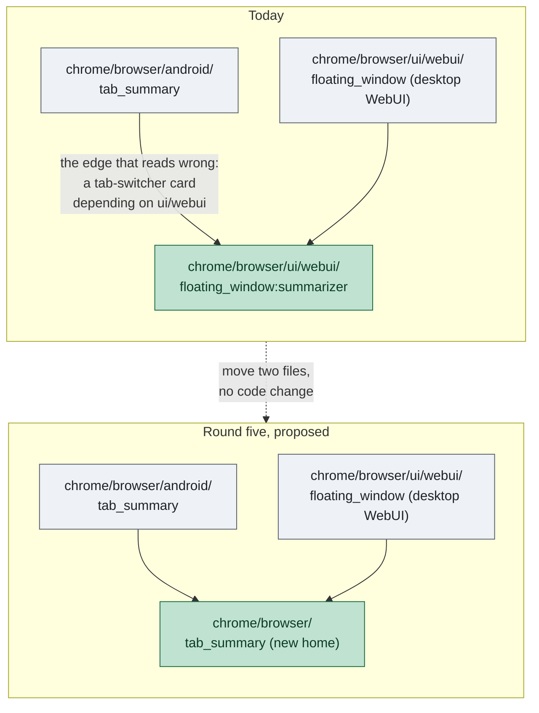

# Showing the tab summary on Android: UI alternatives

The tab summary — a few sentences describing what the user has open, generated
from the `h1`/`h2` headings of each tab — shipped first on desktop, inside
`chrome://floating-window`. This note surveys where it could live on Android and
what each choice costs. It has since been built here too, as the four rounds of
option A below; the survey is kept as written, because the reasoning is what
justifies the surface that was chosen.

Companion to
[`floating-window-tab-summary.md`](floating-window-tab-summary.md), which
documents the implemented desktop feature and, in its appendix, the
*architecture* alternatives that were weighed before it (browser-process
request, served into a same-origin iframe). This note is about the *surface*,
and it is a separate question because **none of the desktop answer transfers**.

> **Status.** The surfaces and classes named below were read in this checkout.
> The designs are proposals, with one exception: **option A exists, in four
> rounds.**
>
> * **Round one — the card.** A card at the top of the `TAB_SWITCHER` pane's
>   grid, carrying a hardcoded placeholder. It renders above the thumbnails and
>   dismisses.
> * **Round two — the tab listing.** The placeholder becomes the open tabs, one
>   line each, rebuilt from live `TabModel` state whenever the grid resets.
>   Rounds one and two were confirmed together on an arm64 device on 2026-09-11.
> * **Round three — real headings.** The contents of those lines became each tab's
>   real `h1`/`h2` headings, pulled from an accessibility-tree snapshot in C++
>   and handed back over JNI.
> * **Round four — the model call.** Those headings go to a model and the prose
>   that comes back is shown, reusing the desktop feature's
>   `FloatingWindowSummarizer` unchanged; the heading listing survives as the
>   fallback.
>
> A fifth round is [proposed but not built](#round-five-proposed-give-the-summarizer-a-home-not-a-process):
> move the summarizer to a platform-neutral path, and do *not* make it a service.
>
> Rounds three and four **compile but have not been run.** See
> [Implementation of option A](#implementation-of-option-a) and
> [Round four](#round-four-the-model-call).

---

## Contents

* [Why the desktop answer does not transfer](#why-the-desktop-answer-does-not-transfer)
  * [The Hub's panes are separate views](#the-hubs-panes-are-separate-views)
* [A. A header card above the tab grid — recommended](#a-a-header-card-above-the-tab-grid--recommended)
  * [Phone (portrait)](#phone-portrait)
  * [Tablet (landscape)](#tablet-landscape)
* [B. A Magic Stack module on the New Tab Page](#b-a-magic-stack-module-on-the-new-tab-page)
* [C. A bottom sheet from the app menu](#c-a-bottom-sheet-from-the-app-menu)
* [D. A Hub pane of its own](#d-a-hub-pane-of-its-own)
* [E. Per-tab-group summaries](#e-per-tab-group-summaries)
* [Discarded](#discarded)
* [What changes on Android regardless of surface](#what-changes-on-android-regardless-of-surface)
* [Recommendation](#recommendation)
* [Implementation of option A](#implementation-of-option-a)
  * [Files touched, all four rounds](#files-touched-all-four-rounds)
  * [Round one: the card on screen](#round-one-the-card-on-screen)
  * [Round two: the tab listing](#round-two-the-tab-listing)
  * [Round three: the headings](#round-three-the-headings)
  * [Round four: the model call](#round-four-the-model-call)
  * [Round five, proposed: give the summarizer a home, not a process](#round-five-proposed-give-the-summarizer-a-home-not-a-process)

---

## Why the desktop answer does not transfer

Three things, and the third is the one that changes the design rather than just
the layout.

**There is no floating window.** The desktop feature is a
`views::BubbleDialogDelegate` anchored to a toolbar button, and the whole
`chrome/browser/ui/views/floating_window/` target is gated
`assert(is_win || is_mac || is_linux || is_chromeos)`. Android Chrome's UI is
Java/Kotlin over a different toolkit; there is no anchored bubble to reuse.

**There is no room for the table.** The desktop page renders a three-column
table — index, title, URL — with a `min-width: 660px`. A phone in portrait has
roughly half that. The tab *list* cannot come along; only the summary can.

**Android already has a "what do I have open" surface, and it is not a new
window.** The Hub — the tab switcher — is exactly that screen. On desktop the
feature had to invent a surface; on Android the surface exists, and the question
is which one to attach to.

### The Hub's panes are separate views

Worth establishing before choosing between them, because it determines how much
is shared.

**The Hub** is the full-screen surface Android Chrome shows when the user leaves
the page — what the tab-switcher button opens. It is not a window or a dialog
but a compositor layout: `HubLayout extends Layout`, returning `LayoutType.HUB`
([`HubLayout.java:91`](https://github.com/obeletski/chromium/blob/floating-window/chrome/android/java/src/org/chromium/chrome/browser/hub/HubLayout.java#L91)),
which draws an almost empty scene layer and lets ordinary Android widgets be
laid over it. Those widgets are what the user sees: a toolbar across the top
with the pane switcher in it, and below it exactly one pane
([`hub_layout.xml`](https://github.com/obeletski/chromium/blob/floating-window/chrome/browser/hub/internal/android/res/layout/hub_layout.xml)).

**A pane** is one destination inside that surface — the tab grid, tab groups,
history — and in code an implementation of the `Pane` interface, *"a base
interface representing a UI that will be displayed as a Pane in the Hub"*. The
clause that matters here is that each supplies its own root view
([`Pane.java:28`](https://github.com/obeletski/chromium/blob/floating-window/chrome/browser/hub/android/java/src/org/chromium/chrome/browser/hub/Pane.java#L28)):

```java
ViewGroup getRootView();
```

**A view**, in Android terms, is one node of the widget tree — `View` is the
base class for anything drawable and touchable, `ViewGroup` a view that contains
other views. So a pane's root view is not a page or a fragment; it is the top of
a whole widget subtree that the pane builds and owns. The tab switcher's is the
recycler view of thumbnails and everything in it, including the message cards
this note is about.

**The host** is a single empty `FrameLayout` with the id `pane_frame`
([`hub_pane_host_layout.xml`](https://github.com/obeletski/chromium/blob/floating-window/chrome/browser/hub/internal/android/res/layout/hub_pane_host_layout.xml)).
When the selected pane changes, `HubPaneHostMediator` reads the new root view
([`HubPaneHostMediator.java:74`](https://github.com/obeletski/chromium/blob/floating-window/chrome/browser/hub/internal/android/java/src/org/chromium/chrome/browser/hub/HubPaneHostMediator.java#L74)):

```java
View view = pane.getRootView();
```

and it reaches `HubPaneHostView`, which empties that frame and attaches the new
subtree in its place — `mPaneFrame.removeAllViews()` then
`mPaneFrame.addView(rootView)`
([`HubPaneHostView.java:382`](https://github.com/obeletski/chromium/blob/floating-window/chrome/browser/hub/internal/android/java/src/org/chromium/chrome/browser/hub/HubPaneHostView.java#L382)).

So these are genuinely separate view trees swapped in and out of one container,
not tabs over shared content: only the toolbar above the frame is common. A card
added to the tab switcher's view is **not** inherited by the others — each would
need its own integration.

There are six panes, declared in
[`PaneId.java:35`](https://github.com/obeletski/chromium/blob/floating-window/chrome/browser/hub/android/java/src/org/chromium/chrome/browser/hub/PaneId.java#L35).
Note that the enum's numbering is **not** the display order — the header says so
outright, and the order actually shown comes from
[`DefaultPaneOrderController.java:17`](https://github.com/obeletski/chromium/blob/floating-window/chrome/browser/hub/android/java/src/org/chromium/chrome/browser/hub/DefaultPaneOrderController.java#L17):
tab switcher, incognito tab switcher, tab groups, cross-device, history,
bookmarks.


> **This is a schematic, not a screenshot.** It is drawn from the pane structure
> in the source — what each pane's view contains, and the order they appear in —
> so the structure and naming are accurate. Spacing, iconography and Material
> styling are illustrative. No screenshot was used: a real capture would need an
> emulator, and third-party screenshots of Chrome's UI cannot be committed to a
> public fork.



---

## A. A header card above the tab grid — **recommended**

A card pinned above the tab thumbnails in the Hub's `TAB_SWITCHER` pane,
scrolling with the grid.

**What a card is here.** Not a new widget, and not a header bolted above the
grid: a *message card* is an item **in** the grid that happens not to be a tab.
The tab switcher's list is one `TabListModel` of mixed items, each tagged with a
`UiType` — `TAB` is a thumbnail, and everything from `PRICE_MESSAGE` upward is a
message card
([`TabProperties.java:63`](https://github.com/obeletski/chromium/blob/floating-window/chrome/android/features/tab_ui/java/src/org/chromium/chrome/browser/tasks/tab_management/TabProperties.java#L63)). Chrome already
ships several: the price-drop notice, the incognito re-auth promo, the
archived-tabs row, IPH, tab-group suggestions, collaboration activity. Round one
added one more, `TAB_SUMMARY_MESSAGE`, deliberately numbered above every
non-message type because
[`UiTypeHelper.isMessageCard()`](https://github.com/obeletski/chromium/blob/floating-window/chrome/android/features/tab_ui/java/src/org/chromium/chrome/browser/tasks/tab_management/UiTypeHelper.java#L39) classifies
by `type >= PRICE_MESSAGE` rather than by listing its members.

**What it looks like** is `MessageCardView`, a `LinearLayout` with four children
— an icon, a `TextViewWithClickableSpans` for the description, an action button
and a close button
([`MessageCardView.java:54`](https://github.com/obeletski/chromium/blob/floating-window/chrome/android/features/tab_ui/java/src/org/chromium/chrome/browser/tasks/tab_management/MessageCardView.java#L54)). That is
exactly the shape of the mock-ups below: `✦` is the icon, the summary prose is
`DESCRIPTION_TEXT`, `✕` is the close button, and the action button goes unused.
Showing a summary is one property set on a model — `mModel.set(DESCRIPTION_TEXT,
text)` — which is why round four could change *what* the card says without
touching how it is drawn.

**Three pieces put it on screen:** a `MessageService` subclass supplies and
queues the message; `MessageCardProvider` and `TabSwitcherMessageManager`
register that service and decide where in the list it lands (index 0, so above
the first row of thumbnails); and `TabListCoordinator.registerItemType()` teaches
the recycler view's adapter how to build that `UiType`. The third is why the card
*scrolls with the grid* rather than sitting in a fixed header — it is a row in
the same list as the tabs. It is also the concrete reason a card added here is
[not inherited by the other panes](#the-hubs-panes-are-separate-views): the card
is a row in *this* pane's `TabListModel`, and each pane owns its own view tree.
Each participant is taken apart under
[The participants](#the-participants).

* **For:** it is the one place where the user is already asking the question the
  summary answers. No new entry point, no discovery problem, no navigation. The
  headings it summarises come from the same tabs shown underneath, so the
  summary and its evidence are on one screen.
* **Against:** it competes with the first row of thumbnails for the most
  valuable space on the screen, and the tab switcher is a latency-sensitive
  animation target — the card must never delay the grid appearing. It also
  wants a dismiss affordance, which means remembering the dismissal.
* **Fits the architecture:** the summary is text, so the browser-process
  summarizer already built (`FloatingWindowSummarizer`) is reusable as-is; only
  the delivery changes from a WebUI iframe to a JNI hop into the Java layer.
  Both halves now exist: `TabOutlineBridge` carries page headings out of C++
  into the card, and `TabSummaryBridge` carries a whole request the other way,
  into the very same `FloatingWindowSummarizer` the desktop feature uses. The
  summarizer needed no source change at all -- only a `BUILD.gn` split, because
  its directory was gated to desktop platforms.

> **Built.** This option exists, in four rounds — see
> [Implementation of option A](#implementation-of-option-a) at the end of this
> note for the files, a snippet from each, the mechanism and what is still
> missing.

### Phone (portrait)

```
┌─────────────────────────────────────┐
│  ╳            Tabs            ┆     │  ← Hub top bar
│ ┌─────┬─────────┬──────┬─────────┐  │
│ │Tabs │ Groups  │ Sync │ History │  │  ← pane switcher
│ └━━━━━┴─────────┴──────┴─────────┘  │
│                                     │
│ ┌─────────────────────────────────┐ │
│ │ ✦ Summary of your 9 tabs      ╳ │ │  ← the card
│ │                                 │ │
│ │ You're reading about Rust       │ │
│ │ memory management across four   │ │
│ │ tabs, and separately planning   │ │
│ │ a sourdough bake. Two tabs are  │ │
│ │ unrelated news articles.        │ │
│ │                                 │ │
│ │ Updated just now · Hide         │ │
│ └─────────────────────────────────┘ │
│                                     │
│ ┌──────────────┐ ┌──────────────┐   │
│ │ ▓▓▓▓▓▓▓▓▓▓▓▓ │ │ ▓▓▓▓▓▓▓▓▓▓▓▓ │   │  ← tab thumbnails
│ │ ▓▓▓▓▓▓▓▓▓▓▓▓ │ │ ▓▓▓▓▓▓▓▓▓▓▓▓ │   │
│ │ Ownership… ╳ │ │ Lifetimes… ╳ │   │
│ └──────────────┘ └──────────────┘   │
│ ┌──────────────┐ ┌──────────────┐   │
│ │ ▓▓▓▓▓▓▓▓▓▓▓▓ │ │ ▓▓▓▓▓▓▓▓▓▓▓▓ │   │
│ │ Sourdough… ╳ │ │ Hydration… ╳ │   │
│ └──────────────┘ └──────────────┘   │
│                                     │
│              ⊕  New tab             │
└─────────────────────────────────────┘
```

While the model is still answering, the card holds its height and shows a
shimmer rather than collapsing — a card that appears late would push the grid
down under the user's thumb:

```
│ ┌─────────────────────────────────┐ │
│ │ ✦ Summarising your 9 tabs…      │ │
│ │ ▒▒▒▒▒▒▒▒▒▒▒▒▒▒▒▒▒▒▒▒▒▒▒▒▒▒▒▒▒   │ │
│ │ ▒▒▒▒▒▒▒▒▒▒▒▒▒▒▒▒▒▒▒▒▒▒▒         │ │
│ └─────────────────────────────────┘ │
```

### Tablet (landscape)

The grid is wider, so the card becomes a sidebar rather than a banner — it stops
consuming a whole row and sits beside the tabs it describes:

```
┌───────────────────────────────────────────────────────────────────────────┐
│  ╳                          Tabs                                    ┆     │
│ ┌──────┬──────────┬───────┬──────────┐                                    │
│ │ Tabs │  Groups  │ Sync  │ History  │                                    │
│ └━━━━━━┴──────────┴───────┴──────────┘                                    │
│                                                                           │
│ ┌───────────────────────┐  ┌────────────┐ ┌────────────┐ ┌────────────┐   │
│ │ ✦ Summary of 9 tabs ╳ │  │ ▓▓▓▓▓▓▓▓▓▓ │ │ ▓▓▓▓▓▓▓▓▓▓ │ │ ▓▓▓▓▓▓▓▓▓▓ │   │
│ │                       │  │ ▓▓▓▓▓▓▓▓▓▓ │ │ ▓▓▓▓▓▓▓▓▓▓ │ │ ▓▓▓▓▓▓▓▓▓▓ │   │
│ │ You're reading about  │  │ Ownership… │ │ Lifetimes… │ │ Move sem…  │   │
│ │ Rust memory manage-   │  └────────────┘ └────────────┘ └────────────┘   │
│ │ ment across four      │                                                 │
│ │ tabs, and separately  │  ┌────────────┐ ┌────────────┐ ┌────────────┐   │
│ │ planning a sourdough  │  │ ▓▓▓▓▓▓▓▓▓▓ │ │ ▓▓▓▓▓▓▓▓▓▓ │ │ ▓▓▓▓▓▓▓▓▓▓ │   │
│ │ bake. Two tabs are    │  │ ▓▓▓▓▓▓▓▓▓▓ │ │ ▓▓▓▓▓▓▓▓▓▓ │ │ ▓▓▓▓▓▓▓▓▓▓ │   │
│ │ unrelated news.       │  │ Sourdough… │ │ Hydration… │ │ Feeding…   │   │
│ │                       │  └────────────┘ └────────────┘ └────────────┘   │
│ │ ─────────────────     │                                                 │
│ │ Rust · 4 tabs         │  ┌────────────┐ ┌────────────┐ ┌────────────┐   │
│ │ Baking · 3 tabs       │  │ ▓▓▓▓▓▓▓▓▓▓ │ │ ▓▓▓▓▓▓▓▓▓▓ │ │ ▓▓▓▓▓▓▓▓▓▓ │   │
│ │ News · 2 tabs         │  │ ▓▓▓▓▓▓▓▓▓▓ │ │ ▓▓▓▓▓▓▓▓▓▓ │ │ ▓▓▓▓▓▓▓▓▓▓ │   │
│ │                       │  │ Election…  │ │ Weather…   │ │ Sports…    │   │
│ │ Updated just now      │  └────────────┘ └────────────┘ └────────────┘   │
│ └───────────────────────┘                                                 │
│                                                                  ⊕ New tab│
└───────────────────────────────────────────────────────────────────────────┘
```

The tablet layout affords something the phone cannot: a **theme breakdown**
under the prose. That is a second thing to ask the model for — named groups with
counts — and it should be a separate field in the response rather than parsed
back out of the sentence.

---

## B. A Magic Stack module on the New Tab Page

The Magic Stack is the horizontally scrollable row of suggestion cards on the
NTP, and it is a documented extension point:
[`chrome/browser/magic_stack/README.md`](https://github.com/obeletski/chromium/blob/floating-window/chrome/browser/magic_stack/README.md)
explains how to add one. `HomeModulesCoordinator` owns the RecyclerView, a
`ModuleProvider` implements the module, and the Segmentation Service ranks it
against the others.

* **For:** the infrastructure exists and is designed to be extended. Ranking is
  handled for you, so a summary nobody engages with naturally sinks. It reaches
  the user when they are about to start something, which is when "what was I
  doing?" is the live question.
* **Against:** the wrong place for it. The NTP is where you go to *leave* your
  current context; the summary is about the context you already have. It also
  competes with modules built on much stronger signals, and the README's own
  taxonomy — **stable** versus **ephemeral** — does not obviously fit something
  that changes every time a tab opens.

```
┌─────────────────────────────────────┐
│          ⌕   Search or type URL     │
│                                     │
│   ●  ●  ●  ●     shortcuts          │
│                                     │
│  ┌───────────────┐ ┌──────────────  │  ← Magic Stack, scrolls sideways
│  │ ✦ Your tabs   │ │ Continue     ▸ │
│  │               │ │ reading        │
│  │ Rust memory   │ │                │
│  │ management +  │ │ ▓▓▓▓▓▓▓▓▓▓▓▓   │
│  │ a sourdough   │ │                │
│  │ plan · 9 tabs │ │ The Rust Book  │
│  │               │ │                │
│  │  See tabs  ▸  │ │                │
│  └───────────────┘ └──────────────  │
└─────────────────────────────────────┘
```

---

## C. A bottom sheet from the app menu

The closest structural analogue to the desktop floating window: a transient
surface over the current page, invoked deliberately.
`BottomSheetController` / `BottomSheetContent`
([`components/browser_ui/bottomsheet`](https://github.com/obeletski/chromium/blob/floating-window/components/browser_ui/bottomsheet/android/java/src/org/chromium/components/browser_ui/bottomsheet/BottomSheetContent.java))
gives peek / half / full states for free.

* **For:** it is the Android idiom for "show me something without taking me
  away", and it is the only option here that keeps the current page visible
  behind it. Deliberate invocation also means the model call only happens when
  asked for — the best cost profile of any option.
* **Against:** it is behind a menu item, so nobody will find it. The desktop
  feature at least had a toolbar button; a fourteenth entry in the Android app
  menu is effectively invisible.

```
┌─────────────────────────────────────┐
│ ← →  ⌂   rust-lang.org          ┆   │
│─────────────────────────────────────│
│                                     │
│   The Rust Programming Language     │  ← page stays visible
│   ▓▓▓▓▓▓▓▓▓▓▓▓▓▓▓▓▓▓▓▓▓▓▓▓▓▓▓▓▓▓    │
│   ▓▓▓▓▓▓▓▓▓▓▓▓▓▓▓▓▓▓▓▓▓▓            │
│                                     │
│ ┌─────────────────────────────────┐ │
│ │              ▁▁▁▁               │ │  ← drag handle
│ │   ✦  Summary of your 9 tabs     │ │
│ │                                 │ │
│ │   You're reading about Rust     │ │
│ │   memory management across      │ │
│ │   four tabs, and separately     │ │
│ │   planning a sourdough bake.    │ │
│ │                                 │ │
│ │   Rust · 4     Baking · 3       │ │
│ │   News · 2                      │ │
│ │                                 │ │
│ │        [ Open tab switcher ]    │ │
│ └─────────────────────────────────┘ │
└─────────────────────────────────────┘
```

---

## D. A Hub pane of its own

A seventh `PaneId`, beside Tab switcher and Tab groups.

* **For:** maximally discoverable, and it is the natural home if the summary
  ever grows past a paragraph — themes, suggested groupings, "close these 4".
* **Against:** wildly disproportionate today. A whole pane whose content is
  three sentences will read as an empty screen, and every pane costs a slot in
  a switcher that already has six. Revisit only if the feature grows.

---

## E. Per-tab-group summaries

Summarise a *group* rather than the profile: a line under each group's name in
the `TAB_GROUPS` pane.

* **For:** the most useful framing of the three-sentence budget. A group is
  already a coherent set, so a summary of it is specific in a way that "here is
  everything you have open" cannot be — and it scales, because each summary
  covers 5 tabs rather than 50. It is also naturally incremental: summarise on
  group creation, refresh when membership changes.
* **Against:** it is a different feature from the one that exists. It also
  multiplies cost by the number of groups, and needs per-group caching to be
  affordable at all.

```
┌─────────────────────────────────────┐
│  ╳           Tab groups        ┆    │
│                                     │
│ ┌─────────────────────────────────┐ │
│ │ ● Rust                  4 tabs  │ │
│ │   ✦ Ownership, borrowing and    │ │
│ │     lifetimes — the memory      │ │
│ │     model chapters.             │ │
│ │   ▓▓▓ ▓▓▓ ▓▓▓ ▓▓▓               │ │
│ └─────────────────────────────────┘ │
│ ┌─────────────────────────────────┐ │
│ │ ● Baking                3 tabs  │ │
│ │   ✦ Sourdough starter care and  │ │
│ │     hydration ratios.           │ │
│ │   ▓▓▓ ▓▓▓ ▓▓▓                   │ │
│ └─────────────────────────────────┘ │
└─────────────────────────────────────┘
```

---

## Discarded

* **A message banner** (`components/messages`). Messages are for *actionable,
  transient* notices — "Undo", "Sign in". A paragraph of prose in a banner is a
  misuse of the component, and it would be dismissed before it is read.
* **In the omnibox / toolbar.** No room, and it would push the summary in front
  of users who did not ask for it on every single page load.
* **A notification.** The summary is not an event, and nothing has happened.

---

## What changes on Android regardless of surface

Four constraints that apply to every option above, and that the desktop design
did not have to face.

**The model call is more expensive.** Mobile data and battery mean "on every tab
switcher open" is not acceptable, where "on every toolbar press" was tolerable on
desktop. The prompt-hash cache proposed as B6 in the architecture note stops
being a refinement and becomes a requirement — and the cache key falls out of the
tab set, so it invalidates itself correctly.

**Incognito is a hard boundary, and Android makes it visible.** The Hub has a
separate `INCOGNITO_TAB_SWITCHER` pane, so the rule already implemented in the
browser — never summarise an off-the-record profile — maps onto a surface the
user can see. The Incognito pane should show nothing, not an error.

**The tab count is much larger.** Desktop tab strips are self-limiting because
tabs get too narrow to read; Android grids are not, and hundreds of tabs is
ordinary. The 40-tab cap in the summarizer is doing more work here, and "9 tabs"
in the mockups is optimistic.

**Low-end devices are the majority.** Whatever the surface, it must render its
final layout before the summary arrives and fill text in afterwards — never
reflow the grid under the user's thumb.

---

## Recommendation

**A, the header card in the tab switcher**, with **B6 caching** from the
architecture note as a precondition rather than a follow-up.

The reasoning is that A is the only option where the summary appears in the
place the user is already asking the question, and where the evidence for it —
the tabs themselves — is on the same screen. Every other option either makes the
user go somewhere (C, D), puts the answer where the question is not being asked
(B), or changes what the feature is (E).

E is the strongest *second* idea, and worth revisiting on its own merits: a
summary of a coherent group is a better use of three sentences than a summary of
everything. If A ships and engagement is poor, E is the more likely fix than
moving A somewhere else.

---

## Implementation of option A

Built in four rounds, one commit each, and the difference between them is the
point. Each has its own section below: what changed, in code, and a diagram of
the parts that moved.

* **[Round one](#round-one-the-card-on-screen)** — `408f6be6`. A
  `MessageService` inserts one card at index 0 of the `TAB_SWITCHER` pane's
  grid, carrying a hardcoded placeholder. The claim it had to earn is
  structural: that a card can sit above the thumbnails at all, and dismiss.
* **[Round two](#round-two-the-tab-listing)** — `528aba06`. The placeholder
  becomes a listing of the open tabs, one line each, rebuilt from the live
  `TabModel` every time the grid resets. Run on an arm64 phone on 2026-09-11.
* **[Round three](#round-three-the-headings)** — `ddda93a3`. The contents of
  those lines become something the browser process does not already know: each
  tab's own `h1`/`h2` headings. Titles and URLs are Java-side `TabModel` state
  and cost nothing to read; headings live in the *renderer*, and the only way to
  get them is an accessibility-tree snapshot, which has no Java API at all. So
  this round is a JNI bridge plus a small C++ target.
* **[Round four](#round-four-the-model-call)** — `97455261`. Those headings go
  to the model, and the prose that comes back replaces them. The heading listing
  survives as the fallback. There is still no caching.

### Files touched, all four rounds

| File | Change |
|---|---|
| **Rounds one and two — the card** | |
| [`TabSummaryMessageService.java`](https://github.com/obeletski/chromium/blob/floating-window/chrome/android/features/tab_ui/java/src/org/chromium/chrome/browser/tasks/tab_management/TabSummaryMessageService.java) | **New, 147 lines.** The service that produces the card. |
| [`TabProperties.java`](https://github.com/obeletski/chromium/blob/floating-window/chrome/android/features/tab_ui/java/src/org/chromium/chrome/browser/tasks/tab_management/TabProperties.java#L82) | `UiType.TAB_SUMMARY_MESSAGE = 11`, plus the `@IntDef` entry. |
| [`TabSwitcherMessageManager.java`](https://github.com/obeletski/chromium/blob/floating-window/chrome/android/features/tab_ui/java/src/org/chromium/chrome/browser/tasks/tab_management/TabSwitcherMessageManager.java#L94) | `MessageType.TAB_SUMMARY_MESSAGE = 8` (`ALL` moves to 9); subscribes the service; inserts the card at index 0 in both append paths; calls `refresh()` from `afterReset()`. |
| [`UiTypeHelper.java`](https://github.com/obeletski/chromium/blob/floating-window/chrome/android/features/tab_ui/java/src/org/chromium/chrome/browser/tasks/tab_management/UiTypeHelper.java#L29) | `isValidUiType()` accepts the new type; `messageTypeToUiType()` maps it. |
| [`tab_management_java_sources.gni`](https://github.com/obeletski/chromium/blob/floating-window/chrome/android/features/tab_ui/tab_management_java_sources.gni#L197) | `TabSummaryMessageService.java` in `internal_tab_management_java_sources`; round three adds `TabOutlineBridge.java` beside it. |
| **Round three — the headings** | |
| [`tab_outline_bridge.cc`](https://github.com/obeletski/chromium/blob/floating-window/chrome/browser/android/tab_outline/tab_outline_bridge.cc) | **New, 142 lines.** Browser-process C++: snapshots one tab's AX tree, flattens its headings, answers over JNI. (Round four moved the flattening into `tab_outline.h`/`.cc`.) |
| [`tab_outline/BUILD.gn`](https://github.com/obeletski/chromium/blob/floating-window/chrome/browser/android/tab_outline/BUILD.gn) | **New, 15 lines.** The `source_set` that holds it. |
| [`TabOutlineBridge.java`](https://github.com/obeletski/chromium/blob/floating-window/chrome/android/features/tab_ui/java/src/org/chromium/chrome/browser/tasks/tab_management/TabOutlineBridge.java) | **New, 50 lines.** The `@NativeMethods` declaration and its one static entry point. |
| [`TabSummaryMessageService.java`](https://github.com/obeletski/chromium/blob/floating-window/chrome/android/features/tab_ui/java/src/org/chromium/chrome/browser/tasks/tab_management/TabSummaryMessageService.java) | `refresh()` becomes an asynchronous gather; new `publish()` composes the result. +98/−31. |
| [`chrome/android/BUILD.gn`](https://github.com/obeletski/chromium/blob/floating-window/chrome/android/BUILD.gn#L2991) | `TabOutlineBridge.java` added to `generate_jni("chrome_jni_headers")`. |
| [`chrome/browser/android/BUILD.gn`](https://github.com/obeletski/chromium/blob/floating-window/chrome/browser/android/BUILD.gn#L484) | `//chrome/browser/android/tab_outline` added to `source_set("android")`. |
| **Round four — the model call** | |
| [`tab_summary/tab_summary_bridge.cc`](https://github.com/obeletski/chromium/blob/floating-window/chrome/browser/android/tab_summary/tab_summary_bridge.cc) | **New, 263 lines.** `TabSummaryRequest`, the self-owned collector, and the four JNI entry points. |
| [`tab_summary/BUILD.gn`](https://github.com/obeletski/chromium/blob/floating-window/chrome/browser/android/tab_summary/BUILD.gn) | **New, 22 lines.** The target, and the edge to the summarizer. |
| [`TabSummaryBridge.java`](https://github.com/obeletski/chromium/blob/floating-window/chrome/android/features/tab_ui/java/src/org/chromium/chrome/browser/tasks/tab_management/TabSummaryBridge.java) | **New, 106 lines.** The Java shim and `TabInfo`. |
| [`tab_outline/tab_outline.h`](https://github.com/obeletski/chromium/blob/floating-window/chrome/browser/android/tab_outline/tab_outline.h) / [`.cc`](https://github.com/obeletski/chromium/blob/floating-window/chrome/browser/android/tab_outline/tab_outline.cc) | **New, 72 + 55 lines.** `ExtractOutline()` and its constants, lifted out of the bridge for a second caller. |
| [`floating_window/BUILD.gn`](https://github.com/obeletski/chromium/blob/floating-window/chrome/browser/ui/webui/floating_window/BUILD.gn) | The summarizer split into its own ungated target; the file-scope `assert` becomes an `if`. |
| [`tab_outline/tab_outline_bridge.cc`](https://github.com/obeletski/chromium/blob/floating-window/chrome/browser/android/tab_outline/tab_outline_bridge.cc) | Trimmed to the JNI shim, 142 lines down to 78. |
| [`tab_outline/BUILD.gn`](https://github.com/obeletski/chromium/blob/floating-window/chrome/browser/android/tab_outline/BUILD.gn) | The two new sources, and `//ui/accessibility` promoted to `public_deps`. |
| [`TabSummaryMessageService.java`](https://github.com/obeletski/chromium/blob/floating-window/chrome/android/features/tab_ui/java/src/org/chromium/chrome/browser/tasks/tab_management/TabSummaryMessageService.java) | `refresh()` splits into `summarise()` and `listHeadings()`; the listing becomes the fallback. |
| `chrome/android/BUILD.gn`, `chrome/browser/android/BUILD.gn`, `tab_management_java_sources.gni` | One line each: the JNI header, the link edge, the Java source. |
| `tab-summary-android-ui-alternatives.md` | This section, and the status note at the top. |

Fifteen source files, plus this note, and the build cost rises with each
crossing. Rounds one and two needed no `BUILD.gn` edit at all — the `.gni`
source list was their only build change. Round three adds a new target and three
build edits, the price of crossing into C++. Round four adds a second target, a
third `BUILD.gn` it does not own (the desktop summarizer's, to ungate it), and
the first edge out of `//chrome/browser/android` into `//chrome/browser/ui`.
The same list appears again, with the reasoning attached, under round four's own
[Files touched](#files-touched).

### Round one: the card on screen

**`408f6be6`.** A `MessageService`, the registration, the dismiss path, the
`UiType`, and a card carrying one hardcoded line:

```java
// TODO: Replace with the model's summary once the Android side can reach it.
private static final String PLACEHOLDER_TEXT = "Tabs summary view";
```

set once, in the `PropertyModel` the service queues:

```java
.with(MessageCardViewProperties.DESCRIPTION_TEXT, PLACEHOLDER_TEXT)
```

Nothing is read from browser state at all — the service takes a `Context`, and
only to resolve the dismiss button's content description. The string is
hardcoded rather than added to `strings.xml` deliberately: a new `IDS_` string
needs a translation screenshot that presubmit blocks on, and this text was
scaffolding that would never ship.

What this round had to earn was narrow and structural — that a card can be
registered with the list adapter, inserted at index 0 above the first row of
thumbnails, and dismissed without the dismiss button looking broken. All three
are below, with the trap that made the button a no-op on the first attempt.

#### The participants

Everything round one adds is Java, in the browser process, on the Android UI
thread, and rounds one and two never leave it. The C++ that round three adds
has [its own list](#the-participants-round-three-adds); round four's is under
[The new participants](#the-new-participants).

**Objects this change adds**

* **`TabSummaryMessageService`**
  ([`.java:61`](https://github.com/obeletski/chromium/blob/floating-window/chrome/android/features/tab_ui/java/src/org/chromium/chrome/browser/tasks/tab_management/TabSummaryMessageService.java#L61))
  — Java, browser process, UI thread. A `MessageService` subclass that queues
  exactly one card, builds its `PropertyModel`, and rewrites the model's text
  each time the grid is reset.

**Objects it plugs into** (all pre-existing, all Java, all in
`chrome/android/features/tab_ui/.../tab_management/`)

* **`MessageService<MessageT, UiT>`**
  ([`MessageService.java:35`](https://github.com/obeletski/chromium/blob/floating-window/chrome/android/features/tab_ui/java/src/org/chromium/chrome/browser/tasks/tab_management/MessageService.java#L35)) — base class for
  anything that can put a card in the tab list. Holds a queue of pending
  messages plus the one currently shown, and carries the four facts the rest of
  the system needs: message type, UI type, layout resource, view binder.
* **`MessageCardProvider`**
  ([`MessageCardProvider.java:25`](https://github.com/obeletski/chromium/blob/floating-window/chrome/android/features/tab_ui/java/src/org/chromium/chrome/browser/tasks/tab_management/MessageCardProvider.java#L25)) — the
  registry of services, keyed by message type. `subscribeMessageService()` is
  the entry point: it registers the service's view type and calls
  `initialize()` on it.
* **`MessageHostDelegate`** / **`MessageHostDelegateFactory`**
  ([`MessageHostDelegateFactory.java:16`](https://github.com/obeletski/chromium/blob/floating-window/chrome/android/features/tab_ui/java/src/org/chromium/chrome/browser/tasks/tab_management/MessageHostDelegateFactory.java#L16))
  — the seam between a service and a particular list. `registerService()` reads
  `getUiType()`, `getLayout()` and `getBinder()` off the service and hands them
  to the coordinator. This is why adding a card needs no registration code.
* **`TabSwitcherMessageManager`**
  ([`TabSwitcherMessageManager.java:70`](https://github.com/obeletski/chromium/blob/floating-window/chrome/android/features/tab_ui/java/src/org/chromium/chrome/browser/tasks/tab_management/TabSwitcherMessageManager.java#L70))
  — owns the provider, constructs every service, and decides *where* each card
  goes in the list. Also the dismiss router: its `dismissHandler()` is what the
  cards' dismiss buttons ultimately call.
* **`TabListCoordinator`**
  ([`TabListCoordinator.java`](https://github.com/obeletski/chromium/blob/floating-window/chrome/android/features/tab_ui/java/src/org/chromium/chrome/browser/tasks/tab_management/TabListCoordinator.java)) — the public face
  of the tab list. `registerItemType()` teaches its adapter a view type;
  `addSpecialListItem()` inserts a non-tab item.
* **`TabListMediator`**
  ([`TabListMediator.java:2870`](https://github.com/obeletski/chromium/blob/floating-window/chrome/android/features/tab_ui/java/src/org/chromium/chrome/browser/tasks/tab_management/TabListMediator.java#L2870)) — does the
  actual model mutation. `addSpecialItemToModel()` is three lines: bounds-check
  the index, then `mModelList.add(index, new ListItem(uiType, model))`.
* **`TabListModel`** — the `ModelList` backing the grid. Tabs and cards are
  entries in the *same* list, which is the whole reason this approach works.
* **`TabModel`** — the browser-side list of open tabs. `getCount()` and
  `getTabAt()` are what the card reads; `Tab.getWebContents()` is what round
  three needs and what is frequently null.
* **`MessageCardView`** ([`MessageCardView.java`](https://github.com/obeletski/chromium/blob/floating-window/chrome/android/features/tab_ui/java/src/org/chromium/chrome/browser/tasks/tab_management/MessageCardView.java)) —
  the card widget: description text, optional icon, action button, dismiss
  button. Reused unchanged.
* **`MessageCardViewBinder`**
  ([`MessageCardViewBinder.java:19`](https://github.com/obeletski/chromium/blob/floating-window/chrome/android/features/tab_ui/java/src/org/chromium/chrome/browser/tasks/tab_management/MessageCardViewBinder.java#L19)) —
  binds `PropertyModel` keys onto that view. Reused unchanged, and the source of
  one trap (below).
* **`MessageCardViewProperties`** — the property keys. `ALL_KEYS` is what the
  model is built with.
* **`PropertyModel`** — the per-card state object handed to the binder.
* **`UiTypeHelper`** ([`UiTypeHelper.java`](https://github.com/obeletski/chromium/blob/floating-window/chrome/android/features/tab_ui/java/src/org/chromium/chrome/browser/tasks/tab_management/UiTypeHelper.java)) — maps
  message type to UI type and answers "is this a message card?".
* **`RecyclerView` + `MVCListAdapter`** — the grid itself. The adapter inflates
  a registered layout and runs the registered binder for each item.

#### How the card gets registered

**Why there is anything to register.** The tab list is a `RecyclerView`, and its
adapter never sees the card — it sees an `int`. `getItemViewType()` returns the
item's `UiType` straight out of the model, and `onCreateViewHolder()` looks that
`int` up in a map of `(ViewBuilder, ViewBinder)` pairs
([`SimpleRecyclerViewAdapter.java:126`](https://github.com/obeletski/chromium/blob/floating-window/ui/android/java/src/org/chromium/ui/modelutil/SimpleRecyclerViewAdapter.java#L126)).
Registration is what puts an entry in that map; without one the lookup returns
null and the row cannot be inflated at all.

So what is registered is a *recipe*, not an instance. A card is not a view added
to a layout once and left there: the `RecyclerView` builds it, recycles it when
it scrolls away and re-binds it to whatever model lands in that holder next —
`onBindViewHolder()` sets the model, `onViewRecycled()` clears it. That needs two
things the adapter cannot guess from an `int`: a builder that inflates the layout
and a binder that maps property keys onto the inflated view.

**Two registrations, doing different jobs.** `subscribeMessageService()` tells
`MessageCardProvider` that this service exists, so its messages are collected,
shown and dismissed alongside every other card's; `registerItemType()` tells the
list adapter how to draw that service's `UiType`. The first decides *whether*
the card can appear, the second *how* it is built. Both are needed, and they run
in that order — the provider forwards the second call on the service's behalf.

It happens once, after native initialization, and that is enforced:
`registerType()` asserts the type is not already in the map, so a second
registration of the same `UiType` is a programming error, not a no-op. Nothing
in any of it is specific to this card — subscribing is the whole of it.



Queueing happens in `initialize()` rather than the constructor because
`queueMessage()` asserts the dismiss provider is already set — the base class
needs somewhere to route a dismissal before a message may exist.

#### How it reaches the screen

The card is appended when the tab list is populated, not when the pane is built.



Two details in that flow are worth stating outright:

* **Index 0 is the entire "header" behaviour.** `ARCHIVED_TABS_MESSAGE` is the
  only other card that does this; every other type lands at
  `getTabListModelSize()` or a computed index, which puts it after or among the
  tabs. Both of the manager's append paths — `appendNextMessage()` for a single
  type and `appendMessagesTo()` for all of them — needed the same case.
* **Full width comes for free.** `TabListMediator.getSpanCountForItem()` returns
  the grid's whole span count for anything `UiTypeHelper.isMessageCard()`
  accepts, so the card is never laid out as a grid cell beside a thumbnail.

Note also that `refresh()` runs *before* the card is appended, and does not
block it. The card is inserted with whatever text the model currently holds and
is rewritten in place when the headings arrive. That ordering is deliberate: it
is the "render the final layout before the summary arrives" rule from the
constraints section, enforced by construction rather than by a loading state.

#### `TabProperties.java` — the UI type

```java
        // Deliberately not contiguous with the message cards above: UiTypeHelper.isMessageCard()
        // classifies by `type >= PRICE_MESSAGE` rather than by listing members, so a new message
        // card has to sort above every non-message type. Taking 11 keeps that true without
        // renumbering PINNED_TAB, which would be a wider change for no gain.
        int TAB_SUMMARY_MESSAGE = 11;
```

The value is not free choice. `isMessageCard()` is a range check, so any value
below `PINNED_TAB = 10` would classify the card as a tab and lose the full-width
span. The `@IntDef` list at
[`TabProperties.java:58`](https://github.com/obeletski/chromium/blob/floating-window/chrome/android/features/tab_ui/java/src/org/chromium/chrome/browser/tasks/tab_management/TabProperties.java#L58)
needs the same entry; omitting it is an Error Prone failure, not a silent one.

#### `UiTypeHelper.java` — two switches

```java
    public static boolean isValidUiType(int type) {
        return switch (type) {
            case UiType.TAB,
                    // …
                    UiType.TAB_SUMMARY_MESSAGE ->
                    true;
            default -> false;
        };
    }
```

```java
    public static @UiType int messageTypeToUiType(@MessageType int type) {
        return switch (type) {
            // …
            case MessageType.TAB_SUMMARY_MESSAGE -> UiType.TAB_SUMMARY_MESSAGE;
            default -> throw new IllegalArgumentException();
        };
    }
```

Both are exhaustive switches over hand-maintained lists, so both fail loudly
rather than silently: miss the first and the type is rejected as invalid, miss
the second and the default branch throws. This is the least dangerous of the
registration points precisely because neither failure is quiet.

#### `TabSwitcherMessageManager.java` — type, subscription, position, refresh

The message type, with `ALL` pushed along:

```java
        int TAB_GROUP_SUGGESTION_MESSAGE = 7;
        int TAB_SUMMARY_MESSAGE = 8;

        // Sentinel meaning "any message"; keep last.
        int ALL = 9;
```

Subscription, which is all the registration there is:

```java
        // The tab summary card. Subscribing is all that is required to register it: the provider
        // calls initialize() on the service, which queues its one message, and hands the card's
        // layout and binder to the TabListCoordinator through MessageHostDelegateFactory. The
        // reference is kept only so afterReset() can refresh the card's text.
        mTabSummaryMessageService =
                new TabSummaryMessageService(mActivity, mCurrentTabModelSupplier);
        mMessageCardProvider.subscribeMessageService(mTabSummaryMessageService);
```

The refresh hook, in `afterReset()`
([`:441`](https://github.com/obeletski/chromium/blob/floating-window/chrome/android/features/tab_ui/java/src/org/chromium/chrome/browser/tasks/tab_management/TabSwitcherMessageManager.java#L441)):

```java
    public void afterReset(int tabCount) {
        onTabModelChanged(mCurrentTabModelSupplier.get(), null);
        onAllTabsClosed();
        // The summary card's text is built from the tab model, which was not populated when the
        // service queued its message. This is the first point at which the grid's contents are
        // settled, so rewrite the card here, before it is appended below.
        if (mTabSummaryMessageService != null) {
            mTabSummaryMessageService.refresh();
        }
        if (tabCount > 0) {
            appendMessagesTo(tabCount);
        }
    }
```

And the position, which needed the same case in both append paths —
`appendNextMessage()` for one type:

```java
            // Above the first row of thumbnails, not after the tabs, which is what makes this
            // a header card rather than one more message in the list.
            case MessageType.TAB_SUMMARY_MESSAGE ->
                    tabListCoordinator.addSpecialListItem(
                            0, UiType.TAB_SUMMARY_MESSAGE, nextMessage.model);
```

and `appendMessagesTo()` for all of them
([`:513`](https://github.com/obeletski/chromium/blob/floating-window/chrome/android/features/tab_ui/java/src/org/chromium/chrome/browser/tasks/tab_management/TabSwitcherMessageManager.java#L513)):

```java
                // Likewise the summary card: it is a header, so index 0 rather than `index`.
                case MessageType.TAB_SUMMARY_MESSAGE ->
                        tabListCoordinator.addSpecialListItem(
                                0, UiType.TAB_SUMMARY_MESSAGE, message.model);
```

Handling only the first is the easy version of this mistake: the card appears
correctly when it is appended alone and drifts to the bottom when the grid is
populated normally, which is the path that actually runs.

#### `tab_management_java_sources.gni` — the source list

```gn
  "//chrome/android/features/tab_ui/java/src/org/chromium/chrome/browser/tasks/tab_management/TabOutlineBridge.java",
```

Alphabetical, between `TabObjectNotificationUpdater.java` and
`TabOverflowMenuCoordinator.java`. A Java file not on this list is simply not
compiled, and the failure is an unresolved symbol at the *use* site rather than
anything pointing at the missing file.

#### Dismissal, and the trap that made the button a no-op

The dismiss button runs **two** providers in sequence, and the difference
between them is where the first version of this card went wrong.



**The trap.** `dismissHandler()`
([`TabSwitcherMessageManager.java:656`](https://github.com/obeletski/chromium/blob/floating-window/chrome/android/features/tab_ui/java/src/org/chromium/chrome/browser/tasks/tab_management/TabSwitcherMessageManager.java#L656))
removes the item and then calls `appendNextMessage()` for every type *except*
`PRICE_MESSAGE`, `INCOGNITO_REAUTH_PROMO_MESSAGE` and `ARCHIVED_TABS_MESSAGE`.
`TAB_SUMMARY_MESSAGE` is not on that list. Meanwhile `MessageService` keeps the
shown message in `mShownMessage` and `getNextMessageItem()` hands the *same*
message back while that field is set — `dismissHandler()` never clears it.

So with no `UI_DISMISS_ACTION_PROVIDER`, as this card was first written, one tap
removed the card and immediately re-added it. The button would have looked
broken with nothing in the logs. The fix is `onDismissed()` calling
`dismissShownMessage()`, which clears the field before the router runs;
`IphMessageService#dismiss()` does the same thing for the same reason:

```java
    private void onDismissed() {
        dismissShownMessage();
    }
```

The defect was found by writing this section rather than by running the code.
It was then confirmed on hardware, which is described under verification below.

A second trap in the same area: the binder attaches the dismiss listener
**inside** the branch handling `DISMISS_BUTTON_CONTENT_DESCRIPTION`
([`MessageCardViewBinder.java:31`](https://github.com/obeletski/chromium/blob/floating-window/chrome/android/features/tab_ui/java/src/org/chromium/chrome/browser/tasks/tab_management/MessageCardViewBinder.java#L31)). Omit
that property and the button renders but does nothing — inert, not merely
unlabelled. Which is why `buildModel()` sets it with a comment saying so:

```java
                        // Without this key the binder never attaches a dismiss listener: it wires
                        // the listener inside the branch that handles the content description, so
                        // omitting the description silently leaves the button inert rather than
                        // merely unlabelled.
                        .with(
                                MessageCardViewProperties.DISMISS_BUTTON_CONTENT_DESCRIPTION,
                                mContext.getString(
                                        R.string.accessibility_tab_suggestion_dismiss_button))
```

#### Why a MessageService and not a view in the pane's layout

This is the decision the whole implementation turns on. The tab switcher is a
`RecyclerView`. A card added to the pane's layout *around* that view would:

* not scroll with the grid, so it would either eat permanent vertical space or
  need scroll plumbing of its own;
* not survive the pane being swapped — `Pane.getRootView()` hands the Hub a
  `ViewGroup` and `HubPaneHostMediator` swaps whole views when the user changes
  pane, so per-pane view surgery has to be redone on every switch;
* push the grid down when it appeared, which is the one behaviour the design
  explicitly forbids ("never reflow the grid under the user's thumb").

As a list item, all three problems are somebody else's already-solved code.

#### Choices worth knowing

* **`UiType.TAB_SUMMARY_MESSAGE = 11`, not a value next to the other message
  cards.** `UiTypeHelper.isMessageCard()` classifies with
  `type >= UiType.PRICE_MESSAGE` rather than by listing members, so any new
  message card has to sort above every non-message type. `PINNED_TAB` already
  holds 10, so 11 is the first value that satisfies that without renumbering it.
* **`MessageCardScope.REGULAR`, not `BOTH`.** The summary is built from page
  headings that will eventually be sent to a remote endpoint, so it must not
  appear over Incognito tabs — the rule the desktop side enforces with
  `CHECK(!profile->IsOffTheRecord())`. The Hub gives Incognito its own pane, so
  this is a visible boundary rather than a filter over a mixed list. Note that
  round three makes this stricter in effect than it was: round two only ever read
  titles, which are already on screen.
* **The existing layout and binder are reused.** `tab_grid_message_card_item`
  already supplies the dismiss button, the incognito palette and the grid's card
  metrics. A bespoke view earns its place when the card grows the shimmer and
  the footer — and round three's real wait is what will force that.
* **The text is rewritten, not rebuilt.** `queueMessage()` runs its factory
  immediately and the only safe moment to queue is `initialize()`, during
  subscription — long before a tab is loaded into the switcher. So the card's
  text cannot be right at construction. `refresh()` and `publish()` set
  `DESCRIPTION_TEXT` on the live model instead, which redraws the view in place
  through the change processor and keeps the card's position; removing and
  re-adding it would lose that.
* **The listing refreshes only on reset.** Opening or closing a tab while the
  switcher is already on screen does not update the card until the pane is left
  and re-entered. Making it live needs a `TabModelObserver` — and, now that a
  refresh costs six renderer round trips, some debouncing along with it.
* **Six tabs, then `+ N more tabs`.** The card sits *above* the grid, so letting
  it grow with the tab count would push every thumbnail off screen.
* **The dismissal is not remembered.** Tapping the cross removes the card for
  the rest of the activity, and a fresh activity brings it back. Option A's
  design calls for remembering it; doing so needs a pref or shared-preferences
  key, and nothing writes one. The card is therefore dismissible but not
  dismissed-for-good, which is the weaker of the two promises.
* **No caching.** Every reset re-asks every renderer. On desktop this was a
  refinement (B6 in the architecture note); the constraints section above argues
  it is a requirement on Android, and it is still not done.
* **No feature flag on the card.** The card itself appears in every build of
  this checkout; gating it means `ChromeFeatureList.java` plus the C++
  registration. Round four did not change that -- what it added is gated, by
  the existing `FloatingWindowSummary` flag and an API key, but the gate
  chooses between a summary and the heading listing rather than between a card
  and no card.

### Round two: the tab listing

**`528aba06`.** The same card, now saying something that changes when the
browser changes. Three things move.

**The tab model arrives as a supplier**, not a value:

```java
TabSummaryMessageService(Context context, Supplier<@Nullable TabModel> tabModelSupplier)
```

read afresh on every refresh rather than captured once — the tab model does not
exist yet when the service is built, and it is replaced when the user switches
between regular and Incognito.

**The `PropertyModel` is kept in a field**, so the text can be rewritten after
the card is on screen. `refresh()` is the whole of it:

```java
public void refresh() {
    mModel.set(MessageCardViewProperties.DESCRIPTION_TEXT, buildText());
}
```

`DESCRIPTION_TEXT` is a writable key, so setting it redraws the card where it
stands; there is no remove-and-re-add, and no flicker in the grid.

**`TabSwitcherMessageManager` keeps a reference** to the service for the one
purpose of calling `refresh()` from `afterReset()` — the point at which the grid
has tabs.



`buildText()` is one line per tab, capped at `MAX_LINES = 8` with a `+ N more`
tail, and each line falls back in order: the tab's title, else its URL spec,
else `(untitled)`.

```java
private String lineFor(Tab tab) {
    ...
    GURL url = tab.getUrl();
    return (url == null || url.getSpec().isEmpty()) ? UNTITLED_TEXT : url.getSpec();
}
```

The URL's *spec* rather than its host, so that two tabs on the same site do not
collapse into the same line.

**What rounds one and two together proved** is that all three of the awkward
parts work: the card renders above the thumbnails and scrolls with them, it
reads live browser state and re-renders in place, and it dismisses for good.
**What they did not do** is produce a summary, or read anything the browser
process did not already have — titles and URLs are Java-side `TabModel` state,
free to read. That is exactly the boundary round three crosses.

#### What rounds one and two verified, and what they did not

**Observed on an arm64 phone, 2026-09-11**, running a `chrome_public_apk` build
of rounds one and two — the card listing tab titles, before any of the JNI work:

* the card renders, **above the first row of thumbnails** — which is the one
  claim the design had to earn, and the reason `addSpecialListItem()` is called
  with index 0 rather than `getTabListModelSize()`;
* it lists the open tabs, so it is reading live `TabModel` state through
  `refresh()` rather than showing anything baked in at build time;
* the dismiss button removes it and it stays removed.

That last point is worth dwelling on, because the failure came first. The build
installed before the fix showed exactly the defect predicted from reading the
source: *"the cross is there but I cannot close it."* One tap removed the card
and `dismissHandler()`'s re-append put it straight back, with nothing in the
logs. The trap described above was written as a hypothetical and is now a
measurement.

**Round three — the headings — has not been run.** It compiles: the APK at
`out/Release/apks/ChromePublic.apk` was built at 18:58 on 2026-09-11, after the
last edit to `tab_outline_bridge.cc`, so the JNI generation, the `source_set`,
the link edge and NullAway on the rewritten `refresh()` are all confirmed by the
build. Nobody has watched the card show a real `h1`. Everything asserted above
about the heading path is read from the source, and the list of things that
would fail silently is long enough to take seriously:

* whether `kExtendedProperties` actually yields `kHierarchicalLevel` here — if
  it does not, every heading is level 0 and the card shows `(no headings)` for
  every tab, which looks exactly like a page with no headings;
* how many of a realistic tab set return a null `WebContents`, which decides
  whether the card is mostly headings or mostly `(not loaded)`;
* whether the 1200 ms timeout is right for a phone renderer that has just been
  woken, as opposed to the desktop renderer it was tuned against;
* whether six tabs of headings is a readable card or a wall of text — the
  layout question `MAX_TABS = 6` is a guess at.

**Also not verified, from rounds one and two and still open.** The Incognito scope check
has not been exercised: the card should be absent from the
`INCOGNITO_TAB_SWITCHER` pane, and nobody has looked. Nor has the behaviour when
all tabs are closed — `onAllTabsClosed()`
([`TabSwitcherMessageManager.java:596`](https://github.com/obeletski/chromium/blob/floating-window/chrome/android/features/tab_ui/java/src/org/chromium/chrome/browser/tasks/tab_management/TabSwitcherMessageManager.java#L596))
removes the IPH, price and Incognito-reauth cards explicitly and does **not**
mention this one, so an empty grid may keep a summary card describing nothing.

---

### Round three: the headings

This is round three, and it is the part that leaves Java.

**Start from the line round two ended on.** The whole of `refresh()` was:

```java
public void refresh() {
    mModel.set(MessageCardViewProperties.DESCRIPTION_TEXT, buildText());
}
```

One statement, synchronous, and it is the seam the rest of this round is built
on. `buildText()` could return immediately because titles are already in the
browser process; headings are not, so the answer arrives later, from another
process, N times. Round three does not replace that line — it *moves* it:

* `refresh()` keeps its name and its caller, but now issues the requests and
  returns with the card still holding its old text. A generation counter goes up
  on every call, so replies from a gather that has been superseded — the user
  switching panes twice in quick succession — are dropped instead of overwriting
  a newer listing.
* The `mModel.set(DESCRIPTION_TEXT, ...)` moves verbatim into `publish()`, which
  runs when the pending count reaches zero. Same key, same live model, same
  redraw-in-place; only the moment changed.
* `buildModel()` now seeds the card with `EMPTY_TEXT` rather than `buildText()`,
  because at build time there is nothing to say yet.

That is the entire shape of the round from the card's point of view: one
`set()` call, deferred. Everything below is what had to be built so that the
call has something worth setting.

A heading is not browser-process state. The browser knows a tab's title and URL
because it routed the navigation; it does not know the page's `h1`s, because it
never parsed the page. The renderer did. The mechanism for asking is
`WebContents::RequestAXTreeSnapshot()`, which tells the renderer to serialize
its accessibility tree once, without turning accessibility on permanently — and
it exists only in C++.



Four things in that diagram are decisions rather than plumbing, and each is
explained with its code below: the AX mode, the null `WebContents` branch, the
extra count in `pending`, and the fact that the reply lands in Java at all
rather than being polled.

#### What crosses, and how many times it is copied

Two boundaries sit in that diagram, and they behave differently. Worth knowing
before tuning anything, because the expensive one is not the one that looks
expensive.

**Renderer to browser is Mojo.** The interface is
[`frame.mojom:488`](https://github.com/obeletski/chromium/blob/floating-window/content/common/frame.mojom#L488):

```
SnapshotAccessibilityTree(SnapshotAccessibilityTreeParams params)
    => (ax.mojom.AXTreeUpdate snapshot);
```

`ax.mojom.AXTreeUpdate` is *typemapped* to `ui::AXTreeUpdate`, so no separate
mojom object exists on either side. `StructTraits` exposes the C++ fields
directly, by reference
([`ax_tree_update_mojom_traits.h:32`](https://github.com/obeletski/chromium/blob/floating-window/ui/accessibility/mojom/ax_tree_update_mojom_traits.h#L32)):

```cpp
static const std::vector<ui::AXNodeData>& nodes(const ui::AXTreeUpdate& p) {
  return p.nodes;
}
```

and the node's own traits do the same for the strings
([`ax_node_data_mojom_traits.h:35`](https://github.com/obeletski/chromium/blob/floating-window/ui/accessibility/mojom/ax_node_data_mojom_traits.h#L35)):

```cpp
static const base::flat_map<ax::mojom::StringAttribute, std::string>&
string_attributes(const ui::AXNodeData& p) {
  return p.string_attributes.container();
}
```

Nothing is staged into an intermediate object; the serializer reads the live
vector and the live map. One heading string therefore costs:

1. the allocation Blink makes when it serializes the node into `AXNodeData`;
2. one copy into the outgoing Mojo message buffer, length-prefixed — `string`
   and `array<string>` have no zero-copy path, and whether the payload rides
   inline or in shared memory does not change that;
3. one copy out, as the browser's `StructTraits::Read` constructs a fresh
   `ui::AXTreeUpdate` on the browser heap.

**Two copies of the payload, one per side** — the floor for a process boundary
without a shared-memory handoff. Nothing after that copies it again:
`AXTreeSnapshotCombiner::ReceiveSnapshot` takes `ui::AXTreeUpdate&`, the combined
tree leaves by `std::move`, and `ExtractOutline()` takes a `const` reference. The
callback is declared `void(ui::AXTreeUpdate&)`
([`web_contents.h:645`](https://github.com/obeletski/chromium/blob/floating-window/content/public/browser/web_contents.h#L645)) —
a non-const reference precisely so that nobody copies it in order to mutate it.

What actually costs here is *volume*, not copies: the snapshot is every node in
the frame up to the 20,000 cap, and `h1`/`h2` are a handful of them. `AXMode` is
the only thing that bounds it, which is why it gets its own section below. Note
also that `WebContentsImpl::RequestAXTreeSnapshot` fans out **one Mojo call per
frame** and combines the replies, so a page full of iframes pays this per frame,
not per tab.

**Browser to Java is JNI, and it is the more expensive hop per string.**
[`ToJavaArrayOfStrings`](https://github.com/obeletski/chromium/blob/floating-window/base/android/jni_array.cc#L234) is a loop:

```cpp
jobjectArray joa = env->NewObjectArray(checked_cast<jsize>(v.size()),
                                       jni_zero::g_string_class, nullptr);
for (size_t i = 0; i < v.size(); ++i) {
  ScopedJavaLocalRef<jstring> item = ConvertUTF8ToJavaString(env, v[i]);
  env->SetObjectArrayElement(joa, checked_cast<jsize>(i), item.obj());
}
```

One array allocation, then per element a Java `String` allocation and a copy
into it — N allocations and N copies, plus a transcode, because C++ holds UTF-8
and Java holds UTF-16. `ConvertUTF8ToJavaString`
([`jni_string.cc:81`](https://github.com/obeletski/chromium/blob/floating-window/base/android/jni_string.cc#L81)) picks one of two
paths:

```cpp
if (length <= kStackBufferSize && base::IsStringASCII(str)) {
  std::array<uint16_t, kStackBufferSize> chars;
  ...                                  // widen each byte in place, on the stack
  jstring result = env->NewString(chars_span.data(), length);
  ...
}
// JNI's NewStringUTF expects "modified" UTF8 so instead create the string
// via our own UTF16 conversion utility.
return jni_zero::AdoptRef(
    env, ConvertUTF16ToJavaStringImpl(env, UTF8ToUTF16(str)));
```

Short and ASCII — which most headings are — widens on the stack and copies once,
into the Java heap. Anything longer or non-ASCII builds a temporary
`std::u16string` first, so it copies twice. `NewStringUTF()` is deliberately
avoided: JNI wants *modified* UTF-8, and Dalvik requires the input to come from
a trusted source, which arbitrary page text is not. `SetObjectArrayElement`
copies the reference only, never the characters.

So one heading, end to end: built in the renderer, copied into the Mojo buffer,
copied out into browser memory, copied and transcoded into a Java `String`.
Three copies of the bytes for ASCII, four for anything else; everything in
between is references and moves.

That is the argument for `ExtractOutline()` cutting at 300 bytes on the **C++**
side rather than letting Java truncate for display: the last copy and the
transcode are then paid on the truncated string, not on the full heading.

#### The participants round three adds

Round one's cast is Java only. Crossing into the renderer adds these, and
the C++ ones all run on the same browser-process UI thread as the Java.

**New on the Android side**
* **`TabOutlineBridge`**
  ([`.java:30`](https://github.com/obeletski/chromium/blob/floating-window/chrome/android/features/tab_ui/java/src/org/chromium/chrome/browser/tasks/tab_management/TabOutlineBridge.java#L30))
  — Java, same thread. A static shim with one method and no state; its whole
  job is to name the native function for `jni_zero`.
* **`JNI_TabOutlineBridge_RequestOutline`**
  ([`tab_outline_bridge.cc:48`](https://github.com/obeletski/chromium/blob/floating-window/chrome/browser/android/tab_outline/tab_outline_bridge.cc#L48))
  — C++, browser process, UI thread. The native entry point: turns a Java
  `WebContents` back into a `content::WebContents*` and asks it for a snapshot.
* **`ExtractOutline`**
  ([`tab_outline.cc`](https://github.com/obeletski/chromium/blob/floating-window/chrome/browser/android/tab_outline/tab_outline.cc))
  — a C++ function that walks one `ui::AXTreeUpdate` and returns the display
  lines. File-local in `tab_outline_bridge.cc` when round three wrote it; round
  four gave it a second caller and moved it into a shared `tab_outline.h`/`.cc`
  in the same directory. The Android twin of `ExtractOutline()` in
  [`floating_window_ui.cc:361`](https://github.com/obeletski/chromium/blob/floating-window/chrome/browser/ui/webui/floating_window/floating_window_ui.cc#L361).
* **`OnSnapshot`**
  ([`tab_outline_bridge.cc:32`](https://github.com/obeletski/chromium/blob/floating-window/chrome/browser/android/tab_outline/tab_outline_bridge.cc#L32))
  — the C++ callback the renderer's reply lands in, which runs `ExtractOutline`
  and hands the strings back to Java.

**Objects it borrows from `//content` and `//ui`**

* **`content::WebContents`** — the browser-process object behind one tab, and
  the owner of the renderer. Declared in
  `content/public/browser/web_contents.h`; the method used here is
  `RequestAXTreeSnapshot()` at
  [`web_contents.h:646`](https://github.com/obeletski/chromium/blob/floating-window/content/public/browser/web_contents.h#L646).
  On Android a *backgrounded* tab frequently has none — see the trap below.
* **`ui::AXTreeUpdate` / `ui::AXNodeData`** — the snapshot: a flat
  `std::vector<AXNodeData>` in document order, each node carrying a role and a
  bag of typed attributes. `ui/accessibility/ax_tree_update.h`.
* **`ui::AXMode`** — a bitmask saying how much the renderer should serialize.
  Choosing it wrongly is the performance trap of this feature.
* **`jni_zero`** — the JNI code generator (`//third_party/jni_zero`). It turns
  the `@NativeMethods` interface into `TabOutlineBridge_jni.h`, with the
  `TabOutlineBridgeJni.get()` shim on the Java side and the
  `JNI_TabOutlineBridge_` name on the C++ side.

#### `tab_outline/BUILD.gn` — new

The whole file. A `source_set` is the right shape because this is one
translation unit with no Java of its own; the Java lives in the tab_ui feature
target, and only the generated header connects them.

```gn
import("//build/config/android/rules.gni")

source_set("tab_outline") {
  sources = [ "tab_outline_bridge.cc" ]
  deps = [
    "//base",
    "//chrome/android:chrome_jni_headers",
    "//content/public/browser",
    "//ui/accessibility",
  ]
}
```

`//chrome/android:chrome_jni_headers` is the dependency that is easy to miss:
it is the `generate_jni` target, and without it the `#include` of
`TabOutlineBridge_jni.h` fails with "file not found" even though nothing is
wrong with the include path. That is the first entry in the
"header not found" checklist in `CLAUDE.md` — check the target's `deps` before
suspecting anything else.

#### `tab_outline_bridge.cc` — new, 142 lines

> Round four split this file. The constants and `ExtractOutline()` below moved
> into `tab_outline.h`/`.cc` beside it, unchanged except for one parameter, when
> the summary bridge became a second caller; the bridge kept the JNI shim and is
> now about half this size. The code is quoted here as it reads today, in
> whichever of the two files now holds it.

**The generated header goes last.**

```cpp
#include "content/public/browser/web_contents.h"
#include "ui/accessibility/ax_enums.mojom.h"
// … other ui/accessibility headers …

// Must come after the other includes: the generated header depends on the JNI
// types they declare.
#include "chrome/android/chrome_jni_headers/TabOutlineBridge_jni.h"
```

This is the one place in the file where include order is load-bearing rather
than stylistic, which is why it carries a comment. `CLAUDE.md`'s include-hygiene
rule ("no transitive includes") still applies to everything above it.

**The three constants, and the AX mode.** The numbers are copied from the
desktop implementation, where they were tuned
([`floating_window_ui.cc:289`](https://github.com/obeletski/chromium/blob/floating-window/chrome/browser/ui/webui/floating_window/floating_window_ui.cc#L289)):

```cpp
constexpr size_t kMaxHeadingBytes = 300;
constexpr size_t kMaxAxNodesPerTab = 20000;
constexpr base::TimeDelta kSnapshotTimeout = base::Milliseconds(1200);

// kWebContents gives the roles and names; kExtendedProperties carries
// kHierarchicalLevel, which is the only way to tell an h1 from an h2 -- the
// role is the same `kHeading` for both. Deliberately *not* ui::kAXModeComplete,
// which adds kInlineTextBoxes: that makes the renderer lay out and serialize
// per-word text boxes for the whole document, which is real work per tab and
// nothing here reads them.
constexpr ui::AXMode kOutlineAXMode(ui::AXMode::kWebContents |
                                    ui::AXMode::kExtendedProperties);
```

The AX mode is the trap worth repeating. `ui::kAXModeComplete` is the constant
that *looks* like the right answer, and it works — it simply asks every renderer
to do a large amount of avoidable work per snapshot. On the low-end devices
called out in the constraints section, that is the difference between a card
that fills in and a tab switcher that stutters. And `kExtendedProperties` is not
optional: without it `kHierarchicalLevel` is absent, every heading reports level
0, and the `level != 1 && level != 2` filter below silently drops the entire
outline.

**The extraction.** One pass over a flat node vector in document order:

```cpp
std::vector<std::string> ExtractOutline(const ui::AXTreeUpdate& update) {
  std::vector<std::string> lines;
  for (const ui::AXNodeData& node : update.nodes) {
    if (!ui::IsHeading(node.role)) {
      continue;
    }
    const int level =
        node.GetIntAttribute(ax::mojom::IntAttribute::kHierarchicalLevel);
    if (level != 1 && level != 2) {
      continue;
    }

    // A heading's accessible name is its computed text content, which can carry
    // the source's line breaks and indentation. Collapse it, or a heading
    // wrapped across several lines in the markup arrives as several lines here
    // and breaks the one-heading-per-line layout.
    std::string text = base::CollapseWhitespaceASCII(
        node.GetStringAttribute(ax::mojom::StringAttribute::kName),
        /*trim_sequences_with_line_breaks=*/true);
    if (text.empty()) {
      continue;
    }

    // A page is free to have a pathologically long heading, and all of it would
    // otherwise cross the JNI boundary. TruncateUTF8ToByteSize() cuts on a
    // character boundary rather than mid-sequence, which substr() would not.
    if (text.size() > kMaxHeadingBytes) {
      text = std::string(base::TruncateUTF8ToByteSize(text, kMaxHeadingBytes));
    }

    lines.push_back(level == 2 ? "    " + text : text);
  }
  return lines;
}
```

Two differences from the desktop twin, both forced by the destination. The
desktop version returns a `Heading` struct keeping the level as a field, because
the WebUI page renders the two levels with different indentation; here the level
is baked into the string as a leading indent, because the card is one `TextView`
and has nowhere to hang structure. And the desktop version's result goes into a
prompt, where a truncated heading is merely a shorter heading; here it goes
across JNI, where an unbounded string is an unbounded copy.

The single-pass, no-recursion shape is not a simplification: `AXTreeUpdate`
really is a flat `std::vector<AXNodeData>` in document order, so iterating it
*is* the tree walk, and heading order is preserved for free.

**The reply.**

```cpp
// Runs on the UI thread when the renderer answers, or when the snapshot times
// out -- in which case `update` is simply empty and the tab contributes no
// lines. There is no separate failure signal, and the Java side cannot tell
// "page with no headings" from "renderer never answered". That is the same
// ambiguity the desktop implementation has, recorded in its limitations list.
void OnSnapshot(ScopedJavaGlobalRef<jobject> callback,
                ui::AXTreeUpdate& update) {
  JNIEnv* env = AttachCurrentThread();
  base::android::RunObjectCallbackAndroid(
      callback,
      base::android::ToJavaArrayOfStrings(env, ExtractOutline(update)));
}
```

`ScopedJavaGlobalRef` rather than the `JavaRef` the entry point receives: a
local JNI reference is valid only for the duration of the native call that
produced it, and this callback outlives that call by up to the snapshot timeout.
Storing the local ref instead compiles, and then fails at run time on a
reference that the VM has already reclaimed. `RunObjectCallbackAndroid()`
(`base/android/callback_android.h`) is the counterpart that invokes
`org.chromium.base.Callback` from C++.

**The entry point, and the null contract.**

```cpp
static void JNI_TabOutlineBridge_RequestOutline(
    JNIEnv* env,
    const JavaRef<jobject>& jweb_contents,
    const JavaRef<jobject>& jcallback) {
  content::WebContents* web_contents =
      content::WebContents::FromJavaWebContents(jweb_contents);
  ScopedJavaGlobalRef<jobject> callback(jcallback);
  if (!web_contents) {
    // Lost between the Java null check and here. Answer with nothing rather
    // than dropping the callback, or the Java side waits forever for a reply
    // that is never coming.
    base::android::RunObjectCallbackAndroid(
        callback, base::android::ToJavaArrayOfStrings(
                      env, std::vector<std::string>()));
    return;
  }

  web_contents->RequestAXTreeSnapshot(
      base::BindOnce(&OnSnapshot, std::move(callback)), kOutlineAXMode,
      kMaxAxNodesPerTab, kSnapshotTimeout,
      // Same-origin pruning: a cross-origin iframe's headings are not part of
      // this page's outline, and reaching into them would widen what is read
      // out of arbitrary sites for no benefit here.
      content::WebContents::AXTreeSnapshotPolicy::kSameOriginDirectDescendants);
}
```

The early return is the shape that matters. A callback-based API has one failure
mode that a return value does not: *not answering*. The Java side counts
outstanding replies and publishes when the count reaches zero, so a dropped
callback does not produce an error — it produces a card that never updates and
nothing in the logs. Answering with an empty array is strictly better than
returning early, even though the array means "no headings" and this case is
really "no tab".

`kSameOriginDirectDescendants` is the policy the desktop side uses too. It is a
privacy decision, not a performance one: it is the difference between reading
the page the user is on and reading whatever third-party frames that page has
embedded.

**The registration.**

```cpp
// Registers the entry point above with jni_zero. Omitting this compiles cleanly
// and then fails at run time with an UnsatisfiedLinkError, which is why the
// generated header plants a -Wunused-function tripwire for it.
DEFINE_JNI(TabOutlineBridge)
```

#### `TabOutlineBridge.java` — new, 50 lines

Everything the Java side needs is four lines of it; the rest is the class
comment, and the class comment is the interesting part.

```java
public class TabOutlineBridge {
    private TabOutlineBridge() {}

    public static void requestOutline(WebContents webContents, Callback<String[]> callback) {
        TabOutlineBridgeJni.get().requestOutline(webContents, callback);
    }

    @NativeMethods
    interface Natives {
        void requestOutline(WebContents webContents, Callback<String[]> callback);
    }
}
```

`@NativeMethods` is the "calls **into** C++" direction of `jni_zero`: the
generated `TabOutlineBridgeJni.get()` returns an implementation of `Natives`
whose methods land on `JNI_TabOutlineBridge_<name>` in C++. There is no `long
nativeFooImpl` first parameter because there is no native object to address —
the bridge is stateless, and the `WebContents` argument carries everything the
native side needs.

The class comment records the Android-specific fact that shapes the caller:

```java
 * <p><b>The Android-specific catch.</b> A snapshot needs a live renderer, and on Android a
 * backgrounded tab usually does not have one -- {@link org.chromium.chrome.browser.tab.Tab#getWebContents}
 * returns null for a tab that has been discarded or never loaded in this session. That is an
 * ordinary state, not an error. Callers must null-check and account for the tab themselves; this
 * class deliberately refuses to paper over it, because "no headings" and "tab not loaded" are
 * different facts and the card should not conflate them.
```

This is the single largest behavioural difference from desktop. On desktop,
every tab in a window has a live `WebContents` and the outline gather can assume
one; on Android, a tab the user has not touched this session very often has
none, and on a memory-constrained device that is the *common* case rather than
the edge. A design that treats it as an error produces a card that is mostly
error text.

#### `TabSummaryMessageService.java` — the gather

`refresh()` was a one-line setter in round two. Round three makes it a
scatter/gather, and three details in it are the ones worth reading. (Round four
splits it again, into `summarise()` and `listHeadings()`; what follows is the
round-three shape, which survives as the fallback path.)

```java
    public void refresh() {
        if (mModel == null) return;

        TabModel tabModel = mTabModelSupplier.get();
        if (tabModel == null || tabModel.getCount() == 0) {
            mModel.set(MessageCardViewProperties.DESCRIPTION_TEXT, EMPTY_TEXT);
            return;
        }

        int total = tabModel.getCount();
        int shown = Math.min(total, MAX_TABS);

        // One slot per tab, filled in as replies arrive. Indexing by position rather than
        // appending is what keeps the output in tab order: the renderers answer in whatever order
        // they please, and a page with no headings answers instantly while a heavy one does not.
        List<String @Nullable []> outlines = new ArrayList<>();
        List<String> titles = new ArrayList<>();
        for (int i = 0; i < shown; i++) {
            outlines.add(null);
            titles.add("");
        }
```

**Pre-sized slots, not appends.** Six renderers answer in six unrelated orders,
and the order they answer in correlates with page weight rather than tab
position — so appending would sort the card by how fast each page is, which
looks like a bug and is impossible to explain to a user.

```java
        // Counts replies still outstanding. Starts at one extra so that a tab answering
        // synchronously -- which the null-WebContents path does -- cannot drive the count to zero
        // and publish a half-issued listing before the loop has finished. Released after the loop.
        // The desktop OutlineCollector holds the same extra count for the same reason.
        int[] pending = new int[] {1};
        // Guards against a late reply writing into a listing that has been superseded by a newer
        // refresh(). Without it, switching panes twice in quick succession interleaves two gathers.
        final int generation = ++mGeneration;
```

**The extra count.** This is the classic scatter/gather defect and it is not
hypothetical here: the null-`WebContents` branch fills its slot *synchronously*.
Without the extra count, a first tab that answers immediately while tabs two
through six have not been asked yet would drive `pending` to zero and publish a
listing containing one line. The count is released after the loop, so the
earliest possible publish is after every request has been issued.
`OutlineCollector` on the desktop side
([`floating_window_ui.cc:596`](https://github.com/obeletski/chromium/blob/floating-window/chrome/browser/ui/webui/floating_window/floating_window_ui.cc#L596))
holds the same extra count for the same reason — the mechanism is different
(`base::RefCounted` with a sentinel reference) but the hazard is identical.

**The generation counter.** `afterReset()` fires on every pane reset, so leaving
and re-entering the tab switcher quickly starts a second gather while the first
is still outstanding. Both would write into `mModel`, and the loser would be
whichever finished first — which is to say the answer shown would be the *older*
one. Stamping each gather and dropping stale replies is two lines; the
alternative, cancelling outstanding snapshots, has no API.

```java
        for (int i = 0; i < shown; i++) {
            Tab tab = tabModel.getTabAt(i);
            if (tab == null) continue;
            titles.set(i, titleFor(tab));

            WebContents webContents = tab.getWebContents();
            if (webContents == null) {
                // Ordinary on Android: a backgrounded tab is frequently discarded, and a tab
                // restored from disk has never had a renderer this session. There is nothing to
                // ask, so say so rather than leaving the tab looking heading-less.
                outlines.set(i, new String[] {NOT_LOADED_TEXT});
                continue;
            }

            final int index = i;
            pending[0]++;
            TabOutlineBridge.requestOutline(
                    webContents,
                    headings -> {
                        if (generation != mGeneration) return;
                        outlines.set(index, headings);
                        if (--pending[0] == 0) publish(titles, outlines, total, shown);
                    });
        }

        pending[0]--;
        if (pending[0] == 0) publish(titles, outlines, total, shown);
    }
```

`int[] pending` rather than an `int` field is the usual Java workaround for
mutating a counter from a lambda: captured locals must be effectively final, and
a one-element array is the cheapest mutable cell. A field would work too and is
arguably cleaner, but it would be shared between concurrent gathers, which is
exactly what the generation counter exists to keep separate.

All of this runs on the UI thread — `refresh()`, every callback, and `publish()`
— so there is no lock anywhere and none is needed. That is worth stating because
the shape of the code (a counter, slots filled out of order) is the shape of
code that usually *does* need one.

**`publish()`**, which composes the text and is where the two indistinguishable
empties are handled:

```java
    private void publish(
            List<String> titles, List<String @Nullable []> outlines, int total, int shown) {
        if (mModel == null) return;

        StringBuilder text = new StringBuilder();
        for (int i = 0; i < shown; i++) {
            if (text.length() > 0) text.append('\n');
            text.append(titles.get(i));

            String @Nullable [] headings = outlines.get(i);
            if (headings == null || headings.length == 0) {
                // Empty covers both "page has no h1/h2" and "the renderer did not answer inside
                // the snapshot timeout". The bridge cannot tell them apart, so neither can this.
                text.append('\n').append(NO_HEADINGS_TEXT);
                continue;
            }
            for (String heading : headings) {
                text.append('\n').append("    ").append(heading);
            }
        }
        if (total > shown) {
            text.append('\n').append("+ ").append(total - shown).append(" more tabs");
        }
        mModel.set(MessageCardViewProperties.DESCRIPTION_TEXT, text.toString());
    }
```

The `mModel == null` check is repeated here rather than relied on from
`refresh()`: between the two, up to 1200 ms of renderer time has passed.

**`MAX_TABS` dropped from 8 to 6.** Round two printed one line per tab; round
three prints a tab and then its headings, so a six-tab card can now be twenty
lines. Six is the count at which a typical set of pages still leaves the first
row of thumbnails visible. It is a guess, and it is the number to revisit first
once the card renders real content on a device.

**The strings, and why they are hardcoded.**

```java
    private static final String EMPTY_TEXT = "No open tabs.";
    private static final String UNTITLED_TEXT = "(untitled)";
    private static final String NOT_LOADED_TEXT = "    (not loaded)";
    private static final String NO_HEADINGS_TEXT = "    (no headings)";
```

Four leading spaces on the last two so they line up with the headings they stand
in for. No `strings.xml` entry, no `IDS_`, for the reason recorded in
`CLAUDE.md`: a new user-visible string needs a translation screenshot that
presubmit blocks on, and nothing here is going upstream.

One more change in this file, small and easy to miss: `buildModel()` now seeds
`DESCRIPTION_TEXT` with `EMPTY_TEXT` rather than calling the old `buildText()`.
There is no synchronous text to build any more, and calling into the gather from
the model factory would start renderer round trips during service subscription —
before native is necessarily ready, and long before there is a grid to show them
in.

#### `chrome/android/BUILD.gn` — the JNI registration

```gn
  generate_jni("chrome_jni_headers") {
    sources = [
      "../../chrome/android/features/tab_ui/java/src/org/chromium/chrome/browser/tasks/tab_management/TabOutlineBridge.java",
      "../browser/share/android/java/src/org/chromium/chrome/browser/share/BitmapDownloadRequest.java",
      …
```

This is the list that decides which Java files get a `_jni.h` generated for
them. Listing the source in the `.gni` above compiles the Java; listing it here
is what makes the C++ side exist. Neither implies the other, and they are in
different files.

The path is written relative to `chrome/android/` and takes a detour through
`../../chrome/android/` to get back to where it started —
`features/tab_ui/java/…` would name the same file. The neighbouring entries all
reach *outward* to `../browser/…`, which is presumably how the longer spelling
happened. It is cosmetic, and it is left alone rather than tidied along with an
unrelated change.

#### `chrome/browser/android/BUILD.gn` — the link edge

```gn
      "//chrome/browser/android/omnibox:impl",
      "//chrome/browser/android/tab_outline",
      "//chrome/browser/autofill/android:jni_headers",
```

Added to the deps of `source_set("android")`, the target that aggregates
`//chrome`'s Android-specific browser code. Without it everything still
compiles: the header generates, the `.cc` compiles inside its own target, and
`DEFINE_JNI` registers a function that is never linked in. The failure is at run
time, on first use, as an `UnsatisfiedLinkError` from
`TabOutlineBridgeJni.get().requestOutline()` — a Java stack trace naming a Java
method, pointing at a missing GN edge three layers away.

#### The card's state over a session



Note what is still *not* modelled: there is no loading state and no reaction to
tabs opening or closing. Between `Shown` and the first `publish()` the card
holds its previous text — on a cold start, `"No open tabs."` — rather than a
shimmer. The design in option A above wants the shimmer and an "Updated just
now" footer; neither exists, and the shimmer is now the more visible gap, since
round three introduced a real wait where round two had none.

#### Why the C++ lives in `//chrome`, not `//components`

The extraction exists twice: once in
[`floating_window_ui.cc`](https://github.com/obeletski/chromium/blob/floating-window/chrome/browser/ui/webui/floating_window/floating_window_ui.cc#L361)
for desktop, once for Android -- in `tab_outline_bridge.cc` when this was
written, and in
[`tab_outline.cc`](https://github.com/obeletski/chromium/blob/floating-window/chrome/browser/android/tab_outline/tab_outline.cc)
since round four gave it a second caller on this side too. The two remaining
copies are close enough that the duplication is obvious, and the comment on the
Android constants says so outright.

Lifting it into `//components` is the right end state and the wrong next step.
The layering rule in `CLAUDE.md` puts code in `//components` when more than one
embedder needs it — and both of these are `//chrome`, so the rule is not yet
met; what would be shared is about forty lines, split unevenly because the two
return types differ; and the shared piece would have to be designed against a
model call that does not exist on Android yet. Duplicating it keeps both sides
free to move while the Android design is still changing, at the cost of two
constants that must be kept in sync by hand.

That was written before round four, which is precisely the event it named: the
Android side now has a model call, so both halves are the same shape and the
argument for leaving them apart has expired. What round four did instead was the
smaller version of the same move — `ExtractOutline()` out of
`tab_outline_bridge.cc` into `tab_outline.h`/`.cc`, shared between two callers on
*this* side only. Lifting it across to `//components` is the next step, and it is
now blocked on nothing but the layering rule, which two `//chrome` callers still
do not satisfy.

### Round four: the model call

Rounds one to three got the card onto the screen and filled it with the pages'
own headings. Round four does what the headings were gathered for: it sends
them to a model and shows the answer.

The short version is that almost none of it is new code. The desktop feature's
summarizer — the prompt, the API key handling, the JSON, the traffic annotation,
the failure taxonomy — is reused unchanged, and the Android work is the two
things that could not be reused: a way to reach it from Java, and a collector to
gather the headings of N tabs before calling it.



Green is new on this branch; blue is the desktop class, reached from Android
without modification. Solid arrows are calls out, dotted arrows the replies
coming back; the two double-headed arrows are one round trip each.

The same six steps in time order, with the language boundary drawn. Everything
in the left box is Java on the UI thread, everything in the right box is C++ on
the same thread; step 2 is the JNI crossing, and step 6 is the reply coming back
across it.



The collector's own work -- one accessibility-tree snapshot per live tab, and
the extraction of `h1`/`h2` from each reply -- is round three's machinery, drawn
in full under [Where the headings come from](#round-three-the-headings).

#### The new participants

Two classes and one target split. Everything else in the diagram above was
described in the earlier rounds or belongs to the desktop feature.

* **`FloatingWindowSummarizer`**
  ([`floating_window_summarizer.h:61`](https://github.com/obeletski/chromium/blob/floating-window/chrome/browser/ui/webui/floating_window/floating_window_summarizer.h#L61))
  — C++, browser process, UI thread. Pre-existing and unchanged. Takes a
  `Profile*` and a `std::vector<SummaryInput>`, builds the prompt, posts it to
  the Gemini endpoint with a `SimpleURLLoader`, and answers once with
  `std::optional<std::string>`. Its header already anticipated this: *"it is the
  seam that keeps the model swappable"*. It turned out to be the seam that kept
  the *platform* swappable too.
* **`SummaryInput`**
  ([`.h:29`](https://github.com/obeletski/chromium/blob/floating-window/chrome/browser/ui/webui/floating_window/floating_window_summarizer.h#L29))
  — a title and a list of headings, and nothing else. The narrow lens on a tab
  that the model is allowed to see.
* **`TabSummaryRequest`**
  ([`tab_summary_bridge.cc`](https://github.com/obeletski/chromium/blob/floating-window/chrome/browser/android/tab_summary/tab_summary_bridge.cc))
  — **new.** C++, browser process, UI thread. One in-flight request: collects
  the tabs Java hands over, snapshots the live ones, calls the summarizer when
  the replies settle, answers Java and deletes itself. The Android counterpart
  of `OutlineCollector`.
* **`TabSummaryBridge`**
  ([`.java`](https://github.com/obeletski/chromium/blob/floating-window/chrome/android/features/tab_ui/java/src/org/chromium/chrome/browser/tasks/tab_management/TabSummaryBridge.java))
  — **new.** Java, same thread. A static shim: `isAvailable()`, and
  `requestSummary()`, which builds a native request in three calls. Carries the
  nested `TabInfo`, the Java-side twin of `SummaryInput`.
* **`tab_outline::ExtractOutline()`**
  ([`tab_outline.h`](https://github.com/obeletski/chromium/blob/floating-window/chrome/browser/android/tab_outline/tab_outline.h))
  — **moved.** Round three had it file-local in `tab_outline_bridge.cc`; round
  four gave it a second caller, so it became a small shared header in the same
  directory.

#### Files touched

| File | Change |
|---|---|
| [`floating_window/BUILD.gn`](https://github.com/obeletski/chromium/blob/floating-window/chrome/browser/ui/webui/floating_window/BUILD.gn) | The summarizer split into its own target, outside the desktop guard. |
| [`tab_summary/tab_summary_bridge.cc`](https://github.com/obeletski/chromium/blob/floating-window/chrome/browser/android/tab_summary/tab_summary_bridge.cc) | **New, 263 lines.** `TabSummaryRequest` and the four JNI entry points. |
| [`tab_summary/BUILD.gn`](https://github.com/obeletski/chromium/blob/floating-window/chrome/browser/android/tab_summary/BUILD.gn) | **New, 22 lines.** The target, and the edge to the summarizer. |
| [`TabSummaryBridge.java`](https://github.com/obeletski/chromium/blob/floating-window/chrome/android/features/tab_ui/java/src/org/chromium/chrome/browser/tasks/tab_management/TabSummaryBridge.java) | **New, 106 lines.** The Java shim and `TabInfo`. |
| [`tab_outline/tab_outline.h`](https://github.com/obeletski/chromium/blob/floating-window/chrome/browser/android/tab_outline/tab_outline.h) / [`.cc`](https://github.com/obeletski/chromium/blob/floating-window/chrome/browser/android/tab_outline/tab_outline.cc) | **New, 72 + 55 lines.** The extraction and its constants, lifted out of the bridge for the second caller. |
| [`tab_outline/tab_outline_bridge.cc`](https://github.com/obeletski/chromium/blob/floating-window/chrome/browser/android/tab_outline/tab_outline_bridge.cc) | Trimmed to the JNI shim, 142 lines down to 78; the extraction now comes from the header. |
| [`tab_outline/BUILD.gn`](https://github.com/obeletski/chromium/blob/floating-window/chrome/browser/android/tab_outline/BUILD.gn) | The two new sources, and `//ui/accessibility` promoted to `public_deps`. |
| [`TabSummaryMessageService.java`](https://github.com/obeletski/chromium/blob/floating-window/chrome/android/features/tab_ui/java/src/org/chromium/chrome/browser/tasks/tab_management/TabSummaryMessageService.java) | `refresh()` splits into `summarise()` and `listHeadings()`; the listing becomes the fallback. |
| `chrome/android/BUILD.gn`, `chrome/browser/android/BUILD.gn`, `tab_management_java_sources.gni` | One line each: the JNI header, the link edge, the Java source. |

#### Why the summarizer did not move

The summarizer's directory is gated to desktop:

```gn
assert(is_win || is_mac || is_linux || is_chromeos)
```

That line sat at the top of
`chrome/browser/ui/webui/floating_window/BUILD.gn`, and a file-scope `assert()`
in GN runs when the file is *loaded*, not when a target in it is reached — so it
fails the Android build whatever target is asked for. It is replaced with an
`if` around the desktop target, leaving the summarizer beside it in its own,
ungated `source_set`:

```gn
source_set("summarizer") {
  sources = [
    "floating_window_summarizer.cc",
    "floating_window_summarizer.h",
  ]
  public_deps = [ "//chrome/browser/profiles:profile" ]
  deps = [ "//base", "//chrome/browser/ui:ui_features", … ]
}

# The WebUI host and everything that enumerates desktop browser windows.
if (is_win || is_mac || is_linux || is_chromeos) {
  source_set("floating_window") { … deps = [ ":summarizer", … ] }
}
```

The obvious objection is that an Android tab-switcher card now depends on a path
containing `ui/webui`, which it has nothing to do with. That is true, and the
tidy answer is to move the two files somewhere platform-neutral —
`chrome/browser/tab_summary/` — leaving both callers pointing at a directory
named for what it does.

It was not done, for a reason specific to this checkout. The desktop write-up
[`floating-window-tab-summary.md`](floating-window-tab-summary.md) names these
two files thirty-eight times, thirty-one of those as GitHub links carrying a
`#L` line anchor into the fork. Moving the file breaks every one of them, and
an `#L` anchor has no redirect. The code
would be marginally better and the documentation substantially worse, and on
this branch the documentation is the artefact. Revisit when a third caller
appears, or when those links are regenerated for another reason.

Note what the split did *not* need: no source change to either file, no include
churn, and no change to the traffic annotation — the existing
`floating_window_tab_summary` annotation covers the Android caller, because it
is the same code sending the same data to the same endpoint for the same reason.

#### The native request

`TabSummaryRequest` is `OutlineCollector` with the parts that were about serving
a web page removed. One class instead of a collector plus a registry, because
there is no page and no correlation token: the reply goes to a single Java
callback handed in at the start.

It is **self-owned**, which is the thing to know before reading it:

```cpp
static jlong JNI_TabSummaryBridge_CreateRequest(
    JNIEnv* env,
    const JavaRef<jobject>& jprofile,
    const JavaRef<jobject>& jcallback) {
  Profile* profile = Profile::FromJavaObject(jprofile);
  CHECK(profile);
  return reinterpret_cast<jlong>(
      new TabSummaryRequest(profile, ScopedJavaGlobalRef<jobject>(jcallback)));
}
```

Java gets a `long` and never frees it. The object completes and deletes itself;
the handle is live only across the three synchronous calls that build the
request, and nothing in Java stores it past `start()`.

**The counting is the same trick as round three, one layer down.** `pending_`
starts at one, every snapshot adds one, and `Start()` releases the extra:

```cpp
  void Start() {
    deadline_.Start(FROM_HERE, tab_outline::kOverallDeadline,
                    base::BindOnce(&TabSummaryRequest::Summarize,
                                   weak_factory_.GetWeakPtr()));
    // Drops the count AddTab() could not drop. pending_ starts at one so that a
    // snapshot completing inline -- or a tab list in which no tab has a
    // renderer at all -- cannot summarize a half-built list before Java has
    // finished handing the tabs over.
    ResolveOne();
  }
```

The deadline is the second guard, and it exists for a failure the per-snapshot
timeout does not cover. `kSnapshotTimeout` is handed *to the renderer* and
truncates the tree it serializes; a renderer that never answers at all — so that
neither a reply nor the callback's destruction ever arrives — is caught only by
a timer on this side. `kOverallDeadline` is 2000 ms, the same number the desktop
collector uses. Both paths lead to `Summarize()`, so it has to be idempotent:

```cpp
  void Summarize() {
    // Both the deadline and the last reply lead here, and on a slow run they
    // can both fire. Whichever arrives first wins; the other must do nothing.
    if (summarizing_) {
      return;
    }
    summarizing_ = true;
    deadline_.Stop();
```

**A renderer that dies mid-flight** is the third case, and it needs neither of
those — it needs `mojo::WrapCallbackWithDefaultInvokeIfNotRun`, copied from the
desktop side along with the comment explaining which case is whose:

```cpp
    ui::AXTreeUpdate on_failure;
    web_contents->RequestAXTreeSnapshot(
        mojo::WrapCallbackWithDefaultInvokeIfNotRun(
            base::BindOnce(&TabSummaryRequest::OnSnapshot,
                           weak_factory_.GetWeakPtr(), index),
            base::OwnedRef(std::move(on_failure))),
        tab_outline::kOutlineAXMode, tab_outline::kMaxAxNodesPerTab,
        tab_outline::kSnapshotTimeout,
        content::WebContents::AXTreeSnapshotPolicy::
            kSameOriginDirectDescendants);
```

All three failures converge on an empty `AXTreeUpdate`, which is why
`OnSnapshot()` has no error branch: the tab contributes its title and no
headings, and the prompt is none the wiser.

**The one place a self-owned object is dangerous** is the end:

```cpp
  void Finish(std::optional<std::string> summary) {
    base::android::RunOptionalStringCallbackAndroid(
        callback_, base::optional_ref<const std::string>(summary));

    // Not `delete this`. Finish() is reached from inside the summarizer's own
    // callback, and the summarizer is a member of this object -- deleting here
    // would free it while one of its methods is still on the stack. Deferring
    // by one task lets that frame unwind first.
    base::SequencedTaskRunner::GetCurrentDefault()->DeleteSoon(FROM_HERE, this);
  }
```

`delete this` is the idiom for a self-owned object and it is wrong here, because
the object owns the thing that called it. `DeleteSoon()` needs the destructor
reachable, which a self-owned class keeps private, so it needs the helper as a
friend — and that is worth stating because the compiler error names
`base::DeleteHelper` rather than anything the author wrote:

```cpp
  // DeleteSoon() destroys through this helper, so it needs access to the
  // destructor; keeping the destructor private is what stops anything else from
  // deleting a self-owned object out from under its own callbacks.
  friend class base::DeleteHelper<TabSummaryRequest>;
```

#### The JNI shape, and a naming convention that bites

Three calls to build one request:

```java
    public static void requestSummary(
            Profile profile, List<TabInfo> tabs, Callback<@Nullable String> callback) {
        TabSummaryBridge.Natives jni = TabSummaryBridgeJni.get();
        long request = jni.createRequest(profile, callback);
        for (TabInfo tab : tabs) {
            jni.addTab(request, tab.title, tab.webContents);
        }
        jni.start(request);
    }
```

One call taking arrays would be tidier, and it founders on the `WebContents`
array: `jni_zero` converts `String[]` to `std::vector<std::string>` through
`@JniType` out of the box, but has no conversion for a vector of
`content::WebContents*`, so the array would be walked element by element in C++
anyway. Walking it in Java keeps every JNI signature trivial.

**The trap.** The handle parameter is named `requestHandle`. Naming it
`nativeRequest` — which reads more naturally, and matches dozens of files in the
tree — does not compile:

```
error: unknown type name 'Request'
   58 |     Request* _ptr = reinterpret_cast<Request*>(nativeRequest);
```

A `long` whose Java parameter name begins with `native` is `jni_zero`'s marker
for *"this is a pointer to a C++ object"*. It strips the prefix, treats the rest
as a class name, and generates a call to a **member** function on it — the
`long nativeBarImpl` → `BarImpl::Foo` convention. That is right for a native
object with a long-lived Java peer, and wrong for a shim around a self-owned
request. The error names a type nobody wrote, three macro expansions deep.

A second signature trap, from the same build: the generated header's expected
parameter is `const std::string& title`, and `std::string& title` fails with
*"missing or has incorrect signature"* — the generated code passes an rvalue,
which a non-const lvalue reference cannot bind. The header prints the signature
it wants in a comment at the top, which is the fastest way out:

```cpp
// static void JNI_TabSummaryBridge_AddTab(
//     JNIEnv* env,
//     int64_t requestHandle,
//     const std::string& title,
//     const jni_zero::JavaRef<…::JWebContents>& webContents);
```

#### What the card does now

`refresh()` splits in two, and the choice between them is one call:

```java
        // isOffTheRecord() is belt-and-braces: MessageCardScope.REGULAR already keeps this card out
        // of the Incognito pane, and the native side CHECKs. Three layers, because the failure this
        // prevents -- Incognito page headings reaching a remote endpoint -- is not recoverable.
        if (TabSummaryBridge.isAvailable() && !tabModel.isOffTheRecord()) {
            summarise(tabModel, generation);
        } else {
            listHeadings(tabModel, generation);
        }
```

`isAvailable()` is checked rather than inferred from a null reply, because the
two mean different things: unavailable is a build that was never going to
summarise anything, and the card should not promise one; null is a request that
was made and failed.

**The listing became the fallback rather than being deleted.** Both a missing
key and a failed request land on it:

```java
                summary -> {
                    if (generation != mGeneration || mModel == null) return;
                    if (summary == null) {
                        // No key, no network, an API error, or a reply with nothing usable in it.
                        // The bridge deliberately does not say which -- the details can carry quota
                        // information and key fragments, and they are logged natively instead.
                        listHeadings(tabModel, generation);
                        return;
                    }
                    mModel.set(
                            MessageCardViewProperties.DESCRIPTION_TEXT,
                            SUMMARY_PREFIX + summary.trim());
                });
```

That is worth more than it looks. The listing is the only view of *what the
summary was built from*, so when the prose is wrong it is how to tell whether
the model misread the headings or never received them. It is also the honest
thing to show in a build with no API key, which is every build of this checkout
by default.

**Which is exactly why the model's text carries a `Summary: ` prefix and the
listing does not.** Both branches write plain text into the same
`DESCRIPTION_TEXT` slot on a card with no title and no icon, so the screen says
nothing about which one produced what is on it — and the fallback is silent by
design, taken without an error on a missing key or a failed request. Untagged,
a reader who does not already know the feature reads the listing as the summary
having done a poor job. The prefix is on the model's prose alone; tagging both
would only restate what the listing's own shape already makes obvious.

The waiting state is written before the request, not after:

```java
        // Write the waiting state before the request, not after: the round trip is a renderer
        // snapshot plus a network call, which is seconds rather than frames, and the card would
        // otherwise sit showing the previous run's text with no sign that anything is happening.
        mModel.set(MessageCardViewProperties.DESCRIPTION_TEXT, SUMMARISING_TEXT);
```

This is the point at which the shimmer the design asked for stops being
optional. Round three's wait was a renderer snapshot — a few hundred
milliseconds. This one
adds a network round trip on mobile data, and `"Summarising your tabs..."` as
static text is a placeholder for a real loading state, not a substitute for one.

**Every tab goes into the prompt, not just the six the card lists.** `MAX_TABS`
bounds how many lines the *card* can show; a summary that silently described the
first six of forty tabs would be wrong in a way the user could not see. The
prompt's own cap is forty, enforced twice — `kMaxTabsToSnapshot` here so that a
profile with two hundred tabs does not spend the whole deadline on tabs the
prompt will discard, and `kMaxTabsInPrompt` inside the summarizer.

#### Turning it on

The feature is off by default and needs a key, exactly as on desktop:

```sh
adb shell 'echo "chrome --enable-features=FloatingWindowSummary:api_key/AIza... \
  --enable-blink-features=" > /data/local/tmp/chrome-command-line'
```

`GOOGLE_API_KEY` from the environment is the other source the summarizer
accepts, and it is the better one on desktop because the key stays out of `ps`
and `chrome://version`. On Android there is no useful environment to put it in,
so the feature param is the practical path — and it does land in
`chrome://version`, on a device. That is acceptable for a demo on a developer's
own phone and would not be acceptable for anything else.

#### What round four proves, and what it does not

**Compiles.** The native target, the JNI generation, the `BUILD.gn` split and
the Java all build for android-arm64. The desktop target still builds too — the
`assert` → `if` change does not alter what it compiles.

**Runs, as of 2026-09-18.** The card has now produced a model summary on a
device: a OnePlus CPH2653 (arm64), running `out/Release/apks/ChromePublic.apk`
at version 153.0.8005.0. Both branches of `refresh()` were exercised in one
session, in this order.

*The fallback, before the flag.* With the device command line carrying only
`--enable-blink-features=DigitClassifier`, the card rendered round three's
listing — `Lenta.ru - Новости России и мира сегодня` followed by
`(no headings)`, then `Home` followed by `The Chromium Projects`, `Chromium`,
`ChromiumOS`. That is `isAvailable()` returning false and `listHeadings()`
running, neither of which had been seen outside a compile either.

*The model path, after it.* With
`--enable-features=FloatingWindowSummary:api_key/AIza...` written to
`/data/local/tmp/chrome-command-line` and the browser force-stopped and
relaunched — the file is read once at startup, so editing it under a running
browser changes nothing — the card showed prose:

> The user is keeping up with current events by browsing Russian and
> international news on Lenta.ru. Additionally, they are exploring Chromium and
> ChromiumOS documentation and project details through the Chromium Projects
> home page.

That quote is the raw reply. The `Summary: ` prefix described under [What the
card does now](#what-the-card-does-now) was added after this run, so the card
now shows it in front of prose like the above.


*Captured on 2026-09-18 from the device described above, with the flag and a
live key, after the `Summary: ` prefix landed. The card is the first item in the
`RecyclerView`, above the first row of thumbnails — the position the whole
design turns on, and the thing a screenshot proves better than the prose does:
it scrolls with the grid because it is in it. The wording differs from the quote
above because this is a later `refresh()` and therefore a separate model call,
not a different code path. `ChromiumOS` is again the tell that the headings
arrived: the tab it comes from is titled `Home`. The `(16) inactive items` card
below the summary is Chrome's own, not part of this feature — it is what the
index-0 insertion has to sit above.*

**The headings reached the model, not just the titles.** This is the claim worth
checking on any run, because the failure mode named below — a renderer missing
the deadline, leaving the prompt with titles alone — produces a plausible
summary rather than an error, and the two are indistinguishable without looking
for a fact only the headings carry. Here that fact is `ChromiumOS`: the second
tab's title is `Home`, and `ChromiumOS` appears only in the `h2` list the
renderer returned. The first tab proves nothing either way — its title already
says `Новости России и мира`, which is what the prose says about it.

**What the timing showed, and what it did not.** The switcher was captured twice
after it opened, at roughly two and eight seconds; both frames already held the
finished prose, so `"Summarising your tabs..."` was never observed on screen.
That bounds the whole path — renderer snapshots, the network round trip and the
model — under about two seconds on 5G with two loaded tabs, and says nothing
more: no instrumented timing was taken, and two live tabs is the cheapest case
the deadline will ever see.

**Still not run.** The quiet failure modes below survive the run above, because
nothing in it was adversarial:

* `Profile` is held as a raw pointer across the async gap. The regular profile
  outlives the tab switcher and the desktop side makes the same assumption, but
  "the same assumption as desktop" is weaker on Android, where the browser
  process is killed far more readily;
* the 2000 ms deadline is tuned against desktop renderers, and both tabs in the
  run above were live and foregrounded within the session. A phone renderer
  woken from the background is the case that matters and was not tested;
* nothing measures how long the whole thing takes on a real network, which is
  the number that decides whether this belongs on a latency-sensitive surface
  at all;
* the six-tab cap and its `+ N more tabs` tail were never on screen — the run
  had two tabs.

The Incognito scope check has still never been exercised, and
`onAllTabsClosed()` still does not mention this card.

### Round five, proposed: give the summarizer a home, not a process

Nothing here is built. It is the next round the code argues for, and one
plausible next round it argues *against*.

**The question that prompts it.** Round four left an Android tab-switcher card
depending on a path containing `ui/webui`, which is documented under [Why the
summarizer did not move](#why-the-summarizer-did-not-move) and is still wrong.
The tempting fix at that point is a Mojo service: the summarizer parses
untrusted remote input, and Chromium's answer to that is usually a sandboxed
process. That is the wrong fix here, and the code already says why.

**Why not a service.** The rule-of-two argument is already discharged, in a
comment at the parse site:

```cpp
// base::JSONReader is the sanctioned parser for untrustworthy input -- it is
// implemented in Rust, which is why parsing a remote response in the browser
// process is acceptable at all. See docs/security/rule-of-2.md.
```

Rule of two says pick at most two of untrustworthy input, unsafe language, no
sandbox. A Rust parser removes the second, so the browser process is a
legitimate place for this. `DataDecoder::ParseJson` exists for the era when the
parser was C++, and its own header warns against reflexive use:

> **IMPORTANT:** Before adding something, please consider if there is a viable
> memory-safe implementation; the data decoder is already a grab bag of random
> stuff and process startup time can be a major performance tax, especially on
> mobile.

Both halves of that apply. Set against what the summarizer *is* -- prompt
assembly, one `SimpleURLLoader` POST, a JSON walk, `optional<string>` back -- a
service would cost a process on the platform that just spent a release removing
one (`kNetworkServiceInProcess` is enabled by default on Android), plus a
`URLLoaderFactory` and profile state plumbed over Mojo, plus a new failure mode
-- service crashed mid-request -- in a feature whose entire failure handling is
today "return `nullopt`, fall back to the heading listing". And it would isolate
nothing: the headings are already in the browser process, because that is where
the AX snapshot landed.

**What to do instead.** Move the two files to `chrome/browser/tab_summary/` and
leave both callers pointing at a directory named for what it does. No code
change, no new target shape, and the edge stops reading like a layering
violation:



#### The names that would move with it

A move is also the only cheap moment to fix the names, because both are wrong in
the same way: they name a *desktop surface* that does not exist on Android.
`floating_window` is a `views::BubbleDialogDelegate` anchored to a toolbar
button; the tab-switcher card is not one, and never will be. Today the Android
bridge has to write:

```cpp
floating_window::SummaryInput input;
floating_window::FloatingWindowSummarizer summarizer_;
```

in a file under `chrome/browser/android/tab_summary/`, which reads as though the
card were part of a feature it has nothing to do with.

| Today | Proposed | Why |
|---|---|---|
| `namespace floating_window` | `namespace tab_summary` | names the capability, not the surface that first used it |
| `FloatingWindowSummarizer` | `TabSummarizer` | the prefix repeated the namespace *and* the wrong surface; `floating_window::FloatingWindowSummarizer` stutters |
| `SummaryInput` | `tab_summary::SummaryInput` | the type name is already right — only the namespace it sits in changes |

`SummaryInput` is the one name worth keeping exactly as it is. Its header
already explains why it exists rather than reusing `TabEntry`: that type
*"carries rendering state (`snapshot_returned`, window grouping) the model has
no use for, and keeping the input narrow is what makes it obvious at a glance
which bytes leave the machine."* A type whose whole job is to be the narrow lens
on an egress boundary should be named for what it carries, and it is. Qualified
as `tab_summary::SummaryInput` it finally reads as what it is: the input to a
tab summary, not an artefact of a floating window.

**The size of the rename**, counted in this checkout: `SummaryInput` appears 23
times and `FloatingWindowSummarizer` 18, across four files — the summarizer's
own `.h` and `.cc`, `floating_window_ui.cc` on the desktop side, and
`tab_summary_bridge.cc` on the Android side. Mechanical, contained, and
reviewable in one pass, which is exactly why it should ride along with the move
rather than be deferred as a separate cleanup.

**What it costs**, and why it has not happened yet: the desktop write-up
[`floating-window-tab-summary.md`](floating-window-tab-summary.md) names these
two files thirty-eight times, thirty-one of those as GitHub links carrying a
`#L` line anchor. Moving the file breaks every one of them, and an `#L` anchor
has no redirect. Do it when those links are regenerated for another reason.

**What would change the answer.** Two triggers, and only two.

* **The model moves on-device.** Inference means a large binary, GPU or NPU
  access, and parsing model files -- which clears the rule-of-two bar on its
  own. `//services/on_device_model` already exists in this tree, with an
  `android/` subdirectory. The move then is not "write a summarizer service", it
  is "call the service Chromium already has", with
  `FloatingWindowSummarizer` choosing between remote and local behind the
  `Summarize()` signature it already has.
* **A caller appears outside `//chrome`.** Two callers in `//chrome` is
  duplication you can see and live with; the layering rule in `CLAUDE.md` only
  starts to bite when a second embedder needs it, and that is also the moment
  `//components` becomes the right destination rather than
  `chrome/browser/tab_summary/`.

Until one of those happens, the seam is already in the right place. The
summarizer's header calls itself *"the seam that keeps the model swappable"*,
and round four demonstrated it kept the *platform* swappable too: Android
reached it with no source change at all, only a `BUILD.gn` split.
