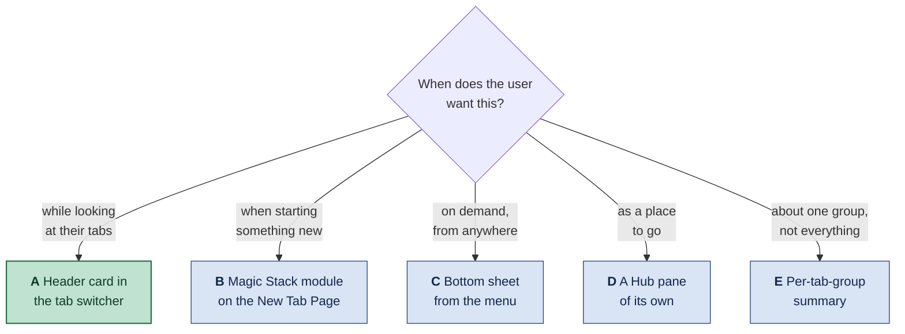
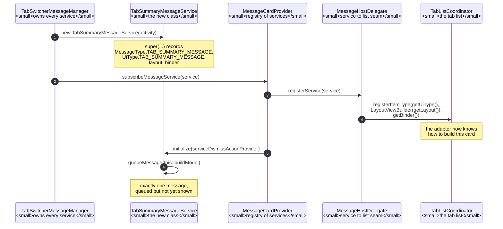
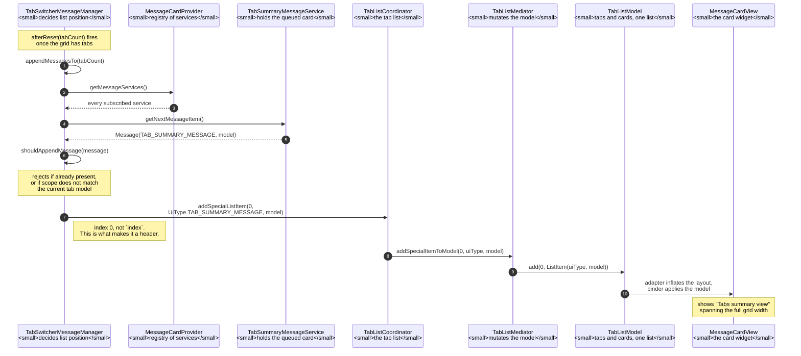
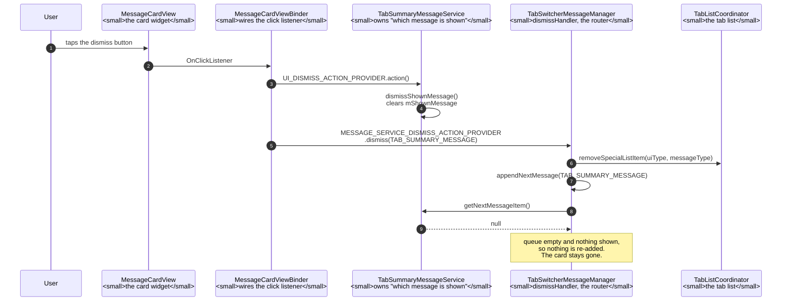
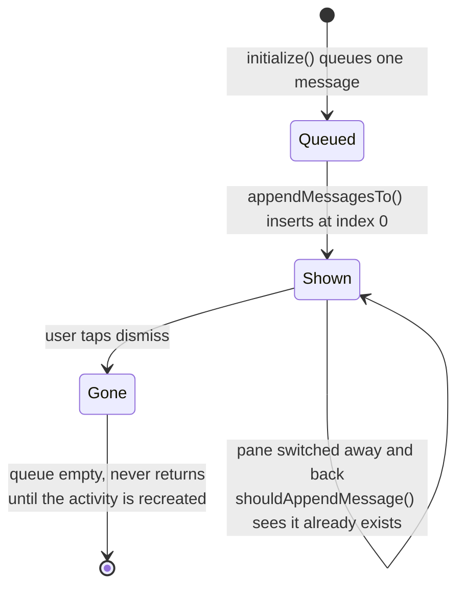

# Showing the tab summary on Android: UI alternatives

The tab summary — a few sentences describing what the user has open, generated
from the `h1`/`h2` headings of each tab — exists today only on desktop, inside
`chrome://floating-window`. This note surveys where it could live on Android and
what each choice costs.

Companion to
[`floating-window-tab-summary.md`](floating-window-tab-summary.md), which
documents the implemented desktop feature and, in its appendix, the
*architecture* alternatives that were weighed before it (browser-process
request, served into a same-origin iframe). This note is about the *surface*,
and it is a separate question because **none of the desktop answer transfers**.

> **Status.** The surfaces and classes named below were read in this checkout.
> The designs are proposals, with one exception: **option A now exists in
> skeleton form.** `TabSummaryMessageService` puts a card at the top of the
> TAB_SWITCHER pane's grid, carrying the hardcoded string "Tabs summary view".
> Nothing behind it is real -- no model call, no headings, no JNI -- and the
> card has been verified only as far as the build: it compiles, passes Error
> Prone and NullAway, and its text is present in `ChromePublic.apk`'s dex. It
> has never been seen on a screen. This machine has no `kvm` group membership
> and every Chromium AVD is x86, while `out/Release` builds arm64, so running
> it needs either a physical device or a separate x86_64 build.

---

## Why the desktop answer does not transfer

Three things, and the third is the one that changes the design rather than just
the layout.

**There is no floating window.** The desktop feature is a
`views::BubbleDialogDelegate` anchored to a toolbar button, and the whole
`chrome/browser/ui/views/floating_window/` target is gated
`assert(is_win || is_mac || is_linux || is_chromeos)`. Android Chrome's UI is
Java/Kotlin over a different toolkit; there is no anchored bubble to reuse.

**There is no room for the table.** The desktop page renders a three-column
table — index, title, URL — with a `min-width: 660px`. A phone in portrait has
roughly half that. The tab *list* cannot come along; only the summary can.

**Android already has a "what do I have open" surface, and it is not a new
window.** The Hub — the tab switcher — is exactly that screen. On desktop the
feature had to invent a surface; on Android the surface exists, and the question
is which one to attach to.

### The Hub's panes are separate views

Worth establishing before choosing between them, because it determines how much
is shared. A `Pane` supplies its own root view
([`Pane.java:28`](https://github.com/obeletski/chromium/blob/floating-window/chrome/browser/hub/android/java/src/org/chromium/chrome/browser/hub/Pane.java#L28)):

```java
ViewGroup getRootView();
```

and `HubPaneHostMediator` swaps that view into the host when the pane changes
([`HubPaneHostMediator.java:74`](https://github.com/obeletski/chromium/blob/floating-window/chrome/browser/hub/internal/android/java/src/org/chromium/chrome/browser/hub/HubPaneHostMediator.java#L74)):

```java
View view = pane.getRootView();
```

So these are genuinely separate views swapped in and out of one container, not
tabs over shared content. A card added to the tab switcher's view is **not**
inherited by the others — each would need its own integration.

There are six panes, declared in
[`PaneId.java:35`](https://github.com/obeletski/chromium/blob/floating-window/chrome/browser/hub/android/java/src/org/chromium/chrome/browser/hub/PaneId.java#L35).
Note that the enum's numbering is **not** the display order — the header says so
outright, and the order actually shown comes from
[`DefaultPaneOrderController.java:17`](https://github.com/obeletski/chromium/blob/floating-window/chrome/browser/hub/android/java/src/org/chromium/chrome/browser/hub/DefaultPaneOrderController.java#L17):
tab switcher, incognito tab switcher, tab groups, cross-device, history,
bookmarks.


> **This is a schematic, not a screenshot.** It is drawn from the pane structure
> in the source — what each pane's view contains, and the order they appear in —
> so the structure and naming are accurate. Spacing, iconography and Material
> styling are illustrative. No screenshot was used: a real capture would need an
> emulator, and third-party screenshots of Chrome's UI cannot be committed to a
> public fork.



---

## A. A header card above the tab grid — **recommended**

A card pinned above the tab thumbnails in the Hub's `TAB_SWITCHER` pane,
scrolling with the grid.

* **For:** it is the one place where the user is already asking the question the
  summary answers. No new entry point, no discovery problem, no navigation. The
  headings it summarises come from the same tabs shown underneath, so the
  summary and its evidence are on one screen.
* **Against:** it competes with the first row of thumbnails for the most
  valuable space on the screen, and the tab switcher is a latency-sensitive
  animation target — the card must never delay the grid appearing. It also
  wants a dismiss affordance, which means remembering the dismissal.
* **Fits the architecture:** the summary is text, so the browser-process
  summarizer already built (`FloatingWindowSummarizer`) is reusable as-is; only
  the delivery changes from a WebUI iframe to a JNI hop into the Java layer.

> **Built.** A skeleton of this option exists — see
> [Implementation of option A](#implementation-of-option-a) at the end of this
> note for the files, the mechanism and what is still missing.

### Phone (portrait)

```
┌─────────────────────────────────────┐
│  ╳            Tabs            ⋮     │  ← Hub top bar
│ ┌─────┬─────────┬──────┬─────────┐  │
│ │Tabs │ Groups  │ Sync │ History │  │  ← pane switcher
│ └━━━━━┴─────────┴──────┴─────────┘  │
│                                     │
│ ┌─────────────────────────────────┐ │
│ │ ✦ Summary of your 9 tabs     ╳ │ │  ← the card
│ │                                 │ │
│ │ You're reading about Rust       │ │
│ │ memory management across four   │ │
│ │ tabs, and separately planning   │ │
│ │ a sourdough bake. Two tabs are  │ │
│ │ unrelated news articles.        │ │
│ │                                 │ │
│ │ Updated just now · Hide         │ │
│ └─────────────────────────────────┘ │
│                                     │
│ ┌──────────────┐ ┌──────────────┐   │
│ │ ▓▓▓▓▓▓▓▓▓▓▓▓ │ │ ▓▓▓▓▓▓▓▓▓▓▓▓ │   │  ← tab thumbnails
│ │ ▓▓▓▓▓▓▓▓▓▓▓▓ │ │ ▓▓▓▓▓▓▓▓▓▓▓▓ │   │
│ │ Ownership… ╳ │ │ Lifetimes… ╳ │   │
│ └──────────────┘ └──────────────┘   │
│ ┌──────────────┐ ┌──────────────┐   │
│ │ ▓▓▓▓▓▓▓▓▓▓▓▓ │ │ ▓▓▓▓▓▓▓▓▓▓▓▓ │   │
│ │ Sourdough… ╳ │ │ Hydration… ╳ │   │
│ └──────────────┘ └──────────────┘   │
│                                     │
│              ⊕  New tab             │
└─────────────────────────────────────┘
```

While the model is still answering, the card holds its height and shows a
shimmer rather than collapsing — a card that appears late would push the grid
down under the user's thumb:

```
│ ┌─────────────────────────────────┐ │
│ │ ✦ Summarising your 9 tabs…      │ │
│ │ ▒▒▒▒▒▒▒▒▒▒▒▒▒▒▒▒▒▒▒▒▒▒▒▒▒▒▒▒▒   │ │
│ │ ▒▒▒▒▒▒▒▒▒▒▒▒▒▒▒▒▒▒▒▒▒▒▒         │ │
│ └─────────────────────────────────┘ │
```

### Tablet (landscape)

The grid is wider, so the card becomes a sidebar rather than a banner — it stops
consuming a whole row and sits beside the tabs it describes:

```
┌───────────────────────────────────────────────────────────────────────────┐
│  ╳                          Tabs                                    ⋮     │
│ ┌──────┬──────────┬───────┬──────────┐                                    │
│ │ Tabs │  Groups  │ Sync  │ History  │                                    │
│ └━━━━━━┴──────────┴───────┴──────────┘                                    │
│                                                                           │
│ ┌───────────────────────┐  ┌────────────┐ ┌────────────┐ ┌────────────┐   │
│ │ ✦ Summary of 9 tabs ╳ │  │ ▓▓▓▓▓▓▓▓▓▓ │ │ ▓▓▓▓▓▓▓▓▓▓ │ │ ▓▓▓▓▓▓▓▓▓▓ │   │
│ │                       │  │ ▓▓▓▓▓▓▓▓▓▓ │ │ ▓▓▓▓▓▓▓▓▓▓ │ │ ▓▓▓▓▓▓▓▓▓▓ │   │
│ │ You're reading about  │  │ Ownership…│ │ Lifetimes… │ │ Move sem…  │   │
│ │ Rust memory manage-   │  └────────────┘ └────────────┘ └────────────┘   │
│ │ ment across four      │                                                 │
│ │ tabs, and separately  │  ┌────────────┐ ┌────────────┐ ┌────────────┐   │
│ │ planning a sourdough  │  │ ▓▓▓▓▓▓▓▓▓▓ │ │ ▓▓▓▓▓▓▓▓▓▓ │ │ ▓▓▓▓▓▓▓▓▓▓ │   │
│ │ bake. Two tabs are    │  │ ▓▓▓▓▓▓▓▓▓▓ │ │ ▓▓▓▓▓▓▓▓▓▓ │ │ ▓▓▓▓▓▓▓▓▓▓ │   │
│ │ unrelated news.       │  │ Sourdough… │ │ Hydration… │ │ Feeding…   │   │
│ │                       │  └────────────┘ └────────────┘ └────────────┘   │
│ │ ─────────────────     │                                                 │
│ │ Rust · 4 tabs         │  ┌────────────┐ ┌────────────┐ ┌────────────┐   │
│ │ Baking · 3 tabs       │  │ ▓▓▓▓▓▓▓▓▓▓ │ │ ▓▓▓▓▓▓▓▓▓▓ │ │ ▓▓▓▓▓▓▓▓▓▓ │   │
│ │ News · 2 tabs         │  │ ▓▓▓▓▓▓▓▓▓▓ │ │ ▓▓▓▓▓▓▓▓▓▓ │ │ ▓▓▓▓▓▓▓▓▓▓ │   │
│ │                       │  │ Election…  │ │ Weather…   │ │ Sports…    │   │
│ │ Updated just now      │  └────────────┘ └────────────┘ └────────────┘   │
│ └───────────────────────┘                                                 │
│                                                                  ⊕ New tab│
└───────────────────────────────────────────────────────────────────────────┘
```

The tablet layout affords something the phone cannot: a **theme breakdown**
under the prose. That is a second thing to ask the model for — named groups with
counts — and it should be a separate field in the response rather than parsed
back out of the sentence.

---

## B. A Magic Stack module on the New Tab Page

The Magic Stack is the horizontally scrollable row of suggestion cards on the
NTP, and it is a documented extension point:
[`chrome/browser/magic_stack/README.md`](https://github.com/obeletski/chromium/blob/floating-window/chrome/browser/magic_stack/README.md)
explains how to add one. `HomeModulesCoordinator` owns the RecyclerView, a
`ModuleProvider` implements the module, and the Segmentation Service ranks it
against the others.

* **For:** the infrastructure exists and is designed to be extended. Ranking is
  handled for you, so a summary nobody engages with naturally sinks. It reaches
  the user when they are about to start something, which is when "what was I
  doing?" is the live question.
* **Against:** the wrong place for it. The NTP is where you go to *leave* your
  current context; the summary is about the context you already have. It also
  competes with modules built on much stronger signals, and the README's own
  taxonomy — **stable** versus **ephemeral** — does not obviously fit something
  that changes every time a tab opens.

```
┌─────────────────────────────────────┐
│          🔍  Search or type URL     │
│                                     │
│   ●  ●  ●  ●     shortcuts          │
│                                     │
│  ┌───────────────┐ ┌──────────────  │  ← Magic Stack, scrolls sideways
│  │ ✦ Your tabs   │ │ Continue     ▸ │
│  │               │ │ reading        │
│  │ Rust memory   │ │                │
│  │ management +  │ │ ▓▓▓▓▓▓▓▓▓▓▓▓   │
│  │ a sourdough   │ │                │
│  │ plan · 9 tabs │ │ The Rust Book  │
│  │               │ │                │
│  │  See tabs  ▸  │ │                │
│  └───────────────┘ └──────────────  │
└─────────────────────────────────────┘
```

---

## C. A bottom sheet from the app menu

The closest structural analogue to the desktop floating window: a transient
surface over the current page, invoked deliberately.
`BottomSheetController` / `BottomSheetContent`
([`components/browser_ui/bottomsheet`](https://github.com/obeletski/chromium/blob/floating-window/components/browser_ui/bottomsheet/android/java/src/org/chromium/components/browser_ui/bottomsheet/BottomSheetContent.java))
gives peek / half / full states for free.

* **For:** it is the Android idiom for "show me something without taking me
  away", and it is the only option here that keeps the current page visible
  behind it. Deliberate invocation also means the model call only happens when
  asked for — the best cost profile of any option.
* **Against:** it is behind a menu item, so nobody will find it. The desktop
  feature at least had a toolbar button; a fourteenth entry in the Android app
  menu is effectively invisible.

```
┌─────────────────────────────────────┐
│ ← →  ⌂   rust-lang.org          ⋮   │
│─────────────────────────────────────│
│                                     │
│   The Rust Programming Language     │  ← page stays visible
│   ▓▓▓▓▓▓▓▓▓▓▓▓▓▓▓▓▓▓▓▓▓▓▓▓▓▓▓▓▓▓    │
│   ▓▓▓▓▓▓▓▓▓▓▓▓▓▓▓▓▓▓▓▓▓▓            │
│                                     │
│ ┌─────────────────────────────────┐ │
│ │              ▁▁▁▁               │ │  ← drag handle
│ │   ✦  Summary of your 9 tabs     │ │
│ │                                 │ │
│ │   You're reading about Rust     │ │
│ │   memory management across      │ │
│ │   four tabs, and separately     │ │
│ │   planning a sourdough bake.    │ │
│ │                                 │ │
│ │   Rust · 4     Baking · 3       │ │
│ │   News · 2                      │ │
│ │                                 │ │
│ │        [ Open tab switcher ]    │ │
│ └─────────────────────────────────┘ │
└─────────────────────────────────────┘
```

---

## D. A Hub pane of its own

A seventh `PaneId`, beside Tab switcher and Tab groups.

* **For:** maximally discoverable, and it is the natural home if the summary
  ever grows past a paragraph — themes, suggested groupings, "close these 4".
* **Against:** wildly disproportionate today. A whole pane whose content is
  three sentences will read as an empty screen, and every pane costs a slot in
  a switcher that already has six. Revisit only if the feature grows.

---

## E. Per-tab-group summaries

Summarise a *group* rather than the profile: a line under each group's name in
the `TAB_GROUPS` pane.

* **For:** the most useful framing of the three-sentence budget. A group is
  already a coherent set, so a summary of it is specific in a way that "here is
  everything you have open" cannot be — and it scales, because each summary
  covers 5 tabs rather than 50. It is also naturally incremental: summarise on
  group creation, refresh when membership changes.
* **Against:** it is a different feature from the one that exists. It also
  multiplies cost by the number of groups, and needs per-group caching to be
  affordable at all.

```
┌─────────────────────────────────────┐
│  ╳           Tab groups        ⋮    │
│                                     │
│ ┌─────────────────────────────────┐ │
│ │ ● Rust                  4 tabs  │ │
│ │   ✦ Ownership, borrowing and    │ │
│ │     lifetimes — the memory      │ │
│ │     model chapters.             │ │
│ │   ▓▓▓ ▓▓▓ ▓▓▓ ▓▓▓               │ │
│ └─────────────────────────────────┘ │
│ ┌─────────────────────────────────┐ │
│ │ ● Baking                3 tabs  │ │
│ │   ✦ Sourdough starter care and  │ │
│ │     hydration ratios.           │ │
│ │   ▓▓▓ ▓▓▓ ▓▓▓                   │ │
│ └─────────────────────────────────┘ │
└─────────────────────────────────────┘
```

---

## Discarded

* **A message banner** (`components/messages`). Messages are for *actionable,
  transient* notices — "Undo", "Sign in". A paragraph of prose in a banner is a
  misuse of the component, and it would be dismissed before it is read.
* **In the omnibox / toolbar.** No room, and it would push the summary in front
  of users who did not ask for it on every single page load.
* **A notification.** The summary is not an event, and nothing has happened.

---

## What changes on Android regardless of surface

Four constraints that apply to every option above, and that the desktop design
did not have to face.

**The model call is more expensive.** Mobile data and battery mean "on every tab
switcher open" is not acceptable, where "on every toolbar press" was tolerable on
desktop. The prompt-hash cache proposed as B6 in the architecture note stops
being a refinement and becomes a requirement — and the cache key falls out of the
tab set, so it invalidates itself correctly.

**Incognito is a hard boundary, and Android makes it visible.** The Hub has a
separate `INCOGNITO_TAB_SWITCHER` pane, so the rule already implemented in the
browser — never summarise an off-the-record profile — maps onto a surface the
user can see. The Incognito pane should show nothing, not an error.

**The tab count is much larger.** Desktop tab strips are self-limiting because
tabs get too narrow to read; Android grids are not, and hundreds of tabs is
ordinary. The 40-tab cap in the summarizer is doing more work here, and "9 tabs"
in the mockups is optimistic.

**Low-end devices are the majority.** Whatever the surface, it must render its
final layout before the summary arrives and fill text in afterwards — never
reflow the grid under the user's thumb.

---

## Recommendation

**A, the header card in the tab switcher**, with **B6 caching** from the
architecture note as a precondition rather than a follow-up.

The reasoning is that A is the only option where the summary appears in the
place the user is already asking the question, and where the evidence for it —
the tabs themselves — is on the same screen. Every other option either makes the
user go somewhere (C, D), puts the answer where the question is not being asked
(B), or changes what the feature is (E).

E is the strongest *second* idea, and worth revisiting on its own merits: a
summary of a coherent group is a better use of three sentences than a summary of
everything. If A ships and engagement is poor, E is the more likely fix than
moving A somewhere else.

---

## Implementation of option A

What was actually built, in skeleton form: a card at the top of the
`TAB_SWITCHER` pane's grid showing the hardcoded string `"Tabs summary view"`.
No model call, no headings, no JNI. This section is the file-by-file account and
the mechanism it plugs into.

### Files touched

| File | Change |
|---|---|
| [`TabSummaryMessageService.java`](https://github.com/obeletski/chromium/blob/floating-window/chrome/android/features/tab_ui/java/src/org/chromium/chrome/browser/tasks/tab_management/TabSummaryMessageService.java) | **New, 147 lines.** The service that produces the card. |
| [`TabProperties.java`](https://github.com/obeletski/chromium/blob/floating-window/chrome/android/features/tab_ui/java/src/org/chromium/chrome/browser/tasks/tab_management/TabProperties.java) | `UiType.TAB_SUMMARY_MESSAGE = 11`, plus the `@IntDef` entry. |
| [`TabSwitcherMessageManager.java`](https://github.com/obeletski/chromium/blob/floating-window/chrome/android/features/tab_ui/java/src/org/chromium/chrome/browser/tasks/tab_management/TabSwitcherMessageManager.java) | `MessageType.TAB_SUMMARY_MESSAGE = 8` (`ALL` moves to 9); subscribes the service; inserts the card at index 0 in both append paths. |
| [`UiTypeHelper.java`](https://github.com/obeletski/chromium/blob/floating-window/chrome/android/features/tab_ui/java/src/org/chromium/chrome/browser/tasks/tab_management/UiTypeHelper.java) | `isValidUiType()` accepts the new type; `messageTypeToUiType()` maps it. |
| [`tab_management_java_sources.gni`](https://github.com/obeletski/chromium/blob/floating-window/chrome/android/features/tab_ui/tab_management_java_sources.gni) | The new source, in `internal_tab_management_java_sources`. |
| `tab-summary-android-ui-alternatives.md` | This section, and the status note at the top. |

Six files, +181/-17. No new layout, no new view, no new string resource, no
`BUILD.gn` edit — the `.gni` list is the only build change.

### The participants

Everything below is Java, in the browser process, on the Android UI thread. The
diagrams that follow name only these.

**Objects this change adds**

* **`TabSummaryMessageService`** — the new class. A `MessageService` subclass
  that queues exactly one card and builds its `PropertyModel`. Owns the
  placeholder string.

**Objects it plugs into** (all pre-existing, all in
`chrome/android/features/tab_ui/.../tab_management/`)

* **`MessageService<MessageT, UiT>`**
  ([`MessageService.java:35`](https://github.com/obeletski/chromium/blob/floating-window/chrome/android/features/tab_ui/java/src/org/chromium/chrome/browser/tasks/tab_management/MessageService.java#L35)) — base class for
  anything that can put a card in the tab list. Holds a queue of pending
  messages plus the one currently shown, and carries the four facts the rest of
  the system needs: message type, UI type, layout resource, view binder.
* **`MessageCardProvider`**
  ([`MessageCardProvider.java:25`](https://github.com/obeletski/chromium/blob/floating-window/chrome/android/features/tab_ui/java/src/org/chromium/chrome/browser/tasks/tab_management/MessageCardProvider.java#L25)) — the
  registry of services, keyed by message type. `subscribeMessageService()` is
  the entry point: it registers the service's view type and calls
  `initialize()` on it.
* **`MessageHostDelegate`** / **`MessageHostDelegateFactory`**
  ([`MessageHostDelegateFactory.java:16`](https://github.com/obeletski/chromium/blob/floating-window/chrome/android/features/tab_ui/java/src/org/chromium/chrome/browser/tasks/tab_management/MessageHostDelegateFactory.java#L16))
  — the seam between a service and a particular list. `registerService()` reads
  `getUiType()`, `getLayout()` and `getBinder()` off the service and hands them
  to the coordinator. This is why adding a card needs no registration code.
* **`TabSwitcherMessageManager`**
  ([`TabSwitcherMessageManager.java:70`](https://github.com/obeletski/chromium/blob/floating-window/chrome/android/features/tab_ui/java/src/org/chromium/chrome/browser/tasks/tab_management/TabSwitcherMessageManager.java#L70))
  — owns the provider, constructs every service, and decides *where* each card
  goes in the list. Also the dismiss router: its `dismissHandler()` is what the
  cards' dismiss buttons ultimately call.
* **`TabListCoordinator`**
  ([`TabListCoordinator.java`](https://github.com/obeletski/chromium/blob/floating-window/chrome/android/features/tab_ui/java/src/org/chromium/chrome/browser/tasks/tab_management/TabListCoordinator.java)) — the public face
  of the tab list. `registerItemType()` teaches its adapter a view type;
  `addSpecialListItem()` inserts a non-tab item.
* **`TabListMediator`**
  ([`TabListMediator.java:2870`](https://github.com/obeletski/chromium/blob/floating-window/chrome/android/features/tab_ui/java/src/org/chromium/chrome/browser/tasks/tab_management/TabListMediator.java#L2870)) — does the
  actual model mutation. `addSpecialItemToModel()` is three lines: bounds-check
  the index, then `mModelList.add(index, new ListItem(uiType, model))`.
* **`TabListModel`** — the `ModelList` backing the grid. Tabs and cards are
  entries in the *same* list, which is the whole reason this approach works.
* **`MessageCardView`** ([`MessageCardView.java`](https://github.com/obeletski/chromium/blob/floating-window/chrome/android/features/tab_ui/java/src/org/chromium/chrome/browser/tasks/tab_management/MessageCardView.java)) —
  the card widget: description text, optional icon, action button, dismiss
  button. Reused unchanged.
* **`MessageCardViewBinder`**
  ([`MessageCardViewBinder.java:19`](https://github.com/obeletski/chromium/blob/floating-window/chrome/android/features/tab_ui/java/src/org/chromium/chrome/browser/tasks/tab_management/MessageCardViewBinder.java#L19)) —
  binds `PropertyModel` keys onto that view. Reused unchanged, and the source of
  one trap (below).
* **`MessageCardViewProperties`** — the property keys. `ALL_KEYS` is what the
  model is built with.
* **`PropertyModel`** — the per-card state object handed to the binder.
* **`UiTypeHelper`** ([`UiTypeHelper.java`](https://github.com/obeletski/chromium/blob/floating-window/chrome/android/features/tab_ui/java/src/org/chromium/chrome/browser/tasks/tab_management/UiTypeHelper.java)) — maps
  message type to UI type and answers "is this a message card?".
* **`RecyclerView` + `MVCListAdapter`** — the grid itself. The adapter inflates
  a registered layout and runs the registered binder for each item.

### How the card gets registered

Registration happens once, after native initialization. Nothing in it is
specific to this card — subscribing is the whole of it.



Queueing happens in `initialize()` rather than the constructor because
`queueMessage()` asserts the dismiss provider is already set — the base class
needs somewhere to route a dismissal before a message may exist.

### How it reaches the screen

The card is appended when the tab list is populated, not when the pane is built.



Two details in that flow are worth stating outright:

* **Index 0 is the entire "header" behaviour.** `ARCHIVED_TABS_MESSAGE` is the
  only other card that does this; every other type lands at
  `getTabListModelSize()` or a computed index, which puts it after or among the
  tabs. Both of the manager's append paths — `appendNextMessage()` for a single
  type and `appendMessagesTo()` for all of them — needed the same case.
* **Full width comes for free.** `TabListMediator.getSpanCountForItem()` returns
  the grid's whole span count for anything `UiTypeHelper.isMessageCard()`
  accepts, so the card is never laid out as a grid cell beside a thumbnail.

### Dismissal, and the trap that made the button a no-op

The dismiss button runs **two** providers in sequence, and the difference
between them is where the first version of this card went wrong.



**The trap.** `dismissHandler()`
([`TabSwitcherMessageManager.java:646`](https://github.com/obeletski/chromium/blob/floating-window/chrome/android/features/tab_ui/java/src/org/chromium/chrome/browser/tasks/tab_management/TabSwitcherMessageManager.java#L646))
removes the item and then calls `appendNextMessage()` for every type *except*
`PRICE_MESSAGE`, `INCOGNITO_REAUTH_PROMO_MESSAGE` and `ARCHIVED_TABS_MESSAGE`.
`TAB_SUMMARY_MESSAGE` is not on that list. Meanwhile `MessageService` keeps the
shown message in `mShownMessage` and `getNextMessageItem()` hands the *same*
message back while that field is set — `dismissHandler()` never clears it.

So with no `UI_DISMISS_ACTION_PROVIDER`, as this card was first written, one tap
removed the card and immediately re-added it. The button would have looked
broken with nothing in the logs. The fix is `onDismissed()` calling
`dismissShownMessage()`, which clears the field before the router runs;
`IphMessageService#dismiss()` does the same thing for the same reason. The
defect was found by writing this section, not by running the code — it has never
been run.

A second trap in the same area: the binder attaches the dismiss listener
**inside** the branch handling `DISMISS_BUTTON_CONTENT_DESCRIPTION`
([`MessageCardViewBinder.java:31`](https://github.com/obeletski/chromium/blob/floating-window/chrome/android/features/tab_ui/java/src/org/chromium/chrome/browser/tasks/tab_management/MessageCardViewBinder.java#L31)). Omit
that property and the button renders but does nothing — inert, not merely
unlabelled.

### The card's state over a session



Note what is *not* modelled: there is no loading state, no refresh, and no
reaction to tabs opening or closing. The card is static text. The design in
option A above wants a shimmer while the model answers and an "Updated just now"
footer; neither exists.

### Why a MessageService and not a view in the pane's layout

This is the decision the whole implementation turns on. The tab switcher is a
`RecyclerView`. A card added to the pane's layout *around* that view would:

* not scroll with the grid, so it would either eat permanent vertical space or
  need scroll plumbing of its own;
* not survive the pane being swapped — `Pane.getRootView()` hands the Hub a
  `ViewGroup` and `HubPaneHostMediator` swaps whole views when the user changes
  pane, so per-pane view surgery has to be redone on every switch;
* push the grid down when it appeared, which is the one behaviour the design
  explicitly forbids ("never reflow the grid under the user's thumb").

As a list item, all three problems are somebody else's already-solved code.

### Choices worth knowing

* **`UiType.TAB_SUMMARY_MESSAGE = 11`, not a value next to the other message
  cards.** `UiTypeHelper.isMessageCard()` classifies with
  `type >= UiType.PRICE_MESSAGE` rather than by listing members, so any new
  message card has to sort above every non-message type. `PINNED_TAB` already
  holds 10, so 11 is the first value that satisfies that without renumbering it.
* **`MessageCardScope.REGULAR`, not `BOTH`.** The summary is built from page
  headings sent to a remote endpoint, so it must not appear over Incognito tabs
  — the rule the desktop side enforces with
  `CHECK(!profile->IsOffTheRecord())`. The Hub gives Incognito its own pane, so
  this is a visible boundary rather than a filter over a mixed list.
* **The existing layout and binder are reused.** For one line of text,
  `tab_grid_message_card_item` already supplies the dismiss button, the
  incognito palette and the grid's card metrics. A bespoke view earns its place
  when the card grows the shimmer and the footer.
* **No feature flag.** The card appears in every build of this checkout. Gating
  it means `ChromeFeatureList.java` plus the C++ registration, and is the first
  thing to add if this goes any further.

### What is verified, and what is not

Verified: compiles into `chrome_java`; passes Error Prone and NullAway (the new
file is `@NullMarked`); the string `"Tabs summary view"` is present in
`ChromePublic.apk`'s `classes.dex` and `classes2.dex`.

**Not verified: anything visual.** The card has never been rendered. This
machine is not in the `kvm` group and `sudo` needs a password, every Chromium
AVD proto is x86 while `out/Release` builds `arm64`, and no device is attached.
Running it needs a physical device or a separate x86_64 build.

Also unexercised, and worth knowing before trusting any of the above: the
dismiss path, the Incognito scope check, and the behaviour when all tabs are
closed — `onAllTabsClosed()`
([`TabSwitcherMessageManager.java:586`](https://github.com/obeletski/chromium/blob/floating-window/chrome/android/features/tab_ui/java/src/org/chromium/chrome/browser/tasks/tab_management/TabSwitcherMessageManager.java#L586))
removes the IPH, price and Incognito-reauth cards explicitly and does **not**
mention this one, so an empty grid may keep a summary card describing nothing.
