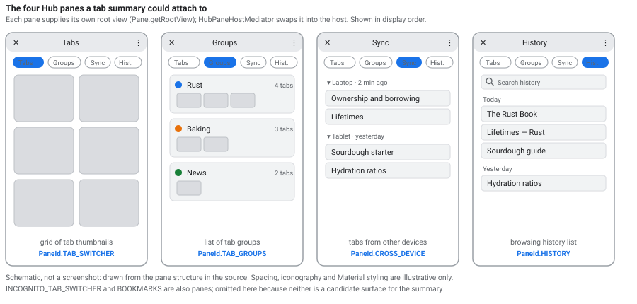
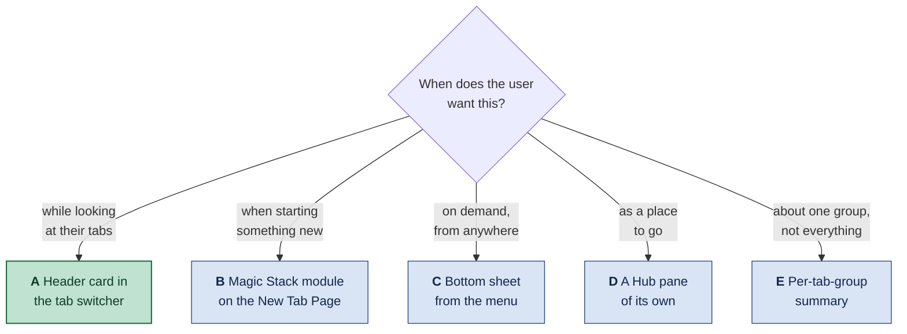
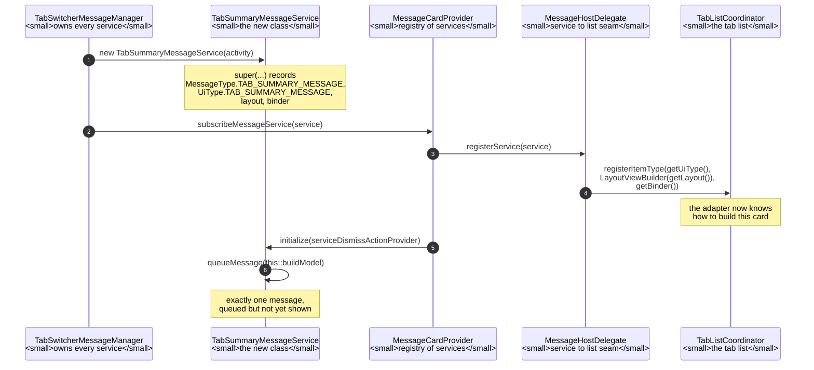
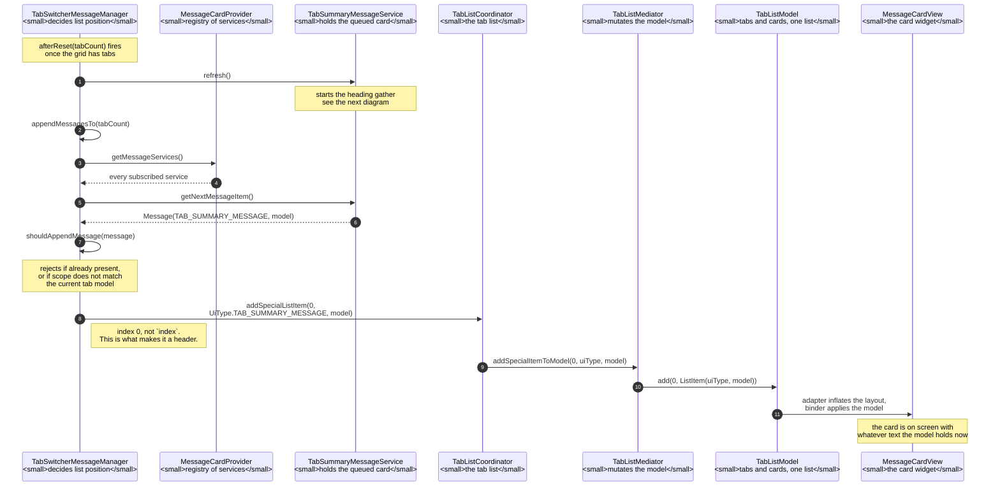
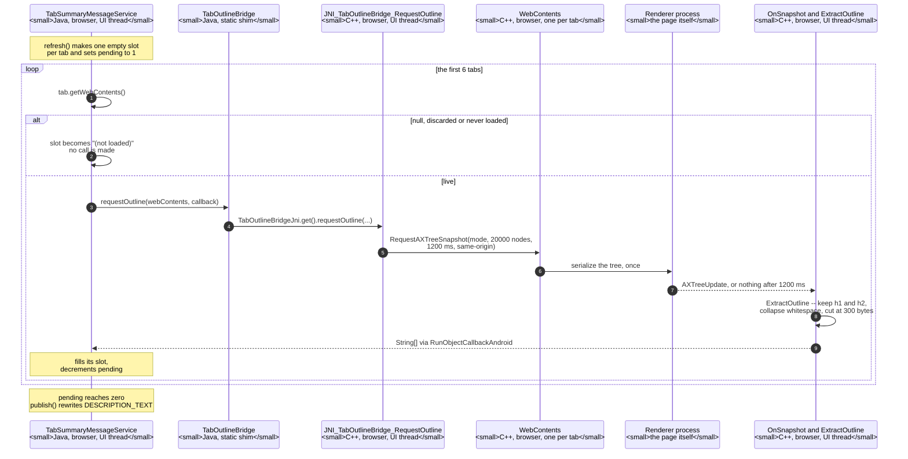
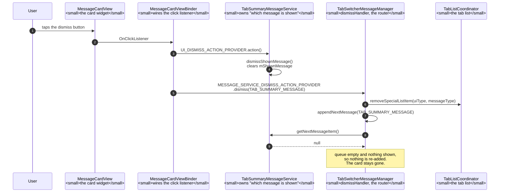
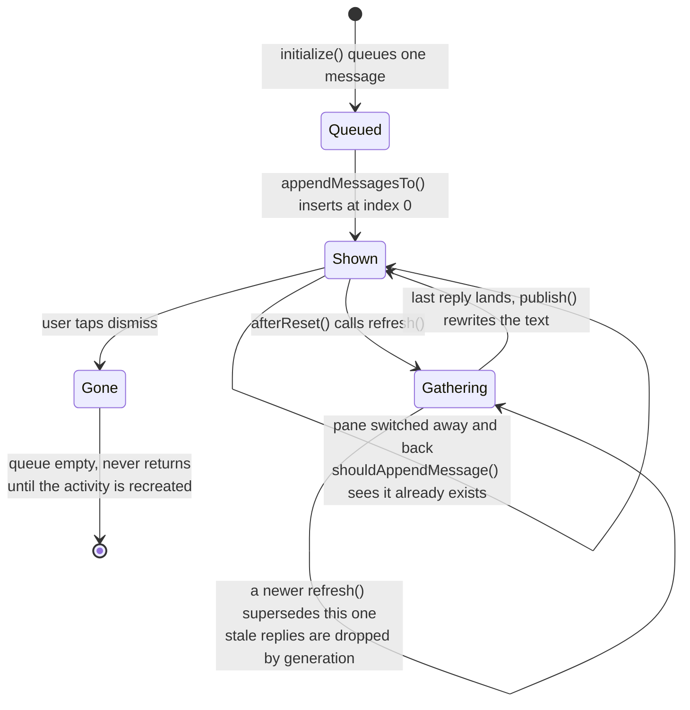

# Showing the tab summary on Android: UI alternatives

The tab summary — a few sentences describing what the user has open, generated
from the `h1`/`h2` headings of each tab — exists today only on desktop, inside
`chrome://floating-window`. This note surveys where it could live on Android and
what each choice costs.

Companion to
[`floating-window-tab-summary.md`](floating-window-tab-summary.md), which
documents the implemented desktop feature and, in its appendix, the
*architecture* alternatives that were weighed before it (browser-process
request, served into a same-origin iframe). This note is about the *surface*,
and it is a separate question because **none of the desktop answer transfers**.

> **Status.** The surfaces and classes named below were read in this checkout.
> The designs are proposals, with one exception: **option A exists, in two
> rounds.** Round one put a card at the top of the TAB_SWITCHER pane's grid
> listing the open tabs one line each; it renders above the thumbnails, reads
> live tab state and dismisses, all confirmed on an arm64 device on 2026-09-11.
> Round two replaced the contents of those lines with each tab's real `h1`/`h2`
> headings, pulled from an accessibility-tree snapshot in C++ and handed back
> over JNI -- the same extraction the desktop feature feeds to the model. Round
> two **compiles but has not been run**; what is still missing before a real
> summary is the model call, not its input. See
> [Implementation of option A](#implementation-of-option-a).

---

## Why the desktop answer does not transfer

Three things, and the third is the one that changes the design rather than just
the layout.

**There is no floating window.** The desktop feature is a
`views::BubbleDialogDelegate` anchored to a toolbar button, and the whole
`chrome/browser/ui/views/floating_window/` target is gated
`assert(is_win || is_mac || is_linux || is_chromeos)`. Android Chrome's UI is
Java/Kotlin over a different toolkit; there is no anchored bubble to reuse.

**There is no room for the table.** The desktop page renders a three-column
table — index, title, URL — with a `min-width: 660px`. A phone in portrait has
roughly half that. The tab *list* cannot come along; only the summary can.

**Android already has a "what do I have open" surface, and it is not a new
window.** The Hub — the tab switcher — is exactly that screen. On desktop the
feature had to invent a surface; on Android the surface exists, and the question
is which one to attach to.

### The Hub's panes are separate views

Worth establishing before choosing between them, because it determines how much
is shared. A `Pane` supplies its own root view
([`Pane.java:28`](https://github.com/obeletski/chromium/blob/floating-window/chrome/browser/hub/android/java/src/org/chromium/chrome/browser/hub/Pane.java#L28)):

```java
ViewGroup getRootView();
```

and `HubPaneHostMediator` swaps that view into the host when the pane changes
([`HubPaneHostMediator.java:74`](https://github.com/obeletski/chromium/blob/floating-window/chrome/browser/hub/internal/android/java/src/org/chromium/chrome/browser/hub/HubPaneHostMediator.java#L74)):

```java
View view = pane.getRootView();
```

So these are genuinely separate views swapped in and out of one container, not
tabs over shared content. A card added to the tab switcher's view is **not**
inherited by the others — each would need its own integration.

There are six panes, declared in
[`PaneId.java:35`](https://github.com/obeletski/chromium/blob/floating-window/chrome/browser/hub/android/java/src/org/chromium/chrome/browser/hub/PaneId.java#L35).
Note that the enum's numbering is **not** the display order — the header says so
outright, and the order actually shown comes from
[`DefaultPaneOrderController.java:17`](https://github.com/obeletski/chromium/blob/floating-window/chrome/browser/hub/android/java/src/org/chromium/chrome/browser/hub/DefaultPaneOrderController.java#L17):
tab switcher, incognito tab switcher, tab groups, cross-device, history,
bookmarks.



> **This is a schematic, not a screenshot.** It is drawn from the pane structure
> in the source — what each pane's view contains, and the order they appear in —
> so the structure and naming are accurate. Spacing, iconography and Material
> styling are illustrative. No screenshot was used: a real capture would need an
> emulator, and third-party screenshots of Chrome's UI cannot be committed to a
> public fork.



---

## A. A header card above the tab grid — **recommended**

A card pinned above the tab thumbnails in the Hub's `TAB_SWITCHER` pane,
scrolling with the grid.

* **For:** it is the one place where the user is already asking the question the
  summary answers. No new entry point, no discovery problem, no navigation. The
  headings it summarises come from the same tabs shown underneath, so the
  summary and its evidence are on one screen.
* **Against:** it competes with the first row of thumbnails for the most
  valuable space on the screen, and the tab switcher is a latency-sensitive
  animation target — the card must never delay the grid appearing. It also
  wants a dismiss affordance, which means remembering the dismissal.
* **Fits the architecture:** the summary is text, so the browser-process
  summarizer already built (`FloatingWindowSummarizer`) is reusable as-is; only
  the delivery changes from a WebUI iframe to a JNI hop into the Java layer.
  Half of that hop now exists: `TabOutlineBridge` carries page headings *out* of
  C++ into the card, so the remaining work is the model call in between, not the
  boundary crossing.

> **Built.** This option exists — see
> [Implementation of option A](#implementation-of-option-a) at the end of this
> note for the ten files, a snippet from each, the mechanism and what is still
> missing.

### Phone (portrait)

```
┌─────────────────────────────────────┐
│  ╳            Tabs            ⋮     │  ← Hub top bar
│ ┌─────┬─────────┬──────┬─────────┐  │
│ │Tabs │ Groups  │ Sync │ History │  │  ← pane switcher
│ └━━━━━┴─────────┴──────┴─────────┘  │
│                                     │
│ ┌─────────────────────────────────┐ │
│ │ ✦ Summary of your 9 tabs     ╳ │ │  ← the card
│ │                                 │ │
│ │ You're reading about Rust       │ │
│ │ memory management across four   │ │
│ │ tabs, and separately planning   │ │
│ │ a sourdough bake. Two tabs are  │ │
│ │ unrelated news articles.        │ │
│ │                                 │ │
│ │ Updated just now · Hide         │ │
│ └─────────────────────────────────┘ │
│                                     │
│ ┌──────────────┐ ┌──────────────┐   │
│ │ ▓▓▓▓▓▓▓▓▓▓▓▓ │ │ ▓▓▓▓▓▓▓▓▓▓▓▓ │   │  ← tab thumbnails
│ │ ▓▓▓▓▓▓▓▓▓▓▓▓ │ │ ▓▓▓▓▓▓▓▓▓▓▓▓ │   │
│ │ Ownership… ╳ │ │ Lifetimes… ╳ │   │
│ └──────────────┘ └──────────────┘   │
│ ┌──────────────┐ ┌──────────────┐   │
│ │ ▓▓▓▓▓▓▓▓▓▓▓▓ │ │ ▓▓▓▓▓▓▓▓▓▓▓▓ │   │
│ │ Sourdough… ╳ │ │ Hydration… ╳ │   │
│ └──────────────┘ └──────────────┘   │
│                                     │
│              ⊕  New tab             │
└─────────────────────────────────────┘
```

While the model is still answering, the card holds its height and shows a
shimmer rather than collapsing — a card that appears late would push the grid
down under the user's thumb:

```
│ ┌─────────────────────────────────┐ │
│ │ ✦ Summarising your 9 tabs…      │ │
│ │ ▒▒▒▒▒▒▒▒▒▒▒▒▒▒▒▒▒▒▒▒▒▒▒▒▒▒▒▒▒   │ │
│ │ ▒▒▒▒▒▒▒▒▒▒▒▒▒▒▒▒▒▒▒▒▒▒▒         │ │
│ └─────────────────────────────────┘ │
```

### Tablet (landscape)

The grid is wider, so the card becomes a sidebar rather than a banner — it stops
consuming a whole row and sits beside the tabs it describes:

```
┌───────────────────────────────────────────────────────────────────────────┐
│  ╳                          Tabs                                    ⋮     │
│ ┌──────┬──────────┬───────┬──────────┐                                    │
│ │ Tabs │  Groups  │ Sync  │ History  │                                    │
│ └━━━━━━┴──────────┴───────┴──────────┘                                    │
│                                                                           │
│ ┌───────────────────────┐  ┌────────────┐ ┌────────────┐ ┌────────────┐   │
│ │ ✦ Summary of 9 tabs ╳ │  │ ▓▓▓▓▓▓▓▓▓▓ │ │ ▓▓▓▓▓▓▓▓▓▓ │ │ ▓▓▓▓▓▓▓▓▓▓ │   │
│ │                       │  │ ▓▓▓▓▓▓▓▓▓▓ │ │ ▓▓▓▓▓▓▓▓▓▓ │ │ ▓▓▓▓▓▓▓▓▓▓ │   │
│ │ You're reading about  │  │ Ownership…│ │ Lifetimes… │ │ Move sem…  │   │
│ │ Rust memory manage-   │  └────────────┘ └────────────┘ └────────────┘   │
│ │ ment across four      │                                                 │
│ │ tabs, and separately  │  ┌────────────┐ ┌────────────┐ ┌────────────┐   │
│ │ planning a sourdough  │  │ ▓▓▓▓▓▓▓▓▓▓ │ │ ▓▓▓▓▓▓▓▓▓▓ │ │ ▓▓▓▓▓▓▓▓▓▓ │   │
│ │ bake. Two tabs are    │  │ ▓▓▓▓▓▓▓▓▓▓ │ │ ▓▓▓▓▓▓▓▓▓▓ │ │ ▓▓▓▓▓▓▓▓▓▓ │   │
│ │ unrelated news.       │  │ Sourdough… │ │ Hydration… │ │ Feeding…   │   │
│ │                       │  └────────────┘ └────────────┘ └────────────┘   │
│ │ ─────────────────     │                                                 │
│ │ Rust · 4 tabs         │  ┌────────────┐ ┌────────────┐ ┌────────────┐   │
│ │ Baking · 3 tabs       │  │ ▓▓▓▓▓▓▓▓▓▓ │ │ ▓▓▓▓▓▓▓▓▓▓ │ │ ▓▓▓▓▓▓▓▓▓▓ │   │
│ │ News · 2 tabs         │  │ ▓▓▓▓▓▓▓▓▓▓ │ │ ▓▓▓▓▓▓▓▓▓▓ │ │ ▓▓▓▓▓▓▓▓▓▓ │   │
│ │                       │  │ Election…  │ │ Weather…   │ │ Sports…    │   │
│ │ Updated just now      │  └────────────┘ └────────────┘ └────────────┘   │
│ └───────────────────────┘                                                 │
│                                                                  ⊕ New tab│
└───────────────────────────────────────────────────────────────────────────┘
```

The tablet layout affords something the phone cannot: a **theme breakdown**
under the prose. That is a second thing to ask the model for — named groups with
counts — and it should be a separate field in the response rather than parsed
back out of the sentence.

---

## B. A Magic Stack module on the New Tab Page

The Magic Stack is the horizontally scrollable row of suggestion cards on the
NTP, and it is a documented extension point:
[`chrome/browser/magic_stack/README.md`](https://github.com/obeletski/chromium/blob/floating-window/chrome/browser/magic_stack/README.md)
explains how to add one. `HomeModulesCoordinator` owns the RecyclerView, a
`ModuleProvider` implements the module, and the Segmentation Service ranks it
against the others.

* **For:** the infrastructure exists and is designed to be extended. Ranking is
  handled for you, so a summary nobody engages with naturally sinks. It reaches
  the user when they are about to start something, which is when "what was I
  doing?" is the live question.
* **Against:** the wrong place for it. The NTP is where you go to *leave* your
  current context; the summary is about the context you already have. It also
  competes with modules built on much stronger signals, and the README's own
  taxonomy — **stable** versus **ephemeral** — does not obviously fit something
  that changes every time a tab opens.

```
┌─────────────────────────────────────┐
│          🔍  Search or type URL     │
│                                     │
│   ●  ●  ●  ●     shortcuts          │
│                                     │
│  ┌───────────────┐ ┌──────────────  │  ← Magic Stack, scrolls sideways
│  │ ✦ Your tabs   │ │ Continue     ▸ │
│  │               │ │ reading        │
│  │ Rust memory   │ │                │
│  │ management +  │ │ ▓▓▓▓▓▓▓▓▓▓▓▓   │
│  │ a sourdough   │ │                │
│  │ plan · 9 tabs │ │ The Rust Book  │
│  │               │ │                │
│  │  See tabs  ▸  │ │                │
│  └───────────────┘ └──────────────  │
└─────────────────────────────────────┘
```

---

## C. A bottom sheet from the app menu

The closest structural analogue to the desktop floating window: a transient
surface over the current page, invoked deliberately.
`BottomSheetController` / `BottomSheetContent`
([`components/browser_ui/bottomsheet`](https://github.com/obeletski/chromium/blob/floating-window/components/browser_ui/bottomsheet/android/java/src/org/chromium/components/browser_ui/bottomsheet/BottomSheetContent.java))
gives peek / half / full states for free.

* **For:** it is the Android idiom for "show me something without taking me
  away", and it is the only option here that keeps the current page visible
  behind it. Deliberate invocation also means the model call only happens when
  asked for — the best cost profile of any option.
* **Against:** it is behind a menu item, so nobody will find it. The desktop
  feature at least had a toolbar button; a fourteenth entry in the Android app
  menu is effectively invisible.

```
┌─────────────────────────────────────┐
│ ← →  ⌂   rust-lang.org          ⋮   │
│─────────────────────────────────────│
│                                     │
│   The Rust Programming Language     │  ← page stays visible
│   ▓▓▓▓▓▓▓▓▓▓▓▓▓▓▓▓▓▓▓▓▓▓▓▓▓▓▓▓▓▓    │
│   ▓▓▓▓▓▓▓▓▓▓▓▓▓▓▓▓▓▓▓▓▓▓            │
│                                     │
│ ┌─────────────────────────────────┐ │
│ │              ▁▁▁▁               │ │  ← drag handle
│ │   ✦  Summary of your 9 tabs     │ │
│ │                                 │ │
│ │   You're reading about Rust     │ │
│ │   memory management across      │ │
│ │   four tabs, and separately     │ │
│ │   planning a sourdough bake.    │ │
│ │                                 │ │
│ │   Rust · 4     Baking · 3       │ │
│ │   News · 2                      │ │
│ │                                 │ │
│ │        [ Open tab switcher ]    │ │
│ └─────────────────────────────────┘ │
└─────────────────────────────────────┘
```

---

## D. A Hub pane of its own

A seventh `PaneId`, beside Tab switcher and Tab groups.

* **For:** maximally discoverable, and it is the natural home if the summary
  ever grows past a paragraph — themes, suggested groupings, "close these 4".
* **Against:** wildly disproportionate today. A whole pane whose content is
  three sentences will read as an empty screen, and every pane costs a slot in
  a switcher that already has six. Revisit only if the feature grows.

---

## E. Per-tab-group summaries

Summarise a *group* rather than the profile: a line under each group's name in
the `TAB_GROUPS` pane.

* **For:** the most useful framing of the three-sentence budget. A group is
  already a coherent set, so a summary of it is specific in a way that "here is
  everything you have open" cannot be — and it scales, because each summary
  covers 5 tabs rather than 50. It is also naturally incremental: summarise on
  group creation, refresh when membership changes.
* **Against:** it is a different feature from the one that exists. It also
  multiplies cost by the number of groups, and needs per-group caching to be
  affordable at all.

```
┌─────────────────────────────────────┐
│  ╳           Tab groups        ⋮    │
│                                     │
│ ┌─────────────────────────────────┐ │
│ │ ● Rust                  4 tabs  │ │
│ │   ✦ Ownership, borrowing and    │ │
│ │     lifetimes — the memory      │ │
│ │     model chapters.             │ │
│ │   ▓▓▓ ▓▓▓ ▓▓▓ ▓▓▓               │ │
│ └─────────────────────────────────┘ │
│ ┌─────────────────────────────────┐ │
│ │ ● Baking                3 tabs  │ │
│ │   ✦ Sourdough starter care and  │ │
│ │     hydration ratios.           │ │
│ │   ▓▓▓ ▓▓▓ ▓▓▓                   │ │
│ └─────────────────────────────────┘ │
└─────────────────────────────────────┘
```

---

## Discarded

* **A message banner** (`components/messages`). Messages are for *actionable,
  transient* notices — "Undo", "Sign in". A paragraph of prose in a banner is a
  misuse of the component, and it would be dismissed before it is read.
* **In the omnibox / toolbar.** No room, and it would push the summary in front
  of users who did not ask for it on every single page load.
* **A notification.** The summary is not an event, and nothing has happened.

---

## What changes on Android regardless of surface

Four constraints that apply to every option above, and that the desktop design
did not have to face.

**The model call is more expensive.** Mobile data and battery mean "on every tab
switcher open" is not acceptable, where "on every toolbar press" was tolerable on
desktop. The prompt-hash cache proposed as B6 in the architecture note stops
being a refinement and becomes a requirement — and the cache key falls out of the
tab set, so it invalidates itself correctly.

**Incognito is a hard boundary, and Android makes it visible.** The Hub has a
separate `INCOGNITO_TAB_SWITCHER` pane, so the rule already implemented in the
browser — never summarise an off-the-record profile — maps onto a surface the
user can see. The Incognito pane should show nothing, not an error.

**The tab count is much larger.** Desktop tab strips are self-limiting because
tabs get too narrow to read; Android grids are not, and hundreds of tabs is
ordinary. The 40-tab cap in the summarizer is doing more work here, and "9 tabs"
in the mockups is optimistic.

**Low-end devices are the majority.** Whatever the surface, it must render its
final layout before the summary arrives and fill text in afterwards — never
reflow the grid under the user's thumb.

---

## Recommendation

**A, the header card in the tab switcher**, with **B6 caching** from the
architecture note as a precondition rather than a follow-up.

The reasoning is that A is the only option where the summary appears in the
place the user is already asking the question, and where the evidence for it —
the tabs themselves — is on the same screen. Every other option either makes the
user go somewhere (C, D), puts the answer where the question is not being asked
(B), or changes what the feature is (E).

E is the strongest *second* idea, and worth revisiting on its own merits: a
summary of a coherent group is a better use of three sentences than a summary of
everything. If A ships and engagement is poor, E is the more likely fix than
moving A somewhere else.

---

## Implementation of option A

Built in two rounds, and the difference between them is the point.

**Round one put the card on screen.** A `MessageService` inserts one card at
index 0 of the `TAB_SWITCHER` pane's grid, and the card lists the open tabs, one
line each. That listing was scaffolding; the claim it had to earn was that a
card can sit above the thumbnails, read live browser state and re-render in
place. Run on an arm64 phone on 2026-09-11.

**Round two replaced the contents of those lines** with something the browser
process does not already know: each tab's own `h1`/`h2` headings. Titles and
URLs are Java-side `TabModel` state and cost nothing to read. Headings live in
the *renderer*, and the only way to get them is an accessibility-tree snapshot,
which has no Java API at all. So round two is a JNI bridge plus a small C++
target — and what it extracts is the same thing the desktop feature already
feeds to the model.

What is missing between this and a real summary is therefore only the model
call, not its input. There is still no model call, no caching and no feature
flag.

### Files touched

| File | Change |
|---|---|
| **Round two — the headings** | |
| [`tab_outline_bridge.cc`](https://github.com/obeletski/chromium/blob/floating-window/chrome/browser/android/tab_outline/tab_outline_bridge.cc) | **New, 142 lines.** Browser-process C++: snapshots one tab's AX tree, flattens its headings, answers over JNI. |
| [`tab_outline/BUILD.gn`](https://github.com/obeletski/chromium/blob/floating-window/chrome/browser/android/tab_outline/BUILD.gn) | **New, 15 lines.** The `source_set` that holds it. |
| [`TabOutlineBridge.java`](https://github.com/obeletski/chromium/blob/floating-window/chrome/android/features/tab_ui/java/src/org/chromium/chrome/browser/tasks/tab_management/TabOutlineBridge.java) | **New, 50 lines.** The `@NativeMethods` declaration and its one static entry point. |
| [`TabSummaryMessageService.java`](https://github.com/obeletski/chromium/blob/floating-window/chrome/android/features/tab_ui/java/src/org/chromium/chrome/browser/tasks/tab_management/TabSummaryMessageService.java) | `refresh()` becomes an asynchronous gather; new `publish()` composes the result. +98/−31. |
| [`chrome/android/BUILD.gn`](https://github.com/obeletski/chromium/blob/floating-window/chrome/android/BUILD.gn#L2991) | `TabOutlineBridge.java` added to `generate_jni("chrome_jni_headers")`. |
| [`chrome/browser/android/BUILD.gn`](https://github.com/obeletski/chromium/blob/floating-window/chrome/browser/android/BUILD.gn#L484) | `//chrome/browser/android/tab_outline` added to `source_set("android")`. |
| **Round one — the card** | |
| [`TabSummaryMessageService.java`](https://github.com/obeletski/chromium/blob/floating-window/chrome/android/features/tab_ui/java/src/org/chromium/chrome/browser/tasks/tab_management/TabSummaryMessageService.java) | **New, 147 lines.** The service that produces the card. |
| [`TabProperties.java`](https://github.com/obeletski/chromium/blob/floating-window/chrome/android/features/tab_ui/java/src/org/chromium/chrome/browser/tasks/tab_management/TabProperties.java#L82) | `UiType.TAB_SUMMARY_MESSAGE = 11`, plus the `@IntDef` entry. |
| [`TabSwitcherMessageManager.java`](https://github.com/obeletski/chromium/blob/floating-window/chrome/android/features/tab_ui/java/src/org/chromium/chrome/browser/tasks/tab_management/TabSwitcherMessageManager.java#L94) | `MessageType.TAB_SUMMARY_MESSAGE = 8` (`ALL` moves to 9); subscribes the service; inserts the card at index 0 in both append paths; calls `refresh()` from `afterReset()`. |
| [`UiTypeHelper.java`](https://github.com/obeletski/chromium/blob/floating-window/chrome/android/features/tab_ui/java/src/org/chromium/chrome/browser/tasks/tab_management/UiTypeHelper.java#L29) | `isValidUiType()` accepts the new type; `messageTypeToUiType()` maps it. |
| [`tab_management_java_sources.gni`](https://github.com/obeletski/chromium/blob/floating-window/chrome/android/features/tab_ui/tab_management_java_sources.gni#L197) | `TabSummaryMessageService.java` in `internal_tab_management_java_sources`; round two adds `TabOutlineBridge.java` beside it. |
| `tab-summary-android-ui-alternatives.md` | This section, and the status note at the top. |

Ten source files, plus this note. Five of them are round one, which needed no
`BUILD.gn` edit at all — the `.gni` source list was its only build change. Round
two adds a new target and three build edits, which is simply the price of
crossing into C++.

### The participants

Round one is entirely Java, in the browser process, on the Android UI thread.
Round two adds C++ in the same process and the same thread, plus a round trip
into each tab's renderer.

**Objects this change adds**

* **`TabSummaryMessageService`**
  ([`.java:56`](https://github.com/obeletski/chromium/blob/floating-window/chrome/android/features/tab_ui/java/src/org/chromium/chrome/browser/tasks/tab_management/TabSummaryMessageService.java#L56))
  — Java, browser process, UI thread. A `MessageService` subclass that queues
  exactly one card, builds its `PropertyModel`, and rewrites the model's text
  each time the grid is reset.
* **`TabOutlineBridge`**
  ([`.java:30`](https://github.com/obeletski/chromium/blob/floating-window/chrome/android/features/tab_ui/java/src/org/chromium/chrome/browser/tasks/tab_management/TabOutlineBridge.java#L30))
  — Java, same thread. A static shim with one method and no state; its whole
  job is to name the native function for `jni_zero`.
* **`JNI_TabOutlineBridge_RequestOutline`**
  ([`tab_outline_bridge.cc:113`](https://github.com/obeletski/chromium/blob/floating-window/chrome/browser/android/tab_outline/tab_outline_bridge.cc#L113))
  — C++, browser process, UI thread. The native entry point: turns a Java
  `WebContents` back into a `content::WebContents*` and asks it for a snapshot.
* **`ExtractOutline`**
  ([`tab_outline_bridge.cc:58`](https://github.com/obeletski/chromium/blob/floating-window/chrome/browser/android/tab_outline/tab_outline_bridge.cc#L58))
  — a file-local C++ function that walks one `ui::AXTreeUpdate` and returns the
  display lines. The Android twin of `ExtractOutline()` in
  [`floating_window_ui.cc:361`](https://github.com/obeletski/chromium/blob/floating-window/chrome/browser/ui/webui/floating_window/floating_window_ui.cc#L361).
* **`OnSnapshot`**
  ([`tab_outline_bridge.cc:98`](https://github.com/obeletski/chromium/blob/floating-window/chrome/browser/android/tab_outline/tab_outline_bridge.cc#L98))
  — the C++ callback the renderer's reply lands in, which runs `ExtractOutline`
  and hands the strings back to Java.

**Objects it borrows from `//content` and `//ui`**

* **`content::WebContents`** — the browser-process object behind one tab, and
  the owner of the renderer. Declared in
  `content/public/browser/web_contents.h`; the method used here is
  `RequestAXTreeSnapshot()` at
  [`web_contents.h:646`](https://github.com/obeletski/chromium/blob/floating-window/content/public/browser/web_contents.h#L646).
  On Android a *backgrounded* tab frequently has none — see the trap below.
* **`ui::AXTreeUpdate` / `ui::AXNodeData`** — the snapshot: a flat
  `std::vector<AXNodeData>` in document order, each node carrying a role and a
  bag of typed attributes. `ui/accessibility/ax_tree_update.h`.
* **`ui::AXMode`** — a bitmask saying how much the renderer should serialize.
  Choosing it wrongly is the performance trap of this feature.
* **`jni_zero`** — the JNI code generator (`//third_party/jni_zero`). It turns
  the `@NativeMethods` interface into `TabOutlineBridge_jni.h`, with the
  `TabOutlineBridgeJni.get()` shim on the Java side and the
  `JNI_TabOutlineBridge_` name on the C++ side.

**Objects it plugs into** (all pre-existing, all Java, all in
`chrome/android/features/tab_ui/.../tab_management/`)

* **`MessageService<MessageT, UiT>`**
  ([`MessageService.java:35`](https://github.com/obeletski/chromium/blob/floating-window/chrome/android/features/tab_ui/java/src/org/chromium/chrome/browser/tasks/tab_management/MessageService.java#L35)) — base class for
  anything that can put a card in the tab list. Holds a queue of pending
  messages plus the one currently shown, and carries the four facts the rest of
  the system needs: message type, UI type, layout resource, view binder.
* **`MessageCardProvider`**
  ([`MessageCardProvider.java:25`](https://github.com/obeletski/chromium/blob/floating-window/chrome/android/features/tab_ui/java/src/org/chromium/chrome/browser/tasks/tab_management/MessageCardProvider.java#L25)) — the
  registry of services, keyed by message type. `subscribeMessageService()` is
  the entry point: it registers the service's view type and calls
  `initialize()` on it.
* **`MessageHostDelegate`** / **`MessageHostDelegateFactory`**
  ([`MessageHostDelegateFactory.java:16`](https://github.com/obeletski/chromium/blob/floating-window/chrome/android/features/tab_ui/java/src/org/chromium/chrome/browser/tasks/tab_management/MessageHostDelegateFactory.java#L16))
  — the seam between a service and a particular list. `registerService()` reads
  `getUiType()`, `getLayout()` and `getBinder()` off the service and hands them
  to the coordinator. This is why adding a card needs no registration code.
* **`TabSwitcherMessageManager`**
  ([`TabSwitcherMessageManager.java:70`](https://github.com/obeletski/chromium/blob/floating-window/chrome/android/features/tab_ui/java/src/org/chromium/chrome/browser/tasks/tab_management/TabSwitcherMessageManager.java#L70))
  — owns the provider, constructs every service, and decides *where* each card
  goes in the list. Also the dismiss router: its `dismissHandler()` is what the
  cards' dismiss buttons ultimately call.
* **`TabListCoordinator`**
  ([`TabListCoordinator.java`](https://github.com/obeletski/chromium/blob/floating-window/chrome/android/features/tab_ui/java/src/org/chromium/chrome/browser/tasks/tab_management/TabListCoordinator.java)) — the public face
  of the tab list. `registerItemType()` teaches its adapter a view type;
  `addSpecialListItem()` inserts a non-tab item.
* **`TabListMediator`**
  ([`TabListMediator.java:2870`](https://github.com/obeletski/chromium/blob/floating-window/chrome/android/features/tab_ui/java/src/org/chromium/chrome/browser/tasks/tab_management/TabListMediator.java#L2870)) — does the
  actual model mutation. `addSpecialItemToModel()` is three lines: bounds-check
  the index, then `mModelList.add(index, new ListItem(uiType, model))`.
* **`TabListModel`** — the `ModelList` backing the grid. Tabs and cards are
  entries in the *same* list, which is the whole reason this approach works.
* **`TabModel`** — the browser-side list of open tabs. `getCount()` and
  `getTabAt()` are what the card reads; `Tab.getWebContents()` is what round
  two needs and what is frequently null.
* **`MessageCardView`** ([`MessageCardView.java`](https://github.com/obeletski/chromium/blob/floating-window/chrome/android/features/tab_ui/java/src/org/chromium/chrome/browser/tasks/tab_management/MessageCardView.java)) —
  the card widget: description text, optional icon, action button, dismiss
  button. Reused unchanged.
* **`MessageCardViewBinder`**
  ([`MessageCardViewBinder.java:19`](https://github.com/obeletski/chromium/blob/floating-window/chrome/android/features/tab_ui/java/src/org/chromium/chrome/browser/tasks/tab_management/MessageCardViewBinder.java#L19)) —
  binds `PropertyModel` keys onto that view. Reused unchanged, and the source of
  one trap (below).
* **`MessageCardViewProperties`** — the property keys. `ALL_KEYS` is what the
  model is built with.
* **`PropertyModel`** — the per-card state object handed to the binder.
* **`UiTypeHelper`** ([`UiTypeHelper.java`](https://github.com/obeletski/chromium/blob/floating-window/chrome/android/features/tab_ui/java/src/org/chromium/chrome/browser/tasks/tab_management/UiTypeHelper.java)) — maps
  message type to UI type and answers "is this a message card?".
* **`RecyclerView` + `MVCListAdapter`** — the grid itself. The adapter inflates
  a registered layout and runs the registered binder for each item.

### How the card gets registered

Registration happens once, after native initialization. Nothing in it is
specific to this card — subscribing is the whole of it.



Queueing happens in `initialize()` rather than the constructor because
`queueMessage()` asserts the dismiss provider is already set — the base class
needs somewhere to route a dismissal before a message may exist.

### How it reaches the screen

The card is appended when the tab list is populated, not when the pane is built.



Two details in that flow are worth stating outright:

* **Index 0 is the entire "header" behaviour.** `ARCHIVED_TABS_MESSAGE` is the
  only other card that does this; every other type lands at
  `getTabListModelSize()` or a computed index, which puts it after or among the
  tabs. Both of the manager's append paths — `appendNextMessage()` for a single
  type and `appendMessagesTo()` for all of them — needed the same case.
* **Full width comes for free.** `TabListMediator.getSpanCountForItem()` returns
  the grid's whole span count for anything `UiTypeHelper.isMessageCard()`
  accepts, so the card is never laid out as a grid cell beside a thumbnail.

Note also that `refresh()` runs *before* the card is appended, and does not
block it. The card is inserted with whatever text the model currently holds and
is rewritten in place when the headings arrive. That ordering is deliberate: it
is the "render the final layout before the summary arrives" rule from the
constraints section, enforced by construction rather than by a loading state.

### Where the headings come from

This is round two, and it is the part that leaves Java.

A heading is not browser-process state. The browser knows a tab's title and URL
because it routed the navigation; it does not know the page's `h1`s, because it
never parsed the page. The renderer did. The mechanism for asking is
`WebContents::RequestAXTreeSnapshot()`, which tells the renderer to serialize
its accessibility tree once, without turning accessibility on permanently — and
it exists only in C++.



Four things in that diagram are decisions rather than plumbing, and each is
explained with its code below: the AX mode, the null `WebContents` branch, the
extra count in `pending`, and the fact that the reply lands in Java at all
rather than being polled.

### File by file

Ten files, in dependency order: the native leaf first, then the bridge, then
the Java that uses it, then the registration points that make any of it visible.

#### 1. `chrome/browser/android/tab_outline/BUILD.gn` — new

The whole file. A `source_set` is the right shape because this is one
translation unit with no Java of its own; the Java lives in the tab_ui feature
target, and only the generated header connects them.

```gn
import("//build/config/android/rules.gni")

source_set("tab_outline") {
  sources = [ "tab_outline_bridge.cc" ]
  deps = [
    "//base",
    "//chrome/android:chrome_jni_headers",
    "//content/public/browser",
    "//ui/accessibility",
  ]
}
```

`//chrome/android:chrome_jni_headers` is the dependency that is easy to miss:
it is the `generate_jni` target, and without it the `#include` of
`TabOutlineBridge_jni.h` fails with "file not found" even though nothing is
wrong with the include path. That is the first entry in the
"header not found" checklist in `CLAUDE.md` — check the target's `deps` before
suspecting anything else.

#### 2. `chrome/browser/android/tab_outline/tab_outline_bridge.cc` — new, 142 lines

**The generated header goes last.**

```cpp
#include "content/public/browser/web_contents.h"
#include "ui/accessibility/ax_enums.mojom.h"
// … other ui/accessibility headers …

// Must come after the other includes: the generated header depends on the JNI
// types they declare.
#include "chrome/android/chrome_jni_headers/TabOutlineBridge_jni.h"
```

This is the one place in the file where include order is load-bearing rather
than stylistic, which is why it carries a comment. `CLAUDE.md`'s include-hygiene
rule ("no transitive includes") still applies to everything above it.

**The three constants, and the AX mode.** The numbers are copied from the
desktop implementation, where they were tuned
([`floating_window_ui.cc:289`](https://github.com/obeletski/chromium/blob/floating-window/chrome/browser/ui/webui/floating_window/floating_window_ui.cc#L289)):

```cpp
constexpr size_t kMaxHeadingBytes = 300;
constexpr size_t kMaxAxNodesPerTab = 20000;
constexpr base::TimeDelta kSnapshotTimeout = base::Milliseconds(1200);

// kWebContents gives the roles and names; kExtendedProperties carries
// kHierarchicalLevel, which is the only way to tell an h1 from an h2 -- the
// role is the same `kHeading` for both. Deliberately *not* ui::kAXModeComplete,
// which adds kInlineTextBoxes: that makes the renderer lay out and serialize
// per-word text boxes for the whole document, which is real work per tab and
// nothing here reads them.
constexpr ui::AXMode kOutlineAXMode(ui::AXMode::kWebContents |
                                    ui::AXMode::kExtendedProperties);
```

The AX mode is the trap worth repeating. `ui::kAXModeComplete` is the constant
that *looks* like the right answer, and it works — it simply asks every renderer
to do a large amount of avoidable work per snapshot. On the low-end devices
called out in the constraints section, that is the difference between a card
that fills in and a tab switcher that stutters. And `kExtendedProperties` is not
optional: without it `kHierarchicalLevel` is absent, every heading reports level
0, and the `level != 1 && level != 2` filter below silently drops the entire
outline.

**The extraction.** One pass over a flat node vector in document order:

```cpp
std::vector<std::string> ExtractOutline(const ui::AXTreeUpdate& update) {
  std::vector<std::string> lines;
  for (const ui::AXNodeData& node : update.nodes) {
    if (!ui::IsHeading(node.role)) {
      continue;
    }
    const int level =
        node.GetIntAttribute(ax::mojom::IntAttribute::kHierarchicalLevel);
    if (level != 1 && level != 2) {
      continue;
    }

    // A heading's accessible name is its computed text content, which can carry
    // the source's line breaks and indentation. Collapse it, or a heading
    // wrapped across several lines in the markup arrives as several lines here
    // and breaks the one-heading-per-line layout.
    std::string text = base::CollapseWhitespaceASCII(
        node.GetStringAttribute(ax::mojom::StringAttribute::kName),
        /*trim_sequences_with_line_breaks=*/true);
    if (text.empty()) {
      continue;
    }

    // A page is free to have a pathologically long heading, and all of it would
    // otherwise cross the JNI boundary. TruncateUTF8ToByteSize() cuts on a
    // character boundary rather than mid-sequence, which substr() would not.
    if (text.size() > kMaxHeadingBytes) {
      text = std::string(base::TruncateUTF8ToByteSize(text, kMaxHeadingBytes));
    }

    lines.push_back(level == 2 ? "    " + text : text);
  }
  return lines;
}
```

Two differences from the desktop twin, both forced by the destination. The
desktop version returns a `Heading` struct keeping the level as a field, because
the WebUI page renders the two levels with different indentation; here the level
is baked into the string as a leading indent, because the card is one `TextView`
and has nowhere to hang structure. And the desktop version's result goes into a
prompt, where a truncated heading is merely a shorter heading; here it goes
across JNI, where an unbounded string is an unbounded copy.

The single-pass, no-recursion shape is not a simplification: `AXTreeUpdate`
really is a flat `std::vector<AXNodeData>` in document order, so iterating it
*is* the tree walk, and heading order is preserved for free.

**The reply.**

```cpp
// Runs on the UI thread when the renderer answers, or when the snapshot times
// out -- in which case `update` is simply empty and the tab contributes no
// lines. There is no separate failure signal, and the Java side cannot tell
// "page with no headings" from "renderer never answered". That is the same
// ambiguity the desktop implementation has, recorded in its limitations list.
void OnSnapshot(ScopedJavaGlobalRef<jobject> callback,
                ui::AXTreeUpdate& update) {
  JNIEnv* env = AttachCurrentThread();
  base::android::RunObjectCallbackAndroid(
      callback,
      base::android::ToJavaArrayOfStrings(env, ExtractOutline(update)));
}
```

`ScopedJavaGlobalRef` rather than the `JavaRef` the entry point receives: a
local JNI reference is valid only for the duration of the native call that
produced it, and this callback outlives that call by up to the snapshot timeout.
Storing the local ref instead compiles, and then fails at run time on a
reference that the VM has already reclaimed. `RunObjectCallbackAndroid()`
(`base/android/callback_android.h`) is the counterpart that invokes
`org.chromium.base.Callback` from C++.

**The entry point, and the null contract.**

```cpp
static void JNI_TabOutlineBridge_RequestOutline(
    JNIEnv* env,
    const JavaRef<jobject>& jweb_contents,
    const JavaRef<jobject>& jcallback) {
  content::WebContents* web_contents =
      content::WebContents::FromJavaWebContents(jweb_contents);
  ScopedJavaGlobalRef<jobject> callback(jcallback);
  if (!web_contents) {
    // Lost between the Java null check and here. Answer with nothing rather
    // than dropping the callback, or the Java side waits forever for a reply
    // that is never coming.
    base::android::RunObjectCallbackAndroid(
        callback, base::android::ToJavaArrayOfStrings(
                      env, std::vector<std::string>()));
    return;
  }

  web_contents->RequestAXTreeSnapshot(
      base::BindOnce(&OnSnapshot, std::move(callback)), kOutlineAXMode,
      kMaxAxNodesPerTab, kSnapshotTimeout,
      // Same-origin pruning: a cross-origin iframe's headings are not part of
      // this page's outline, and reaching into them would widen what is read
      // out of arbitrary sites for no benefit here.
      content::WebContents::AXTreeSnapshotPolicy::kSameOriginDirectDescendants);
}
```

The early return is the shape that matters. A callback-based API has one failure
mode that a return value does not: *not answering*. The Java side counts
outstanding replies and publishes when the count reaches zero, so a dropped
callback does not produce an error — it produces a card that never updates and
nothing in the logs. Answering with an empty array is strictly better than
returning early, even though the array means "no headings" and this case is
really "no tab".

`kSameOriginDirectDescendants` is the policy the desktop side uses too. It is a
privacy decision, not a performance one: it is the difference between reading
the page the user is on and reading whatever third-party frames that page has
embedded.

**The registration.**

```cpp
// Registers the entry point above with jni_zero. Omitting this compiles cleanly
// and then fails at run time with an UnsatisfiedLinkError, which is why the
// generated header plants a -Wunused-function tripwire for it.
DEFINE_JNI(TabOutlineBridge)
```

#### 3. `TabOutlineBridge.java` — new, 50 lines

Everything the Java side needs is four lines of it; the rest is the class
comment, and the class comment is the interesting part.

```java
public class TabOutlineBridge {
    private TabOutlineBridge() {}

    public static void requestOutline(WebContents webContents, Callback<String[]> callback) {
        TabOutlineBridgeJni.get().requestOutline(webContents, callback);
    }

    @NativeMethods
    interface Natives {
        void requestOutline(WebContents webContents, Callback<String[]> callback);
    }
}
```

`@NativeMethods` is the "calls **into** C++" direction of `jni_zero`: the
generated `TabOutlineBridgeJni.get()` returns an implementation of `Natives`
whose methods land on `JNI_TabOutlineBridge_<name>` in C++. There is no `long
nativeFooImpl` first parameter because there is no native object to address —
the bridge is stateless, and the `WebContents` argument carries everything the
native side needs.

The class comment records the Android-specific fact that shapes the caller:

```java
 * <p><b>The Android-specific catch.</b> A snapshot needs a live renderer, and on Android a
 * backgrounded tab usually does not have one -- {@link org.chromium.chrome.browser.tab.Tab#getWebContents}
 * returns null for a tab that has been discarded or never loaded in this session. That is an
 * ordinary state, not an error. Callers must null-check and account for the tab themselves; this
 * class deliberately refuses to paper over it, because "no headings" and "tab not loaded" are
 * different facts and the card should not conflate them.
```

This is the single largest behavioural difference from desktop. On desktop,
every tab in a window has a live `WebContents` and the outline gather can assume
one; on Android, a tab the user has not touched this session very often has
none, and on a memory-constrained device that is the *common* case rather than
the edge. A design that treats it as an error produces a card that is mostly
error text.

#### 4. `TabSummaryMessageService.java` — the gather

`refresh()` was a one-line setter in round one. It is now a scatter/gather, and
three details in it are the ones worth reading.

```java
    public void refresh() {
        if (mModel == null) return;

        TabModel tabModel = mTabModelSupplier.get();
        if (tabModel == null || tabModel.getCount() == 0) {
            mModel.set(MessageCardViewProperties.DESCRIPTION_TEXT, EMPTY_TEXT);
            return;
        }

        int total = tabModel.getCount();
        int shown = Math.min(total, MAX_TABS);

        // One slot per tab, filled in as replies arrive. Indexing by position rather than
        // appending is what keeps the output in tab order: the renderers answer in whatever order
        // they please, and a page with no headings answers instantly while a heavy one does not.
        List<String @Nullable []> outlines = new ArrayList<>();
        List<String> titles = new ArrayList<>();
        for (int i = 0; i < shown; i++) {
            outlines.add(null);
            titles.add("");
        }
```

**Pre-sized slots, not appends.** Six renderers answer in six unrelated orders,
and the order they answer in correlates with page weight rather than tab
position — so appending would sort the card by how fast each page is, which
looks like a bug and is impossible to explain to a user.

```java
        // Counts replies still outstanding. Starts at one extra so that a tab answering
        // synchronously -- which the null-WebContents path does -- cannot drive the count to zero
        // and publish a half-issued listing before the loop has finished. Released after the loop.
        // The desktop OutlineCollector holds the same extra count for the same reason.
        int[] pending = new int[] {1};
        // Guards against a late reply writing into a listing that has been superseded by a newer
        // refresh(). Without it, switching panes twice in quick succession interleaves two gathers.
        final int generation = ++mGeneration;
```

**The extra count.** This is the classic scatter/gather defect and it is not
hypothetical here: the null-`WebContents` branch fills its slot *synchronously*.
Without the extra count, a first tab that answers immediately while tabs two
through six have not been asked yet would drive `pending` to zero and publish a
listing containing one line. The count is released after the loop, so the
earliest possible publish is after every request has been issued.
`OutlineCollector` on the desktop side
([`floating_window_ui.cc:596`](https://github.com/obeletski/chromium/blob/floating-window/chrome/browser/ui/webui/floating_window/floating_window_ui.cc#L596))
holds the same extra count for the same reason — the mechanism is different
(`base::RefCounted` with a sentinel reference) but the hazard is identical.

**The generation counter.** `afterReset()` fires on every pane reset, so leaving
and re-entering the tab switcher quickly starts a second gather while the first
is still outstanding. Both would write into `mModel`, and the loser would be
whichever finished first — which is to say the answer shown would be the *older*
one. Stamping each gather and dropping stale replies is two lines; the
alternative, cancelling outstanding snapshots, has no API.

```java
        for (int i = 0; i < shown; i++) {
            Tab tab = tabModel.getTabAt(i);
            if (tab == null) continue;
            titles.set(i, titleFor(tab));

            WebContents webContents = tab.getWebContents();
            if (webContents == null) {
                // Ordinary on Android: a backgrounded tab is frequently discarded, and a tab
                // restored from disk has never had a renderer this session. There is nothing to
                // ask, so say so rather than leaving the tab looking heading-less.
                outlines.set(i, new String[] {NOT_LOADED_TEXT});
                continue;
            }

            final int index = i;
            pending[0]++;
            TabOutlineBridge.requestOutline(
                    webContents,
                    headings -> {
                        if (generation != mGeneration) return;
                        outlines.set(index, headings);
                        if (--pending[0] == 0) publish(titles, outlines, total, shown);
                    });
        }

        pending[0]--;
        if (pending[0] == 0) publish(titles, outlines, total, shown);
    }
```

`int[] pending` rather than an `int` field is the usual Java workaround for
mutating a counter from a lambda: captured locals must be effectively final, and
a one-element array is the cheapest mutable cell. A field would work too and is
arguably cleaner, but it would be shared between concurrent gathers, which is
exactly what the generation counter exists to keep separate.

All of this runs on the UI thread — `refresh()`, every callback, and `publish()`
— so there is no lock anywhere and none is needed. That is worth stating because
the shape of the code (a counter, slots filled out of order) is the shape of
code that usually *does* need one.

**`publish()`**, which composes the text and is where the two indistinguishable
empties are handled:

```java
    private void publish(
            List<String> titles, List<String @Nullable []> outlines, int total, int shown) {
        if (mModel == null) return;

        StringBuilder text = new StringBuilder();
        for (int i = 0; i < shown; i++) {
            if (text.length() > 0) text.append('\n');
            text.append(titles.get(i));

            String @Nullable [] headings = outlines.get(i);
            if (headings == null || headings.length == 0) {
                // Empty covers both "page has no h1/h2" and "the renderer did not answer inside
                // the snapshot timeout". The bridge cannot tell them apart, so neither can this.
                text.append('\n').append(NO_HEADINGS_TEXT);
                continue;
            }
            for (String heading : headings) {
                text.append('\n').append("    ").append(heading);
            }
        }
        if (total > shown) {
            text.append('\n').append("+ ").append(total - shown).append(" more tabs");
        }
        mModel.set(MessageCardViewProperties.DESCRIPTION_TEXT, text.toString());
    }
```

The `mModel == null` check is repeated here rather than relied on from
`refresh()`: between the two, up to 1200 ms of renderer time has passed.

**`MAX_TABS` dropped from 8 to 6.** Round one printed one line per tab; round
two prints a tab and then its headings, so a six-tab card can now be twenty
lines. Six is the count at which a typical set of pages still leaves the first
row of thumbnails visible. It is a guess, and it is the number to revisit first
once the card renders real content on a device.

**The strings, and why they are hardcoded.**

```java
    private static final String EMPTY_TEXT = "No open tabs.";
    private static final String UNTITLED_TEXT = "(untitled)";
    private static final String NOT_LOADED_TEXT = "    (not loaded)";
    private static final String NO_HEADINGS_TEXT = "    (no headings)";
```

Four leading spaces on the last two so they line up with the headings they stand
in for. No `strings.xml` entry, no `IDS_`, for the reason recorded in
`CLAUDE.md`: a new user-visible string needs a translation screenshot that
presubmit blocks on, and nothing here is going upstream.

One more change in this file, small and easy to miss: `buildModel()` now seeds
`DESCRIPTION_TEXT` with `EMPTY_TEXT` rather than calling the old `buildText()`.
There is no synchronous text to build any more, and calling into the gather from
the model factory would start renderer round trips during service subscription —
before native is necessarily ready, and long before there is a grid to show them
in.

#### 5. `TabProperties.java` — the UI type

```java
        // Deliberately not contiguous with the message cards above: UiTypeHelper.isMessageCard()
        // classifies by `type >= PRICE_MESSAGE` rather than by listing members, so a new message
        // card has to sort above every non-message type. Taking 11 keeps that true without
        // renumbering PINNED_TAB, which would be a wider change for no gain.
        int TAB_SUMMARY_MESSAGE = 11;
```

The value is not free choice. `isMessageCard()` is a range check, so any value
below `PINNED_TAB = 10` would classify the card as a tab and lose the full-width
span. The `@IntDef` list at
[`TabProperties.java:58`](https://github.com/obeletski/chromium/blob/floating-window/chrome/android/features/tab_ui/java/src/org/chromium/chrome/browser/tasks/tab_management/TabProperties.java#L58)
needs the same entry; omitting it is an Error Prone failure, not a silent one.

#### 6. `UiTypeHelper.java` — two switches

```java
    public static boolean isValidUiType(int type) {
        return switch (type) {
            case UiType.TAB,
                    // …
                    UiType.TAB_SUMMARY_MESSAGE ->
                    true;
            default -> false;
        };
    }
```

```java
    public static @UiType int messageTypeToUiType(@MessageType int type) {
        return switch (type) {
            // …
            case MessageType.TAB_SUMMARY_MESSAGE -> UiType.TAB_SUMMARY_MESSAGE;
            default -> throw new IllegalArgumentException();
        };
    }
```

Both are exhaustive switches over hand-maintained lists, so both fail loudly
rather than silently: miss the first and the type is rejected as invalid, miss
the second and the default branch throws. This is the least dangerous of the
registration points precisely because neither failure is quiet.

#### 7. `TabSwitcherMessageManager.java` — type, subscription, position, refresh

The message type, with `ALL` pushed along:

```java
        int TAB_GROUP_SUGGESTION_MESSAGE = 7;
        int TAB_SUMMARY_MESSAGE = 8;

        // Sentinel meaning "any message"; keep last.
        int ALL = 9;
```

Subscription, which is all the registration there is:

```java
        // The tab summary card. Subscribing is all that is required to register it: the provider
        // calls initialize() on the service, which queues its one message, and hands the card's
        // layout and binder to the TabListCoordinator through MessageHostDelegateFactory. The
        // reference is kept only so afterReset() can refresh the card's text.
        mTabSummaryMessageService =
                new TabSummaryMessageService(mActivity, mCurrentTabModelSupplier);
        mMessageCardProvider.subscribeMessageService(mTabSummaryMessageService);
```

The refresh hook, in `afterReset()`
([`:441`](https://github.com/obeletski/chromium/blob/floating-window/chrome/android/features/tab_ui/java/src/org/chromium/chrome/browser/tasks/tab_management/TabSwitcherMessageManager.java#L441)):

```java
    public void afterReset(int tabCount) {
        onTabModelChanged(mCurrentTabModelSupplier.get(), null);
        onAllTabsClosed();
        // The summary card's text is built from the tab model, which was not populated when the
        // service queued its message. This is the first point at which the grid's contents are
        // settled, so rewrite the card here, before it is appended below.
        if (mTabSummaryMessageService != null) {
            mTabSummaryMessageService.refresh();
        }
        if (tabCount > 0) {
            appendMessagesTo(tabCount);
        }
    }
```

And the position, which needed the same case in both append paths —
`appendNextMessage()` for one type:

```java
            // Above the first row of thumbnails, not after the tabs, which is what makes this
            // a header card rather than one more message in the list.
            case MessageType.TAB_SUMMARY_MESSAGE ->
                    tabListCoordinator.addSpecialListItem(
                            0, UiType.TAB_SUMMARY_MESSAGE, nextMessage.model);
```

and `appendMessagesTo()` for all of them
([`:513`](https://github.com/obeletski/chromium/blob/floating-window/chrome/android/features/tab_ui/java/src/org/chromium/chrome/browser/tasks/tab_management/TabSwitcherMessageManager.java#L513)):

```java
                // Likewise the summary card: it is a header, so index 0 rather than `index`.
                case MessageType.TAB_SUMMARY_MESSAGE ->
                        tabListCoordinator.addSpecialListItem(
                                0, UiType.TAB_SUMMARY_MESSAGE, message.model);
```

Handling only the first is the easy version of this mistake: the card appears
correctly when it is appended alone and drifts to the bottom when the grid is
populated normally, which is the path that actually runs.

#### 8. `tab_management_java_sources.gni` — the source list

```gn
  "//chrome/android/features/tab_ui/java/src/org/chromium/chrome/browser/tasks/tab_management/TabOutlineBridge.java",
```

Alphabetical, between `TabObjectNotificationUpdater.java` and
`TabOverflowMenuCoordinator.java`. A Java file not on this list is simply not
compiled, and the failure is an unresolved symbol at the *use* site rather than
anything pointing at the missing file.

#### 9. `chrome/android/BUILD.gn` — the JNI registration

```gn
  generate_jni("chrome_jni_headers") {
    sources = [
      "../../chrome/android/features/tab_ui/java/src/org/chromium/chrome/browser/tasks/tab_management/TabOutlineBridge.java",
      "../browser/share/android/java/src/org/chromium/chrome/browser/share/BitmapDownloadRequest.java",
      …
```

This is the list that decides which Java files get a `_jni.h` generated for
them. Listing the source in the `.gni` above compiles the Java; listing it here
is what makes the C++ side exist. Neither implies the other, and they are in
different files.

The path is written relative to `chrome/android/` and takes a detour through
`../../chrome/android/` to get back to where it started —
`features/tab_ui/java/…` would name the same file. The neighbouring entries all
reach *outward* to `../browser/…`, which is presumably how the longer spelling
happened. It is cosmetic, and it is left alone rather than tidied along with an
unrelated change.

#### 10. `chrome/browser/android/BUILD.gn` — the link edge

```gn
      "//chrome/browser/android/omnibox:impl",
      "//chrome/browser/android/tab_outline",
      "//chrome/browser/autofill/android:jni_headers",
```

Added to the deps of `source_set("android")`, the target that aggregates
`//chrome`'s Android-specific browser code. Without it everything still
compiles: the header generates, the `.cc` compiles inside its own target, and
`DEFINE_JNI` registers a function that is never linked in. The failure is at run
time, on first use, as an `UnsatisfiedLinkError` from
`TabOutlineBridgeJni.get().requestOutline()` — a Java stack trace naming a Java
method, pointing at a missing GN edge three layers away.

### Dismissal, and the trap that made the button a no-op

The dismiss button runs **two** providers in sequence, and the difference
between them is where the first version of this card went wrong.



**The trap.** `dismissHandler()`
([`TabSwitcherMessageManager.java:656`](https://github.com/obeletski/chromium/blob/floating-window/chrome/android/features/tab_ui/java/src/org/chromium/chrome/browser/tasks/tab_management/TabSwitcherMessageManager.java#L656))
removes the item and then calls `appendNextMessage()` for every type *except*
`PRICE_MESSAGE`, `INCOGNITO_REAUTH_PROMO_MESSAGE` and `ARCHIVED_TABS_MESSAGE`.
`TAB_SUMMARY_MESSAGE` is not on that list. Meanwhile `MessageService` keeps the
shown message in `mShownMessage` and `getNextMessageItem()` hands the *same*
message back while that field is set — `dismissHandler()` never clears it.

So with no `UI_DISMISS_ACTION_PROVIDER`, as this card was first written, one tap
removed the card and immediately re-added it. The button would have looked
broken with nothing in the logs. The fix is `onDismissed()` calling
`dismissShownMessage()`, which clears the field before the router runs;
`IphMessageService#dismiss()` does the same thing for the same reason:

```java
    private void onDismissed() {
        dismissShownMessage();
    }
```

The defect was found by writing this section rather than by running the code.
It was then confirmed on hardware, which is described under verification below.

A second trap in the same area: the binder attaches the dismiss listener
**inside** the branch handling `DISMISS_BUTTON_CONTENT_DESCRIPTION`
([`MessageCardViewBinder.java:31`](https://github.com/obeletski/chromium/blob/floating-window/chrome/android/features/tab_ui/java/src/org/chromium/chrome/browser/tasks/tab_management/MessageCardViewBinder.java#L31)). Omit
that property and the button renders but does nothing — inert, not merely
unlabelled. Which is why `buildModel()` sets it with a comment saying so:

```java
                        // Without this key the binder never attaches a dismiss listener: it wires
                        // the listener inside the branch that handles the content description, so
                        // omitting the description silently leaves the button inert rather than
                        // merely unlabelled.
                        .with(
                                MessageCardViewProperties.DISMISS_BUTTON_CONTENT_DESCRIPTION,
                                mContext.getString(
                                        R.string.accessibility_tab_suggestion_dismiss_button))
```

### The card's state over a session



Note what is still *not* modelled: there is no loading state and no reaction to
tabs opening or closing. Between `Shown` and the first `publish()` the card
holds its previous text — on a cold start, `"No open tabs."` — rather than a
shimmer. The design in option A above wants the shimmer and an "Updated just
now" footer; neither exists, and the shimmer is now the more visible gap, since
round two introduced a real wait where round one had none.

### Why a MessageService and not a view in the pane's layout

This is the decision the whole implementation turns on. The tab switcher is a
`RecyclerView`. A card added to the pane's layout *around* that view would:

* not scroll with the grid, so it would either eat permanent vertical space or
  need scroll plumbing of its own;
* not survive the pane being swapped — `Pane.getRootView()` hands the Hub a
  `ViewGroup` and `HubPaneHostMediator` swaps whole views when the user changes
  pane, so per-pane view surgery has to be redone on every switch;
* push the grid down when it appeared, which is the one behaviour the design
  explicitly forbids ("never reflow the grid under the user's thumb").

As a list item, all three problems are somebody else's already-solved code.

### Why the C++ lives in `//chrome`, not `//components`

The extraction now exists twice: once in
[`floating_window_ui.cc`](https://github.com/obeletski/chromium/blob/floating-window/chrome/browser/ui/webui/floating_window/floating_window_ui.cc#L361)
for desktop, once in `tab_outline_bridge.cc` for Android. The two are close
enough that the duplication is obvious, and the comment at the top of the
Android constants says so outright.

Lifting it into `//components` is the right end state and the wrong next step.
The layering rule in `CLAUDE.md` puts code in `//components` when more than one
embedder needs it — and both of these are `//chrome`, so the rule is not yet
met; what would be shared is about forty lines, split unevenly because the two
return types differ; and the shared piece would have to be designed against a
model call that does not exist on Android yet. Duplicating it keeps both sides
free to move while the Android design is still changing, at the cost of two
constants that must be kept in sync by hand. The moment the Android side grows a
model call, both halves become the same shape and the extraction is worth doing.

### Choices worth knowing

* **`UiType.TAB_SUMMARY_MESSAGE = 11`, not a value next to the other message
  cards.** `UiTypeHelper.isMessageCard()` classifies with
  `type >= UiType.PRICE_MESSAGE` rather than by listing members, so any new
  message card has to sort above every non-message type. `PINNED_TAB` already
  holds 10, so 11 is the first value that satisfies that without renumbering it.
* **`MessageCardScope.REGULAR`, not `BOTH`.** The summary is built from page
  headings that will eventually be sent to a remote endpoint, so it must not
  appear over Incognito tabs — the rule the desktop side enforces with
  `CHECK(!profile->IsOffTheRecord())`. The Hub gives Incognito its own pane, so
  this is a visible boundary rather than a filter over a mixed list. Note that
  round two makes this stricter in effect than it was: round one only ever read
  titles, which are already on screen.
* **The existing layout and binder are reused.** `tab_grid_message_card_item`
  already supplies the dismiss button, the incognito palette and the grid's card
  metrics. A bespoke view earns its place when the card grows the shimmer and
  the footer — and round two's real wait is what will force that.
* **The text is rewritten, not rebuilt.** `queueMessage()` runs its factory
  immediately and the only safe moment to queue is `initialize()`, during
  subscription — long before a tab is loaded into the switcher. So the card's
  text cannot be right at construction. `refresh()` and `publish()` set
  `DESCRIPTION_TEXT` on the live model instead, which redraws the view in place
  through the change processor and keeps the card's position; removing and
  re-adding it would lose that.
* **The listing refreshes only on reset.** Opening or closing a tab while the
  switcher is already on screen does not update the card until the pane is left
  and re-entered. Making it live needs a `TabModelObserver` — and, now that a
  refresh costs six renderer round trips, some debouncing along with it.
* **Six tabs, then `+ N more tabs`.** The card sits *above* the grid, so letting
  it grow with the tab count would push every thumbnail off screen.
* **No caching.** Every reset re-asks every renderer. On desktop this was a
  refinement (B6 in the architecture note); the constraints section above argues
  it is a requirement on Android, and it is still not done.
* **No feature flag.** The card appears in every build of this checkout. Gating
  it means `ChromeFeatureList.java` plus the C++ registration, and is the first
  thing to add if this goes any further.

### What is verified, and what is not

**Observed on an arm64 phone, 2026-09-11**, running a `chrome_public_apk` build
of round one — the card listing tab titles, before any of the JNI work:

* the card renders, **above the first row of thumbnails** — which is the one
  claim the design had to earn, and the reason `addSpecialListItem()` is called
  with index 0 rather than `getTabListModelSize()`;
* it lists the open tabs, so it is reading live `TabModel` state through
  `refresh()` rather than showing anything baked in at build time;
* the dismiss button removes it and it stays removed.

That last point is worth dwelling on, because the failure came first. The build
installed before the fix showed exactly the defect predicted from reading the
source: *"the cross is there but I cannot close it."* One tap removed the card
and `dismissHandler()`'s re-append put it straight back, with nothing in the
logs. The trap described above was written as a hypothetical and is now a
measurement.

**Round two — the headings — has not been run.** It compiles: the APK at
`out/Release/apks/ChromePublic.apk` was built at 18:58 on 2026-09-11, after the
last edit to `tab_outline_bridge.cc`, so the JNI generation, the `source_set`,
the link edge and NullAway on the rewritten `refresh()` are all confirmed by the
build. Nobody has watched the card show a real `h1`. Everything asserted above
about the heading path is read from the source, and the list of things that
would fail silently is long enough to take seriously:

* whether `kExtendedProperties` actually yields `kHierarchicalLevel` here — if
  it does not, every heading is level 0 and the card shows `(no headings)` for
  every tab, which looks exactly like a page with no headings;
* how many of a realistic tab set return a null `WebContents`, which decides
  whether the card is mostly headings or mostly `(not loaded)`;
* whether the 1200 ms timeout is right for a phone renderer that has just been
  woken, as opposed to the desktop renderer it was tuned against;
* whether six tabs of headings is a readable card or a wall of text — the
  layout question `MAX_TABS = 6` is a guess at.

**Also not verified, from round one and still open.** The Incognito scope check
has not been exercised: the card should be absent from the
`INCOGNITO_TAB_SWITCHER` pane, and nobody has looked. Nor has the behaviour when
all tabs are closed — `onAllTabsClosed()`
([`TabSwitcherMessageManager.java:596`](https://github.com/obeletski/chromium/blob/floating-window/chrome/android/features/tab_ui/java/src/org/chromium/chrome/browser/tasks/tab_management/TabSwitcherMessageManager.java#L596))
removes the IPH, price and Incognito-reauth cards explicitly and does **not**
mention this one, so an empty grid may keep a summary card describing nothing.
