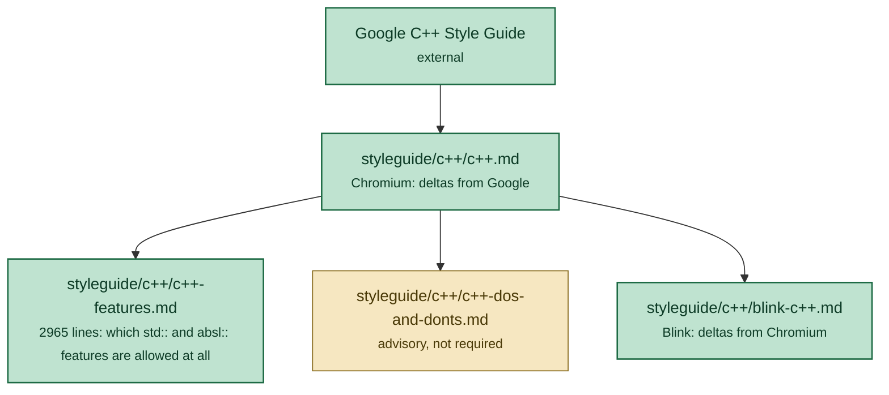
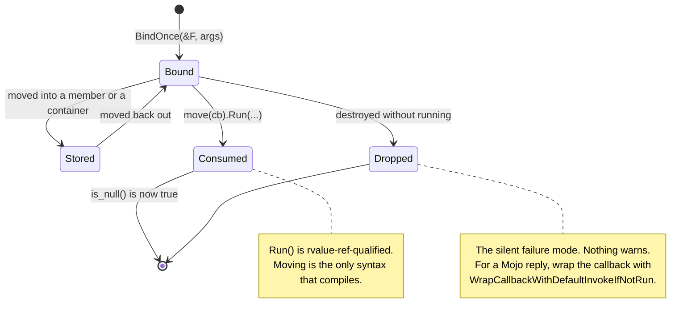
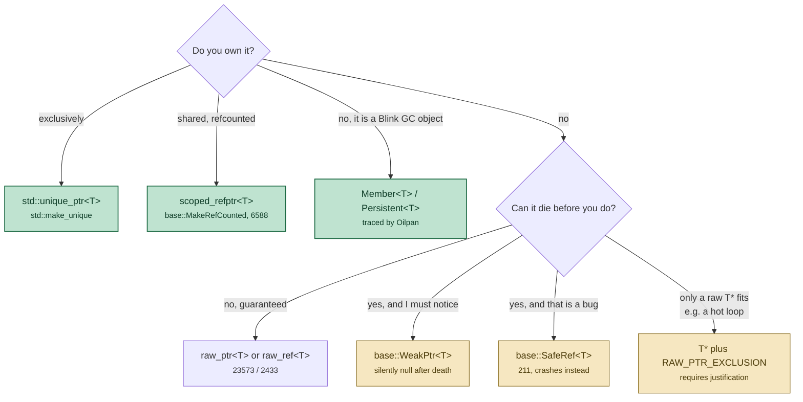
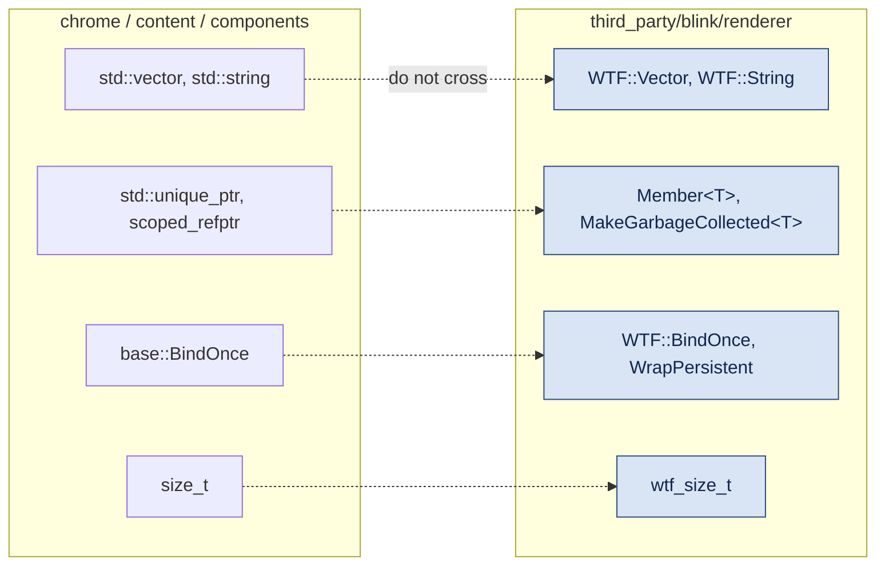

# C++ idioms in this checkout

An orientation note, in the family of `docs/notes/chromium-android-architecture.md`
— about *how Chromium writes C++*, not about upstream C++ itself. It exists
because reading Chromium source with standard-C++ instincts is actively
misleading: the tree bans a large slice of `std::`, replaces it with `base::`
equivalents that look similar but behave differently, and layers a *second*,
incompatible dialect on top inside `third_party/blink/renderer/`.

Everything here is verified against this checkout (`chrome/VERSION`
153.0.8005.0). Occurrence counts come from grepping `*.cc` and `*.h` under
`base/`, `chrome/`, `content/`, `components/`, `ui/` and
`third_party/blink/renderer/`; they are there to separate "this is the house
style" from "this exists somewhere".

Worked examples are drawn from the two feature branches in this checkout, since
their code is commented for exactly this audience:

* `floating-window` — `chrome/browser/ui/webui/floating_window/floating_window_ui.cc`,
  `chrome/browser/ui/views/toolbar/floating_window_toolbar_button.{h,cc}`,
  `chrome/browser/ui/views/floating_window/floating_window_bubble.cc`
* `digitclassifier` — `third_party/blink/renderer/modules/digitclassifier/`
  (a different branch; read with `git show digitclassifier:<path>`)

---

## 1. Three style guides, stacked

The rules are not in one place, and the inner layers *override* the outer ones.



Two consequences worth internalising before reading any file:

* **`styleguide/c++/c++-features.md` is a whitelist, not advice.** Every C++20
  and C++23 feature is explicitly marked `[allowed]`, `[banned]` or `[tbd]`, and
  so is every Abseil facility. A feature that is not listed as allowed is not
  usable, however standard it is.
* **`blink-c++.md` inverts several Chromium rules** rather than adding to them.
  Function names are `CamelCase()` even for getters; getters drop the `Get`
  prefix unless the bare name would collide with a type; `new`/`delete` go from
  discouraged to banned. Code that is correct in `chrome/` is wrong in
  `third_party/blink/renderer/` and vice versa.

---

## 2. The banned half of `std::`

This is the single biggest surprise for a reader arriving with standard C++
background. The bans in `styleguide/c++/c++-features.md` are not stylistic — in
most cases the standard facility is *unsafe or unusable* given how Chromium is
built (no exceptions, no RTTI in some configs, a bespoke task system, and a
binary-size budget measured in kilobytes).

| Banned | Use instead | Why, per `c++-features.md` |
|---|---|---|
| `std::function` | `base::OnceCallback` / `base::RepeatingCallback`, or `base::FunctionRef` | `std::function` cannot express Chromium's refcounting or weak pointers, and hides thread-safety concerns |
| `std::bind` | `base::BindOnce` / `base::BindRepeating` | `base::Bind*` refuses capturing lambdas and *forces* raw pointers to be spelled `base::Unretained`, so lifetime bugs are visible at the call site |
| `std::shared_ptr`, `std::weak_ptr` | `scoped_refptr` + `base::RefCounted`, `base::WeakPtr` | extrinsic vs. intrinsic refcounting; migration cost |
| `<thread>`, `<mutex>`, `<future>`, `<latch>`, `<semaphore>`, `<condition_variable>`, `<stop_token>` | `base/synchronization/`, `base::Thread`, `base::TaskRunner` | overlaps `base/`, which is tied to the message-loop model |
| `<chrono>` | `base::Time`, `base::TimeDelta`, `base::TimeTicks` | — |
| `std::to_string`, `std::stoi` and friends | `base/strings/string_number_conversions.h` | the parse direction signals failure with **exceptions**, which are off; the print direction is locale-dependent |
| `<span>` | `base::span` | superseded — `base::span` has strictly more functionality |
| `std::bit_cast` | `base::bit_cast` | the `std::` version accepts pointers and references, which does not avoid UB and silently casts away `const` |
| `<format>`, `<regex>`, `<filesystem>`, `<exception>`, `<source_location>` | `base::StringPrintf`, RE2, `base::FilePath`, — , `base::Location` | binary size and/or missing exception support |
| `std::any`, `std::byte`, `std::from_chars`, coroutines, modules, `[[no_unique_address]]` | various | see the per-entry rationale |
| almost all of Abseil, including `absl::optional`, `absl::Span`, `absl::string_view`, `absl::StatusOr`, `absl::Synchronization`, `absl::Time`, `absl::NoDestructor` | the `std::` or `base::` equivalent | Abseil is a dependency of other dependencies, not an API surface for Chromium code |

Abseil is not *absent* — it is narrowly permitted. What actually survives, by
occurrence:

```
absl::flat_hash_map   531      absl::Status      298
absl::flat_hash_set   435      absl::Cleanup     153
absl::StrFormat       331      absl::uint128     144
absl::Overload        321      absl::string_view 116
```

`absl::string_view` at 116 hits against 20,438 for `std::string_view` is the
shape to expect: a banned facility that survives only where it crosses into
third-party API.

### The migration runs both ways

`base/` is not a permanent fork of the standard library. Where the standard
caught up, the `base::` version was **deleted**, and code that predates the
deletion no longer compiles. In this checkout:

| Gone | Replacement | Evidence |
|---|---|---|
| `base::ranges::*` | `std::ranges::*` | 0 hits vs. 1,778 for `std::ranges::contains` alone |
| `base::Contains()` | `std::ranges::contains()` | `base/containers/contains.h` does not exist |
| `base::Value::Dict`, `base::Value::List` | `base::DictValue`, `base::ListValue` | `base/values.h:242` declares `class BASE_EXPORT GSL_OWNER DictValue`; 21,957 uses |

The practical rule: **do not trust remembered `base::` API names, and do not
trust upstream documentation or an LLM's recall of them.** Check the header
exists before using it. `agents/prompts/knowledge_base.md` is the routing table
for "what is the canonical way to do X here".

### What `std::` does have to offer

The banned list above is long enough to give a misleading impression. Modern
standard C++ is the default here — it is specific *facilities* that are
excluded, usually for exceptions, binary size, or a `base::` predecessor that
would cost too much to migrate. `styleguide/c++/c++-features.md` marks every
feature `[allowed]`, `[banned]` or `[tbd]`, and the allowed side is large.

**C++20 language features, all `[allowed]`:** concepts and constraints,
designated initializers, `consteval`, `constinit`, three-way comparison and
defaulted comparison operators, abbreviated function templates
(`void f(auto x)`), aggregate initialization with parentheses, range-`for` with
an initializer, `using enum`, `[[likely]]`/`[[unlikely]]`, bit-field member
initializers, and feature-test macros.

**C++20 library, `[allowed]`:** `<bit>`, `<compare>`, `<concepts>`, `<numbers>`,
`<version>`, `std::ssize`, `std::remove_cvref_t`, `std::midpoint`, `std::lerp`,
`std::erase`/`erase_if`, `std::make_unique_for_overwrite`,
`std::string::starts_with`/`ends_with`, `std::ranges::subrange`, and — the big
one — the **range algorithms** and range access primitives.

**C++23, `[allowed]`:** `std::to_underlying` (1,144 uses), monadic
`std::optional` (`and_then`, `transform`, `or_else`), `std::ranges::to`,
`std::from_range` construction, `std::byteswap`,
`std::basic_string::contains`, `if consteval`, `#elifdef`, and static
`operator()`/`operator[]`.

The everyday spellings are `std::` too: `std::optional` at 68,154 uses,
`std::string_view` at 20,438, `std::unique_ptr` everywhere, and `std::ranges::*`
having wholly displaced `base::ranges::*`.

#### The ranges split, which is the easy one to get wrong

Range **algorithms** are allowed and idiomatic — `std::ranges::find`,
`std::ranges::equal`, `std::ranges::sort`, `std::ranges::contains` (1,778 uses).
Range **factories and adaptors** are banned: no `std::views::transform`,
`std::views::filter`, `iota_view`, or `std::ranges::view_interface`. The stated
reasons are "questions about the design, impact on build time, and runtime
performance."

Three adaptors are explicit exceptions — `std::views::reverse`,
`std::views::zip`, `std::views::as_rvalue` — but with a catch that trips people
who reach for the familiar syntax:

```cpp
std::ranges::find(v, x);            // fine
std::views::reverse(v);             // fine — one of the three exceptions
v | std::views::reverse;            // BANNED, even though reverse is allowed
v | std::views::transform(f);       // banned twice over
```

> "pipe chaining remains banned even for allowed adaptors ... (function call
> syntax must be used)"

and this one is not left to review: it is **enforced by the Chromium style
clang-plugin**. The same exceptions and the same pipe prohibition apply through
the `std::ranges::views::` alias.

#### `[tbd]` means not yet

A third category is neither allowed nor banned — under discussion, so treat it
as unavailable: `std::expected` (hence 3,348 uses of `base::expected`),
`std::flat_map`, `std::print`, `std::move_only_function`, `std::unreachable`,
`std::mdspan`, `std::stacktrace`, `std::generator`, and the explicit object
parameter (`deducing this`). Checking which bucket a feature is in before using
it is a one-grep operation, and it is the difference between a clean review and
a rewrite.

---

## 3. Callbacks: the `std::move(cb).Run()` grammar

22,822 occurrences of `std::move(...).Run(` across the tree. This is *the*
Chromium expression, and it is unusual enough to deserve unpacking.

`base::OnceCallback::Run()` is **ref-qualified `&&`** — it can only be called on
an rvalue. So there is no way to run a `OnceCallback` without visibly consuming
it, and `std::move()` here is not an optimisation, it is the only syntax that
compiles. After it, the callback is null (`is_null()` is true), which is what
makes double-invocation a detectable bug rather than a silent one.

`floating_window_ui.cc:479` is the canonical shape:

```cpp
std::move(callback_).Run(base::MakeRefCounted<base::RefCountedString>(
    base::StrCat({kPageHead, BuildPageBodyHtml(tabs_), kPageTail})));
```

...and the comment above it explains why the surrounding `finished_` flag
exists at all: `Finish()` is reachable from two independent directions (the last
snapshot resolving, and a deadline timer), and running a `OnceCallback` twice is
a use-after-move.



### The `std::` equivalents, and why none of them are used

Everything in this section has a standard-library counterpart, which is worth
tabulating because the counterparts are what a reader arriving from general C++
will reach for first. Three of the four are banned, one is undecided, and the
fifth entry is the interesting one.

| Chromium | Closest `std::` | Status | What the difference actually is |
|---|---|---|---|
| `base::RepeatingCallback<Sig>` | `std::function<Sig>` | **banned** | `std::function` is lifetime-agnostic: it will happily store a lambda capturing a dangling `this` and never mention it. `base::RepeatingCallback` integrates with `WeakPtr` cancellation and `scoped_refptr` receivers, which the standard wrapper knows nothing about. |
| `base::OnceCallback<Sig>` | `std::move_only_function<Sig>` (C++23) | **`[tbd]`** | Closer than it looks: the standard type accepts ref-qualifiers, so `std::move_only_function<void() &&>` reproduces the rvalue-only `Run()` that makes consumption visible. The remaining gap is the same weak-pointer and refcount integration. `c++-features.md` says only "Overlaps with `base::OnceCallback`". |
| `base::BindOnce` / `BindRepeating` | `std::bind`, `std::bind_front` | **both banned** | `std::bind` is a well-known trap — placeholders, silent argument dropping, nested-bind surprises — but the stated reason is narrower: `base::Bind` "helps prevent lifetime issues by preventing binding of capturing lambdas and by forcing callers to declare raw pointers as `Unretained`". `bind_front` is banned merely as overlapping. |
| `base::FunctionRef<Sig>` | `std::function_ref<Sig>` | **not until C++26** | The standard version does not exist yet in any language mode this tree compiles with, and `absl::FunctionRef` is banned, so `base::FunctionRef` is the only option for a non-owning synchronous callable. |
| `base::Unretained(p)` | **nothing** | — | There is no analogue and there cannot be one. `Unretained(p)` and passing `p` raw are functionally identical; the wrapper generates no code. It exists *because* `base::Bind*` refuses to compile with a bare raw pointer, so its entire value is the compile error and the greppable name it forces you to write. |

`std::ref` and `std::cref` *are* standard, allowed, and used — `base::Bind*`
accepts them to mean "store a reference to the caller's object" (with the
lifetime obligation that implies). They are the nearest thing in shape to
`Unretained`, but they say something different: "store a reference", not "I
assert this outlives the callback".

The pattern behind the whole table: the standard facilities are
**lifetime-agnostic**, and Chromium's are **lifetime-opinionated**. Every
`base::` replacement exists to move a lifetime decision from invisible to
mandatory-and-named. That single idea explains the bans, the `Unretained`
ceremony, the `static_assert` against capturing lambdas, and why
`base::FunctionRef` relaxes all of it for calls that are provably synchronous.

### Passing convention

From `docs/callback.md`, and it is enforced by the type system more than by
review: **pass by value if ownership transfers, by const-reference otherwise.**
A function that takes `base::OnceCallback<void(int)>` by value is announcing that
it will consume or store it. A `const base::OnceCallback<...>&` parameter can
only inspect it — most usefully `is_null()`.

### The bind-argument vocabulary

`base::BindOnce`/`BindRepeating` refuse to bind a capturing lambda, and refuse to
bind a bare raw pointer receiver. That refusal is the point: every unsafe
lifetime decision has to be spelled out with a named wrapper, so it is greppable.

| Wrapper | What it means | Hits |
|---|---|---|
| `base::Unretained(p)` | Passes the raw pointer through unchanged, and asserts that `p` outlives the callback. There is no runtime check whatsoever — the wrapper generates no code, and exists only so that the assumption has a name you can grep for. | 15,211 |
| `weak_factory_.GetWeakPtr()` | Binds a weak reference to the receiver. If the receiver is destroyed first the callback is **silently cancelled** rather than run, so this is for cases where "the work is no longer wanted" is a normal outcome, not an error. | 6,156 factories |
| `base::RetainedRef(p)` | Stores a `scoped_refptr`, keeping the object alive for the callback's lifetime, but passes the bound function a plain `T*`. Use it when the callee's signature takes a raw pointer and you cannot change it. | 168 |
| `base::Owned(p)` | The callback takes ownership of a heap object and deletes it when the callback itself is destroyed, whether or not it ever ran. The bound function receives a `T*`. | 107 |
| `base::OwnedRef(std::move(v))` | The callback owns a *copy* of `v` and passes the bound function a mutable `T&` to that copy. The only wrapper that combines ownership with reference passing — see the subsection below. | 28 |
| `base::IgnoreResult(cb)` | Adapts a value-returning callback to a `void`-returning one by discarding the result. Needed because callback signatures must match exactly, and most task runners want `void`. | — |
| `base::DoNothing()` | A no-op callback that adopts whatever signature the parameter requires. Useful for optional completion callbacks and in tests, and clearer than an empty lambda because it cannot accidentally capture anything. | 6,730 |

The `base::Unretained` count is not a smell — every one of them is a documented
claim. Both uses in the floating-window feature carry the proof in a comment:

* `floating_window_ui.cc:462` — the timer is a **member**, so `OneShotTimer`'s
  destructor cancels it and it cannot outlive `this`.
* `floating_window_ui.cc:670` — the `Profile*` outlives the data source, because
  the data source is owned by the `URLDataManager` keyed on that same profile.

`base::OwnedRef` at only 28 uses tree-wide makes
`floating_window_ui.cc:628` worth reading twice:

```cpp
ui::AXTreeUpdate on_failure;
snapshot_targets[i]->RequestAXTreeSnapshot(
    mojo::WrapCallbackWithDefaultInvokeIfNotRun(
        base::BindOnce(&OutlineCollector::OnSnapshot, collector,
                       snapshot_target_rows[i]),
        base::OwnedRef(std::move(on_failure))),
    ...);
```

Three separate mechanisms in one expression, unpacked in the next three
subsections. The target is
`WebContents::AXTreeSnapshotCallback = base::OnceCallback<void(ui::AXTreeUpdate&)>`
(`content/public/browser/web_contents.h:645`) — note the **non-const lvalue
reference**, which is what forces the third mechanism.

#### The receiver: a `scoped_refptr` bound as `this`

`base::BindOnce(&OutlineCollector::OnSnapshot, collector, row)` binds a pointer
to member function whose signature is `void(size_t, ui::AXTreeUpdate&)`.
`collector` is a `scoped_refptr<OutlineCollector>`, and `base::Bind*`
understands that: it stores a **reference-counted handle**, so the object stays
alive exactly as long as the callback does. That is why no `base::Unretained`
and no `WeakPtr` appear — and it is the mechanism by which the collector
outlives the function that created it. The outstanding reply callbacks *are*
what keep it alive.

With the receiver and `row` bound, the one remaining parameter is
`ui::AXTreeUpdate&`, so the result matches `AXTreeSnapshotCallback` exactly.

#### The drop guard, and how it works

`mojo::WrapCallbackWithDefaultInvokeIfNotRun()` covers the `Dropped` edge in the
state diagram above. Its header states the contract
(`mojo/public/cpp/bindings/callback_helpers.h:15`): if the callback is destroyed
before it can run — the task was dropped, the renderer went away — it is run
with the default arguments instead.

Worth knowing the implementation, because it explains the caveats. It
heap-allocates a helper and returns a callback that *owns* it:

```cpp
return base::BindOnce(&internal::CallbackWithDeleteHelper<T>::Run,
                      std::make_unique<internal::CallbackWithDeleteHelper<T>>(
                          std::move(cb), std::forward<Args>(args)...));
```

The helper pre-binds "run me with the defaults" into `delete_callback_`, then:

```cpp
~CallbackWithDeleteHelper() { if (delete_callback_) std::move(delete_callback_).Run(); }
void Run(Args... args) { delete_callback_.Reset(); std::move(callback_).Run(...); }
```

so exactly one of the two paths fires — `Run()` disarms the destructor first.
Two caveats the header raises itself: the destructor may run on a thread you did
not expect (not an issue for mojo async replies, which run and destroy on the
`Remote`'s thread), and **nothing in the type advertises the special destructor
behaviour**, so these should not be passed deep into call graphs where a reader
cannot tell whether `Run()` is expected.

#### `base::OwnedRef`, and why nothing simpler compiles

The default argument has to satisfy `ui::AXTreeUpdate&`. Every simpler option is
rejected:

* a temporary is a prvalue and will not bind to a non-const lvalue reference;
* a plain bound value fails too, because `BindOnce` passes bound arguments to
  the target as rvalues;
* `base::Owned()` passes a `T*`, and the parameter is not a pointer.

This is not a special case — `base::Bind*` **refuses** to bind a plain value to
any non-const reference parameter, by `static_assert`
(`base/functional/bind_internal.h:1602`):

> "Bound argument for non-const reference parameter must be wrapped in
> `std::ref()` or `base::OwnedRef()`."

The refusal is deliberate, because `void f(int& out)` is ambiguous at the bind
site: mutate *the caller's* variable, or give the function scratch storage?
Those have opposite lifetime requirements, so the tree makes you say which.
`docs/callback.md:814` shows the pair:

```cpp
int n = 0;
auto has_ref  = base::BindRepeating(&foo, std::ref(n));        // the caller's n
auto has_copy = base::BindRepeating(&foo, base::OwnedRef(n));  // the callback's copy
auto broken   = base::BindRepeating(&foo, n);                  // does not compile
```

`std::ref` borrows and obliges you to outlive the callback; `OwnedRef` copies
and obliges you to nothing. The implementation is nine lines
(`bind_internal.h:375`) and two details carry it:

```cpp
class OwnedRefWrapper {
 public:
  explicit OwnedRefWrapper(const T& t) : t_(t) {}
  explicit OwnedRefWrapper(T&& t) : t_(std::move(t)) {}
  T& get() const { return t_; }
 private:
  mutable T t_;          // by value -> the callback owns it
};                       // mutable  -> get() const can still yield a non-const T&
```

`mutable` is the trick: bound arguments are unwrapped through a `const&`
(`BindUnwrapTraits::Unwrap(const T& o) { return o.get(); }`), and without it a
*mutable* reference could not come back out of a const-accessed bind state.

The second documented use is the one in play here — `bind.h:346` calls it
"useful to pass placeholder arguments", with an example whose parameter is
literally named `ignore`:

```cpp
void bar(int& ignore, const std::string& s);
OnceClosure cb = base::BindOnce(&bar, base::OwnedRef(0), "Hello");
```

`OwnedRef(0)` conjures scratch storage from a literal, which `std::ref` cannot
do — there is no object to refer to. `on_failure` is exactly that: a placeholder
nobody reads.

#### `std::move()` moves nothing

`std::move(on_failure)` is worth a note because it looks like an optimisation
and is not one. It is a cast —
`static_cast<std::remove_reference_t<T>&&>` — producing an **xvalue**. No bytes
move. All it changes is overload resolution: `on_failure` is an lvalue and would
select `OwnedRefWrapper(const T&)`; the cast selects `OwnedRefWrapper(T&&)`.

Here that buys close to nothing, because `on_failure` is default-constructed and
never written to — two empty vectors and a default `AXTreeData`, as cheap to
copy as to move. (`AXTreeUpdate` is copyable *and* movable;
`ui/accessibility/ax_tree_update.h:54-59` declares both, with a TODO about
auditing the copy sites.) The `std::move` is there for intent and robustness:
it says the local is dead after this line, and it stays correct if the fallback
ever gains content.

One detail that is load-bearing and easy to undo: `on_failure` is declared
**inside** the request loop, so each iteration moves from a fresh object. Hoisting
it above the loop — a tempting tidy-up — would have every later iteration move
from an already-moved-from value. That is well-defined but unspecified, and
harmless only for as long as the object stays empty.

### Combinators

Worth recognising, uncommon enough that each is a deliberate choice:

* `a.Then(b)` — chains, passing `a`'s return into `b`. On a `OnceCallback` both
  sides must be moved: `std::move(first).Then(std::move(second)).Run(3.5f)`.
* `base::BindPostTask(runner, cb)` (266) — a callback that, whenever and
  wherever it is run, hops to `runner` first. The standard way to hand a
  callback across sequences.
* `base::SplitOnceCallback(std::move(cb))` (197) — returns a `std::pair` of two
  `OnceCallback`s from one, for an API that may take either of two paths.
  Running both is a crash, by design.
* `base::BarrierCallback<T>(n, done)` (128) — fan-in: collects `n` results into
  a vector and runs `done` once. Note that `floating_window_ui.cc` does *not*
  use it, because it needs a deadline and a per-tab index, neither of which the
  barrier offers.

---

## 4. The pointer vocabulary

Chromium has roughly eight ways to hold a reference to an object, and the choice
encodes the lifetime contract. `T*` is the *least* common in modern code:
`raw_ptr<T>` has 23,573 occurrences against a member-pointer population that
used to be all raw.



### Which of these exist in `std::`

Same exercise as the callback table in §3, and it lands differently: here one
Chromium type *is* the standard one, two are banned in favour of `base::`
replacements, and four have no standard counterpart at all because they encode
a claim rather than an ownership model.

| Chromium | `std::` counterpart | Status | What the difference is |
|---|---|---|---|
| `std::unique_ptr<T>` | itself | **allowed, and the default** | No replacement was ever needed. The only local rule is to build it with `std::make_unique` rather than bare `new`, which also keeps one-based refcounting optimisations valid for the `scoped_refptr` case. |
| `scoped_refptr<T>` + `base::RefCounted<T>` | `std::shared_ptr<T>` | **banned** | `shared_ptr` uses *extrinsic* refcounting — the count lives in a separate control block — while `base::RefCounted` puts the count inside the object. `c++-features.md` says it "could plausibly be used in Chromium, but would require significant migration". The intrinsic model is also what lets a raw `T*` be converted back into a `scoped_refptr`. |
| `base::WeakPtr<T>` | `std::weak_ptr<T>` | **banned** | Banned as a consequence of `shared_ptr` being banned, but the semantics differ too: `std::weak_ptr` only observes a `shared_ptr`, whereas `base::WeakPtr` works for any object holding a `WeakPtrFactory`, regardless of how it is owned. It is also **sequence-affine** — it may be passed between sequences but only dereferenced on the one it was bound to — which has no `std::` equivalent. |
| `base::span<T>` | `std::span<T>` | **banned** | Not a design disagreement: "Superseded by `base::span`, which has a richer functionality set." The `base` version carries the fixed-extent helpers (`first<N>()`, `subspan<O, N>()`) that the spanification work leans on. |
| `base::HeapArray<T>` | `std::unique_ptr<T[]>` | — | The standard form owns an array but forgets its length, so every use is an unchecked index. `HeapArray` "is a replacement for `std::unique_ptr<T[]>` that keeps track of its size", converts to a `span`, and indexes with bounds checks. |
| `raw_ptr<T>` | `T*` | **no counterpart** | A checked pointer that turns a use-after-free from an exploitable read into a crash. There is nothing like it in the standard library; `std::observer_ptr` was never standardised, and would have been a documentation-only wrapper anyway. |
| `raw_ref<T>` | `T&` | **no counterpart** | The reference-shaped sibling of `raw_ptr`, for a member that is never null and never rebound. |
| `base::SafeRef<T>` | **nothing** | — | A non-owning pointer that is *always intended to be valid*: "unlike a `T*` or `T&`, a logic bug will manifest as a benign crash instead of as a Use-after-Free". Where `WeakPtr` says "this may legitimately vanish", `SafeRef` says "if this vanishes, that is a bug — crash". Cannot be null, hence the `Ref` suffix. |
| `base::to_address`, `base::bit_cast` | `std::to_address`, `std::bit_cast` | **both banned** | Narrow, specific defects. `std::to_address` "is not guaranteed to be SFINAE-compatible"; `std::bit_cast` accepts pointers and references, which "doesn't avoid UB" and lets you cast away `const`. The `base::` versions are the same idea with the hole closed. |

The pattern is the mirror image of §3. There, standard facilities were rejected
for being **lifetime-agnostic**. Here, `std::unique_ptr` survives untouched
because ownership is exactly what it models well — and everything Chromium adds
sits in the space the standard library does not address at all: pointers that
assert something about a lifetime they do not own. `raw_ptr` asserts "checked",
`SafeRef` asserts "must be valid", `WeakPtr` asserts "may not be". Those are
claims, not ownership models, which is why no `std::` type corresponds to them.

**`raw_ptr<T>` is not a smart pointer.** It owns nothing and is implicitly
convertible both ways; it is a *checked* pointer that turns a use-after-free
from an exploitable read into a crash. Note that `base/memory/raw_ptr.h` is a
one-line facade — the implementation lives in PartitionAlloc at
`base/allocator/partition_allocator/src/partition_alloc/pointers/raw_ptr.h`,
and the rationale (MiraclePtr, BackupRefPtr, the dangling-pointer detector) is
in `base/memory/raw_ptr.md`. It costs a little, so it is for members and not
for locals — which is why
`floating_window_toolbar_button.h:59,62` uses it for the two members while
`floating_window_toolbar_button.cc:96` uses a plain local
`views::Widget* const widget`.

Note also the `.get()` at `floating_window_toolbar_button.cc:76`:
`widget_observation_.Observe(widget_.get())` — a `raw_ptr<T>` member usually
converts implicitly, but a template parameter deduction site often needs the
raw `T*` spelled out.

### Refcounted classes have a private destructor

`floating_window_ui.cc:430`–`487` is the standard shape, and every line of the
boilerplate is load-bearing:

```cpp
class OutlineCollector : public base::RefCounted<OutlineCollector> {
 public:
  OutlineCollector(std::vector<TabEntry> tabs,
                   content::WebUIDataSource::GotDataCallback callback)
      : tabs_(std::move(tabs)), callback_(std::move(callback)) {}
  OutlineCollector(const OutlineCollector&) = delete;
  OutlineCollector& operator=(const OutlineCollector&) = delete;
  // ...
 private:
  friend class base::RefCounted<OutlineCollector>;
  ~OutlineCollector() = default;
```

* **CRTP base**, not a member — `base::RefCounted<T>` puts the count *in* the
  object (intrinsic refcounting), which is the stated reason `std::shared_ptr`
  is banned rather than adopted.
* **Private destructor + `friend`** — this makes `delete collector;` and
  stack allocation compile errors. The only way the object can die is the
  refcount reaching zero. Every refcounted class in the tree does this.
* **Copy/assign explicitly deleted** — `c++-dos-and-donts.md` requires being
  explicit rather than relying on "obvious", and requires deleting *both* of a
  pair, never one.
* **`base::MakeRefCounted<T>(...)`** at the construction site, never
  `scoped_refptr<T>(new T(...))`: bare `new` is not compatible with the
  one-based refcounting optimisation.

### `base::PassKey<T>` — the constructor allowlist

2,003 occurrences. A parameter type nobody but `T` can construct:

```cpp
class Foo {
 public:
  explicit Foo(base::PassKey<Manager>);   // public, but only Manager can call it
};
```

It exists because `std::make_unique` and `blink::MakeGarbageCollected` need a
*public* constructor, and friending them (per `c++-dos-and-donts.md`) would hand
construction rights to everyone. `base/types/pass_key.h:24` is worth a look for
the concept trick that enforces the key types are pairwise unique.

`blink-c++.md` extends this into a hard rule: a class has *either* `Create()`
factories *or* public constructors, never both — and PassKey is how you get a
`Create()` that can still call `MakeGarbageCollected`.

---

## 5. Memory safety expressed in the type system

Two campaigns are visibly mid-flight in this tree, and both leave marks that
look strange out of context.

### Spanification

Pointer-plus-length pairs are being replaced with `base::span`. The knock-on is
that plain pointer arithmetic and unchecked indexing now produce a **compiler
plugin warning**, so any remaining raw buffer access must be wrapped and
justified (`docs/unsafe_buffers.md`):

* `UNSAFE_BUFFERS(expr)` (1,339) — "I have checked this, here is why", and the
  presubmit expects a `// SAFETY:` comment above it.
* `UNSAFE_TODO(expr)` — identical behaviour, different name, so the not-yet-audited
  cases are greppable separately from the audited ones.
* `#pragma allow_unsafe_buffers` under `#ifdef UNSAFE_BUFFERS_BUILD` — a
  whole-file opt-out; whole directories are listed in an unsafe-buffers paths file.

`digit_classifier_model.cc:286` is a textbook instance — a C API returned a void
pointer, so the span has to be built by hand:

```cpp
// SAFETY: `kResultSize` bytes were requested from GetConstMappedRange() and
// it returned non-null, so the range is valid for exactly that many bytes.
const auto bytes = UNSAFE_BUFFERS(
    base::span(static_cast<const uint8_t*>(mapped), kResultSize));
const uint32_t digit = base::U32FromLittleEndian(bytes.first<4u>());
```

Note `bytes.first<4u>()` — the *template* form returns a fixed-extent
`span<const uint8_t, 4>`, which is what `U32FromLittleEndian` requires. The
runtime form `.first(4)` would not compile. The same trick, with an offset,
appears throughout `digit_classifier_weights.cc:64,73–75` as
`bytes.subspan<4u, 4u>()`: parse a binary header with the sizes checked at
compile time rather than by a comment.

`digit_classifier_weights.cc:86` is the strangest expression in either feature:

```cpp
base::as_writable_bytes(base::allow_nonunique_obj, base::span(storage))
    .copy_from(bytes.subspan(kHeaderSize));
```

`base::allow_nonunique_obj` is a tag argument. Reinterpreting a `float` array as
bytes is normally refused because `float` has non-unique object representations
(NaN payloads, signed zero) — two distinct bit patterns can compare equal, so
byte-wise comparison or hashing would be wrong. The tag says "these bytes are
only ever copied", which is the one use that stays sound.

### `LIFETIME_BOUND`: dangling caught at compile time

`LIFETIME_BOUND` (`base/compiler_specific.h:783`) expands to
`[[clang::lifetimebound]]` where the compiler supports it and to nothing
otherwise. It annotates a parameter or a member function to say "the returned
reference borrows from this", which lets clang reject the classic dangling
patterns outright:

```cpp
struct S {
  S(int* p LIFETIME_BOUND);
  int* Get() LIFETIME_BOUND;
  std::string_view GetSubstring(const std::string& s LIFETIME_BOUND) const;
};

S    Func1() { int i = 0;  return S(&i); }          // will not compile
int* Func2(int* p) { return S(p).Get(); }           // will not compile
std::string_view Func3(const S& s) {
  return s.GetSubstring(NumberToString(3));         // will not compile
}
```

All three are diagnosed as returning the address of a stack object or a
temporary. It is the same instinct as `raw_ptr` and `SafeRef` from §4 — moving a
lifetime mistake from runtime to as early as possible — except this one costs
nothing at all at runtime, because it is purely an attribute. Worth adding to
any accessor that hands out a view into a member, `std::string_view` and
`base::span` returns above all. `LIFETIME_CAPTURE_BY_THIS` is the sibling for a
function that *stores* the reference rather than returning it.

### Numeric conversions

`base::checked_cast<T>` (1,314) CHECK-fails on a lossy conversion;
`base::strict_cast<T>` (83) refuses to compile one. `base::ClampedNumeric`
saturates. A bare `static_cast` between integer widths in new code is a
reviewable event — but note it stays correct and idiomatic for *unrelated*
conversions, like `static_cast<int>(ui::mojom::DialogButton::kNone)` at
`floating_window_bubble.cc:65`, where an enum has to satisfy a bitmask API.

---

## 6. RAII wrappers instead of manual pairing

Anything that must be undone gets a scoped object, so the undo cannot be
forgotten on an early return.

| Type | Undoes | Hits |
|---|---|---|
| `base::ScopedObservation<Source, Observer>` | `RemoveObserver` on destruction | 2,706 |
| `base::ScopedMultiSourceObservation` | the same, for N sources | — |
| `base::AutoReset<T>` | restores a variable's previous value | 1,208 |
| `base::ScopedClosureRunner` | runs a `OnceClosure` on destruction | 943 |
| `base::NoDestructor<T>` | *suppresses* destruction — for function-local statics of non-trivially-destructible type | 3,497 |

`floating_window_toolbar_button.h:67` shows the observation pattern and its
non-obvious half — the `{this}` initialiser in the member declaration:

```cpp
base::ScopedObservation<views::Widget, views::WidgetObserver>
    widget_observation_{this};
```

Braces rather than `=` because the constructor is `explicit`; this is exactly
case 3 in the `c++-dos-and-donts.md` initialisation rules ("uniform init only
when neither assignment nor parens work"). The same shape is why
`base::WeakPtrFactory<C> factory_{this};` is written that way everywhere.

`base::NoDestructor` deserves its own note because it looks like a leak. It is
the modern replacement for `base::LazyInstance` (itself obsolete since 2017,
when function-local static initialisation became thread-safe). The point is not
laziness but **destruction order**: a global destructor running at exit can
touch objects other threads are still using. `NoDestructor` simply never runs it.
`absl::NoDestructor` is banned in favour of it.

---

## 7. The failure vocabulary

Chromium builds without exceptions, so "this cannot happen" is expressed with a
family of macros whose differences matter:

| Macro | Behaviour |
|---|---|
| `CHECK(cond)` | always compiled in, including official release builds; crashes |
| `DCHECK(cond)` | compiled out unless `dcheck_always_on`; **the argument is dead code in release** |
| `NOTREACHED()` | `[[noreturn]]` — the compiler knows control does not continue, so no `return` is needed after it |
| `NOTREACHED(base::NotFatalUntil::M120)` | reports without crashing until milestone M120, then becomes fatal |
| `DUMP_WILL_BE_NOTREACHED()` | reports a dump, keeps running — for hardening an assumption before trusting it |
| `CHECK_DEREF(ptr)` | returns `T&`, crashing at the *caller's* line if null |

`NOTREACHED()` at 11,711 uses is being *hardened*, not removed:
`base/notreached.h:33` shows the macro dispatching on whether it was given a
milestone argument. `base::NotFatalUntil` (905 uses) is how a new `CHECK` is
introduced into shipped code without turning a wrong assumption into a crash
wave — it collects reports for one or two milestones first.

`CHECK_DEREF` (2,220) is the neat one. `base/check_deref.h:30` is a
`[[nodiscard]] T&` function with a defaulted
`base::Location::Current()` argument, which is why the crash report points at
the caller and not at the header:

```cpp
MyType& ref = CHECK_DEREF(MethodReturningAPointer());
```

It turns "pointer that must not be null" into a reference at the point of use,
so nothing downstream has to re-check.

### Expected failures: `base::expected` and its two macros

`CHECK` and friends are for things that cannot happen. For things that *can*,
the vocabulary is `base::expected<T, E>` (3,348 in the tree), with
`base::ok(v)` and `base::unexpected(e)` constructing the two states. Note that
`std::expected` is still `[tbd]` in `c++-features.md`, so the `base::` one is
not going away.

This is the growth area. Sampling the added lines of the last 1,000 commits,
`base::unexpected(` appears 177 times, `base::expected<` 103 and `base::ok(`
44 — together more frequent than anything except `std::move` and the `Bind`
family. With no exceptions available, returning errors as values is the only
option, and the tree is converting to it steadily.

The awkward part of any result type is propagation: without `?` or exceptions,
every call site turns into a check-and-early-return. `base/types/expected_macros.h`
supplies the two macros that absorb that boilerplate:

```cpp
base::expected<Signature, Error> Sign(base::span<const uint8_t> data) {
  ASSIGN_OR_RETURN(TBS_HCONTEXT h_context, OpenContext());  // binds, or returns the error
  RETURN_IF_ERROR(ValidateSpan(data));                      // returns on error, discards success
  ...
}
```

`ASSIGN_OR_RETURN(lhs, rexpr)` evaluates `rexpr`; on success it declares and
initialises `lhs`, on failure it returns the error from the *enclosing*
function. `RETURN_IF_ERROR(rexpr)` is the same without the binding. Both also
accept `std::optional<T>`, and both accept extra arguments that are treated as
an invocable transforming the error on the way out.

Three sharp edges the header calls out, all worth knowing before using them:

* **`ASSIGN_OR_RETURN` expands to multiple statements**, so it cannot be the
  unbraced body of an `if`.
* **If `lhs` is parenthesised the parentheses are stripped**, which is how
  `ASSIGN_OR_RETURN((auto [a, b]), f())` can bind a structured binding — and
  also why `lhs` may not contain a ternary.
* The enclosing function may return either `E` directly or
  `base::expected<U, E>`; the macro adapts, so you do not wrap in
  `base::unexpected` yourself.

The implementation is a small showcase of advanced C++, and one trick in it is
reusable. `base::internal::UnexpectedDeducer` takes a *lambda* rather than an
error value, deducing `E` through `std::invoke_result_t`, so that a `void` error
type still works; and callers must return `Ret()`, declared
`constexpr decltype(auto) Ret() && noexcept`, rather than the deducer itself.
The reusable trick is in the macro body, with its own comment:

```cpp
/* Pass `expected` as an arg rather than capturing, so the lambda body */
/* is a template context, so `constexpr if` avoids instantiating the */
/* non-matching arm, since it won't compile otherwise. */
return base::internal::UnexpectedDeducer(
           [&](auto&& base_internal_expected__) {
             if constexpr (base::internal::IsExpected<
                               decltype(base_internal_expected__)>) { ... }
```

In an ordinary function, **both arms of an `if constexpr` must still compile** —
discarding happens only inside a template. Passing the value as an `auto&&`
parameter instead of capturing it makes the lambda's `operator()` a template, so
the non-matching arm is never instantiated. That is the standard way to get
genuine compile-time branching in non-template code, and it is worth recognising
outside this header.

---

## 8. Strings

* **`base::StrCat({a, b, c})` and `base::StrAppend(&s, {…})`, not `operator+`.**
  The initialiser-list form sizes the result once and copies once; a chain of
  `+` allocates per operator. `floating_window_ui.cc:352,358,387,395` uses it
  for every fragment of generated HTML.
* **`std::u16string` is a real type here**, not an afterthought — UI strings and
  page titles are UTF-16 (`base::UTF16ToUTF8`, `Escaped()` overloads at
  `floating_window_ui.cc`). Blink has its own `String` (`WTF::String`) with
  `String::FromUtf8`, `String::Number` and `String::Format`.
* `base::TruncateUTF8ToByteSize` returns a `std::string_view` into the input, so
  it appears as `std::string(base::TruncateUTF8ToByteSize(...))` at
  `floating_window_ui.cc:326`. Cutting at a character boundary is the whole
  point; a `substr()` would split a multi-byte sequence.
* Raw string literals `R"(...)"` for embedded HTML, CSS and shader source
  (`floating_window_ui.cc:76`, `digit_classifier_model.cc` `kShaderSource`).
* **UI strings in this checkout are hardcoded `u"..."` with a TODO**, contrary to
  upstream rules — see `CLAUDE.md`. `generated_resources.grd` entries would
  require translation screenshots that presubmit blocks on, for code that will
  never ship.

---

## 9. Macros that generate class machinery

Several base classes require a macro in the class body plus a matching one in
the `.cc`. Missing one produces a link error or a silently absent feature rather
than a helpful message.

| Header side | Source side | Provides |
|---|---|---|
| `METADATA_HEADER(This, Super)` | `BEGIN_METADATA(This)` / `END_METADATA` | views introspection, the views inspector, `IsViewClass<T>()` |
| — | `WEB_UI_CONTROLLER_TYPE_IMPL(T)` | per-type identity for `WebUIController` |
| `DEFINE_WRAPPERTYPEINFO()` | (IDL codegen) | the Blink wrapper type that binds C++ to a V8 object |

`floating_window_toolbar_button.h:36` and `.cc:99` are the pair; note that
`BEGIN_METADATA`/`END_METADATA` sit **outside** the namespace-closing brace at
the very bottom of the file.

---

## 10. Blink is a different language

`third_party/blink/renderer/` is a hard boundary. Inside it, most of what the
rest of this document says is wrong.



### Oilpan, the garbage collector

16,789 uses of `MakeGarbageCollected<T>`. Objects on the Blink heap are neither
owned nor refcounted; they are traced. Three obligations come with that, and all
three are visible in `navigator_digit_classifier.{h,cc}`:

1. Inherit `GarbageCollected<T>` (or a base that does, like `ScriptWrappable`).
2. Hold other GC objects in `Member<T>` — never a raw pointer, never
   `unique_ptr`.
3. Implement `void Trace(Visitor*) const` that traces every `Member` **and calls
   the base class's `Trace`**. Forgetting either is a use-after-free that only
   shows up under GC pressure:

```cpp
void NavigatorDigitClassifier::Trace(Visitor* visitor) const {
  visitor->Trace(digit_classifier_);
  Supplement<NavigatorBase>::Trace(visitor);   // easy to omit; must not be
}
```

`Supplement<NavigatorBase>` is itself an idiom worth knowing — it is how a
module bolts a property onto a core class (`navigator.digitclassifier`) without
`core/` having to know the module exists. The `From<T>()`/`ProvideTo()` pair in
`navigator_digit_classifier.cc` is the lazy-instantiation dance every supplement
performs.

### Crossing threads and out of Blink

`digit_classifier.cc:87`–`125` packs the whole cross-thread vocabulary into one
call:

```cpp
CreateWebGPUGraphicsContext3DProviderAsync(
    ..., CrossThreadBindOnce(
        [](CrossThreadHandle<DigitClassifier> classifier_handle, ...) {
          auto unwrap = MakeUnwrappingCrossThreadHandle(classifier_handle);
          if (!unwrap) { return; }
          auto* classifier = unwrap.GetOnCreationThread();
          ...
        },
        MakeCrossThreadHandle(this), MakeCrossThreadHandle(execution_context)));
```

* `WTF::BindOnce` (spelled bare `BindOnce` inside `namespace blink`) is *not*
  `base::BindOnce` — it understands Oilpan wrappers.
* `WrapPersistent(gc_object)` (`digit_classifier.cc:62`) creates a strong root
  that keeps a GC object alive across an async gap. Without it the object is
  collectable while the callback is pending.
* A GC pointer must never simply be captured for another thread.
  `MakeCrossThreadHandle` / `MakeUnwrappingCrossThreadHandle` is the sanctioned
  round trip; the unwrap can fail, and the early `return` on failure is the
  normal case, not an error path.
* `CrossThreadBindOnce` is the cross-thread analogue of `BindOnce`, and it is
  the one place a lambda is idiomatic — because it is *captureless*, everything
  arriving through parameters.

### Promises

`ScriptPromiseResolver<T>` is a GC object created with
`MakeGarbageCollected`, and its `Promise()` is captured *before* anything async
starts (`digit_classifier.cc:57`–`64`). Two idioms sit around it:

* `EmptyPromise()` is the return value for the synchronous-throw path — the
  `ExceptionState&` out-parameter already carries the exception, and returning
  an empty promise says "look there instead". A caller must never see both.
* `resolver->WrapCallbackInScriptScope(cb)` injects the resolver as the callback's
  **first unbound parameter** and re-enters the right V8 script scope. That is
  why `OnResultMapped`'s signature at `digit_classifier_model.h:71` puts
  `resolver` after the bound `readback` but before the callback's own arguments —
  a comment in that header spells the ordering out precisely because getting it
  wrong is a confusing compile error.

### The expression to read twice

`digit_classifier.cc:211`:

```cpp
DigitClassifierModel* model = DigitClassifierModel::Create(
    GetExecutionContext(), dawn_control_client_, std::move(device),
    *std::move(weights));
```

`weights` is a `std::optional<DigitClassifierWeights>` of a move-only type.
`std::move(weights)` produces an rvalue optional; `operator*` on an rvalue
optional yields an rvalue *reference to the contained value*, so the argument
binds to a by-value parameter by **move**, not copy. Writing `*weights` would
copy — and `DigitClassifierWeights` has no copy constructor, so it would not
compile. `std::move(*weights)` would also work; the form used moves the
dereference outward, which is the more common spelling in the tree.

### Small Blink-specific spellings

* `wtf_size_t`, not `size_t`, when interacting with WTF containers — hence the
  `static_cast<wtf_size_t>` at `digit_classifier_weights.cc:85`.
* `To<Derived>(base_ptr)` is Blink's checked downcast
  (`digit_classifier.cc:115`), replacing `static_cast` and `dynamic_cast`.
* `NotShared<DOMFloat32Array>` (`digit_classifier_model.h:71`) is a binding-layer
  wrapper meaning "this typed array is not backed by a SharedArrayBuffer" — a
  distinction the IDL layer enforces so the C++ can assume no concurrent mutation.
* `MODULES_EXPORT` on classes crossing the component boundary.

---

## 11. Expression-level tics

Small things that repeatedly stop a first-time reader.

* **Argument-name comments.** `/*autosize=*/true`
  (`floating_window_bubble.cc:60`), `/*trim_sequences_with_line_breaks=*/true`.
  Required by the style guide for otherwise-unreadable literal arguments; clang
  verifies the name matches the parameter.
* **Commented-out parameter names.** `void HandleRequest(Profile* profile,
  const std::string& /*path*/, ...)` — unused, but named for documentation.
  Blink additionally permits *omitting* obvious names entirely
  (`Node(TreeScope*, ConstructionType)`), which Chromium proper does not.
* **Designated initialisers in aggregates.** `digit_classifier_model.cc:174`:
  ```cpp
  const std::array<wgpu::BindGroupEntry, 6> entries = {{
      {.binding = 0, .buffer = layer1_weights_buffer_},
      ...
  }};
  ```
  The double brace is `std::array`'s aggregate-of-aggregate wrapping, not a typo.
  Designated initialisers are explicitly `[allowed]` C++20.
* **Chained C-struct descriptors.** `shader_descriptor.nextInChain = &wgsl_source;`
  (`digit_classifier_model.cc:159`) — the WebGPU/Dawn extension mechanism.
  A field pointing at another struct that must outlive the call.
* **Userdata trampolines.** `callback->UnboundCallback()` plus
  `callback->AsUserdata()` (`digit_classifier.cc:157`) is how a C++ callback is
  handed to a C API that takes a function pointer and a `void*`.
  `MakeWGPUOnceCallback` owns the pair and deletes itself when invoked.
* **`base::FunctionRef` for visitors** — enough of a trap on its own that it has
  its own subsection, §11.1 below.
* **`std::to_underlying(e)`** (1,144) rather than `static_cast<int>` for enum
  classes — allowed C++23, and it cannot silently pick the wrong width.
* **`GSL_OWNER`, `[[nodiscard]]` (2,517), `constinit` (144)** as ordinary
  annotations on declarations.

### 11.1 Lambdas: when `[&]` is allowed, and when it will not compile

Chromium's rules about lambdas are about *lifetime*, never about syntax, and two
different APIs enforce them in opposite directions.

**`base::Bind*` rejects capturing lambdas outright**, by `static_assert`
(`base/functional/bind_internal.h:1756`):

> "Capturing lambdas and stateful functors are intentionally not supported. Use
> a non-capturing lambda or stateless functor (i.e. has no non-static data
> members) and bind arguments directly."

The intent is that state a callback needs must be spelled out as *bound
arguments*, where every unsafe decision carries a greppable name — `Unretained`,
`Owned`, `OwnedRef`, a `WeakPtr`. A capture list hides all of that behind two
characters. Same reason `std::bind` is banned in favour of `base::Bind*`.

**`base::FunctionRef` invites them.** Its header
(`base/functional/function_ref.h:23`) defines it as a non-owning reference for
callees that "do not need to copy or take ownership" and "**synchronously** call
the invocable" — the same family as `std::string_view` and `base::span`, with
the same warning that storing or returning one is a lifetime bug. That
synchronous-call promise is exactly the condition under which Google style
permits default capture by reference, and `docs/patterns/builder-lambda.md`
words the exemption well: fine when the lambda "can never escape the current
scope and obviously is shorter-lived than any of the captured variables."

The tree goes further than permitting it. Converting a `OnceCallback` into a
`FunctionRef` is a `static_assert(false)` (`base/functional/callback.h:271`):

> "using `base::BindOnce()` is not necessary with `base::FunctionRef`; is it
> possible to use a capturing lambda directly?"

So for a `FunctionRef` parameter, `[&]` is not merely tolerated — it is the
intended spelling.

**The signal to read is the parameter type, not the lambda.** `FunctionRef`
means synchronous, so `[&]` is safe. `OnceCallback` / `RepeatingCallback` means
it may be stored and run later, so lifetimes need named wrappers.

A worked example, `floating_window_ui.cc:557`:

```cpp
collection->ForEach(
    [&](BrowserWindowInterface* browser) {
      if (browser->GetType() != BrowserWindowInterface::TYPE_NORMAL ||
          browser->IsDeleteScheduled()) {
        return true;  // Keep iterating.
      }
      ...
    },
    BrowserCollection::Order::kCreation);
```

`[&]` captures three locals of the enclosing function and cannot outlive the
statement. Two further things in those five lines are worth knowing:

* **`return true` means *continue*.** The header is explicit
  (`browser_collection.h:44`): "true means continue, false means terminate." The
  early return is a `continue`, not a `break`. Other APIs in the tree use
  `false` to continue, so read the declaration rather than guessing.
* **The callback form is not stylistic.** `GetAllBrowserWindowInterfaces()`
  returns a `std::vector` and exists, but `ForEach()` wraps the loop in a
  `BrowserCollectionEnumerator`
  (`chrome/browser/ui/browser_window/internal/browser_collection.cc:18`) — a
  temporary that **observes the collection for the duration of the iteration**
  through `base::ScopedObservation`, holds its own snapshot, and patches that
  snapshot as windows close:

  ```cpp
  void OnBrowserClosed(BrowserWindowInterface* browser) override {
    auto it = std::ranges::find(browsers_, browser);
    if (it != browsers_.end()) { *it = nullptr; }   // skipped during iteration
  }
  void ForEach(base::FunctionRef<bool(BrowserWindowInterface*)> on_browser) {
    for (size_t index = 0; index < browsers_.size(); index++) {
      if (browsers_[index] && !on_browser(browsers_[index])) { return; }
    }
  }
  ```

  A vector handed back to the caller is a dead snapshot — nothing can correct it
  when a window closes mid-iteration. *That* is why the callback form is
  preferred, not the syntax. Re-reading `browsers_.size()` each iteration is
  additionally what makes the `enumerate_new_browsers` option work.

**Standard-C++ footnotes**, since the capture clause has grown repeatedly:
`[x = expr]` init-capture (C++14) is the move-capture mechanism; `[*this]`
(C++17) copies the enclosing object, where `[=]` only ever captured the `this`
*pointer*; implicit `this` capture through `[=]` is **deprecated in C++20**, so
write `[=, this]` or `[*this]` to say which you meant; `[&]` captures only what
the body odr-uses, not everything in scope; and variables with static storage
duration are never captured, just used.

### 11.2 Sum types: `std::visit` with `absl::Overload`

`std::variant` plus `std::visit` is the tree's sum type, and the visitor is
almost always written with `absl::Overload` — one of the few Abseil facilities
in everyday use (321 in the tree; it appears on neither the banned nor the
`[tbd]` list, unlike `absl::Any`, `absl::Span` and `absl::Optional`, which are
all banned):

```cpp
return std::visit(absl::Overload{
                      [](const LocalRecordTypePayload&) { return ...; },
                      [&](const LoyaltyCard& card) { return ...; },
                  },
                  payload);
```

`absl::Overload` is an aggregate that inherits from each lambda and pulls in
their `operator()`s with `using`, so the braced list becomes a single callable
with one overload per alternative — the classic "overload set from lambdas"
idiom, relying on CTAD to deduce the lambda types. Its value is that
`std::visit` will not compile unless every alternative is handled, so adding a
new variant member turns into a build error at each visitation site rather than
a silently-missed case. That is the same exhaustiveness argument the tree makes
for enums over bools, one level up.

### 11.3 Strong aliases: making a wrapper out of a primitive

`base::StrongAlias<Tag, T>` (318) wraps a primitive in a distinct type so that
two things which are both `int` stop being interchangeable. Two specialisations
carry most of the usage:

| Type | Wraps | Notes |
|---|---|---|
| `base::IdType32<Foo>` / `IdType64<Foo>` (93) | an integer id | "an alternative to `int`, for a class `Foo` with methods like `int GetId()`" — prevents passing a `TabId` where a `WindowId` was meant |
| `base::TokenType<Foo>` (15) | an `UnguessableToken` | unlike a bare `UnguessableToken` it "does not default to null and does not expose the concept of null tokens" — use `std::optional<TokenType<...>>` when nullability is genuinely wanted |

`blink-c++.md` recommends the same tool for the bool-parameter problem —
`base::StrongAlias<class ForReloadTag, bool>` instead of a bare `bool`, testable
directly in an `if` — as the alternative to a two-value enum.

`base::EnumSet<E, Min, Max>` (77) is the related container: "essentially a
wrapper around `std::bitset<>` with stronger type enforcement, more descriptive
member function names, and an iterator interface." It is the type-safe way to
express a set of flags without `|`-ing raw integers together.

### 11.4 Concepts, used sparingly

C++20 constraints are `[allowed]` and appear in new code, though at low volume —
34 uses of `requires` across the added lines of the last 1,000 commits. Both
forms show up: a named concept defined with a requires-expression,

```cpp
concept HasErrorRead = requires(DataView data_view, UserType* output) { ... };
```

and a bare requires-clause constraining a template parameter,

```cpp
requires internal::HasSignature<P, bool(const TrackedElement*)>
```

They mostly replace SFINAE in template-heavy `base/` and `mojo/` code rather
than appearing in feature code. `consteval` (4) and `constinit` (7) are
similarly present but rare. Note the contrast with the `[banned]` neighbours:
coroutines and modules are not available at all, so `requires` is the one large
C++20 feature that actually changed how this code is written.

---

## 12. Where to look before writing

| Question | Answer lives in |
|---|---|
| Is this `std::` / `absl::` feature usable? | `styleguide/c++/c++-features.md` |
| Chromium vs. Google style delta | `styleguide/c++/c++.md` |
| Advisory patterns: init syntax, `=default`, copyability, `DCHECK_IS_ON()` | `styleguide/c++/c++-dos-and-donts.md` |
| Anything under `third_party/blink/renderer/` | `styleguide/c++/blink-c++.md`, `third_party/blink/renderer/README.md` |
| Callback semantics, binding, chaining, splitting | `docs/callback.md` |
| Task runners, sequences, thread affinity | `docs/threading_and_tasks.md` |
| `const` placement and `const_cast` | `styleguide/c++/const.md` |
| `CHECK` vs `DCHECK` vs `NOTREACHED` | `styleguide/c++/checks.md` |
| Spanification, `UNSAFE_BUFFERS`, opt-outs | `docs/unsafe_buffers.md` |
| "How do I add a metric / a pref / a feature flag" | `agents/prompts/knowledge_base.md` — routes to the canonical doc |
| Per-area conventions (Android, Rust, WebUI/Lit, coverage) | `agents/prompts/templates/` |
| 49 task-shaped recipes | `agents/skills/<name>/SKILL.md` |

---

## 13. What this document does not cover

Deliberate omissions, each large enough to want its own note:

* **Mojo.** The `.mojom` IDL, `mojo::Remote`/`mojo::PendingReceiver` (4,657 and
  6,819 uses), associated interfaces and message ordering. Start from the
  `.mojom` file for any browser↔renderer interaction — and see
  [`chromium-linux-processes-and-ipc.md`](chromium-linux-processes-and-ipc.md)
  for what happens beneath it on Linux, down to the system calls.
* **Sequences and thread annotations.** `SEQUENCE_CHECKER` (1,342) plus
  `VALID_CONTEXT_REQUIRED` (`base/thread_annotations.h:254`, which is just
  `EXCLUSIVE_LOCKS_REQUIRED` under another name), `GUARDED_BY` (827),
  `base::SequenceBound` (294), and the task-posting vocabulary itself —
  `SequencedTaskRunner`, `base::ThreadPool`, `PostTaskAndReply`. Now covered in
  [`chromium-threading.md`](chromium-threading.md);
  `docs/threading_and_tasks.md` is the canonical upstream reference.
* **GN and the layering rules** — `docs/imported/gn/style_guide.md`, and the
  layering summary in this checkout's `CLAUDE.md`.
* **JNI**, which has its own generated-code conventions
  (`docs/android_jni_ownership_best_practices.md`, `//third_party/jni_zero`).
