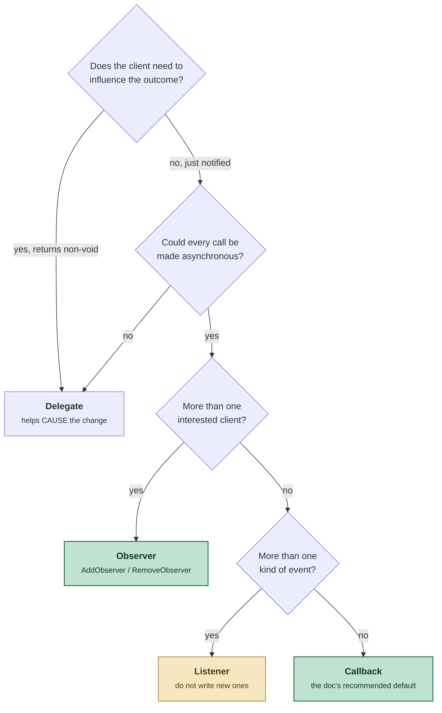
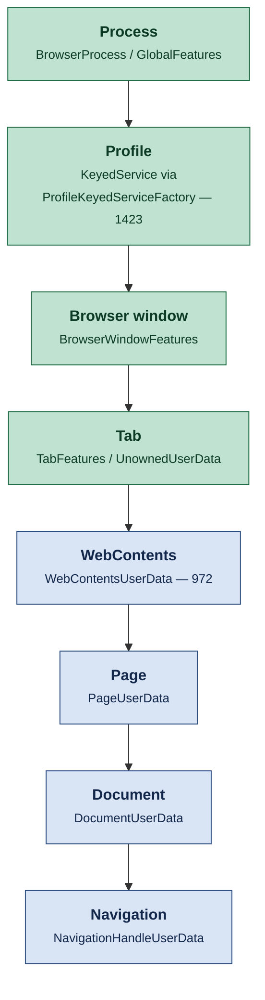
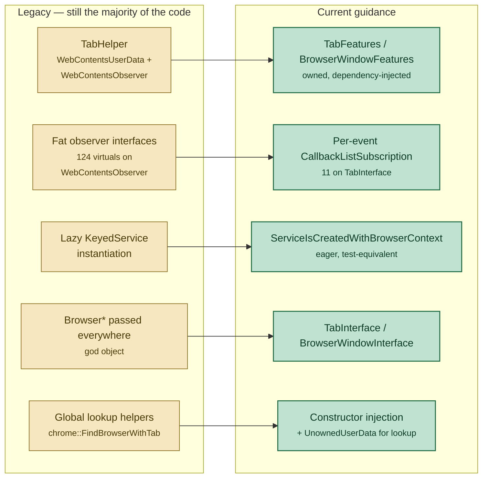
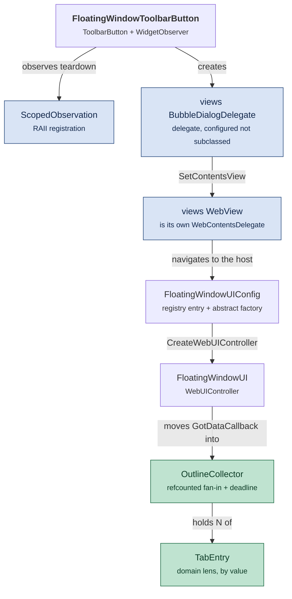

# Design patterns in this checkout

A companion to `docs/notes/chromium-cpp-idioms.md`. That note is about
expressions — what `std::move(cb).Run()` means, why `raw_ptr` exists. This one
is a level up: the *object-graph* patterns — who observes whom, who owns whom,
where per-object state is allowed to live, and which of the tree's famous
patterns are now being actively removed.

Chromium is unusual in that it **documents its own patterns in-tree**, in
`docs/patterns/` (12 write-ups) and `docs/chrome_browser_design_principles.md`.
Those documents are the primary source here; the code sampling exists to show
what the patterns actually look like at scale, and where the tree has already
moved past its own documentation.

Occurrence counts are from `*.cc`/`*.h` under `base/ chrome/ content/
components/ ui/ third_party/blink/renderer/`, on `chrome/VERSION` 153.0.8005.0.

---

## 1. The in-tree pattern catalogue

| Doc | Pattern | One-line summary |
|---|---|---|
| `docs/patterns/inversion-of-control.md` | Callback / Listener / Observer / Delegate | 404 lines; **the** foundational document, read it first |
| `docs/patterns/associated-data.md` | `SupportsUserData`, `WebContentsUserData`, `KeyedService` | how to attach per-object state you do not own |
| `docs/patterns/domain-lens.md` | Domain Lens | expose a narrow, purpose-built view of a fat class |
| `docs/patterns/builder-and-parameter-bundle.md` | Builder, Parameter Bundle | many configuration options, small runtime API |
| `docs/patterns/passkey.md` | Passkey | per-method access control, finer than `friend` |
| `docs/patterns/bool-init.md` | `bool Init()` | documented mainly to say **don't** |
| `docs/patterns/builder-lambda.md` | Builder Lambda | immediately-invoked lambda to scope construction temporaries |
| `docs/patterns/prefer-enums.md` | Enum parameters | two-value enums instead of bool arguments |
| `docs/patterns/testapi.md` | TestApi | test-only surface in a separate target |
| `docs/patterns/friend-the-tests.md` | Friend the tests | `FRIEND_TEST_ALL_PREFIXES`; discouraged |
| `docs/patterns/fortesting-methods.md` | `XForTesting()` | naming convention as a review signal |
| `docs/patterns/synchronous-runloop.md` | Synchronous RunLoop | block a thread until an event; test code only |

Beyond `docs/patterns/`:

* `docs/chrome_browser_design_principles.md` — the modern architecture of
  `//chrome/browser`: the four primitives, feature containers, dependency
  injection, and a list of named anti-patterns.
* `content/README.md` — why the `content`/`chrome` split exists, and the
  embedder-interface (`ContentClient`) escape hatch.
* `ui/base/unowned_user_data/README.md` — the newest associated-data variant.
* `docs/tab_helpers.md` — the TabHelper pattern, now carrying a deprecation
  notice at the top.

---

## 2. Inversion of control, and how to pick a flavour

`docs/patterns/inversion-of-control.md` defines the family: a **low-level class
defines an interface that a high-level class implements**, so control flows back
"up" the dependency graph. In Chromium this is also literal — `//content` cannot
depend on `//chrome`, so every time `content` needs something from `chrome`, it
happens through an inverted interface.

The document is unusually blunt about the trade-off:

> **Inversion of control should not be your first resort. It is sometimes
> useful for solving specific problems, but in general it is overused in
> Chromium.**

The family has four members, and the decision tree below picks between them, so
they need naming first:

* **Callback** — a `base::OnceCallback` or `RepeatingCallback` handed to the
  framework, which runs it. No interface, no inheritance, no registration.
* **Listener** — an interface with a single event on it, at most one instance
  per framework object. A pre-lambda construct; do not write new ones.
* **Observer** — an interface with several events on it, any number of
  registered instances, notified of things that have already happened. All
  methods return `void`.
* **Delegate** — an interface the framework consults *while* doing something, to
  make a decision or supply a missing piece. Its methods return values.

With those named, the tree's own rules for choosing:



The three tests, quoted verbatim, are worth memorising because they settle most
arguments:

* "If every call to the client could be made asynchronous and the API would
  still work fine for your use case, you have an observer or listener, not a
  delegate."
* "If there might be multiple interested client objects instead of one, you have
  an observer, not a listener or delegate."
* "**If any method on your interface has any return type other than `void`, you
  have a delegate**, not an observer or listener."

Or, in one sentence from the same doc: an observer is *notified* of a change; a
delegate helps *cause* it.

### The rules that are easy to get wrong

Five design tips from that document that show up as real bugs when ignored:

1. **Observer methods get empty bodies in the header, not `= 0`.** A pure
   virtual forces every implementer to write a stub for events they do not care
   about, and hides whether the base implementation must be called.
2. **Delegates should have sensible base implementations too**, so subclasses
   override only their part.
3. **Always pass the framework object back** to the observer
   (`OnWidgetDestroying(views::Widget* widget)`, not `OnWidgetDestroying()`).
   Without it, one object cannot observe two sources.
4. **Name methods long and specific.** A client may implement several
   interfaces, and `OnLoadStarted` will collide with somebody. Callbacks avoid
   the problem entirely.
5. **The framework must not own its observers.** Raw pointers plus
   add/remove, or a scoping helper.

---

## 3. Observer, at scale

8,955 classes inherit something named `*Observer`. The mechanism is
`base::ObserverList` (1,047 uses), whose defining property is stated at the top
of `base/observer_list.h:31`:

> "Unlike a standard vector or list, this container can be modified during
> iteration without invalidating the iterator. So, it safely handles the case of
> an observer removing itself or other observers from the list while observers
> are being notified."

That is the whole reason it is not a `std::vector<Observer*>` — notification
frequently destroys observers, and re-entrancy during `Notify` is normal, not
exceptional. `base::CheckedObserver` (615 uses) adds the other half: an observer
that is destroyed while still registered is caught, rather than leaving a
dangling pointer to be dereferenced on the next notification.

Registration is almost never done by hand. `base::ScopedObservation` (2,706
uses) pairs the add with the remove, so an observer that dies mid-observation
cannot leave the source holding a dangling pointer. The floating-window feature
uses it in the smallest possible form —
`chrome/browser/ui/views/toolbar/floating_window_toolbar_button.h:67`:

```cpp
class FloatingWindowToolbarButton : public ToolbarButton,
                                    public views::WidgetObserver {
  // views::WidgetObserver:
  void OnWidgetDestroying(views::Widget* widget) override;
 private:
  raw_ptr<views::Widget> widget_ = nullptr;
  base::ScopedObservation<views::Widget, views::WidgetObserver>
      widget_observation_{this};
};
```

Note tip 3 in action: `OnWidgetDestroying` receives the widget, and the
implementation at `.cc:56` asserts `CHECK_EQ(widget, widget_)`. And note the
*reason* it observes at all — the button does not own the bubble, but needs to
know when something it did not initiate (Esc) closed it. That is the textbook
observer use: passive notification, multiple potential listeners, no return
value.

### The fat-observer problem, and what replaced it

Design tip 4 of `inversion-of-control.md` names `WebContentsObserver` as the
tree's cautionary example: whenever *any* event fires, *every* registered
observer is notified, however few care.

The numbers in this checkout make the point:

| Interface | Virtual methods | Implementers |
|---|---|---|
| `content::WebContentsObserver` | **124** | 677 |
| `content::WebContentsDelegate` | **131** | 89 |
| `content::ContentBrowserClient` | **366** | (342 overridden in `ChromeContentBrowserClient`) |

The modern replacement is not a smaller observer interface — it is **no
interface at all**. `base::CallbackList` plus `base::CallbackListSubscription`
(2,490 uses) turns each event into its own independently subscribable channel:

```cpp
// base/callback_list.h:34 — the documented shape
CallbackListSubscription RegisterCallback(CallbackList::CallbackType cb) {
  return callback_list_.Add(std::move(cb));
}
```

`components/tabs/public/tab_interface.h` is where this has been carried
furthest. Instead of one `TabObserver` with a dozen methods, it exposes **11
separate registration points**, each returning a subscription that unregisters
on destruction:

```cpp
virtual base::CallbackListSubscription RegisterWillDiscardContents(...);
virtual base::CallbackListSubscription RegisterDidActivate(...);
virtual base::CallbackListSubscription RegisterWillDeactivate(...);
virtual base::CallbackListSubscription RegisterDidBecomeVisible(...);
virtual base::CallbackListSubscription RegisterWillBecomeHidden(...);
virtual base::CallbackListSubscription RegisterWillDetach(...);
// ... 5 more
```

A feature subscribes only to what it needs, the subscription *is* the
unregistration handle (so there is no `RemoveObserver` to forget), and the
callback can be bound with whatever state it needs — none of which a
method-per-event observer interface offers.

`tabs::ContentsObservingTabFeature`
(`chrome/browser/ui/tabs/contents_observing_tab_feature.h:23`) shows the two
styles side by side in one 40-line class: it inherits the old
`WebContentsObserver` for DOM-level events, and holds a
`base::CallbackListSubscription tab_subscription_` for the tab-level ones.

---

## 4. Delegate, and the "configure, don't subclass" variant

A delegate implements a deliberately-missing piece of a framework class. The
classic form is a `Foo::Delegate` interface with policy questions on it
(`ShouldPersistKey()`, `IsValidValueForKey()`) — non-void returns, which is
exactly the test the doc gives.

But the most common delegate shape in `//chrome/browser/ui/views` is different,
and the floating-window bubble is a clean example of it. `views::WidgetDelegate`
and its `BubbleDialogDelegate` subclass are delegates you are expected to
**configure through setters rather than subclass**:

```cpp
// chrome/browser/ui/views/floating_window/floating_window_bubble.cc:58
auto delegate = std::make_unique<views::BubbleDialogDelegate>(
    anchor_view, views::BubbleBorder::TOP_RIGHT,
    views::BubbleBorder::DIALOG_SHADOW, /*autosize=*/true);
delegate->SetButtons(static_cast<int>(ui::mojom::DialogButton::kNone));
delegate->SetShowCloseButton(false);
delegate->SetShowTitle(false);
delegate->SetAccessibleTitle(u"Floating window");
delegate->set_close_on_deactivate(false);
delegate->SetContentsView(std::move(web_view));
```

Two things worth extracting from this:

* **The View-flavoured `views::BubbleDialogDelegateView` cannot be subclassed by
  new code** — its constructors are private behind a `friend` allowlist. The
  supported path is `BubbleDialogDelegate` + `SetContentsView()`. This is the
  tree enforcing the design-principles rule "avoid subclassing existing concrete
  view subclasses".
* **`views::WebView` is its own `WebContentsDelegate`.** The sizing chain
  documented at `floating_window_bubble.cc:115` runs
  `EnableSizingFromWebContents()` → renderer auto-resize →
  `WebView::ResizeDueToAutoResize()` → `SetPreferredSize()`. A framework class
  implementing the delegate interface *on behalf of* its user is common in
  views, and it is why so much works with no delegate code written at all.

### Client: the delegate that crosses a layer boundary

`ContentBrowserClient` is the same pattern applied to the `content`/`chrome`
boundary, and its own class comment (`content_browser_client.h:301`) is the
best statement of the cost:

> "Embedder API (or SPI) for participating in browser logic... Use this 'escape
> hatch' **sparingly, to avoid the embedder interface ballooning and becoming
> very specific to Chrome**."

At 366 virtual methods with 342 of them overridden in `chrome`, the interface
did balloon. `content/README.md` prefers the alternative where possible: expose
a generic extension point that features subscribe to, rather than a new client
method per feature.

---

## 5. Associated data: where per-object state is allowed to live

This is the pattern with the most variants, and picking the wrong one is the
most common architectural mistake in `//chrome/browser`.

The problem, from `docs/patterns/associated-data.md`: a central class `C` is
used by consumers in other modules that do not control `C`'s lifetime, and each
wants to store something per-instance-of-`C`. Putting the fields on `C` makes
`C` responsible for invariants that belong to strangers; putting a
`map<C*, Data>` in each consumer makes every consumer track `C`'s destruction.
The pattern splits it: **`C` owns the lifetime of the data, the consumer owns
its invariants.**

`base::SupportsUserData` is the raw mechanism — a keyed
`map<const void*, unique_ptr<Data>>` mixed into the central class, where the key
is conventionally the address of a static (or of the consumer instance itself,
when there can be several).

What matters in practice is that Chromium has a **ladder of scopes**, and each
rung has its own typed helper. Choosing the right rung is the design decision.

Every rung below is a browser-process object, and each names the thing whose
lifetime bounds the data attached to it. The four long-lived ones are the
product concepts from §6 — process, profile, browser window, tab. The four
short-lived ones are `//content` primitives and are worth knowing apart, because
they look interchangeable and are not: a **`WebContents`** is the renderer-backed
object a tab holds, and survives navigation; a **`Page`** is one primary page
within it, replaced on a cross-document navigation; a **`Document`** is one DOM
document, so a same-document navigation keeps it and a reload does not; and a
**`NavigationHandle`** exists only for the duration of a single navigation
attempt, which may never commit at all.



`content/public/browser/web_contents_user_data.h:19` warns about exactly this
choice:

> "When considering using this class, please carefully consider the intended
> lifetime of the data... It is preferable to use a more specific UserData
> class, rather than storing non-WebContents state as a WebContentsUserData
> combined with using a WebContentsObserver to manually reset the state."

The mechanism itself is a CRTP template plus a macro pair — `WebContentsUserData<T>`
supplies `CreateForWebContents()`, `FromWebContents()` and the key, and
`WEB_CONTENTS_USER_DATA_KEY_DECL()` / `..._IMPL(T)` give the type its unique key
address. The constructor is private with `friend WebContentsUserData`, so an
instance can only come into existence attached to a `WebContents`.

### KeyedService: associated data with a dependency graph

`KeyedService` (701 direct subclasses) is the profile-scoped rung, and its
distinguishing feature over plain `SupportsUserData` is that factories **declare
dependencies on each other**, so construction and two-phase shutdown are
ordered. `ProfileKeyedServiceFactory` (1,423 uses) is the `//chrome` subclass.

The design-principles doc adds a rule the pattern doc does not:

> "Override `ServiceIsCreatedWithBrowserContext` to return `true`. This
> guarantees precise lifetime semantics. **Lazy instantiation is an
> anti-pattern.**"

The reasoning is about tests, and it generalises well beyond `KeyedService`:
production starts at `content::ContentMain()` and instantiates services in one
order; a test harness instantiates a *subset* at a different time in a different
order. Divergent behaviour gets papered over with early-exit conditionals in
production code. Eager construction removes the whole class of problem.

### UnownedUserData: the newest rung

`ui/base/unowned_user_data/README.md` describes the most recent addition (206
uses of `ScopedUnownedUserData<>`, 148 `DECLARE_USER_DATA`). It separates the
two jobs the older patterns fused together:

* **lifetime** stays with the owner (`TabFeatures`, `BrowserWindowFeatures`);
* **lookup** goes through the host, so `MyFeature::From(tab)` works.

The point is testability: a `MockTabInterface` has no `TabFeatures`, so nothing
reachable through the old path is injectable. With an `UnownedUserDataHost` on
the mock, a single real feature can be attached to an otherwise mocked tab. The
cost is about seven lines:

```cpp
class MyTabFeature {
  DECLARE_USER_DATA(MyTabFeature);              // + DEFINE_USER_DATA in the .cc
  static MyTabFeature* From(TabInterface* tab); // convenience wrapper
 private:
  ScopedUnownedUserData<MyTabFeature> scoped_unowned_user_data_;
};
```

---

## 6. Feature containers and core controllers

`docs/chrome_browser_design_principles.md` names four primitives — profile,
browser window, tab, `WebContents` — and states where the state for each lives:

| Primitive | Represented by | State lives in |
|---|---|---|
| process | `BrowserProcess` | `GlobalFeatures` |
| profile | `Profile` | `ProfileKeyedService` |
| browser window | `BrowserWindowInterface` | `BrowserWindowFeatures` |
| tab | `TabInterface` | `TabFeatures` |

Every feature is expected to have "a core controller with precise lifetime
semantics", owned and instantiated by exactly one of those containers, with its
**dependencies injected in the constructor**. The doc's own example:

```cpp
// Do not do this:
FooFeature(Browser* browser) : browser_(browser) {}
FooFeature::DoStuff() { DoStuffWith(browser_->profile()->GetPrefs()); }

// Do this:
FooFeature(PrefService* prefs) : prefs_(prefs) {}
FooFeature::DoStuff() { DoStuffWith(prefs_); }
```

`class Browser` is named, in the tree's own documentation, as "a god-object
anti-pattern"; Project Bedrock exists to remove it. The replacement interfaces
are `BrowserWindowInterface` and `TabInterface`.

**The scoping bug this prevents** is worth stating on its own, because it is the
reason the rule exists rather than a style preference: a tab-scoped feature that
caches a `Browser*` or `BrowserView*` points at the wrong window as soon as the
tab is dragged out into a new one. A tab feature is supposed to hold
`TabInterface* tab_` and reach the window dynamically through
`tab_->GetBrowserWindowInterface()->GetFeatures()`. Similarly, anything
profile-scoped — the doc's example is extension install/uninstall — belongs in a
`KeyedService`, not on a tab feature, or two tabs racing will uninstall it while
the other is using it.

The floating-window feature is on the correct side of this by construction:
`FloatingWindowToolbarButton` holds a `raw_ptr<Browser>` only to reach
`browser_->GetProfile()` once, and `HandleRequest()` is bound to a `Profile*`,
never a `Browser*` — which is precisely why an Incognito window's floating
window lists only Incognito tabs.

---

## 7. Domain lens

A domain lens is a purpose-built, narrow view of a fat class, so a client can
depend on the view instead of the class. `docs/patterns/domain-lens.md` gives
two motivations: testing a UI component should not require constructing an
entire `NetworkRequest`, and a second backing type should not have to subclass
the first just to be displayable.

The in-tree example the doc cites is `tabs::TabData`
(`chrome/browser/ui/tabs/tab_data.h:35`), and it is exactly the shape described
— a plain copyable/movable struct with a translation function, no methods that
mutate anything, no `WebContents` access:

```cpp
struct TabData {
  static TabData FromTabInterface(tabs::TabInterface* tab);
  TabData(const TabData& other);
  TabData(TabData&& other);
  bool operator==(const TabData& other) const;
  // ... only the fields needed to draw a tab
};
```

`TabEntry` in `chrome/browser/ui/webui/floating_window/floating_window_ui.cc:262`
is the same pattern arrived at for a different reason — and its comment gives
the second, sharper motivation:

```cpp
// Note that this deliberately holds *copies* rather than a WebContents*. The
// snapshots complete asynchronously, and a tab can be closed while they are in
// flight; holding the title and URL by value means a tab that disappears
// mid-gather still renders as the row it was, instead of dangling.
struct TabEntry {
  int window_number = 0;
  bool is_active = false;
  std::u16string title;
  std::string url;
  std::vector<Heading> outline;
  bool snapshot_returned = false;
};
```

A lens over a mutable object is also a **snapshot**, and that turns a lifetime
problem into a non-problem. The warning in the pattern doc still applies:
domain lenses are easy to overuse, since every client uses only a subset of a
fat class and that alone does not justify a new type.

---

## 8. Factory and registry

Three distinct things get called "factory" here.

**Static `Create()` returning null on failure.** Constructors cannot fail
without exceptions, so a class whose construction can fail exposes a factory and
keeps the constructor private or trivial.
`third_party/blink/renderer/modules/digitclassifier/digit_classifier_model.cc`
is the minimal form — it constructs, calls a private `Initialize()`, and returns
`nullptr` if any GPU resource could not be created. This is the *safe* use of
the `bool Init()` pattern; `docs/patterns/bool-init.md` exists mainly to say
that a **public** `Init()` clients must remember to call is the anti-pattern.

**Service factories with a dependency graph** — `BrowserContextKeyedServiceFactory`
(955) / `ProfileKeyedServiceFactory` (1,423), covered above.

**Registries that map a key to a constructor.** The floating-window feature adds
one entry to a global registry, and its header
(`chrome/browser/ui/webui/floating_window/floating_window_ui.h:15`) documents
the whole lifecycle:

```cpp
// The lifecycle is:
//   1. RegisterChromeWebUIConfigs() adds one instance of this class to the
//      global WebUIConfigMap at startup (see chrome_web_ui_configs.cc).
//   2. When something navigates to chrome://floating-window, content looks the
//      host up in that map.
//   3. The map calls CreateWebUIController(), which builds a FloatingWindowUI
//      for the WebContents doing the navigating.
class FloatingWindowUIConfig
    : public content::DefaultWebUIConfig<FloatingWindowUI> {
  FloatingWindowUIConfig()
      : DefaultWebUIConfig(content::kChromeUIScheme,
                           chrome::kChromeUIFloatingWindowHost) {}
};
```

`content::WebUIConfig` is the abstract factory (`CreateWebUIController()` plus
policy hooks like `IsWebUIEnabled()` and `ShouldHandleURL()`);
`DefaultWebUIConfig<T>` is the template-method specialisation that fills in the
common case, `std::make_unique<T>(web_ui)`. Deriving from the bare `WebUIConfig`
is only needed when construction takes more than the `WebUI*`, or when the page
must be conditionally disabled. Registration is one line:
`chrome/browser/ui/webui/chrome_web_ui_configs.cc:340`.

---

## 9. Builder and parameter bundle

The problem stated in `docs/patterns/builder-and-parameter-bundle.md`: a class
with many configuration options is forced to choose between a huge constructor
and public setters that make logically-`const` members non-`const` and move
validation to runtime.

* **Parameter bundle** — a `Foo::Params` struct. Note the doc's caveat: since
  constructors cannot fail, it must be *impossible to make an invalid Params*,
  or the class needs a factory to validate.
* **Builder** — a `Foo::Builder` whose setters return `Builder&`, so
  configuration chains and no temporary needs naming:
  ```cpp
  auto c = C::Builder().set_name(name).set_color(color).Build();
  ```
* **Optional-only bundle** — required arguments stay positional, optional ones
  go in a chainable `Params` with a default: `C("foo", ..., Params().set_is_cool(true))`.

In-tree: `ui::DialogModel::Builder` (`ui/base/models/dialog_model.h:170`), and
`views::Builder<>` (614 uses in `chrome/` and `ui/`), which extends the idea to
declarative construction of whole view hierarchies.

The **builder lambda** (`docs/patterns/builder-lambda.md`) is a smaller relative
worth recognising, because it is the one place the style guide's ban on default
capture-by-reference is explicitly lifted:

```cpp
C foo = [&]() -> auto {
  A a;
  a.set_property(value);
  return MakeC(a);
}();
```

The lambda gives block scope for the temporary `A` while letting `foo` stay
immutable. It is safe because the lambda provably cannot escape the scope.

---

## 10. Access control patterns

**Passkey** (`docs/patterns/passkey.md`, 2,003 uses) — a parameter type only one
class can construct, so a public method is callable by exactly that class:

```cpp
using BarPassKey = base::PassKey<Bar>;
void HelpBarOut(BarPassKey, ...);   // leave the parameter unnamed
```

Unlike `friend`, it is per-method rather than per-class, and the capability can
be *delegated* — `Bar` may hand a passkey to a helper. It costs nothing but a
few bytes of argument space. Its most common use is letting
`std::make_unique` / `blink::MakeGarbageCollected` construct a class without
handing construction rights to everyone.

**The test-access ladder** — three patterns for the same problem, in increasing
weight, and the tree documents when each stops being appropriate:

| Pattern | Shape | Use when | Breaks down when |
|---|---|---|---|
| `friend the tests` | `FRIEND_TEST_ALL_PREFIXES(FooTest, X)` — 4,744 uses | one test suite needs a field | many suites need it; couples tests to implementation |
| `ForTesting methods` | `void DoStuffForTesting();` | a small amount of test surface | there are lots of them |
| `TestApi` | separate `foo_test_api.{h,cc}`, linked only into test targets | a widely-used class needs real test surface | an extensive TestApi means the class is doing too much |

All three docs push toward the same conclusion — "test the contract, not the
implementation" — and `friend-the-tests.md` says outright that testing private
methods separately is usually a sign the private behaviour is unnecessary.

---

## 11. Cross-process: Mojo as inversion of control over a pipe

Everything above assumes both halves are in one process. Across a process
boundary the same patterns appear, generated rather than hand-written: a
`.mojom` interface definition produces a `mojo::Remote<T>` (4,657) on the
calling side and a `mojo::Receiver<T>` (6,819 `PendingReceiver` uses) on the
implementing side. A `Remote` is a proxy; a `Receiver` binds an implementation
to a pipe.

Two things carry over from the in-process patterns and are worth watching for:

* **The reply callback is a `OnceCallback` that may be dropped, not just
  delayed.** If the other process dies, the callback is destroyed without
  running. `mojo::WrapCallbackWithDefaultInvokeIfNotRun()` is the standard
  guard; `floating_window_ui.cc:628` uses it around an accessibility-snapshot
  request for exactly this reason.
* **A dropped pipe is the disconnect event**, which is the cross-process
  equivalent of `OnWidgetDestroying` — you observe teardown by observing the
  connection, not by being told.

The floating-window feature is a useful negative example here: it deliberately
has **no `.mojom` of its own**. It needed browser→renderer data, and got it by
reusing an existing generic extension point (`RequestAXTreeSnapshot`) rather
than adding an interface — which is precisely the preference `content/README.md`
states.

---

## 12. Blink's own patterns

`third_party/blink/renderer/` uses the same vocabulary with different spellings,
plus two patterns that have no `//chrome` equivalent.

**Supplement** (884 uses) is Blink's associated-data pattern, and it inverts the
dependency the same way `KeyedService` does: a module bolts a property onto a
`core/` class without `core/` knowing the module exists. The
`digitclassifier` branch adds `navigator.digitclassifier` this way:

```cpp
class NavigatorDigitClassifier final
    : public GarbageCollected<NavigatorDigitClassifier>,
      public Supplement<NavigatorBase> {
  static const char kSupplementName[];
  static DigitClassifier* digitclassifier(NavigatorBase& navigator);
};

DigitClassifier* NavigatorDigitClassifier::digitclassifier(
    NavigatorBase& navigator) {
  auto* supplement = Supplement<NavigatorBase>::From<NavigatorDigitClassifier>(
      navigator);
  if (!supplement) {
    supplement = MakeGarbageCollected<NavigatorDigitClassifier>(navigator);
    ProvideTo(navigator, supplement);
  }
  return supplement->digit_classifier_.Get();
}
```

The `From()` / `ProvideTo()` lazy-instantiation dance is the same shape as
`WebContentsUserData::GetOrCreateForWebContents()` — keyed by
`kSupplementName` instead of a static address.

**Visitor** is how Oilpan traces the object graph. Every GC object implements
`void Trace(Visitor*) const`, visits each `Member<>`, and **calls its base
class's `Trace`** — omitting either is a use-after-free that only appears under
GC pressure. It is a genuine Visitor: the object knows its own structure, the
visitor decides what to do with each edge.

`blink-c++.md` also contributes one composition rule with no analogue elsewhere:
**a class has either `Create()` factories or public constructors, never both** —
and Passkey is the sanctioned way to have a `Create()` that can still call
`MakeGarbageCollected`.

---

## 13. What the tree is migrating away from

The most useful thing to know about Chromium's patterns is which ones are on
the way out, because the code is full of both sides and the older side is more
numerous.



`docs/tab_helpers.md` now opens with the deprecation notice:

> "Tab helpers are in the process of being deprecated. When possible prefer to
> use TabFeatures over TabHelpers."

The design-principles doc adds explicit anti-pattern labels: lazy
`WebContentsUserData` instantiation, `NoDestructor` singletons as core
controllers, self-owned view/controller objects, subclassing `Widget`, nested
message loops, and global functions that access non-global state (naming static
methods on `BrowserList`).

There is also a general one worth quoting, because it explains several of the
others:

> "Avoid tight coupling of unrelated features. This results in O(N²)
> complexity, since every pair of features ends up implicitly coupled. The
> proper solution is to work with UX to use consistent design language, which in
> turn results in O(N) complexity."

---

## 14. One feature, read as a stack of patterns

The floating-window feature is small enough to hold in one diagram and uses
seven of the patterns above. Every box is a browser-process object:
`FloatingWindowToolbarButton` is the toolbar control (§3), `BubbleDialogDelegate`
and `views::WebView` are the views classes behind the floating surface (§4),
`FloatingWindowUIConfig` and `FloatingWindowUI` are the WebUI registry entry and
its controller (§8), and `OutlineCollector` and `TabEntry` are the file-local
helpers in `floating_window_ui.cc` that gather the outlines and hold one row's
worth of data (§7).



Reading the seams is the useful part:

1. **Observer** — the button observes the widget because the bubble can close
   itself (Esc), so `widget_` must be invalidated from outside
   (`floating_window_toolbar_button.cc:53`).
2. **Delegate, configured not subclassed** — no `BubbleDialogDelegate` subclass
   exists in the feature.
3. **Delegate supplied by the framework** — `views::WebView` is already a
   `WebContentsDelegate`, so auto-resize works with no delegate code written.
4. **Registry + abstract factory** — one line in `chrome_web_ui_configs.cc`
   makes `chrome://floating-window` exist.
5. **Inverted control through a callback** — `WebUIDataSource::GotDataCallback`
   is the low-level interface `content` defines and `chrome` fills in. The whole
   asynchronous redesign needed *no new mechanism*, because that interface was
   already callback-shaped.
6. **Fan-in with a deadline** — `OutlineCollector` is refcounted because two
   independent things keep it alive (the reply callbacks and its own timer), and
   `Finish()` is idempotent because it is reachable from both.
7. **Domain lens** — `TabEntry` holds copies, so a tab closed mid-gather still
   renders as the row it was.

---

## 15. Quick reference

| Pattern | Canonical header | In-tree doc |
|---|---|---|
| Callback / Observer / Delegate | `base/functional/callback.h` | `docs/patterns/inversion-of-control.md` |
| Observer list | `base/observer_list.h`, `base/observer_list_types.h` | ↑ |
| Scoped registration | `base/scoped_observation.h` | ↑ |
| Per-event subscription | `base/callback_list.h` | ↑ |
| Associated data | `base/supports_user_data.h` | `docs/patterns/associated-data.md` |
| Per-WebContents data | `content/public/browser/web_contents_user_data.h` | `docs/tab_helpers.md` (deprecated) |
| Per-profile service | `components/keyed_service/core/keyed_service.h` | `docs/patterns/associated-data.md` |
| Injectable feature lookup | `ui/base/unowned_user_data/scoped_unowned_user_data.h` | `ui/base/unowned_user_data/README.md` |
| Feature containers | `chrome/browser/ui/tabs/public/tab_features.h`, `chrome/browser/ui/browser_window/public/browser_window_features.h` | `docs/chrome_browser_design_principles.md` |
| Tab / window interfaces | `components/tabs/public/tab_interface.h` | ↑ |
| Domain lens | `chrome/browser/ui/tabs/tab_data.h` | `docs/patterns/domain-lens.md` |
| Builder | `ui/base/models/dialog_model.h` | `docs/patterns/builder-and-parameter-bundle.md` |
| Passkey | `base/types/pass_key.h` | `docs/patterns/passkey.md` |
| Embedder client | `content/public/browser/content_browser_client.h` | `content/README.md` |
| WebUI registry | `content/public/browser/webui_config.h` | — |
| Cross-process interfaces | `mojo/public/cpp/bindings/README.md` | `mojo/README.md` |
| Blink supplement | `third_party/blink/renderer/platform/supplementable.h` | `styleguide/c++/blink-c++.md` |
| Test access | — | `docs/patterns/{testapi,friend-the-tests,fortesting-methods}.md` |
| Blocking on an event in tests | `base/run_loop.h` | `docs/patterns/synchronous-runloop.md` |
