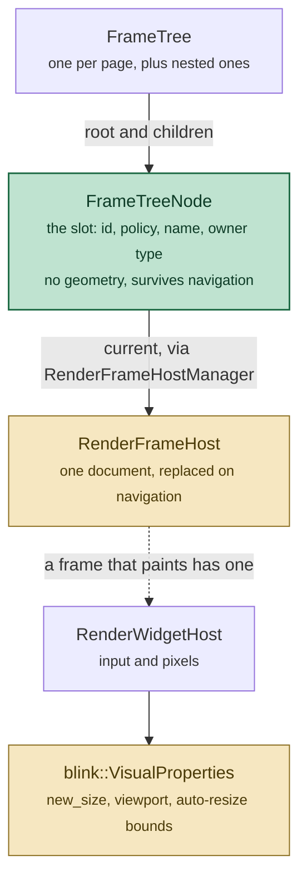
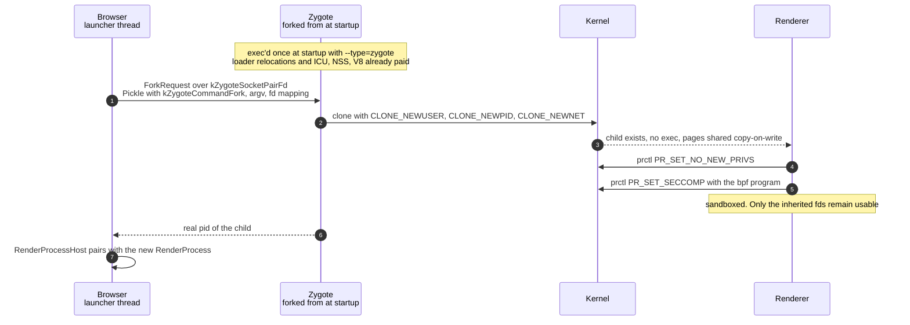
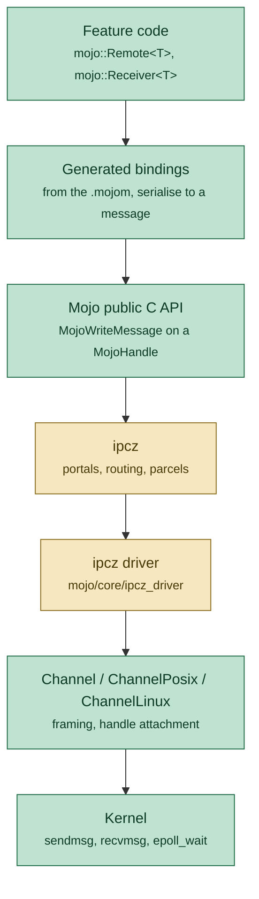
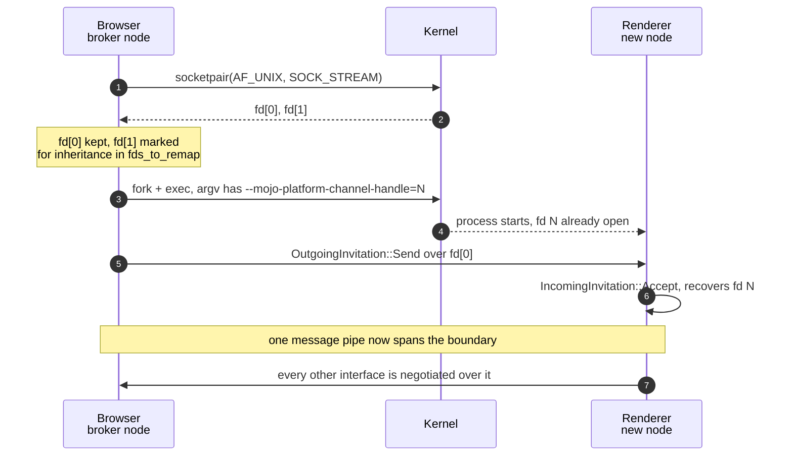
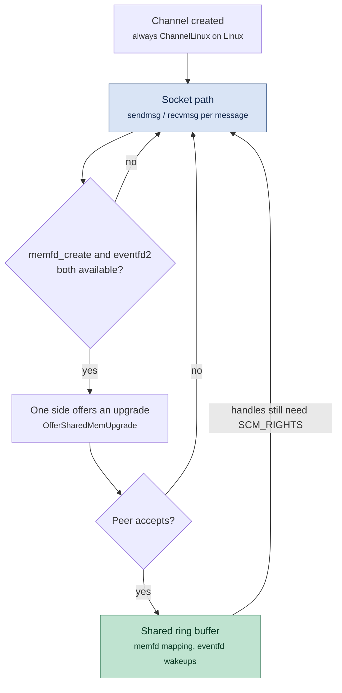
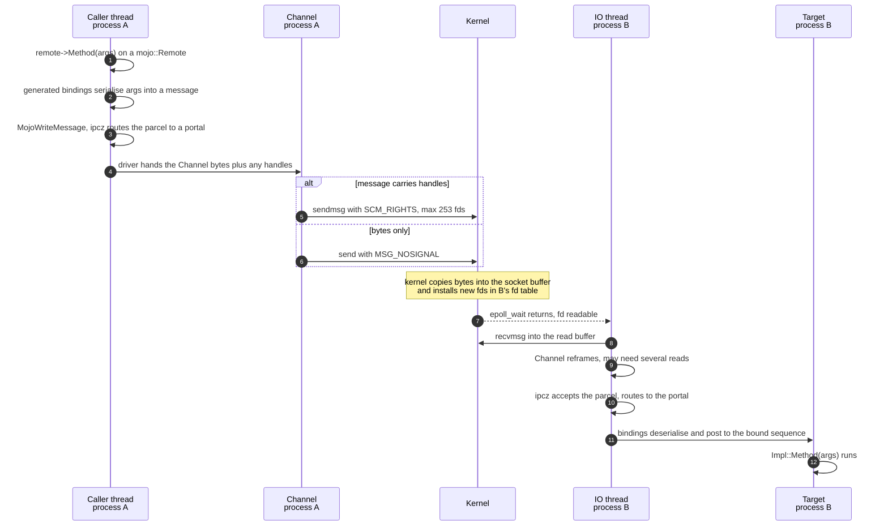

# Processes and IPC on Linux, down to the system calls

Two halves of one story: how Chromium creates a renderer process on Linux, and
how a `mojo::Remote<T>` method call in one process becomes a `sendmsg()` on an
`AF_UNIX` socket in another.

Written against this checkout (`chrome/VERSION` 153.0.8005.0) rather than against
upstream documentation, because on two points they disagree — §0 and §1.

**Companion notes in this directory:**

* [`chromium-android-architecture.md`](chromium-android-architecture.md) — the
  layering-vs-process mental model, and what differs on Android.
* [`chromium-cpp-idioms.md`](chromium-cpp-idioms.md) — the C++ dialect. Its §3
  covers `base::OnceCallback`, which is what a Mojo reply is.
* [`chromium-design-patterns.md`](chromium-design-patterns.md) — the
  object-graph patterns. Its §12 covers Mojo as inversion of control over a
  pipe, and its §11 covers the feature flags that gate §6 below.

> **Source links.** Paths link into
> [github.com/obeletski/chromium](https://github.com/obeletski/chromium) on the
> `floating-window` branch, with `#L` anchors where a line is cited. They drift
> if the branch is rebased.

---

## 0. Read this before `mojo/core/README.md`

[`mojo/core/README.md`](https://github.com/obeletski/chromium/blob/floating-window/mojo/core/README.md)
is the best overview in the tree and is **stale in one structural way**: it
describes routing built on `mojo/core/ports`, a hand-rolled Node/Port network.
That layer is no longer the one that runs. In this checkout,
[`embedder.cc:65`](https://github.com/obeletski/chromium/blob/floating-window/mojo/core/embedder/embedder.cc#L65):

```cpp
void Init(const Configuration& configuration) {
  internal::g_configuration = configuration;
  CHECK(!configuration.disable_ipcz);
  if (IsMojoIpczEnabled()) {
    CHECK(InitializeIpczNodeForProcess({...}));
    MojoEmbedderSetSystemThunks(GetMojoIpczImpl());
  } else {
    NOTREACHED();
  }
}
```

A `CHECK` on the way in and a `NOTREACHED()` on the legacy branch: **ipcz is the
only backend**. Routing now lives in
[`third_party/ipcz`](https://github.com/obeletski/chromium/blob/floating-window/third_party/ipcz/README.md)
(checked in, not a submodule, so it is browsable), and `mojo/core` supplies it
with a *driver*.

The good news for this document: the ports-vs-ipcz change is above the transport.
Everything from `Channel` downwards — the socket, the syscalls, the fd passing —
is the same code either way, and the README's "Node to Node IPC", "Packet
Framing" and "Security" sections remain accurate.

---

## 1. Creating a renderer, and the classes that name it

### The class pairing, checked against this tree

The canonical description is the
[Multi-process Architecture](https://www.chromium.org/developers/design-documents/multi-process-architecture/)
design document, whose central idea is a **browser-side host object paired with
a renderer-side object**, one pair per concept. The pairing is only two thirds
of the picture — `FrameTreeNode`, below, is the third object and belongs to
neither side:

| Browser process | Renderer process | In this checkout |
|---|---|---|
| `RenderProcessHost` — browser-side state and communication for one renderer | `RenderProcess` — per-renderer global state | [`render_process_host.h`](https://github.com/obeletski/chromium/blob/floating-window/content/public/browser/render_process_host.h), [`render_process_impl.h`](https://github.com/obeletski/chromium/blob/floating-window/content/renderer/render_process_impl.h) |
| `RenderFrameHost` — state for one document, and the channel to that frame | `RenderFrame` — one frame containing a web document | both present under `content/public/` |
| `RenderWidgetHost` — input and painting for one widget | `RenderWidget` | **host only**; see below |
| `Browser` — a top-level browser window | — | see the caveat below |

Two corrections worth carrying, because the design doc is older than the code:

* **`RenderWidget` no longer exists** as a class in `content/`. Its renderer-side
  role was folded into Blink's
  [`WebFrameWidget`](https://github.com/obeletski/chromium/blob/floating-window/third_party/blink/public/web/web_frame_widget.h).
  `RenderWidgetHost` is still very much alive. `RenderView` is likewise gone —
  `RenderFrame`/`RenderFrameHost` replaced it when site isolation made the frame,
  not the tab, the unit of everything.
* **`Browser` is not a `content/` concept** and, in `//chrome`, is explicitly
  called "a god-object anti-pattern" by
  `docs/chrome_browser_design_principles.md`. New code takes
  `BrowserWindowInterface` — see §6 of the design-patterns note.

The doc's rule of thumb — "in general, each new window or tab opens in a new
process" — is now a simplification: process allocation is driven by site
isolation and a process limit, so same-site frames across tabs may share one
renderer while cross-site iframes in one tab do not.

### `FrameTreeNode`: the slot, not the frame

The host/renderer table above is only two thirds of the picture. There is a
third object that is neither, and mistaking it for a frame is the usual first
error when reading `content/browser/renderer_host/`.

**Its inheritance chain is one level deep**
([`frame_tree_node.h:60`](https://github.com/obeletski/chromium/blob/floating-window/content/browser/renderer_host/frame_tree_node.h#L60)):

```
RenderFrameHostOwner        pure interface, 12 pure-virtual methods, no base
        ▲
FrameTreeNode : public RenderFrameHostOwner
```

There is no shared tree-node base class. The interface exists for a reason worth
knowing, and its comment states it
([`render_frame_host_owner.h:38`](https://github.com/obeletski/chromium/blob/floating-window/content/browser/renderer_host/render_frame_host_owner.h#L38)):

> "An interface for `RenderFrameHostImpl` to communicate with `FrameTreeNode`
> owning it... As main `RenderFrameHostImpl` can be moved between different
> `FrameTreeNode`s (i.e. during prerender activations), `RenderFrameHostImpl`
> should not reference `FrameTreeNode` directly to prevent accidental violation
> of implicit 'associated FTN stays the same' assumptions."

That is the domain lens pattern (§7 of the design-patterns note) used defensively:
a deliberately narrow view of the owner, so that code cannot casually assume a
relationship that prerender activation is allowed to break.

**It has no size, and that is the design.** Grepping the header for
`size|bounds|rect|viewport` turns up only `child_count()` and
`GetFencedFrameDepth()`. A `FrameTreeNode` is a *position in the tree*; what it
holds is slot identity rather than geometry:

| Held | What it is |
|---|---|
| `FrameTreeNodeId` | identity that survives navigation |
| `FrameOwnerElementType` | which element created the frame |
| `FramePolicy` | sandbox flags and permissions policy from the owner element |
| `FrameOwnerProperties` | scrolling, margins and similar owner attributes |
| `TreeScopeType` | document tree vs shadow tree |
| frame name | the `name` attribute, i.e. the `window.open` target |
| `RenderFrameHostManager` | the current and speculative `RenderFrameHost`s |

Geometry lives on the **widget** side instead, in
[`blink::VisualProperties`](https://github.com/obeletski/chromium/blob/floating-window/third_party/blink/public/common/widget/visual_properties.h)
— `new_size_device_px`, `visible_viewport_size_device_px`, the auto-resize
bounds — travelling between `RenderWidgetHost` and the renderer's widget. Two
different objects because they have different lifetimes: the class comment says
a node "is a wrapper for all objects that are frame-specific (as opposed to
page-specific)", and that its "current RenderFrameHost ... can change over time
as the frame is navigated". The node is the durable slot; documents pass
through it.



**What makes it a frame is being in the tree**; the tree holds nothing else. The
nearest thing to a discriminator is `FrameOwnerElementType`
([`frame_owner_element_type.h:12`](https://github.com/obeletski/chromium/blob/floating-window/third_party/blink/public/common/frame/frame_owner_element_type.h#L12)):

```cpp
kNone = 0,     // no owner element, i.e. a main frame
kIframe,
kObject,       // <object> that created a nested browsing context
kEmbed,
kFrame,        // legacy <frame> inside a frameset
kFencedframe,
```

`<object>` and `<embed>` get real `FrameTreeNode`s, which surprises anyone
assuming "frame" means `<iframe>`.

**There is no `NonFrameNode`** — grepping the tree finds no such symbol, and
there is no room for one, since `FrameTree`'s accessors are typed
`FrameTreeNode*` throughout. The things that execute or render *without* a
`FrameTreeNode` are separate categories rather than a sibling class: workers
(`DedicatedWorkerHost`, `SharedWorkerHost`, service workers) are script with no
document and no frame; ordinary DOM elements live in Blink's `Node` tree, a
different tree entirely; and browser UI is Views.

The cases that look like exceptions are not. Fenced frames, guest views
(`<webview>`) and prerendered pages all get real `FrameTreeNode`s — in a
separate, **nested `FrameTree`**. That is what the two predicates at
[`frame_tree_node.h:118`](https://github.com/obeletski/chromium/blob/floating-window/content/browser/renderer_host/frame_tree_node.h#L118)
distinguish, with a warning attached:

> "Frame trees may be nested so it can be the case that `IsMainFrame()` is true,
> but is not the outermost main frame. In particular, `!IsMainFrame()` cannot
> [be relied on]... use `!IsOutermostMainFrame()` instead."

### The Linux mechanism: fork from a zygote, no exec

Here is where Linux departs sharply from Windows and macOS, and where a
reasonable guess is wrong: **a renderer is not `exec`'d**. There is no `execve`
anywhere in [`zygote_linux.cc`](https://github.com/obeletski/chromium/blob/floating-window/content/zygote/zygote_linux.cc).

The launcher chooses between two paths
([`child_process_launcher_helper_linux.cc:87`](https://github.com/obeletski/chromium/blob/floating-window/content/browser/child_process_launcher_helper_linux.cc#L87)):

```cpp
ZygoteCommunication* zygote_handle = GetZygoteForLaunch();
if (zygote_handle) {
  base::ProcessHandle handle = zygote_handle->ForkRequest(
      command_line()->argv(), files_to_register->GetMapping(), GetProcessType());
  ...
} else {
  process.process = base::LaunchProcess(*command_line(), *options);  // fork + exec
}
```

The zygote path is the default; `--no-zygote` selects the second.
[`docs/linux/zygote.md`](https://github.com/obeletski/chromium/blob/floating-window/docs/linux/zygote.md) gives the reasoning,
and it is worth reading because two of the three reasons are not about speed:

* **Amortised startup.** Dynamic-loader relocations cost "~6 MB and 60 ms/GHz
  per process"; ICU, NSS and the V8 snapshot cost up to ~8 MB more. Fork after
  that work and every renderer inherits it, sharing the pages copy-on-write.
* **Version consistency.** If the `chrome` binary or its shared libraries are
  replaced on disk while Chromium is running, a later `exec` would start a
  *different version* — "a version x browser might be talking to a version y
  renderer. Our IPC system does not support this (and does not want to!)." The
  zygote is exec'd once at startup and holds the correct binary open.
* **Address-space randomisation.** The zygote is itself `exec`'d, so renderers
  get a different layout from the browser.

The zygote is started by `--type=zygote`, listens on a socket pair whose fd is
pinned at [`zygote_commands_linux.h:36`](https://github.com/obeletski/chromium/blob/floating-window/content/common/zygote/zygote_commands_linux.h#L36)
(`kZygoteSocketPairFd = base::GlobalDescriptors::kBaseDescriptor`), and receives
a `base::Pickle` carrying `kZygoteCommandFork` plus the child's argv and fd
mapping ([`zygote_communication_linux.cc:108`](https://github.com/obeletski/chromium/blob/floating-window/content/common/zygote/zygote_communication_linux.cc#L108)).

### The syscalls

`Zygote::ForkWithRealPid`
([`zygote_linux.cc:386`](https://github.com/obeletski/chromium/blob/floating-window/content/zygote/zygote_linux.cc#L386))
reaches one of two calls, depending on whether the namespace sandbox is in play:

```cpp
pid = sandbox::NamespaceSandbox::ForkInNewPidNamespace(...);   // sandboxed
pid = sandbox::Credentials::ForkAndDropCapabilitiesInChild();  // otherwise
```

The first bottoms out in `base::ForkWithFlags`, which is a **`clone()`**, not a
`fork()` ([`launch_posix.cc:781`](https://github.com/obeletski/chromium/blob/floating-window/base/process/launch_posix.cc#L781)):

```cpp
return clone(&CloneHelper, stack, flags, env, ptid, nullptr, ctid);
```

with the namespace flags from
[`namespace_sandbox.cc:142`](https://github.com/obeletski/chromium/blob/floating-window/sandbox/linux/services/namespace_sandbox.cc#L142):

```cpp
: ns_types(CLONE_NEWUSER | CLONE_NEWPID | CLONE_NEWNET)
```

— a new user namespace (so the process can drop privileges without being root),
a new PID namespace (so it cannot see or signal other processes), and a new
network namespace (so it cannot open sockets). That is **layer one** of the
sandbox.

**Layer two** is seccomp-bpf, installed after the fork
([`sandbox_bpf.cc:245`](https://github.com/obeletski/chromium/blob/floating-window/sandbox/linux/seccomp-bpf/sandbox_bpf.cc#L245)):

```cpp
if (prctl(PR_SET_NO_NEW_PRIVS, 1, 0, 0, 0)) { ... }
...
if (prctl(PR_SET_SECCOMP, SECCOMP_MODE_FILTER, &prog)) { ... }
```

with the modern `seccomp(SECCOMP_SET_MODE_FILTER, ...)` syscall preferred where
available (`:275`). `PR_SET_NO_NEW_PRIVS` first is mandatory, not optional: the
kernel refuses a seccomp filter from an unprivileged process without it, and it
is what stops a setuid binary regaining privilege after the filter is on.



The last note is the one that ties this section to the rest of the document: a
sandboxed renderer has no network namespace and a seccomp filter, so **the only
way it can reach anything is through file descriptors it already holds**. One of
those is the Mojo channel from §3. That is why the sandbox and the IPC design
have to be understood together.

## 2. The participants

Named before the diagrams use them, because half of these are easy to confuse:

* **Node** — an ipcz participant, one per process. One node in the network is
  the **broker** (the browser process); it can create shared memory and
  introduce two other nodes to each other.
* **Portal** — ipcz's endpoint object; portals come in entangled pairs and are
  what a Mojo message pipe is made of.
* **`mojo::Remote<T>` / `mojo::Receiver<T>`** — the generated C++ bindings, the
  only layer most feature code ever sees.
* **`MojoHandle`** — an opaque integer naming a pipe, buffer or trap in the
  public C API.
* **`mojo::core::ipcz_driver::Transport`**
  ([`transport.cc`](https://github.com/obeletski/chromium/blob/floating-window/mojo/core/ipcz_driver/transport.cc))
  — the adapter that gives ipcz a way to move bytes and handles between nodes.
* **`mojo::core::Channel`**
  ([`channel.h`](https://github.com/obeletski/chromium/blob/floating-window/mojo/core/channel.h))
  — the platform-independent framing layer: one message = header + handles +
  payload. `ChannelPosix` and, on Linux, `ChannelLinux` are the subclasses that
  actually touch the kernel.
* **`PlatformChannel`**
  ([`platform_channel.cc`](https://github.com/obeletski/chromium/blob/floating-window/mojo/public/cpp/platform/platform_channel.cc))
  — the bootstrap primitive: a connected socket pair, one end kept, one end
  handed to a child process.
* **IO thread** — each process has one; it is the only thread that reads from
  the socket. Writes usually happen on the calling thread and fall back to the
  IO thread when the socket buffer is full.



The amber boxes are the layer that replaced `mojo/core/ports`; the green boxes
are unchanged by that migration.

---

## 3. Bootstrap: how two processes come to share a socket

Nothing above works until two processes hold the two ends of one socket. On
Linux that is a plain `socketpair()`, inherited across `fork`/`exec`.

**Step 1 — the browser creates a connected pair.**
[`platform_channel.cc:150`](https://github.com/obeletski/chromium/blob/floating-window/mojo/public/cpp/platform/platform_channel.cc#L150):

```cpp
PCHECK(socketpair(AF_UNIX, SOCK_STREAM, 0, fds) == 0);
```

`SOCK_STREAM`, not `SOCK_SEQPACKET` — so the transport is a byte stream with no
message boundaries, which is why `Channel` has to do its own framing (§4).

**Step 2 — one end is marked for inheritance and named on the command line.**
`PrepareToPassRemoteEndpoint()` adds the fd to the child's
`base::LaunchOptions::fds_to_remap` and appends a switch whose name is
[`platform_channel.h:37`](https://github.com/obeletski/chromium/blob/floating-window/mojo/public/cpp/platform/platform_channel.h#L37):

```cpp
static constexpr char kHandleSwitch[] = "mojo-platform-channel-handle";
```

If you have ever run `ps` on a Chromium renderer and wondered what
`--mojo-platform-channel-handle=7` meant: that is the fd number the socket
landed on in the child.

**Step 3 — the child is launched, and then invited.** Order matters — the
invitation is sent *after* `fork`, to the process handle
([`child_process_launcher_helper.cc:426`](https://github.com/obeletski/chromium/blob/floating-window/content/browser/child_process_launcher_helper.cc#L426)):

```cpp
mojo::OutgoingInvitation::Send(
    std::move(invitation), process.process.Handle(),
    mojo_channel_->TakeLocalEndpoint(), process_error_callback_);
```

**Step 4 — the child accepts.** `IncomingInvitation::Accept()` on the endpoint
recovered from the command line yields the first message pipe. Everything else
in the process's IPC life is bootstrapped from that one pipe.



**Node introductions.** A renderer starts connected only to the broker. The
first time it needs to talk to, say, the GPU process, it asks the broker for an
introduction; the broker creates a fresh `socketpair()` and passes one end to
each. The network therefore trends toward fully connected rather than routing
everything through the browser — the README's "Routing and Topology" section
still describes this accurately.

---

## 4. The read side: one thread, `epoll`, and a framing loop

Each process reads its sockets on the IO thread, and it does so through the
ordinary `base` message pump rather than any Mojo-specific loop.
[`channel_posix.cc:219`](https://github.com/obeletski/chromium/blob/floating-window/mojo/core/channel_posix.cc#L219):

```cpp
read_watcher_ = base::IOWatcher::Get()->WatchFileDescriptor(...);
```

On Linux `IOWatcher` is backed by
[`MessagePumpEpoll`](https://github.com/obeletski/chromium/blob/floating-window/base/message_loop/message_pump_epoll.cc),
which is exactly what it sounds like — `epoll_create1()` at construction
(`:142`), `epoll_ctl(EPOLL_CTL_ADD)` per watched fd (`:328`), and `epoll_wait()`
in the run loop. So a renderer sitting idle is a thread blocked in `epoll_wait`,
and an incoming IPC is that call returning.

> A `base::Feature` named `kUsePollForMessagePumpEpoll` exists in
> [`message_pump_epoll.h:51`](https://github.com/obeletski/chromium/blob/floating-window/base/message_loop/message_pump_epoll.h#L51),
> which swaps `epoll` for `poll`. Worth knowing before concluding from a strace
> that a build "doesn't use epoll".

When the fd is readable, `ChannelPosix` loops
([`channel_posix.cc:298`](https://github.com/obeletski/chromium/blob/floating-window/mojo/core/channel_posix.cc#L298)):

```cpp
char* buffer = GetReadBuffer(&buffer_capacity);
ssize_t read_result =
    SocketRecvmsg(socket_.get(), buffer, buffer_capacity, &incoming_fds);
...
if (!OnReadComplete(bytes_read, &next_read_size)) { ... }
```

`GetReadBuffer` / `OnReadComplete` are the framing half: because the socket is a
byte stream, a `recvmsg()` may return half a message or three and a half, so
`Channel` accumulates until a header says a complete message is present.

---

## 5. The write side, and the two system calls that matter

A message with no handles takes the cheap path
([`socket_utils_posix.cc:67`](https://github.com/obeletski/chromium/blob/floating-window/mojo/public/cpp/platform/socket_utils_posix.cc#L67)):

```cpp
ssize_t SocketWrite(base::PlatformFile socket, const void* bytes, size_t num_bytes) {
  return send(socket, bytes, num_bytes, MSG_NOSIGNAL);
}
```

`MSG_NOSIGNAL` matters: without it, writing to a socket whose peer has exited
raises `SIGPIPE` and kills the process. With it the write returns `EPIPE` and
Mojo reports the peer as gone — which is how "the renderer crashed" becomes a
disconnect handler rather than a browser crash.

A message **with** handles takes the interesting path
([`socket_utils_posix.cc:73`](https://github.com/obeletski/chromium/blob/floating-window/mojo/public/cpp/platform/socket_utils_posix.cc#L73)):

```cpp
char cmsg_buf[CMSG_SPACE(kMaxSendmsgHandles * sizeof(int))];
struct msghdr msg = {};
msg.msg_iov = iov;
msg.msg_iovlen = num_iov;
msg.msg_control = cmsg_buf;
msg.msg_controllen = CMSG_LEN(descriptors.size() * sizeof(int));
struct cmsghdr* cmsg = CMSG_FIRSTHDR(&msg);
cmsg->cmsg_level = SOL_SOCKET;
cmsg->cmsg_type = SCM_RIGHTS;          // <- the fd-passing mechanism
...
return HANDLE_EINTR(sendmsg(socket, &msg, MSG_NOSIGNAL));
```

This is `SCM_RIGHTS`, the POSIX mechanism for passing an open file description
over a Unix socket. The kernel installs a *new* fd in the receiving process
pointing at the same open file description. The receive side unpacks it
symmetrically at
[`socket_utils_posix.cc:113`](https://github.com/obeletski/chromium/blob/floating-window/mojo/public/cpp/platform/socket_utils_posix.cc#L113),
walking `CMSG_FIRSTHDR`/`CMSG_NXTHDR` and picking out `SCM_RIGHTS` control
messages.

Two consequences worth carrying around:

* **253 handles per message, and it is a kernel limit.**
  [`channel.cc:73`](https://github.com/obeletski/chromium/blob/floating-window/mojo/core/channel.cc#L73)
  says so directly: *"Linux: The platform imposes a limit of 253 handles per
  `sendmsg()`."* Larger transfers must be split.
* **You can only send handles you hold.** The kernel copies from the sender's fd
  table, so a sandboxed renderer cannot name another process's fd — the security
  property `mojo/core/README.md` describes as handles being "kernel-mediated
  capabilities", in contrast to ipcz portal names, which are pure user-mode and
  must not be leaked.

`HANDLE_EINTR` wraps both calls: a signal can interrupt a blocking socket
operation, and the macro retries on `EINTR`.

---

## 6. The Linux-only shared memory upgrade

This is the part of the stack with no equivalent on other platforms, and it is
easy to miss because the class name is the only clue.
[`channel_linux.h:20`](https://github.com/obeletski/chromium/blob/floating-window/mojo/core/channel_linux.h#L20):

> "ChannelLinux is a specialization of ChannelPosix which has support for shared
> memory via Mojo channel upgrades. By default on Linux, CrOS, and Android every
> channel will be of type ChannelLinux which can be upgraded at runtime to take
> advantage of shared memory when all required kernel features are present."

So on Linux the socket is the *bootstrap*, and a live channel may migrate its
data path into a shared ring buffer. Two syscalls make it possible, both called
through `syscall()` rather than libc wrappers so that old glibc still builds:

* [`channel_linux.cc:115`](https://github.com/obeletski/chromium/blob/floating-window/mojo/core/channel_linux.cc#L115)
  — `syscall(__NR_memfd_create, "mojo_channel_linux", ...)` allocates the ring
  buffer as an anonymous memory file.
* [`channel_linux.cc:165`](https://github.com/obeletski/chromium/blob/floating-window/mojo/core/channel_linux.cc#L165)
  — `syscall(__NR_eventfd2, 0, EFD_CLOEXEC | EFD_NONBLOCK)` creates the
  notification fd, so the reader can block in `epoll_wait` on something cheap
  instead of the socket.

Both are **feature-probed at runtime, not assumed from the build target** — the
code deliberately calls each with invalid arguments and inspects the error
(`channel_linux.cc:946`, `:191`) rather than testing a kernel version. The
upgrade is offered by one side (`OfferSharedMemUpgrade()`, `:626`) and only
takes effect if the peer accepts.

It is gated by a feature flag with a parameter for the ring size
([`embedder.cc:48`](https://github.com/obeletski/chromium/blob/floating-window/mojo/core/embedder/embedder.cc#L48)):

```cpp
bool shared_mem_enabled = base::FeatureList::IsEnabled(kMojoUseEventFd);
int num_pages = kMojoUseEventFdPages.Get();   // clamped to [0, 128], default 4
ChannelLinux::SetSharedMemParameters(shared_mem_enabled, num_pages);
```

which is the feature-flag pattern from the design-patterns note (§11 there) in its natural habitat: a
performance change that ships switchable, with a server-tunable parameter.

**Check the default before assuming this path is live.** The flag's default is
per-platform ([`features.cc:11`](https://github.com/obeletski/chromium/blob/floating-window/mojo/core/embedder/features.cc#L11)):

```cpp
#if BUILDFLAG(IS_ANDROID)
BASE_FEATURE(kMojoUseEventFd, base::FEATURE_ENABLED_BY_DEFAULT);
#elif BUILDFLAG(IS_LINUX) || BUILDFLAG(IS_CHROMEOS)
BASE_FEATURE(kMojoUseEventFd, base::FEATURE_DISABLED_BY_DEFAULT);
#endif
```

So on **Android the upgrade is on by default**, and on **desktop Linux and
ChromeOS it is off** unless enabled by a trial or the command line. A desktop
build straced today will show `sendmsg`/`recvmsg` and no `memfd_create` from
this path — the machinery is present and the class is still `ChannelLinux`, but
the upgrade is not offered. That is worth knowing before concluding the code is
dead: it is shipped-but-gated, not unused.



Note the bottom edge: a ring buffer moves *bytes*, not file descriptors, so
anything carrying handles still goes back through `sendmsg()` with `SCM_RIGHTS`.

---

## 7. Shared memory is not `memfd`, and the reason is a flag

A reasonable guess is that `base::UnsafeSharedMemoryRegion` — what a `.mojom`
`handle<shared_buffer>` becomes — is also a `memfd`. On Linux it is not.
[`platform_shared_memory_region_posix.cc:195`](https://github.com/obeletski/chromium/blob/floating-window/base/memory/platform_shared_memory_region_posix.cc#L195):

```cpp
// We don't use shm_open() API in order to support the --disable-dev-shm-usage flag.
FilePath directory;
if (!GetShmemTempDir(..., &directory)) { return {}; }
FilePath path;
ScopedFD fd = CreateAndOpenFdForTemporaryFileInDir(directory, ..., &path);
```

`GetShmemTempDir` resolves to `/dev/shm`
([`file_util_posix.cc:1452`](https://github.com/obeletski/chromium/blob/floating-window/base/files/file_util_posix.cc#L1452)),
falling back elsewhere when it is unusable. That fallback is the entire point:
Docker's default 64 MB `/dev/shm` breaks Chromium, which is why
`--disable-dev-shm-usage` exists and why every CI recipe passes it — including
the headless invocations used to render the PDFs beside this file. A `memfd`
would have made the flag impossible to honour.

Once created, the region's fd travels between processes exactly like any other
handle: `SCM_RIGHTS`, subject to the same 253-per-message limit.

---

## 8. End to end

Putting §3–§7 together for one call on an established connection.



Two things this diagram deliberately shows. **The write is usually synchronous
on the calling thread** — it becomes a queued write on the IO thread only when
the socket buffer is full. And **the target runs on its bound sequence, not the
IO thread**: the IO thread's job ends at handing the parcel over, which is why
a slow message handler does not block the process's other IPC.

---

## 9. Where to read more

| Question | Read |
|---|---|
| Why a zygote exists at all | [`docs/linux/zygote.md`](https://github.com/obeletski/chromium/blob/floating-window/docs/linux/zygote.md) |
| The sandbox model | [`docs/design/sandbox.md`](https://github.com/obeletski/chromium/blob/floating-window/docs/design/sandbox.md), [`docs/design/sandbox_faq.md`](https://github.com/obeletski/chromium/blob/floating-window/docs/design/sandbox_faq.md), [`docs/linux/sandbox_ipc.md`](https://github.com/obeletski/chromium/blob/floating-window/docs/linux/sandbox_ipc.md) |
| The host/renderer class pairing | [Multi-process Architecture](https://www.chromium.org/developers/design-documents/multi-process-architecture/) — with the §1 corrections |
| Concepts and vocabulary, gently | [`mojo/docs/basics.md`](https://github.com/obeletski/chromium/blob/floating-window/mojo/docs/basics.md) |
| How to actually define and use an interface | [`mojo/public/cpp/bindings/README.md`](https://github.com/obeletski/chromium/blob/floating-window/mojo/public/cpp/bindings/README.md) |
| Services, and how Chromium wires interfaces up | [`docs/mojo_and_services.md`](https://github.com/obeletski/chromium/blob/floating-window/docs/mojo_and_services.md) |
| Implementation overview — with the §0 caveat | [`mojo/core/README.md`](https://github.com/obeletski/chromium/blob/floating-window/mojo/core/README.md) |
| Byte-level message layout | [`mojo/docs/wire_format_spec.md`](https://github.com/obeletski/chromium/blob/floating-window/mojo/docs/wire_format_spec.md) |
| Routing model that replaced ports | [`third_party/ipcz/README.md`](https://github.com/obeletski/chromium/blob/floating-window/third_party/ipcz/README.md) |
| Security review guidance | [`docs/security/mojo.md`](https://github.com/obeletski/chromium/blob/floating-window/docs/security/mojo.md) |
| Testing IPC | [`docs/mojo_testing.md`](https://github.com/obeletski/chromium/blob/floating-window/docs/mojo_testing.md) |

**Observing it live.** The syscall claims here are checkable from outside:

```sh
strace -f -e trace=socketpair,sendmsg,recvmsg,epoll_wait,memfd_create,eventfd2 \
       -p <renderer pid>
```

`ls -l /proc/<pid>/fd` shows the inherited channel fd, and matching it against
`--mojo-platform-channel-handle=N` in `/proc/<pid>/cmdline` confirms §2 in one
step.

---

## 10. What is verified here, and what is not

Written to the standard the other notes in this directory use, so the seams are
worth stating.

**Read in this checkout and quoted directly:** the zygote-or-`LaunchProcess`
branch, the absence of any `execve` in `zygote_linux.cc`, the `clone()` call and
its `CLONE_NEWUSER | CLONE_NEWPID | CLONE_NEWNET` flags, the two `prctl()` calls
that install seccomp-bpf, the `kZygoteSocketPairFd` constant, the `ipcz`-only
`Init()`, the
`socketpair` call, the `sendmsg`/`recvmsg`/`SCM_RIGHTS` block, the 253-handle
comment, the `memfd_create` and `eventfd2` calls and their runtime probes, the
`kUsePollForMessagePumpEpoll` flag, the `/dev/shm` comment, and the invitation
send site in `//content`.

**Assembled from those pieces rather than traced in a debugger:** the end-to-end
ordering in §7. Each hop is real; the claim that a specific call takes exactly
this path has not been stepped through.

**Checked against the tree rather than taken from the design document:** that
`RenderWidget` and `RenderView` no longer exist as classes in `content/`, and
that `RenderProcessHost`, `RenderProcess`, `RenderFrameHost`, `RenderFrame` and
`RenderWidgetHost` all do. Likewise for `FrameTreeNode`: the one-level
inheritance chain, the twelve pure virtuals on `RenderFrameHostOwner`, the
absence of any geometry member, and the absence of any `NonFrameNode` symbol
anywhere in the tree.

**Deliberately out of scope:** the ipcz routing algorithm itself (portal
migration and route reduction), data-pipe internals, the Windows and macOS
transports, and associated interfaces — the multiplexing that lets many
interfaces share one pipe while preserving ordering.
