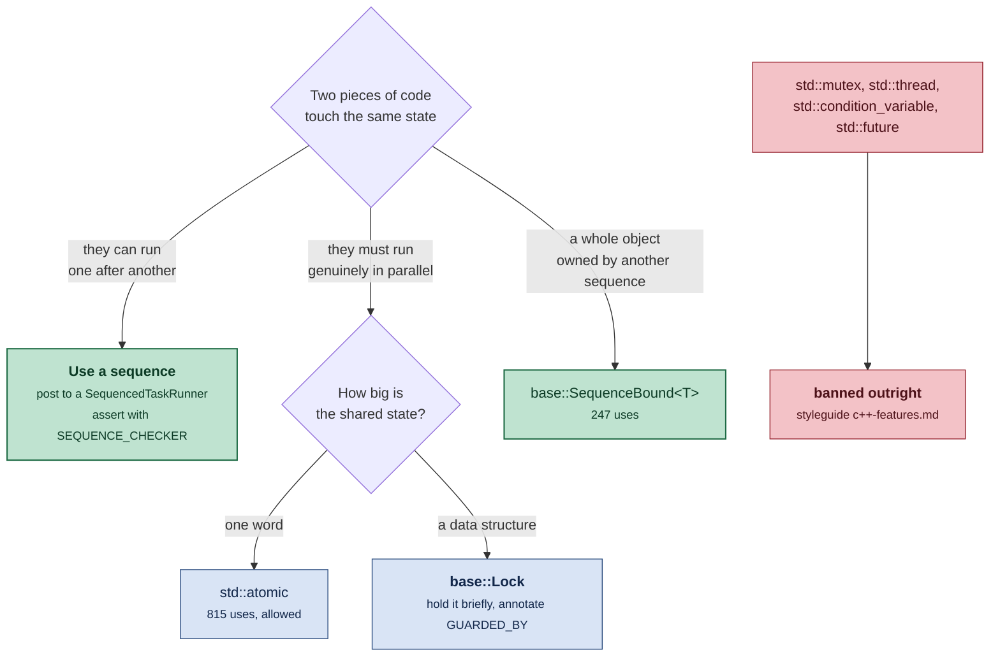
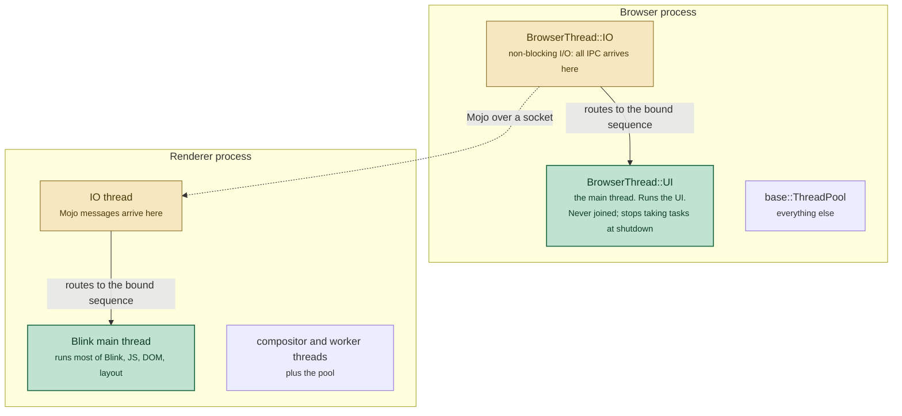
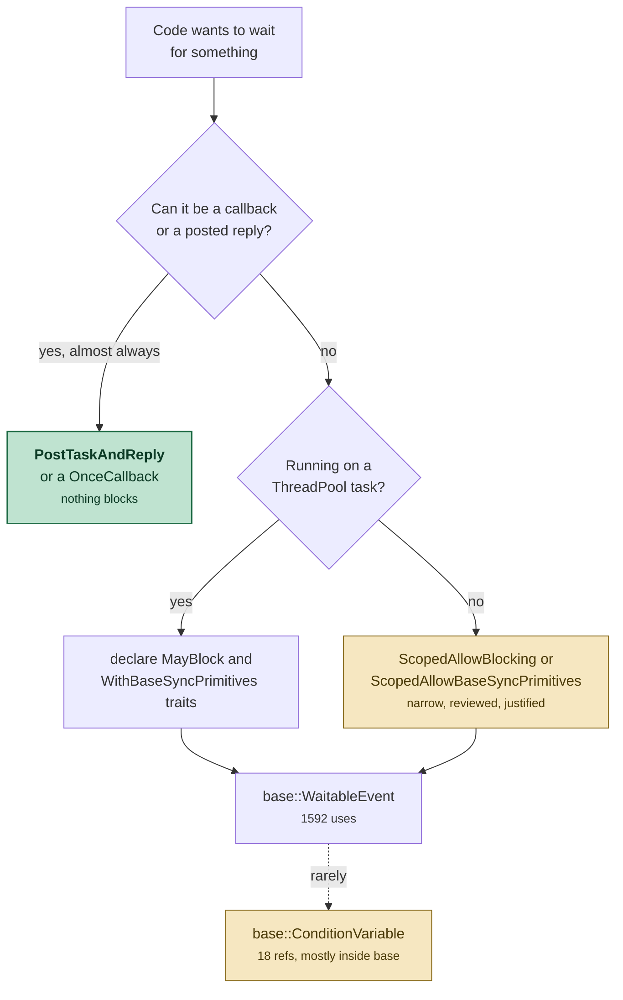

# Threading in the browser and renderer processes

Is threading allowed? Yes. Are mutexes used? Yes, but far less than you would
expect. Are condition variables used? **Almost never** — 18 references across
the whole tree, and nearly all of them are inside `base/` itself.

This note explains why the numbers come out that way, what you are supposed to
write instead, and what the compiler and runtime will stop you from doing.

Counts are from `*.cc`/`*.h` under `base/ chrome/ content/ components/ ui/
third_party/blink/renderer/`, on `chrome/VERSION` 153.0.8005.0.

**Companion notes in this directory:**

* [`chromium-cpp-idioms.md`](chromium-cpp-idioms.md) — the C++ dialect. Its §2
  covers why `<thread>`, `<mutex>` and `<condition_variable>` are banned outright.
* [`chromium-design-patterns.md`](chromium-design-patterns.md) — object-graph
  patterns; this note is the one its "does not cover" list points at for
  sequences.
* [`chromium-linux-processes-and-ipc.md`](chromium-linux-processes-and-ipc.md) —
  where the IO thread's `epoll` loop and the Mojo channel come from.
* [`chromium-android-architecture.md`](chromium-android-architecture.md) — the
  process model these threads live inside.

---

## 1. The short answers

| Question | Answer |
|---|---|
| Is threading allowed? | Yes, but you rarely create a thread. `base::Thread` appears 159 times; `base::ThreadPool::` 1,952. |
| Are mutexes used? | Yes — `base::AutoLock` 2,275, across 487 files — but task posting outnumbers them ~7:1 (`SequencedTaskRunner` + `SingleThreadTaskRunner` = 15,385). |
| Condition variables? | **18 references, tree-wide.** Effectively a `base/`-internal primitive. |
| Reader-writer locks? | None. "Chrome doesn't expose reader-writer locks." |
| `std::mutex`, `std::thread`, `std::condition_variable`? | **Banned.** So is `<future>`, `<latch>`, `<semaphore>`, `<barrier>`, `<stop_token>`. |
| So what do I write? | A **sequence**: post tasks to a `base::SequencedTaskRunner` and assert with `SEQUENCE_CHECKER` (1,342 uses). |

The governing sentence is in
[`docs/threading_and_tasks.md`](https://github.com/obeletski/chromium/blob/floating-window/docs/threading_and_tasks.md):

> "Usage of locks is discouraged in Chrome. Sequences inherently provide
> thread-safety. Prefer classes that are always accessed from the same sequence
> to managing your own thread-safety with locks."

---

## 2. The vocabulary

Named before the diagrams use them, because "sequence" is the term that does the
work and it is not a standard one:

* **Thread** — an OS thread. Chromium has few and names most of them.
* **Sequence** — a *virtual* thread: a guarantee that a set of tasks runs one at
  a time, in posting order, with each task seeing the previous one's writes.
  Successive tasks may run on **different physical threads**.
* **`base::SequencedTaskRunner`** — the handle you post to for that guarantee.
* **`base::SingleThreadTaskRunner`** — stronger: same physical thread every
  time. It *is-a* `SequencedTaskRunner`. Needed only for thread-affine
  dependencies.
* **Task** — a `base::OnceClosure` on a queue. The unit of everything.
* **`base::ThreadPool`** — the shared pool of general-purpose worker threads that
  backs most sequences.
* **`SEQUENCE_CHECKER` / `THREAD_CHECKER`** — debug-build members asserting that
  every access came from the right sequence or thread.
* **Blocking call** — anything that parks the thread off-CPU: file I/O, sockets,
  waiting on an event. **Banned by default**, per thread (§6).

The lexicon in `threading_and_tasks.md` adds the adjective that matters most:

> "**Thread-unsafe**: The vast majority of types in Chrome are thread-unsafe
> (by design)."

That is the default you should assume for any class you meet.

---

## 3. The model: sequences instead of locks

The idea is that mutual exclusion is a *scheduling* problem, not a *locking*
problem. If two pieces of code never run at once, they need no lock.

```cpp
class A {
 public:
  A() {
    // Do not require accesses to be on the creation sequence.
    DETACH_FROM_SEQUENCE(sequence_checker_);
  }

  void AddValue(int v) {
    DCHECK_CALLED_ON_VALID_SEQUENCE(sequence_checker_);
    values_.push_back(v);
  }

 private:
  SEQUENCE_CHECKER(sequence_checker_);
  // No lock required, because all accesses are on the same sequence.
  std::vector<int> values_;
};
```

The non-obvious guarantee, and the reason this is not just single-threading with
extra words:

> "Tasks posted to the same sequence will run in sequential order. After a
> sequenced task completes, the next task may be picked up by a **different
> worker thread**, but that task is guaranteed to see any side-effects caused by
> the previous one(s) on its sequence."

So a sequence is thread-safe without being thread-affine. You get the reasoning
simplicity of one thread and the scheduling freedom of a pool. The tree strongly
prefers this: `SEQUENCE_CHECKER` 1,342 against `THREAD_CHECKER` 247.



`base::SequenceBound<T>` deserves a mention because it makes the pattern
type-safe: it owns a `T` on a given sequence and only lets you reach it by
posting, so a cross-sequence access is a compile error rather than a DCHECK.

---

## 4. The threads that actually exist

Every process has a main thread, an IO thread, a few special-purpose threads,
and a pool. What the first two mean differs by process.



Two things this makes concrete.

**The IO thread is not where your code runs.** All IPC arrives there, but the
handler is bound to some other sequence and the IO thread just routes to it —
which is why a slow message handler does not stall the process's other IPC. The
IO thread's own loop is the `epoll` loop described in §4 of the
[processes-and-IPC note](chromium-linux-processes-and-ipc.md).

**`BrowserThread` is closed for extension.** The header says so at the enum
([`browser_thread.h:96`](https://github.com/obeletski/chromium/blob/floating-window/content/public/browser/browser_thread.h#L96)):
"NOTE: do not add new threads here. Instead you should just use..." — the pool.
That is why `base::Thread` is down to 159 uses: creating a physical thread is
now the rare, justified case rather than the default.

---

## 5. Locks: allowed, common, and narrowly scoped

Locks are not forbidden — `base::AutoLock` at 2,275 uses across 487 files is not
a rounding error, and there are 487 declarations of the form `base::Lock lock_;`
to go with them. What is discouraged is using them as the *primary* thread-safety strategy.

```cpp
class C {
 private:
  base::Lock lock_;
  Data data_ GUARDED_BY(lock_);   // 827 uses of GUARDED_BY tree-wide
};

void C::Update() {
  base::AutoLock auto_lock(lock_);   // RAII; there is no manual Acquire/Release idiom
  data_.Mutate();
}
```

Three details worth knowing:

* **`base::Lock` is a `pthread_mutex` on POSIX**, configured in
  [`lock_impl_posix.cc:113`](https://github.com/obeletski/chromium/blob/floating-window/base/synchronization/lock_impl_posix.cc#L113)
  with `PTHREAD_MUTEX_ERRORCHECK` — so relocking one you already hold is
  diagnosed rather than deadlocking — and `PTHREAD_PRIO_INHERIT` where
  available, which limits priority inversion when a background thread holds a
  lock the UI thread wants.
* **`GUARDED_BY` is checked by the compiler**, not by convention. It is a Clang
  thread-safety annotation, so reading `data_` without holding `lock_` is a
  build error in a properly annotated class.
* **There are no reader-writer locks.** The lexicon explains what to do instead:
  a "thread-compatible" global is initialised once — in single-threaded startup
  or through `base::NoDestructor` — and immutable forever after.

The doc's rule for when a lock is right:

> "Locks should only be used to swap in a shared data structure that can be
> accessed on multiple threads. If one thread updates it based on expensive
> computation or through disk access, then that slow work should be done without
> holding the lock."

Compute outside, swap inside. Never hold a lock across I/O — which, as §6 shows,
the runtime will also try to stop you doing.

---

## 6. Why condition variables are almost unused

18 references, and the file list is the answer: `base/` internals
(`waitable_event_posix.cc`, `lock_impl.h`, `thread_restrictions.h`), performance
tests, chromedriver, and a Nearby-Connections platform shim. **Essentially no
product code constructs one.**

That is not an accident of taste. Waiting is *restricted at runtime*.
[`thread_restrictions.h:38`](https://github.com/obeletski/chromium/blob/floating-window/base/threading/thread_restrictions.h#L38)
puts condition variables in the same banned category as disk I/O:

> "**Waiting on a //base sync primitive**: Refers to calling one of these
> methods: `base::WaitableEvent::*Wait*`, `base::ConditionVariable::*Wait*`,
> `base::Process::WaitForExit*`"

So on a normal thread, `ConditionVariable::Wait()` does not merely block — it
trips a check. To be allowed to wait at all you must either be on a pool task
declared with the right traits, or hold an explicit scoped allowance:

| Escape hatch | Meaning |
|---|---|
| `base::MayBlock()` task trait | this pool task may block, so schedule it accordingly |
| `base::WithBaseSyncPrimitives()` trait | this pool task may wait on a `WaitableEvent` or `ConditionVariable` |
| `ScopedAllowBlocking` (1,638 uses) | a narrow, reviewed exception in non-pool code |
| `ScopedAllowBaseSyncPrimitives` | the same, for sync-primitive waits |
| `ScopedBlockingCall` (658) | *annotates* an unavoidable blocking call so the pool can spin up another worker |

Note the asymmetry in the counts: `ScopedAllowBlocking` at 1,638 versus
`ScopedAllowBaseSyncPrimitives` at a handful. Blocking on **I/O** is a common,
grudgingly-permitted thing. Blocking on **another thread** is not, because it is
the shape that produces deadlocks and jank, and because a callback almost always
expresses the same intent without a parked thread.

Where a wait genuinely is needed, `base::WaitableEvent` (1,592) is the primitive
reached for rather than a condition variable — it composes with
`WaitableEventWatcher` so the wait can become a callback instead of a block.



---

## 7. What the toolchain enforces

Little of this rests on reviewer diligence:

| Rule | Enforced by |
|---|---|
| No `std::thread`, `std::mutex`, `std::condition_variable`, `<future>`, `<latch>`, `<semaphore>` | the style guide's banned list, and there is no `#include` in `base/` to make them convenient |
| Access from the wrong sequence | `SEQUENCE_CHECKER` — `DCHECK` in debug and `dcheck_always_on` builds |
| Reading a field without its lock | `GUARDED_BY` — a Clang thread-safety **compile** error |
| Blocking on a thread that forbids it | `thread_restrictions.h` — a runtime check |
| Binding a raw pointer into a cross-thread callback | `base::Bind*` refuses; you must write `base::Unretained`, a `WeakPtr`, or `RetainedRef` (see §3 of the idioms note) |

The last row is the connection to the callback machinery: because tasks are
`base::OnceClosure`s, every cross-thread hand-off is also a lifetime decision,
and the bind wrappers make each one visible.

---

## 8. The rest of the cabinet

Sections 1–7 cover what you reach for daily. The rest of `base/threading/` and
`base/task/` is worth skimming once, because several of these solve a problem
you would otherwise solve badly by hand.

### Posting and replying

| Class | Uses | What it is for |
|---|---|---|
| `PostTaskAndReplyWithResult` | 1,221 | Run a function on another sequence, get its **return value** delivered back on yours. The workhorse for "do the slow thing elsewhere, then continue here". |
| `base::BindPostTask` | 612 | Wrap a callback so that, wherever it is eventually run, it hops to a chosen task runner first. The standard way to hand a callback to code that does not know your sequence. |
| `base::CancelableTaskTracker` | 800 | Post tasks you can cancel **by id**, from any sequence, with the guarantee that a cancelled task's reply never runs. Where a `WeakPtr` is not enough because cancellation must be explicit rather than lifetime-driven. |
| `DeferredSequencedTaskRunner` | 62 | Queue tasks now, start running them later. Used during startup, before the real target sequence exists. |
| `base::PostJob` / `JobHandle` | 7 / 71 | Parallel work-splitting: a job with N worker slots that the pool grows and shrinks based on remaining work. For data-parallel loops, not for one-off tasks. |

### Threads, when you really do need one

| Class | Uses | What it is for |
|---|---|---|
| `base::PlatformThread` | 971 | The lowest layer — thread creation, `PlatformThread::CurrentId()`, `Sleep()`, thread names and priorities. The high count is mostly identity and naming, not thread creation. |
| `base::Thread` | 159 | A thread that owns a message loop, so you can post to it. What you create when a dependency is genuinely thread-affine. |
| `base::SimpleThread` / `DelegateSimpleThread` | 26 / 33 | A thread with **no** message loop — a plain `Run()` that exits. For a self-contained loop that never needs to receive tasks. |
| `base::Thread::Options` | 75 | Where the message-pump type, stack size and `ThreadType` are chosen at creation. |
| `base::ThreadType` | 230 | Scheduling priority as an enum — `kBackground`, `kUtility`, `kDefault`, `kPresentation`, `kAudioProcessing`, `kRealtimeAudio` — rather than raw nice values. Declared in `base/task/thread_type.h`, not under `base/threading/`. |
| `base::ScopedBoostPriority` | 15 | Temporarily raise priority for a scope, e.g. around a known-contended section. There is no class called `ScopedThreadPriority`; that is only the header name, which also supplies the `SCOPED_MAY_LOAD_LIBRARY_AT_BACKGROUND_PRIORITY()` macro. |

### Per-thread and per-sequence storage

| Class | Uses | What it is for |
|---|---|---|
| `SequenceLocalStorageSlot` | 93 | "Values stored and retrieved from a sequence. Values are deleted when the sequence is deleted." The sequence-shaped answer to thread-local storage, and the one to prefer. |
| `base::ThreadLocalStorage` | 12 | Genuine TLS. Rare, because a value tied to a physical thread is usually the wrong scope in a pool-backed world. `thread_local` covers most remaining cases. |

### Diagnostics

| Class | Uses | What it is for |
|---|---|---|
| `base::HangWatcher` | 85 | Instantiate a `WatchHangsInScope` and the watcher reports if that scope takes longer than a timeout. How jank becomes a crash report rather than a mystery. |
| `base::Watchdog` | 3 | An older, coarser alarm: arm it, disarm it, and it fires if you did not. |
| `base::ThreadCollisionWarner` | 27 | Detects two threads entering a section that was assumed to be single-threaded — a lighter, non-fatal cousin of `SEQUENCE_CHECKER` for hot paths. Spelled at call sites as the `DFAKE_MUTEX` / `DFAKE_SCOPED_LOCK` macro pair (17 uses); there is no `THREAD_COLLISION_WARNER` identifier. |
| `base::CurrentThread` | 77 | Introspection on the current message loop: is one running, add a `TaskObserver`, check whether the current thread runs tasks at all. |

### Small primitives it is easy to miss

| Class | Uses | What it is for |
|---|---|---|
| `base::AtomicFlag` | 44 | A one-way boolean: set once, read from anywhere. Narrower and clearer than a `std::atomic<bool>` because it cannot be unset. |
| `base::AtomicRefCount` | 17 | The counter behind refcounting, occasionally used directly. |
| `base::ScopedClosureRunner` | 830 | Not threading-specific, but the usual way to guarantee a completion callback runs on every exit path — including the early returns that make threaded code go wrong. |
| `base::WaitableEventWatcher` | — | Turns "wait for this event" into "run this callback when the event fires", which is how a blocking wait becomes a non-blocking one. |
| `base::CancelableEvent` | — | A `WaitableEvent` variant supporting cancellation of a pending wait. |

The pattern across the whole table: for nearly every primitive that would park a
thread, `base/` also ships the version that posts a callback instead — and that
is the one the tree expects you to use.

## 9. What `std::` offers, and why almost none of it is used

The C++ standard library has a complete concurrency toolkit. Chromium uses
essentially one piece of it. `styleguide/c++/c++-features.md` bans the rest in a
single entry, **Thread Support Library**, listing eight headers at once:

```c++
#include <barrier>             // C++20
#include <condition_variable>
#include <future>
#include <latch>               // C++20
#include <mutex>
#include <semaphore>           // C++20
#include <stop_token>          // C++20
#include <thread>
```

with a one-line reason: *"Overlaps with `base/synchronization`. `base::Thread` is
tightly coupled to `base::MessageLoop` which would make it hard to replace."*
That is a migration-cost argument, not a claim that the standard versions are
bad — but the effect is a hard wall.

| `std::` | Status | Chromium equivalent | The actual difference |
|---|---|---|---|
| `std::thread`, `std::jthread` | **banned** | `base::Thread` (159), `base::SimpleThread` (26), `base::PlatformThread` (971) | `base::Thread` owns a message loop, so you can *post* to it; a `std::thread` only runs a function. `std::jthread` has 0 uses. |
| `std::mutex`, `std::lock_guard`, `std::unique_lock` | **banned** | `base::Lock` (658 references, 487 of them declarations of the form `base::Lock lock_;`), `base::AutoLock` (2,275) | `base::Lock` is a `pthread_mutex` with `ERRORCHECK` and priority inheritance, integrates with Clang's `GUARDED_BY`, and carries the tree's lock-order and metrics instrumentation. |
| `std::shared_mutex` | not in the banned list, but **0 uses** | — | The lexicon states it outright: "Chrome doesn't expose reader-writer locks." The sanctioned alternative is an immutable global initialised once. |
| `std::condition_variable` | **banned** | `base::ConditionVariable` (18) | Both exist; both are avoided. §6 explains why — waiting is restricted at runtime, not just discouraged. |
| `std::future`, `std::promise`, `std::async` | **banned** | `PostTaskAndReplyWithResult` (1,221) | The closest and most instructive pair. Both express "compute elsewhere, get the value back", but a `std::future` is collected by **blocking** on `get()`, while the Chromium version delivers the result as a **callback on your sequence**. That inversion is the whole design. |
| `std::latch`, `std::barrier` | **banned** | `base::BarrierClosure` (302) | Same again: a `std::latch` is waited on; a `BarrierClosure` counts down and then *runs a callback*. Nothing parks. |
| `std::binary_semaphore`, `std::counting_semaphore` | **banned** | `base::WaitableEvent` (1,592) | With `WaitableEventWatcher` to convert the wait into a callback when it must not block. |
| `std::stop_token`, `std::stop_source` | **banned** | `base::WeakPtr`, `base::CancelableTaskTracker` (800) | Chromium ties cancellation to **object lifetime** (a `WeakPtr` cancels the callback when the receiver dies) or to an explicit task id, rather than to a token passed down a call chain. |
| `std::call_once`, `std::once_flag` | from banned `<mutex>` (15 uses each, mostly `base/`, `ui/gfx` and WTF) | function-local `static`, `base::NoDestructor` | Function-local static initialisation has been thread-safe since C++11, which covers nearly every case `call_once` was invented for. |
| `thread_local` | **allowed** (136 uses) | `SequenceLocalStorageSlot` (93) | The language keyword works; it is just usually the wrong *scope*, since work migrates between pool threads. Sequence-local storage is the shape that matches. |
| **`std::atomic`** | **allowed** — **815 uses** | — | The one piece adopted wholesale. `std::atomic_flag` (7) loses to `base::AtomicFlag` (44), which is one-way by construction: set once, never cleared. |

Two observations worth taking away.

**The pattern in the "Chromium equivalent" column is always the same
transformation.** Take a standard primitive whose interface is *"block until"*
and replace it with one whose interface is *"call me when"*. `future::get()`
becomes a reply callback, `latch::wait()` becomes a barrier closure,
`semaphore::acquire()` becomes a watched event. That is not a stylistic
preference: a browser has threads that must never stop pumping their message
loop, so a primitive that blocks by design is unusable on most of them.

**This is the mirror image of the pointer story.** §4 of the
[idioms note](chromium-cpp-idioms.md) found that `std::unique_ptr` survived
untouched because ownership is something the standard library models well. Here
almost nothing survives, because what the standard library models is *threads*,
and Chromium's unit of concurrency is the **sequence** — which has no standard
counterpart at all.

## 10. Blink is not an exception, quite

`third_party/blink/renderer/` overrides many Chromium conventions but **not this
one**: `base::AutoLock` appears 751 times inside Blink, so it uses the same
locks. WTF adds only narrow extras, such as `RecursiveMutex`
([`threading_primitives.h:50`](https://github.com/obeletski/chromium/blob/floating-window/third_party/blink/renderer/platform/wtf/threading_primitives.h#L50)).

What differs is the *assertion idiom*. Blink's dominant check is
`DCHECK(IsMainThread())` — 611 uses — rather than a per-object
`SEQUENCE_CHECKER`, because so much of Blink is main-thread-only by construction
rather than sequence-bound. Oilpan's garbage collector reinforces that: a
`Member<T>` is not a thread-safe handle, and objects are traced per-thread, so
"just post it to another sequence" is not available for GC objects the way it is
for ordinary ones. Cross-thread work in Blink goes through the explicit
`CrossThreadBindOnce` / `CrossThreadHandle` machinery instead — see §10 of the
[idioms note](chromium-cpp-idioms.md).

---

## 11. Where to read more

| Question | Read |
|---|---|
| The canonical guide, at length | [`docs/threading_and_tasks.md`](https://github.com/obeletski/chromium/blob/floating-window/docs/threading_and_tasks.md) |
| "Why can't I just…" | [`docs/threading_and_tasks_faq.md`](https://github.com/obeletski/chromium/blob/floating-window/docs/threading_and_tasks_faq.md) |
| Testing threaded code | [`docs/threading_and_tasks_testing.md`](https://github.com/obeletski/chromium/blob/floating-window/docs/threading_and_tasks_testing.md) |
| Callback and binding semantics | [`docs/callback.md`](https://github.com/obeletski/chromium/blob/floating-window/docs/callback.md) |
| Blocking a thread in a test, correctly | [`docs/patterns/synchronous-runloop.md`](https://github.com/obeletski/chromium/blob/floating-window/docs/patterns/synchronous-runloop.md) |
| The primitives themselves | [`base/synchronization/`](https://github.com/obeletski/chromium/blob/floating-window/base/synchronization/lock.h), [`base/threading/thread_restrictions.h`](https://github.com/obeletski/chromium/blob/floating-window/base/threading/thread_restrictions.h) |
| Which `std::` concurrency features are banned, and why | §2 of [`chromium-cpp-idioms.md`](chromium-cpp-idioms.md) |

---

## 12. Snippet reference

Every Chromium threading name used above, with the shortest call that shows its
real shape. Each entry points at the header that declares it as `path:line`, as
read in this checkout — `base/` drifts, so treat a snippet older than the tree
with suspicion rather than copying it.

Two conventions throughout: `FROM_HERE` is the `base::Location` macro that gives
the scheduler a source position for tracing, and every `base::BindOnce` that
names a member function needs a lifetime decision for its first argument (§7).

### Posting and replying

**`base::OnceClosure`** — `base/functional/callback_forward.h:19`. The unit of
work; everything below moves one of these around.

```cpp
base::OnceClosure task = base::BindOnce(&DoThing, arg);  // OnceCallback<void()>
std::move(task).Run();  // OnceClosure is consumed by running it
```

**`base::ThreadPool::PostTask`** — `base/task/thread_pool.h:115`. Fire-and-forget
on a pool worker. Tasks posted this way may run **in parallel with each other**;
they are on no sequence. Returns `false` only if shutdown means it definitely
will not run.

```cpp
base::ThreadPool::PostTask(
    FROM_HERE, {base::MayBlock(), base::TaskPriority::USER_VISIBLE},
    base::BindOnce(&WriteCacheFile, path));
```

**`base::ThreadPool::CreateSequencedTaskRunner`** —
`base/task/thread_pool.h:176`. The usual entry point to §3's model: a handle
whose tasks run one at a time, in order, on whichever worker is free.

```cpp
scoped_refptr<base::SequencedTaskRunner> runner =
    base::ThreadPool::CreateSequencedTaskRunner(
        {base::MayBlock(), base::TaskShutdownBehavior::SKIP_ON_SHUTDOWN});
runner->PostTask(FROM_HERE, base::BindOnce(&Step1));
runner->PostTask(FROM_HERE, base::BindOnce(&Step2));  // never before Step1
```

**`base::SequencedTaskRunner`** — `base/task/sequenced_task_runner.h:192`. The
handle itself. `PostTask()` is not declared here: it is inherited from
`TaskRunner` (`base/task/task_runner.h:68`), which is why grepping this header
for it comes up empty.

```cpp
scoped_refptr<base::SequencedTaskRunner> runner =
    base::SequencedTaskRunner::GetCurrentDefault();      // :339
runner->PostDelayedTask(FROM_HERE, base::BindOnce(&Retry), base::Seconds(1));
```

**`base::SingleThreadTaskRunner`** — `base/task/single_thread_task_runner.h:41`.
Same API, stronger promise: one physical thread. In the browser process you
almost never construct one — you ask `content` for the existing UI or IO thread
(`content/public/browser/browser_thread.h:68`).

```cpp
scoped_refptr<base::SingleThreadTaskRunner> ui =
    content::GetUIThreadTaskRunner({});
ui->PostTask(FROM_HERE, base::BindOnce(&UpdateOmnibox));
```

**`PostTaskAndReplyWithResult`** — `base/task/task_runner.h:153` (member on any
runner) and `base/task/thread_pool.h:105` (static, default traits). The
workhorse. Note the argument order: *task first, reply second*, and the reply
runs on the sequence that called this.

```cpp
base::ThreadPool::PostTaskAndReplyWithResult(
    FROM_HERE, {base::MayBlock()},
    base::BindOnce(&ReadWholeFile, path),                        // pool
    base::BindOnce(&Self::OnRead, weak_factory_.GetWeakPtr()));  // back here
```

The `std::` shape it replaces, for contrast — this is the inversion §9 is about:

```cpp
std::future<std::string> f = std::async(&ReadWholeFile, path);
std::string data = f.get();   // banned: parks the calling thread until done
```

**`base::BindPostTask`** — `base/task/bind_post_task.h:68` (a
`RepeatingCallback` overload is at `:85`). Wraps a callback so that running it
anywhere hops to your runner first. The way to hand a callback to code that
knows nothing about your sequence.

```cpp
device_->SetDoneCallback(base::BindPostTask(
    base::SequencedTaskRunner::GetCurrentDefault(),
    base::BindOnce(&Self::OnDone, weak_factory_.GetWeakPtr())));
```

**`base::CancelableTaskTracker`** — `base/task/cancelable_task_tracker.h:60`.
Cancellation by id rather than by lifetime. The trap is the first parameter:
a raw `TaskRunner*`, not a `scoped_refptr`, so pass `runner.get()`.

```cpp
base::CancelableTaskTracker tracker_;                              // member
base::CancelableTaskTracker::TaskId id = tracker_.PostTaskAndReply(
    runner.get(), FROM_HERE, base::BindOnce(&Load), base::BindOnce(&OnLoaded));
tracker_.TryCancel(id);       // :121 — the reply is then guaranteed not to run
```

**`base::DeferredSequencedTaskRunner`** —
`base/task/deferred_sequenced_task_runner.h:26`. Accepts tasks before there is
anywhere to run them. `Start()` (`:53`) is for the constructor that already took
a target runner; the no-arg constructor pairs with `StartWithTaskRunner()`
(`:56`), and mixing the two fails.

```cpp
auto deferred = base::MakeRefCounted<base::DeferredSequencedTaskRunner>();
deferred->PostTask(FROM_HERE, base::BindOnce(&Early));  // queued, not run
deferred->StartWithTaskRunner(real_runner);             // drains, in order
```

**`base::PostJob` / `base::JobHandle`** — `base/task/post_job.h:196` / `:88`.
Data-parallel work splitting. Two callbacks: the worker task, run concurrently
by up to N workers, and a `MaxConcurrencyCallback` (`:148`,
`RepeatingCallback<size_t(size_t worker_count)>`) that the pool polls to decide
how many to run.

```cpp
base::JobHandle handle = base::PostJob(
    FROM_HERE, {base::TaskPriority::USER_BLOCKING},
    base::BindRepeating(&ProcessItems, base::Unretained(&queue)),
    base::BindRepeating(&ItemsRemaining, base::Unretained(&queue)));
handle.Join();   // :120 — a JobHandle must be Join()ed or Cancel()led (:124)
```

**`base::BarrierClosure`** — `base/barrier_closure.h:23`. N callers, one
continuation. Nothing waits; the last caller runs `done_closure` on its own
thread.

```cpp
base::RepeatingClosure barrier =
    base::BarrierClosure(loaders.size(), base::BindOnce(&AllDone));
for (auto& loader : loaders)
  loader->Start(barrier);   // each Run()s it exactly once when finished
```

**`base::SequenceBound<T>`** — `base/threading/sequence_bound.h:105`. Owns a `T`
on another sequence and makes touching it directly impossible. Adapted from the
header's own example (`:101`); `Then()` is *required* when the method returns
non-void (`:205`).

```cpp
base::SequenceBound<Database> db_{backend_runner_, "profile.db"};  // ctor :129
db_.AsyncCall(&Database::Query)
    .WithArgs(5)
    .Then(base::BindOnce(&Self::OnResult, weak_factory_.GetWeakPtr()));
```

**`base::WeakPtr`** — `base/memory/weak_ptr.h:362` (`WeakPtrFactory`). The
default cancellation mechanism: a task bound to a dead receiver is dropped
instead of run. The factory must be the **last** member so it is destroyed
first, and it is sequence-affine — invalidation and dereference must happen on
the same sequence.

```cpp
 private:
  base::WeakPtrFactory<Self> weak_factory_{this};   // last member
// ...
runner->PostTask(FROM_HERE,
                 base::BindOnce(&Self::OnDone, weak_factory_.GetWeakPtr()));
```

### Locks

**`base::Lock` / `base::AutoLock` / `GUARDED_BY`** —
`base/synchronization/lock.h:25`, `base/synchronization/lock.h:131` (`AutoLock`
is a `using`, not a class, which is why it has no header of its own), and
`base/thread_annotations.h:59`. The whole idiom, as in §5:

```cpp
base::Lock lock_;
Data data_ GUARDED_BY(lock_);
// ...
{
  base::AutoLock auto_lock(lock_);   // Acquire() in ctor, Release() in dtor
  data_.Mutate();                    // reading data_ outside this fails to build
}
```

`GUARDED_BY_CONTEXT(sequence_checker_)` (`base/thread_annotations.h:251`) is the
same annotation pointed at a `SEQUENCE_CHECKER` instead of a lock — the
sequence-shaped version of the same compile-time check.

### Waiting, and the permission to wait

**`base::WaitableEvent`** — `base/synchronization/waitable_event.h:56`. Both
constructor arguments default (`ResetPolicy::MANUAL`,
`InitialState::NOT_SIGNALED`, `:69`), which is worth spelling out anyway because
`AUTOMATIC` versus `MANUAL` decides whether one `Signal()` releases one waiter or
all of them.

```cpp
base::WaitableEvent done(base::WaitableEvent::ResetPolicy::MANUAL,
                         base::WaitableEvent::InitialState::NOT_SIGNALED);
runner->PostTask(FROM_HERE, base::BindOnce(&Work, base::Unretained(&done)));
done.Wait();      // :103 — only where waiting is permitted; see below
```

**`base::WaitableEventWatcher`** —
`base/synchronization/waitable_event_watcher.h:75`. The "call me when" form.
`EventCallback` is `OnceCallback<void(WaitableEvent*)>` (`:81`), so the handler
takes the event back as an argument.

```cpp
base::WaitableEventWatcher watcher_;                                    // member
watcher_.StartWatching(                                                 // :97
    &event_, base::BindOnce(&Self::OnSignaled, weak_factory_.GetWeakPtr()),
    base::SequencedTaskRunner::GetCurrentDefault());
// void Self::OnSignaled(base::WaitableEvent* event) { ... }
```

**`base::CancelableEvent`** — `base/synchronization/cancelable_event.h:26`.
A 0-1 semaphore that does not start signaled and must not be signaled twice.
`Cancel()` is `[[nodiscard]]` and only succeeds on Windows, Linux, ChromeOS and
Android.

```cpp
base::CancelableEvent event;
event.Signal();
if (event.Cancel())     // :39 — true only if no waiter consumed the signal
  ;                     // the wake-up was withdrawn
```

**`base::ConditionVariable`** — `base/synchronization/condition_variable.h:85`.
Takes the lock by **pointer**, and the lock must be held across `Wait()`.

```cpp
base::Lock lock_;
base::ConditionVariable cv_{&lock_};   // :88 — Lock*, not Lock&
// ...
base::AutoLock auto_lock(lock_);
while (!ready_)
  cv_.Wait();                          // :98 — trips a restriction check (§6)
cv_.Signal();                          // :107; Broadcast() at :105
```

**`base::MayBlock()` / `base::WithBaseSyncPrimitives()`** —
`base/task/task_traits.h:165` / `:193`. Empty tag structs; they exist to be
listed in a traits brace-init.

```cpp
base::ThreadPool::PostTask(
    FROM_HERE, {base::MayBlock(), base::WithBaseSyncPrimitives()},
    base::BindOnce(&ReadFileThenWaitForEvent));
```

**`base::ScopedAllowBlocking`** — `base/threading/thread_restrictions.h:575`.
The API that looks right and will not compile: the constructor is private and
every legitimate caller is written into a `friend` list starting at `:584`. New
code cannot instantiate it without editing that list — which *is* the review
gate the count in §6 is measuring. Outside production code, use the testing
variant (`:716`).

```cpp
base::ScopedAllowBlockingForTesting allow_blocking;
base::File f(path, base::File::FLAG_OPEN | base::File::FLAG_READ);
```

**`base::ScopedAllowBaseSyncPrimitives`** —
`base/threading/thread_restrictions.h:748`. Same friend-list construction, for
waits rather than I/O; testing variant at `:948`.

```cpp
base::ScopedAllowBaseSyncPrimitivesForTesting allow_wait;
event.Wait();
```

**`base::ScopedBlockingCall`** — `base/threading/scoped_blocking_call.h:91`,
`BlockingType` at `:24`. Not a permission — an *annotation*, so the pool can
compensate by starting another worker. Adapted from the header's own
good/bad pair (`:60`-`:90`): keep the scope tight and do no CPU work inside it,
and do not wrap `WaitableEvent::Wait()`, which instantiates its own.

```cpp
{
  base::ScopedBlockingCall scoped_blocking_call(
      FROM_HERE, base::BlockingType::WILL_BLOCK);
  ::read(fd, buf, len);
}
CPUIntensiveProcessing(buf);   // deliberately outside the scope
```

### Threads, when you really do need one

**`base::Thread` / `base::Thread::Options`** — `base/threading/thread.h:64` /
`:77`. A thread that owns a message loop, so it has a `task_runner()`.
`Options` is move-only (it holds a `unique_ptr` and tracks `moved_from`,
`:117`-`:126`), so `StartWithOptions()` (`:181`) takes it by value and you
`std::move()` it in.

```cpp
base::Thread thread("MyThread");            // ctor :138
base::Thread::Options options;
options.message_pump_type = base::MessagePumpType::IO;   // :90
options.thread_type = base::ThreadType::kUtility;        // :105
thread.StartWithOptions(std::move(options));
thread.task_runner()->PostTask(FROM_HERE, base::BindOnce(&Work));  // :241
```

**`base::SimpleThread` / `base::DelegateSimpleThread`** —
`base/threading/simple_thread.h:63` / `:164`. No message loop: `Run()` returns
and the thread ends. Nothing can be posted to it.

```cpp
class Worker : public base::SimpleThread {
 public:
  Worker() : base::SimpleThread("Worker") {}   // ctor :91
  void Run() override { CrunchUntilDone(); }   // :113, pure virtual
};
Worker w;
w.Start();   // :101
w.Join();    // :105 — unless Options::joinable was set false
```

`DelegateSimpleThread` is the same thing with the body supplied by a
`Delegate*` (`:166`) instead of by subclassing.

**`base::PlatformThread`** — `base/threading/platform_thread.h:423`. Watch the
name: it is a per-platform **alias** (`:419`-`:425`) for `PlatformThreadLinux`,
`PlatformThreadApple` and so on, all deriving from `PlatformThreadBase`
(`:168`) — grepping for `class PlatformThread {` finds nothing.

```cpp
base::PlatformThread::SetName("MyThread");                    // :253
base::PlatformThreadId id = base::PlatformThread::CurrentId();  // :223
base::PlatformThread::Sleep(base::Milliseconds(10));          // :249
```

**`base::ThreadType`** — `base/task/thread_type.h:31`. Note the header: it lives
under `base/task/`, not `base/threading/`. The values are `kBackground`,
`kUtility`, `kDefault`, `kPresentation`, `kAudioProcessing`, `kRealtimeAudio`.

```cpp
options.thread_type = base::ThreadType::kBackground;
base::PlatformThread::SetDefaultThreadType(base::ThreadType::kUtility);  // :316
```

**Temporarily raising priority** — `base/threading/scoped_thread_priority.h`.
There is no class called `ScopedThreadPriority`; the header offers
`base::ScopedBoostPriority` (`:102`, 15 uses) and a macro for the case it was
written for, a background thread about to page in a DLL (`:46`).

```cpp
{
  base::ScopedBoostPriority boost(base::ThreadType::kDefault);  // :105
  TouchContendedResource();
}
SCOPED_MAY_LOAD_LIBRARY_AT_BACKGROUND_PRIORITY();   // once per call site
```

### Per-thread and per-sequence storage

**`base::SequenceLocalStorageSlot`** —
`base/threading/sequence_local_storage_slot.h:228`. One value per sequence,
destroyed with it. The slot object is normally a function-local `static`; only
the *value* is per-sequence.

```cpp
int& GetDepth() {
  static base::SequenceLocalStorageSlot<int> slot;
  return slot.GetOrCreateValue();   // :80 (:170 for the small-type variant)
}
```

The header's own example (`:28`-`:29`) writes `sls_value->GetOrCreateValue()`,
which is wrong: `operator->` (`:104`) returns `T*`, so that spelling asks for
`T::GetOrCreateValue`. Use `.` on the slot.

**`base::ThreadLocalStorage::Slot`** —
`base/threading/thread_local_storage.h:115`. Genuine TLS, and untyped — it
stores `void*` and takes a destructor function.

```cpp
base::ThreadLocalStorage::Slot slot(&DestroyValue);  // :119
slot.Set(value);                                     // :134, void*
auto* v = static_cast<Value*>(slot.Get());           // :130
```

**`thread_local`** — the language keyword, allowed and simpler than the above.
It is just usually the wrong scope, since a sequence's tasks migrate between
pool threads.

```cpp
thread_local int reentrancy_depth = 0;
```

### Assertions and annotations

**`SEQUENCE_CHECKER` / `DCHECK_CALLED_ON_VALID_SEQUENCE` /
`DETACH_FROM_SEQUENCE`** — `base/sequence_checker.h:75` / `:76` / `:79`. See §3
for the full class. All three compile to nothing outside `DCHECK` builds
(`:82`-`:84`), so the member costs nothing in release.

```cpp
SEQUENCE_CHECKER(sequence_checker_);                  // declares the member
DCHECK_CALLED_ON_VALID_SEQUENCE(sequence_checker_);   // in every method
DETACH_FROM_SEQUENCE(sequence_checker_);   // "the next caller sets the sequence"
```

**`THREAD_CHECKER`** — `base/threading/thread_checker.h:82`, with
`DCHECK_CALLED_ON_VALID_THREAD` (`:83`) and `DETACH_FROM_THREAD` (`:86`).
Identical shape, stricter question: same physical thread, not same sequence.

```cpp
THREAD_CHECKER(thread_checker_);
DCHECK_CALLED_ON_VALID_THREAD(thread_checker_);
```

**Detecting an unexpected second thread** —
`base/threading/thread_collision_warner.h`. The document called this
`THREAD_COLLISION_WARNER`; no such identifier exists. The class is
`base::ThreadCollisionWarner` (`:146`) and the intended spelling is a pair of
macros, which compile away outside `DCHECK` builds (`:123`-`:126`).

```cpp
class Collector {
 private:
  DFAKE_MUTEX(push_mutex_);        // :107 — a member, not a real lock
  void Push(int v) {
    DFAKE_SCOPED_LOCK(push_mutex_);  // :110 — warns if two threads are in here
    data_.push_back(v);
  }
};
```

### Diagnostics

**`base::HangWatcher` / `base::WatchHangsInScope`** —
`base/threading/hang_watcher.h:106` / `:63`. You almost never touch the watcher;
you instantiate the scope. Adapted from the header's example (`:50`); the
default timeout is 10 s (`:70`).

```cpp
void Foobar() {
  base::WatchHangsInScope scope(base::Seconds(5));   // ctor :73
  DoWork();   // if this scope outlives 5s, the hang is reported
}
```

**`base::Watchdog`** — `base/threading/watchdog.h:33`. The coarse, explicit
version: you arm and disarm it yourself, and `Alarm()` fires if you did not get
there in time.

```cpp
base::Watchdog watchdog(base::Seconds(30), "Startup", /*enabled=*/true);  // :46
watchdog.Arm();      // :64
DoStartup();
watchdog.Disarm();   // :69
```

Override the default alarm by passing a `Watchdog::Delegate*` (`:35`) whose
`Alarm()` (`:40`) runs on the watchdog thread.

**`base::CurrentThread`** — `base/task/current_thread.h:75`. Introspection on
the current message loop. It is a value type with a self-returning `operator->`
(`:101`), so the `Get()->` spelling below is not a pointer dereference.

```cpp
if (base::CurrentThread::IsSet())                       // :96
  base::CurrentThread::Get()->AddTaskObserver(this);    // :87, :136
bool on_io = base::CurrentIOThread::IsSet();            // :306
```

### Small primitives

**`base::AtomicFlag`** — `base/synchronization/atomic_flag.h:20`. One-way, and
that is enforced: there is no `Clear()`, only `UnsafeResetForTesting()` (`:42`).

```cpp
base::AtomicFlag shutting_down_;
shutting_down_.Set();              // :30 — from the owning sequence
if (shutting_down_.IsSet())        // :35 — from anywhere
  return;
```

**`base::AtomicRefCount`** — `base/atomic_ref_count.h:19`. `Decrement()` returns
`bool`, not the new count: `true` means "still alive".

```cpp
base::AtomicRefCount refs_{1};        // :22
refs_.Increment();                    // :27
if (!refs_.Decrement())               // :38 — false means it hit zero
  delete this;
```

**`base::ScopedClosureRunner`** — `base/functional/callback_helpers.h:146`.
Guarantees a completion callback on every exit path, including early returns.

```cpp
base::ScopedClosureRunner on_exit(base::BindOnce(&NotifyDone));  // :149
if (Failed())
  return;             // NotifyDone() still runs
on_exit.RunAndReset();  // :161, or Release() (:167) to hand ownership onward
```

**`base::NoDestructor`** — `base/no_destructor.h:83`. The sanctioned immutable
global from §5: constructed once on first use, never destroyed, so no
shutdown-order race.

```cpp
const std::map<int, std::string>& GetTable() {
  static const base::NoDestructor<std::map<int, std::string>> table({{1, "a"}});
  return *table;
}
```

### Blink's cross-thread machinery

**`CrossThreadBindOnce`** —
`third_party/blink/renderer/platform/wtf/cross_thread_functional.h:94`, paired
with `PostCrossThreadTask`
(`third_party/blink/renderer/platform/scheduler/public/post_cross_thread_task.h:18`,
which takes the runner by **reference**). It differs from `base::BindOnce` by
requiring every argument to be safe to move across threads.

```cpp
PostCrossThreadTask(*task_runner, FROM_HERE,
                    CrossThreadBindOnce(&Worker::Process, std::move(data)));
```

**`CrossThreadHandle` / `MakeCrossThreadHandle`** —
`third_party/blink/renderer/platform/heap/cross_thread_handle.h:49` / `:55`.
How an Oilpan `Member`-managed object survives the trip: a `Member<T>` is not a
thread-safe handle, so a garbage-collected pointer must be wrapped. Adapted from
the header's `PingPong` example (`:15`-`:47`).

```cpp
worker_pool::PostTask(
    FROM_HERE, CrossThreadBindOnce(&PingPong::PongOnBackground,
                                   MakeCrossThreadHandle(this),
                                   std::move(task_runner_)));
// coming back, unwrap: MakeUnwrappingCrossThreadWeakHandle(std::move(handle))
```

**`WTF::RecursiveMutex`** —
`third_party/blink/renderer/platform/wtf/threading_primitives.h:50`. Included
only because §10 names it; the header marks it deprecated and slated for removal
(`:48`). Do not add uses.

---

## 13. What is verified here, and what is not

**Measured in this checkout:** every count in this note, by grepping `*.cc` and
`*.h` under `base/ chrome/ content/ components/ ui/
third_party/blink/renderer/`. The condition-variable figure is a reference
count, not a construction count, and the file list behind it is what supports
the "mostly inside `base/`" claim.

**Read and quoted directly:** the lexicon and lock guidance in
`threading_and_tasks.md`, the blocking categories in `thread_restrictions.h`,
the `pthread_mutex` attributes in `lock_impl_posix.cc`, the "do not add new
threads here" note in `browser_thread.h`, and the absence of any
reader-writer lock.

**Not verified:** that `GUARDED_BY` fires as a compile error in this build
configuration specifically — the annotation is Clang's and the tree enables it,
but no failing build was produced to confirm it. The renderer's thread list in
§4 is also simplified; compositor and worker threads vary by configuration.

**Checked while writing §12:** every snippet there was written against the
header open beside it, and each `path:line` pointer was re-grepped in this
checkout after the section was finished; where a header already carried a usable
example the entry says so and adapts it rather than inventing one. Three names
this note used did not survive that pass and were corrected in §8: there is no
`ThreadType::kDisplayCritical` (it is `kPresentation`), no class
`ScopedThreadPriority` (only the header of that name, offering
`base::ScopedBoostPriority`), and no `THREAD_COLLISION_WARNER` macro (the class
is `base::ThreadCollisionWarner`, used via `DFAKE_MUTEX`). None of the snippets
was compiled.

**Named but not explored:** everything in §8 is listed with its purpose and a
usage count, not walked through. `WaitableEventWatcher` and `CancelableEvent`
have no count because a reliable one needs disambiguating from their own headers
and tests.

**Out of scope:** the `SequenceManager` and `MessagePump` internals, the full
set of scheduling traits, and the `ThreadPool` shutdown semantics that decide
whether a posted task runs at all.
